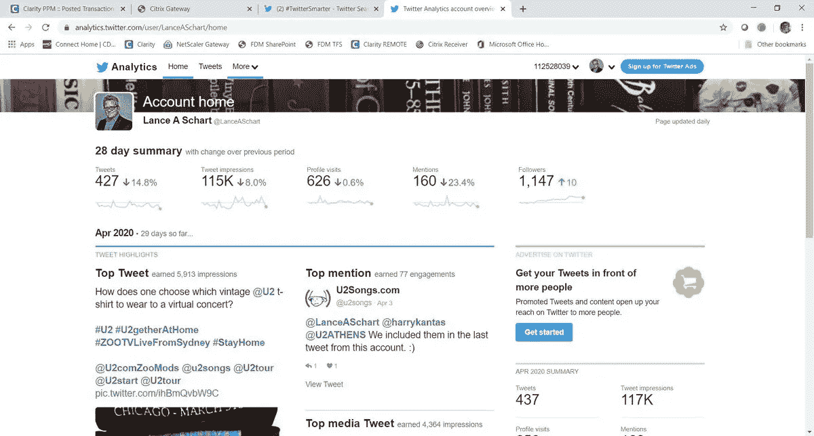
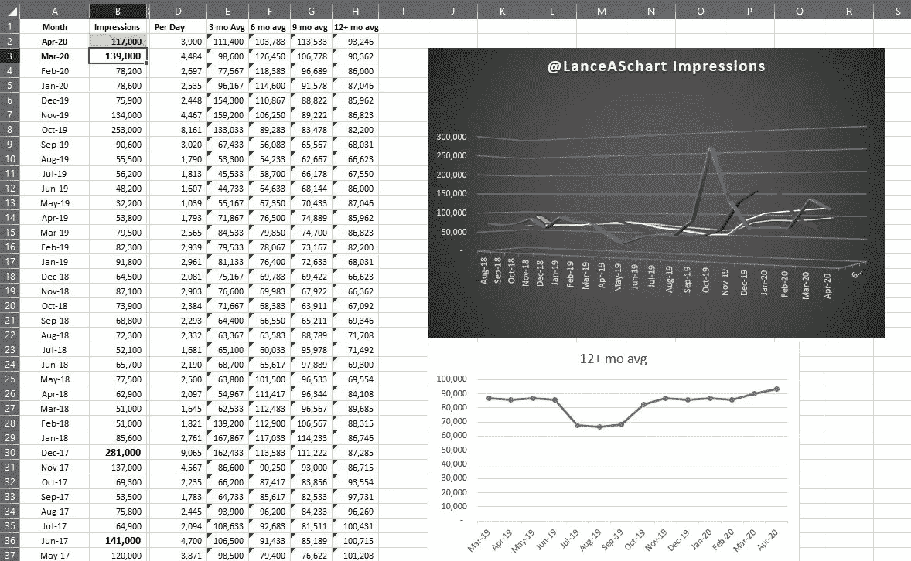
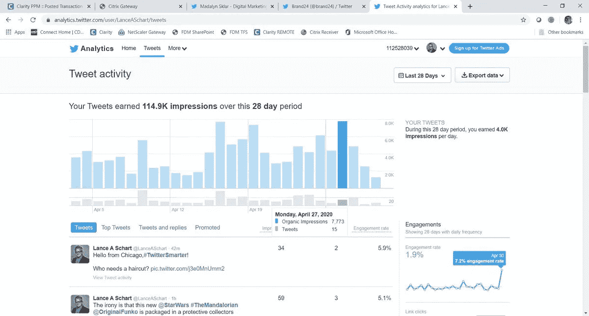
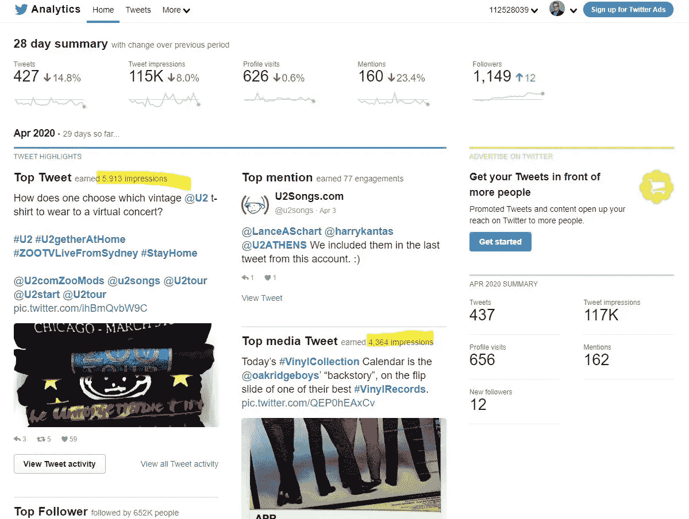

# 最好是从你的内心去创造，而不是数字

> 原文：<https://medium.datadriveninvestor.com/create-from-your-heart-not-the-analytics-4b3807d057c4?source=collection_archive---------9----------------------->

## 真正的内容吸引那些想要你答案的人

Analytics can spike on Twitter chat days.

那些窥视分析魔力的人有被数据催眠的风险。[搜索引擎优化](https://www.datadriveninvestor.com/2018/12/29/for-seo-the-words-are-key/)统治着一天，而内容却被硬塞进病毒公式。

该扇耳光了。

分析讲述了故事的一部分，但只是受环境严重影响的数字——一天中的时间、话题兴趣、被困在家中的观众。如果只是为了吸引点击，文字没有什么意义。

吸引人的标题和图片可能会吸引读者的注意力，但吸引他们的是内容的质量。与其用数字作画，不如用想象去描绘一幅繁茂的风景。

 [## 分析硬数据让你对自己的成功有更好的洞察力

### 分析有助于描绘一幅完整的画面，说明你已经走了多远

medium.datadriveninvestor.com](/analyzing-hard-data-gives-you-good-insight-to-your-success-7b5a25e6326c) 

分析有他们的位置，即使是在一个滑坡上，这是 [Madalyn Sklar](https://twitter.com/MadalynSklar/) 、 [Shawn Paul Wood](https://twitter.com/ShawnPaulWood) 和 [Lance A. Schart](https://twitter.com/LanceASchart) 聚集在一起，关注 Twitter 的深渊。

“我希望 Twitter 上的情况会有所改变，”数字公关专家兼文案撰写人伍德说。“对于需要虚荣心的人来说，穿着暴露地问‘你觉得我今天看起来可爱吗？’这样发人深省的回答往往会被忽视。”"

Schart 擅长项目管理、媒体关系和品牌咨询。他从经验中知道最终产品才是最重要的。

他说:“在所有社交媒体上获得一致、专注和高质量内容的关注。”。“当然，校对你的内容也有帮助。不必要和多余的词通常会让人们直接跳过你的推文。”

谷歌描述了 Twitter 的内部运作。

“Twitter 的分析帮助你了解你在 Twitter 上分享的内容如何促进你的业务增长，”[谷歌表示](https://www.google.com/search?sxsrf=ALeKk02S-ssKXPp_Kpt3P4pPSELGRlAoow%3A1589643935723&source=hp&ei=nwrAXo2eKc-9ggfAzJSwDA&q=twitter+analytics&oq=twitter+a&gs_lcp=CgZwc3ktYWIQARgBMgIIADICCAAyAggAMgIIADIFCAAQgwEyAggAMgIIADICCAAyBQgAEIMBMgIIADoECCMQJ1C1EFiJQmC2YWgAcAB4AIAB-wGIAc0JkgEFMi41LjKYAQCgAQGqAQdnd3Mtd2l6&sclient=psy-ab)。“在你的推文活动仪表板上，你可以找到每一条推文的指标。你会准确地知道 Twitter 用户看到、转发、喜欢和回复每条推文的次数。”

Sklar 是一名数字营销企业家和社交媒体传播者，他说:“Twitter 的分析可以帮助你了解你在 Twitter 上分享的内容如何促进你的业务增长。”

# **恒定需求**

在某种意义上，分析是一种戏弄。

“Twitter 有很好的原生分析，但客户总是要求更多，”伍德说。“这就是为什么用谷歌分析或付费平台的东西来支持 Twitter 分析很好。无论你能做什么，让客户远离虚荣指标，就去做吧。”

Schart 同意你得到你所支付的。

“Twitter 分析门户提供基本信息，”他说。“它每天更新，让你可以看到你在过去 28 天的印象和其他统计数据——可以追溯到你注册免费服务的时候。肯定有更好的付费分析工具。”

Schart 确实发现了 Twitter 分析的用途。他计算自己的账户与前几个月、前几个季度和前几年相比的表现，给出了一个电子表格的快照。

在 Twitter 的分析中，浏览量不同于推文数量。

Sklar 说:“印象是你的推文被浏览的次数。”“计数是指你发布了多少条推文。你发的微博越多，你可能得到的印象就越多。但印象不等于参与。参与才是最重要的。”

 [## 事实存在于数据中

### 知道如何使用网上收集的信息将有助于企业

blog.markgrowth.com](https://blog.markgrowth.com/truth-lies-in-the-data-390bd062c270) 

参与并不意味着仅仅为了增加统计数据而积极行动。

“如果你发太多微博，你真正的粉丝和社区可能不会‘不关注’你，但要注意这些微博的内容和数量，”Schart 说。"如果你采取一种有争议的立场并不断地鼓吹，你可能会无意中冒犯到某人."

伍德的信息很明确:“我经常和我的分析团队分享这个:*计数*就是你做的事情。印象是你的所作所为让别人也这样做。

# **超过印象数**

印象数可能反映了此刻有多少追随者登录 Twitter，但它远不止于此。

如果人们的推文被分享或评论，他们的追随者会看到它，这使得印象上升。如果人们[搜索你推文中的标签](https://medium.com/datadriveninvestor/theres-a-hashtag-for-that-if-you-do-it-right-79b9d167c86a?source=friends_link&sk=1e7299a5e093c083a5d16201b61fd4cb)，那么他们会给你留下印象。

Sklar 说:“如果你不能从一个印象中获得参与度，那么这个印象就没有多大价值。”她注意到[萌芽社交](https://twitter.com/SproutSocial/)发布了一篇文章 [*“什么是 Twitter 印象，为什么它们对 Twitter 如此重要？”*](https://sproutsocial.com/insights/twitter-impressions/)

“我一直对基本的 Twitter 分析工具很好奇，”Schart 说。“我想知道他们是否会把这种印象算作有人实际查看了这条推文，或者当有人不停地滚动浏览这条推文时，这条推文是否存在。”

当你的受众活跃时，通过分析可以帮助用户安排推文，从而有更好的机会获得大量印象。这条推文可能会接触到新的、更广泛的受众。

Sklar 说:“了解你的受众将有助于你决定发布什么内容和信息。”“如果你不与你的观众沟通，你将看不到成长，而且你会伤害他们。”

 [## 宝贵的经验引领数字化成功之路

### 早期的失误会困扰你的企业很长一段时间

medium.datadriveninvestor.com](/valuable-lessons-lead-the-way-to-digital-success-ec27ff48ca42) 

反而[知道痛点](https://medium.com/datadriveninvestor/strategic-social-listening-is-real-life-90c8a07b7c3f?source=friends_link&sk=d2e8aa4948fc21652656dda320f89ac5)填补欲望。

“你的观众对他们喜欢的东西做出回应，这就是为什么分析对一个成功的社区如此重要，”Wood 说。“了解他们想要什么。给他们所需要的。”

最好的答案来自[专注的倾听](https://blog.markgrowth.com/listen-for-good-vibrations-6cfa76efe031?source=friends_link&sk=ea7e95745397894229a8dfa463414534)。

“你就是你的品牌，而你的品牌可能就是你自己，”Schart 说。“如果你对如何使用语言和图像没有战略眼光，文字很重要，也很容易让人反感。你可以提出有争议的观点，但你也必须用事实来支持它们。否则，你可能会失去客户。”

# **超越蓝鸟**

除了 Twitter，其他社交平台也提供分析，尽管主要是针对商业账户。

“所有平台都提供某种度量标准，”Schart 说。然而，有些网站要求你为有意义的信息付费。一个公关客户——一个新兴的数字音乐流媒体平台——[为脸书广告](https://www.datadriveninvestor.com/2019/06/05/targeted-ads-dominate-the-competition/)付费，但不得不支付更多费用来获得谁看过他的内容的人口统计信息。

他说:“LinkedIn 能让你深入了解哪些人浏览了你的个人资料，如果你购买了他们的年度 LinkedIn Pro 套餐，你就可以和他们(T2)联系。”“如果你是在新的经济环境下[找工作的话，这完全值得。”](https://www.datadriveninvestor.com/2019/05/18/11428/)

 [## 雇佣 LinkedIn 是工作 1 |数据驱动投资者

### LinkedIn 激发了爱恨交加的关系。用户要么信它，要么骂它。中间那些根本不用…

www.datadriveninvestor.com](https://www.datadriveninvestor.com/2020/01/22/employing-linkedin-is-job-1/) 

有时，当印象和推文的记录一次消失几天、几周或一个月时，Twitter analytics 会出现呃逆或焦虑发作。然后它们神奇地再次出现，就像什么都没发生一样。

Sklar 说:“这些年来，我看到我的分析曲线突然变平，几周后又恢复正常。”“其他人告诉我，他们也发生了同样的事。推特一直没有给出解释。或许这与 Twitter 何时对平台进行重大变革有关，但谁知道呢。”

除了这些干扰，Schart 强调，随着时间的推移，参与度应该有一个上升的轨迹。

你检查分析的频率取决于动机和好奇心。你是一个向客户证明自己存在的营销人员吗？你这么做是为了自己的心安吗？

“我大约每一到两周检查一次我的 Twitter 分析，”Sklar 说。“我建议你至少每月检查一次。这里面有很多很棒的信息——黄金。”

自我满足是合理的辩解。

“如果你一直在提供让你自豪的内容，检查你的分析，”伍德说。"数字会告诉你是否有理由感到自豪。"

# **符合你的意图**

当检查分析符合你的策略时，效果最好。

“你需要的时候就经常检查，但你检查的原因应该与你的战略目标和整体媒体计划相匹配，”Schart 说。“如果你有强迫症，要知道推特分析每天都在更新。

“你可能想每小时查看一下你的推特数据，或者更频繁地查看，如果你正在直播一个事件的话，”他说。“然后你就会知道你的标签是否有效，或者人们是否在关注你的信息。还是那句话，按你的方案查。”

 [## 改变我们的视角可以极大地影响我们与人交往的方式

### 关系的质量和我们看待世界的方式至关重要

medium.datadriveninvestor.com](/see-world-through-their-eyes-not-yours-2877d173713b) 

良好的参与度取决于你在 Twitter 上的活跃程度。这听起来很小，但在总体印象中，良好的参与度是 2%。然而，这些数字到底意味着什么，你能相信它们吗？

在两次 Twitter 聊天的例子中，一条推文——只得到主持人的一个赞，有几百万粉丝，但没有一条转发——最终获得了超过 2 万次展示。

在另一次聊天中，一条转发四次的推文勉强清除了 100 个印象。所以，玩数字游戏要自担风险，但不要被统计数据所迷惑。有句老话:数字会说谎，说谎者也会说谎。忠于自己。

“显然，较高的参与度更好，”Schart 说。“但如果你得到一个一致的数字——一个显示你的所有内容被大致相同数量的人观看的范围——一个‘低’平均值可能证明你的内容是有效的，但可以改进。”

和一般的分析一样，设定智能的、可实现的目标来支持你的整体战略。

“不是每条推文都会破 1000、5000、10000 或 100 万，”Schart 说。“继续做对你和你的品牌最有利的事情。有计划。继续发展你的信息、社交媒体和销售策略。使用高质量、原创和引人注目的图形。要坚持。”

**关于作者**

吉姆·卡扎曼是[拉戈金融服务公司](http://largofinancialservices.com/)的经理，曾在空军和联邦政府的公共事务部门工作。你可以在[推特](https://twitter.com/JKatzaman)、[脸书](https://www.facebook.com/jim.katzaman)和 [LinkedIn](https://www.linkedin.com/in/jim-katzaman-33641b21/) 上和他联系。