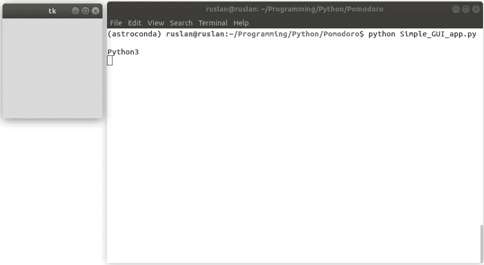
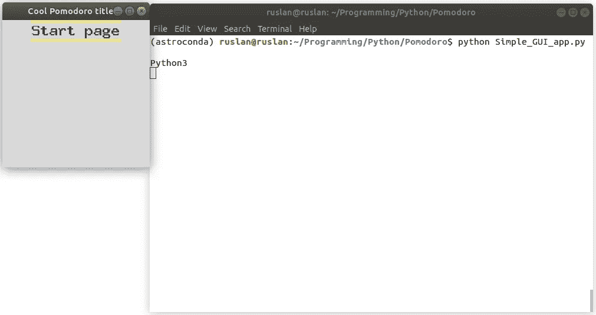
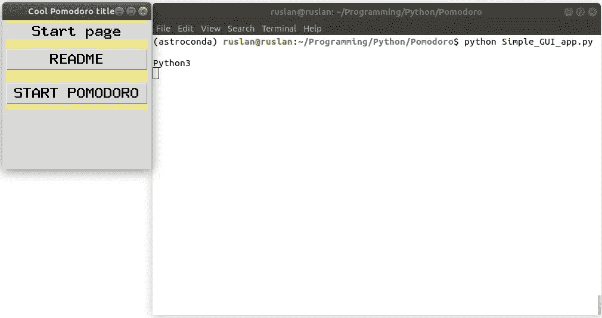
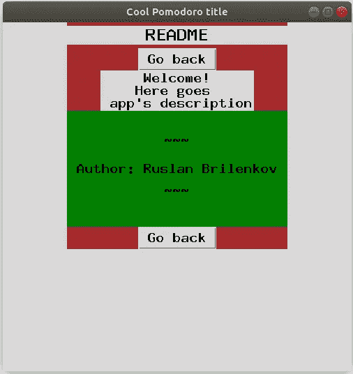

# 从头开始用 Python 创建生产力应用程序—第 1 部分

> 原文：<https://medium.datadriveninvestor.com/create-productivity-app-in-python-from-scratch-part-1-d715d1f393db?source=collection_archive---------1----------------------->

## 用于时间管理的 Python。番茄应用。


Photo by [Daria Nepriakhina](https://unsplash.com/@epicantus?utm_source=unsplash&utm_medium=referral&utm_content=creditCopyText) on [Unsplash](https://unsplash.com/s/photos/laptop-work-from-home?utm_source=unsplash&utm_medium=referral&utm_content=creditCopyText)

# 介绍

疫情正在猛烈袭击。有必要限制与“外部”世界的任何身体接触，并尽可能待在室内。如果你有机会在家工作，那是很棒的。然而，这也是要付出代价的。

在家保持高效工作不是一件容易的事情。家庭环境不是工作环境。假设你不是一个人住，你不能在接下来的 8 小时内和你的孩子/家人说再见，然后离开家去工作。通常，工作场所是你休息、吃饭、培养爱好和睡觉的同一个房间。此外，全天候呆在室内会让人发疯。

总的来说，在这个动荡的时代，几乎不可能把*的生活*和*的工作*分开。但是我们人类没有能力同时做多项任务。因此，我们很难有效地集中精力工作。

在这里，我想和你分享一个强大的生产力技巧，叫做 ***番茄。*** 帮助你一次只专注于一项活动的方法。

此外，我将讲述如何使用 Python 从头开始创建它。我会告诉你为什么我决定自己创建这个应用程序，为什么重新发明这辆自行车是值得做的，至少在我看来是这样。我想鼓励大家在日常生活中使用 Python。

# Pomodoro 作为生产力应用


Photo by [Lukas Blazek](https://unsplash.com/@goumbik?utm_source=unsplash&utm_medium=referral&utm_content=creditCopyText) on [Unsplash](https://unsplash.com/s/photos/pomodoro-timer?utm_source=unsplash&utm_medium=referral&utm_content=creditCopyText)

番茄工作法是弗朗西斯科·西里洛在 20 世纪 80 年代末发明的一种时间管理技术。这种方法使用一个计时器将工作分成间隔，传统上长度为 25 分钟，由 5 分钟的短暂休息分开。后来，偶尔有 15 分钟的长时间休息。

在意大利语中， *pomodoro* 意为*番茄*。这项技术是以西里洛在大学时使用的西红柿形状的厨房定时器命名的。

## 我的番茄挫折

这款应用有很多免费版本。随便拿一个马上开始用:*按下按钮开始工作*。尽管如此，并不是每个版本都包括一个选项来记录/存储你已经完成的会话数。在我看来，记录你的进步很重要——不管是你花了多少小时工作，还是记录你的体重减少/增加(T21)。

并非每个 Pomodoro 应用程序都有保存或显示已完成会话数量的选项。碰巧的是，我一直使用的应用程序没有这个选项。当然，没有必要知道你完成了多少番茄工作法。但是，我想知道这个数字。也许，在一天结束的时候，我看一看这个数字，它会让我觉得更有成就感。或者在周末，我可以看到我每天完成了多少番茄工作法。来了，`Ruslan_Frustrations += 1`。

此外，在某些时候，我厌倦了应用程序的标准白色背景颜色。所以，我决定检查是否有一个选项来改变它。同样，一些应用程序可能会提供它。但碰巧的是，我一直使用的应用程序没有这个选项，我也没有检查任何其他应用程序，直到我创建了我的应用程序…

再问一次，如果我不能改变背景颜色，我的作品会更好/更差吗？当然不是。但我希望有可能改变我喜欢的应用程序中的颜色。所以，`Ruslan_Frustrations += 1`。

# 创建我的应用程序的想法

结果，我决定用 Python 创建我的 Pomodoro 应用程序。总而言之，这里有几个原因

*   拥有我自己的酷酷的可定制按钮和颜色的番茄红素应用程序
*   挑战我的编程技能
*   来增加我对 Python 的了解
*   找点乐子

在这一点上，我要说最后一个原因不是最不重要的。如果不是为了好玩，我可能不会开始/继续这个项目。现在，我更高兴，因为我可以与你分享我的知识和想法。

请继续关注，因为我们将把项目分解成小部分(类似于把工作分成短的间隔)。

该项目的计划如下:

1.  创建用户友好的界面(GUI)
2.  添加番茄红素逻辑(倒计时定时器)
3.  在工作时段之间添加休息时间
4.  添加会话号记录器
5.  在会话之间切换时发出信号(声音/响铃)
6.  有趣的部分:定制颜色和按钮(也许)

几乎不可能在一篇文章中以合理的详细程度涵盖所有这些主题。根据这篇文章的长度，我将决定如何分解上述计划。但现在，让我们把它分解如下:

*   这一部分(**第一部分**)包括我们的番茄工作法 GUI 的基础——图形用户界面。以及对`classes`的简单介绍。
*   **第 2 部分**包括 Pomodoro 逻辑(定时器、会话切换等。)
*   在**第 3 部分**(有趣的部分)，我们将回到 GUI 部分，看看我们如何修改/定制我们的应用程序(按钮、颜色、背景等)。)

# 第一部分

如果你想学习 Python 中 GUI 的基础知识或者温习一下你的知识，我准备了关于 GUI 基础知识的文章。

## 快速回顾

为了以防万一，如果你想跳过所有以前的教程，我给你一个快速回顾，告诉你如何开始在 Python 中使用用于 GUI 的 Tkinter 包:

> **注意:** *Tkinter 预装 Windows 和 macOS。****Linux****用户(包括我)需要运行以下命令来安装包:*
> 
> 对于 Python 3
> *sudo apt-get 安装 python3-tk*
> 
> 对于 Python 2.7
> *sudo apt-get 安装 python-tk*

对于 Python 2 和 Python 3，Tkinter 的用法略有不同，因此我们必须显式导入正确的包:

```
import sysif (sys.version_info.major == 3):
    print('Python 3')
    import tkinter as tk# for Python 3
    from tkinter import messagebox
else:
    print('Python 2')
    import Tkinter as tk# for Python 2.7
    import tkMessageBox
```

现在，我们在同一页上。因此，让我们从应用程序布局开始。

# Pomodoro 应用程序布局

一点小剧透。在本文结束时，您将能够创建一个类似如下的 GUI:


Made by Author.

## 创建基础

我们的应用程序将有两页。一个将描述应用程序(如 README)。另一个将包含程序的“肉”，番茄倒计时定时器的逻辑。在这里，我将使用类将页面彼此分开。

[](https://www.datadriveninvestor.com/2020/07/07/introduction-to-time-series-forecasting-of-stock-prices-with-python/) [## 用 Python |数据驱动投资者进行股票价格时间序列预测简介

### 在这个简单的教程中，我们将看看如何将时间序列模型应用于股票价格。更具体地说，一个…

www.datadriveninvestor.com](https://www.datadriveninvestor.com/2020/07/07/introduction-to-time-series-forecasting-of-stock-prices-with-python/) 

我们将有 4 节课:

1.  连接所有其他框架的应用程序布局。例如不可见的主窗口`**PomodoroApp**`。
2.  `**Starting**` 页面是我们进入应用程序后看到的初始框架。它包含转到其他页面的按钮。
3.  包含应用程序信息的`**README**`页面。
4.  包含程序主要逻辑的`**Pomodoro**`定时器页面(将在下一篇**第 2 部分**中讨论)

## 创建番茄大战应用程序:

*   用类似于`root = tk.Tk()`的`__init__`初始化 Tkinter 窗口。我们还没有放任何框架。
*   定义一个函数`switch_frame`在框架(页面)之间切换。

```
class PomodoroApp(tk.Tk):
    def __init__(self):
        tk.Tk.__init__(self)
        self.frame = None
        #here, we will switch to the starting page (frame) as:
        #self.switch_frame(StartPage) def switch_frame(self, frame_class):
        new_frame = frame_class(self)
        # checking if the current frame is not empty,
        # we destroy it before switching to the next frame:
        if self.frame is not None:
            self.frame.destroy()
        self.frame = new_frame
        self.frame.pack()
```

> **注意:** *方法* `*__init__*` *称为构造函数方法。此方法允许类初始化类的属性。当从一个类创建一个对象时调用它。在这里，我们创建窗口对象(* `*tk.Tk*` *)来容纳所有其他帧。*

***简要解释*** 这段代码。当调用`PomodoroApp()`类的`switch_frame()`方法时，我们将新类中的一个新帧赋给一个`new_frame`变量。在用新的帧替换当前帧之前，如果当前帧不是空的(不是`None`，我们就删除(销毁)当前帧，否则，没有什么可销毁的。最后，我们用熟悉的方法放置一个新的框架`.pack()`。

为了调用该类/应用程序，我们使用以下命令:

```
app = PomodoroApp() # <- calling our main class
app.mainloop() # <- needed to keep the GUI running
```

像往常一样，我们通过从终端调用`python code.py`来启动我们的应用程序。我们将只看到一个短暂的空窗。因为我们还没有加载任何帧。然而，在框架之间切换的所有逻辑都已经存在了！



Made by Author

> **注:***`***self***`*代表类的实例。用于调用* ***当前*** ***类*** *的函数/方法，与调用其他类的函数相比。**

## *创建起始页*

*现在，我们可以创建另一个名为`StartPage()`的类来表示我们的起始页面，即起始框架。为了切换到**起始页面**，我们在`PomodoroApp()`类的`__init__`方法中调用`self.switch_frame(StartPage)`。*

*但是首先，我们需要创建我们的`StartPage()`类:*

```
*class StartPage(tk.Frame):
    def __init__(self, master):
        tk.Frame.__init__(self, master, bg='khaki')
        tk.Label(self, text="Start page", font=('MathJax_SansSerif-Bold', 18, "bold")).pack(side="top", fill="x", pady=5)*
```

****简要解释*** 这段代码。在这里，我们创造了*

*   *具有选定背景颜色的新框架(`khaki`)。*
*   *一个标签说，这是我们的“起始页”，有一个选定的字体参数。你可以随意改变文本的大小和样式。的。pack()方法也有几个参数，如`side`、`fill`和`pady`来放置一个标签到侧面，在 x 方向填充，在 y 方向填充。*

*为了在运行应用程序时显示起始页，让我们回到第一节课。我们从`PomodoroApp()`中调用一个`self.switch_frame(StartPage)`方法。此外，让我们添加应用程序的标题和自定义大小:*

```
*class PomodoroApp(tk.Tk):
    def __init__(self):
        tk.Tk.__init__(self)
        self.title("Cool Pomodoro title") # <-- new line!
        self.geometry("250x250") # <-- new line!
        self.frame = None
        self.switch_frame(StartPage) # <-- new line!*
```

*结果，我们得到了我们的起始页*

**

*Made by Author*

## *添加按钮*

*不，我们可以在我们的`StartPage`类中添加两个按钮。*

```
*class StartPage(tk.Frame):
    def __init__(self, master):
        tk.Frame.__init__(self, master, bg='khaki')
        tk.Label(self, text="Start page", font=('MathJax_SansSerif-Bold', 18, "bold")).pack(side="top", fill="x", pady=5)
        tk.Button(self, text="README", font=('MathJax_SansSerif-Bold', 18, "bold"),
                  command=lambda: master.switch_frame(READMEPage)).pack(fill='x', pady = 10)
        tk.Button(self, text="START POMODORO", font=('MathJax_SansSerif-Bold', 18, "bold"),
                  command=lambda: master.switch_frame(PomodoroPage)).pack(fill='x', pady = 10)*
```

> ***注意:** *我们用一个* `*lambda*` *函数。它被称为匿名函数。这些函数通常是传递给高阶函数的参数。如果 lambda 函数只需要在代码中做几次，那么使用 lambda 函数是很有用的。因为使用这些法律秩序函数在计算上更便宜。**

*结果，我们有了一个视觉上完整的起始页！请记住，按钮指向不存在的页面。我们将在接下来的步骤中创建这些页面。但是，让我们享受一下我们努力工作的成果吧！*

**

*Made by Author*

## *添加自述文件页面*

*我们将从第`README`页开始。我们计划有一个按钮“回到主页”和一个描述应用程序的文本。但是当然，一个人可以随心所欲。因为*

> *你的应用——你的规则。*

*我举一个我所做的例子:*

```
*class READMEPage(tk.Frame):
    def __init__(self, master):
        tk.Frame.__init__(self, master)
        tk.Frame.configure(self,bg='brown')
        tk.Label(self, text="README", font=('MathJax_SansSerif-Bold', 18, "bold")).pack(side="top", fill="x", pady=5)

        tk.Button(self, text="Go back", font=('MathJax_SansSerif-Bold', 14, "bold"),
                  command=lambda: master.switch_frame(StartPage)).pack()

        text_for_label = "Welcome!\nHere goes \n app's description"
        text_for_contacts = " \n\n ~~~ \n\n Author: Ruslan Brilenkov \n\n ~~~ \n\n "

        tk.Label(self, text=text_for_label, font=('MathJax_SansSerif-Bold', 14, "bold")).pack()
        tk.Label(self, text=text_for_contacts, font=('MathJax_SansSerif-Bold', 14, "bold"), bg='green').pack(side="top", fill="both")

        tk.Button(self, text="Go back", font=('MathJax_SansSerif-Bold', 14, "bold"),
                  command=lambda: master.switch_frame(StartPage)).pack()*
```

*我希望，现在你能立即掌握代码。尽管如此，我还是想提一下:*

*   *我们增加了两个“返回”按钮来防止无休止的滚动，以防我们的描述变得太长。这些按钮被链接以切换到起始页。*
*   *标签上有描述应用程序的文字和作者的联系方式等。*

*因此，我们有一个简单的解释性`README`页面:*

**

*Made by Author*

# *额外收获——一个西红柿图像*

*我们将在本教程的下一部分(**第二部分**)添加最终的“开始番茄”页面。暂时享受一下额外的部分——将图像插入标签小部件。*

> ***注:** *我们将使用* ***Python 映像库*** *(PIL)。要安装这个包，在终端中编写如下代码:
> pip 安装 pillow**

*不要忘记导入这两个包`Image`和`ImageTk`:*

```
*from PIL import Image, ImageTk
...class StartPage(tk.Frame):
    def __init__(self, master):
        . # this part
        . # is
        . # the same

        im = Image.open("pomodoro_image.png")
        im_resized = im.resize((250, 200))
        render = ImageTk.PhotoImage(im_resized)
        img = tk.Label(self, image=render)
        img.image = render
        img.pack(fill='both')*
```

*我已经将图像的大小调整到 250x200 像素以适合窗口。在这种情况下，调整图像大小是一个反复试验的过程。结果看起来像这样:*

**

*Made by Author.*

# *最后*

*幸运的是，我们的旅程还没有结束。虽然这是我们从零开始创建 Pomodoro GUI 应用程序的第一次飞跃，但是还有很多事情要做。在下一个教程中，我们将创建主要的工作/休息定时器逻辑和其他一些东西。所以，敬请关注。*

*总的来说，这个练习花费了我大量的时间，我希望它对你也有用！感谢您阅读我的文章。*

# *接触*

*在 [LinkedIn](https://www.linkedin.com/in/ruslan-brilenkov/) 上与我联系。*

*看看我的 [GitHub](https://github.com/RuslanBrilenkov) 。*

**附:如果你喜欢 Medium.com 这个美丽平台上这种不间断的阅读体验，可以考虑通过注册成为会员来支持这个社区的作家，* [*这里*](https://ruslan-brilenkov.medium.com/membership) *。它每月只需 5 美元，支持所有的作家。**

## *访问专家视图— [订阅 DDI 英特尔](https://datadriveninvestor.com/ddi-intel)*