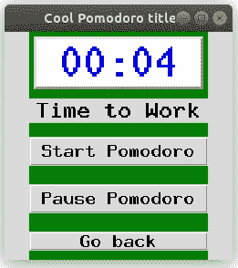

# 从头开始用 Python 创建生产力应用程序—第 2 部分

> 原文：<https://medium.datadriveninvestor.com/create-productivity-app-in-python-from-scratch-part-2-86ecca3525fa?source=collection_archive---------8----------------------->

## 用于时间管理的 Python。番茄应用。包含完整代码:)


Photo by [Artem Sapegin](https://unsplash.com/@sapegin?utm_source=unsplash&utm_medium=referral&utm_content=creditCopyText) on [Unsplash](https://unsplash.com/s/photos/python-programming?utm_source=unsplash&utm_medium=referral&utm_content=creditCopyText)

# 介绍

本文是我之前在讨论过的[项目的第二部分。概括地说，这个想法是从头开始用 Python 创建一个 ***番茄*** 应用程序。因为我们都希望待在新冠肺炎疫情的家中也能高效地工作。](https://medium.com/datadriveninvestor/create-productivity-app-in-python-from-scratch-part-1-d715d1f393db)

一种方法是一次走一步。因为我们的大脑不应该同时处理多项任务。实际上，它在不同的任务之间进行多重切换。

> 换句话说，我们需要一次只专注于一项活动。番茄工作法可以帮助我们。

## 第 1 部分摘要

之前，我们构建了应用程序的基础，如下所示:


Made by Author.

一个起始页，两个活动按钮，一个很酷的番茄图片，以及一个在遮光罩下的框架之间切换的例程。我们讨论了“README”页面，其中包括应用程序的描述和作者的联系方式。这篇文章讲的是“开始番茄”页面。

如果你想学习 Python 中 GUI 的基础知识或者温习一下你的知识，我准备了关于 GUI 基础知识的文章。

在这一部分中，我们将创建主要的工作/休息计时器逻辑和其他一些东西，比如一个会话计数器和一个记录进度的选项。但是我们将会看到，在合理的时间限制内，我们能以一个体面的细节水平实现多少。

话虽如此，让我们开始吧！

# 第二部分

## GUI 基础

让我们简要概述一下 Pomodoro 页面的图形界面。这是本项目第 1 部分的自然过渡。

> **注意:** *记住我们在程序中把每一个新页面都变成一个新类。*

在上一部分中，我们为“README”页面创建了标签和按钮。为了放置它，我们在相应的 GUI 元素(小部件)之后立即使用了命令`pack()`。比如，

```
tk.Label(...).pack(...)
```

让我们做一些不同的事情。因为我们将创建更多的 GUI 元素。这将使我们的代码更干净、更好。基本上，我们将在一个函数中创建所有的小部件，并在另一个函数中将它们放在一个框架上。比如，

```
class PomodoroPage(tk.Frame):
    def __init__(self, master):
        ... # here we create the widgets def show_widgets(self):
        ... # here we will place (show) all of them
```

而“Start Pomodoro”页面的全基础界面是:

```
class PomodoroPage(tk.Frame):
    def __init__(self, master):

        self.Message = "Time to Work"

        tk.Frame.__init__(self, master)      

        tk.Frame.configure(self,bg='green')
        self.LabelMessage = tk.Label(self, text=self.Message, font=('MathJax_SansSerif-Bold', 18, "bold"))

        label_font = ('MathJax_SansSerif-Bold', 40)
        self.time_str = tk.StringVar()
        self.LabelTime = tk.Label(self, textvariable=self.time_str, font=label_font, bg='white', 
                 fg='blue', relief='raised', bd=3)

        self.StartButton = tk.Button(self, text='Start Pomodoro',  font=('MathJax_SansSerif-Bold', 14, "bold"))

        self.PauseButton = tk.Button(self, text='Pause Pomodoro',  font=('MathJax_SansSerif-Bold', 14, "bold"))

        self.goBackButton = tk.Button(self, text="Go back", font=('MathJax_SansSerif-Bold', 14, "bold"),
                  command=lambda: master.switch_frame(StartPage))

        self.show_widgets()def show_widgets(self):
        self.LabelTime.pack(fill='x', padx=5, pady=5)
        self.LabelMessage.pack(side="top", fill="x", pady=5)

        self.StartButton.pack(fill='x', pady = 10)
        self.PauseButton.pack(fill='x', pady = 10)
        self.goBackButton.pack(fill='x', pady = 10)
```

编译完程序后，进入 Pomodoro 页面，我们可以看到以下结果:


Made by Author

代码的简要说明。如您所见，这里我们创建了:

*   两个标签(一个带有一个空消息，当我们创建它时将显示倒计时定时器，另一个带有一个(字符串)消息，告诉“工作时间”作为主要的番茄工作牌标志)
*   两个按钮(当我们创建主逻辑时，再次控制计时器)
*   还有一个按钮用于返回主页面/框架(与第 1 部分中的按钮相同)

> **注意:** *即使我们首先初始化/创建一个小部件，我们仍然可以通过以不同的顺序调用方法* `*pack()*` *或* `*place()*` *来改变它的显示顺序！这正是这里正在发生的事情。为了向您展示这个概念，我们在将显示时间的标签(一个空框)之前用文本“工作时间”初始化标签。后来，在函数* `*show_widgets()*` *里面我们先把方法* `*.pack()*` *称为第二个标签，反之亦然。它定义标签的显示顺序。*

这使得应用程序中的小部件排列更加容易。与“README”页面风格相比，我们在初始化每个小部件后立即使用了`.pack()`。代码变得更加灵活。

现在，我们有了一个好看的页面。所以，我们可以考虑一下**这个应用的核心**。实际定时器和会话(工作、中断)逻辑。

## 计时器

倒计时器是番茄工作灯的*底座*。但不仅仅是计时器。将一个工作流程分成多个不同长度的会话(工作、短休息、长休息)的方式。

让我们一次处理一个任务(就像我们一开始讨论的不要做多任务一样)。我们从我们的类`PomodoroPage()`中的新函数`count_down()`开始倒数计时器，如下所示:

```
class PomodoroPage(tk.Frame):
    def __init__(self, master):
        ... def show_widgets(self):
        ... def count_down(self):
        # For a moment, we set up our time limit here
        self.currentTiming = 10 # sec try:
            # The count-down timer. The "meat" of the program.
            for self.t in range(self.currentTiming, -1, -1):
                # format as 2 digit integers, fills with zero to the left
                # divmod() gives minutes, seconds
                self.sf = "{:02d}:{:02d}".format(*divmod(self.t, 60))
                #print(sf)  # test
                self.time_str.set(self.sf)
                self.update()
                # delay one second
                time.sleep(1) #print(self.t) except Exception as e:
                # in case of any error, print the error
                print(str(e))
```

现在，我们有了倒计时器，它在给定的时刻开始计时(现在是 10 秒),然后一直计时到零。可以看到`try-catch`块。我在这里使用它的原因是为了在意外错误(`exception`)的情况下不中断我们的程序。我仍然希望看到错误(通过打印出来)，但我希望我的 Pomodoro GUI 应用程序也能继续运行。

要了解更多信息，你可以看看这篇文章，在这篇文章中，我简单地解释了它，并直接在另一个项目中实现了它。

> **注意:** *在这里，我们可以打印出时间值，但是我们使用* `*.set()*` *方法直接在* `*time_str*` *小部件中打印出来。还有* `*.****update()***` *这个框框！这很重要，否则，我们将看不到标签内部的任何变化！*

接下来，我们将简单地从另一个方法`start_working()`中调用这个方法`count_down()`。我决定这样做的原因是，它可以灵活地实现工作休息制度之间的切换。让我们创建那个方法(在同一个类中一个接一个地创建):

```
 def start_working(self):
           # creating the main function of counting down the time
           self.count_down()
```

最后，要运行它，我们需要给按钮参数添加一个`command`，如下所示:

```
self.StartButton = tk.Button(self, text=’Start Pomodoro’, **command = self.start_working**, font=(‘MathJax_SansSerif-Bold’, 14, “bold”))
```

因此，当您编译代码并按下按钮(“Start Pomodoro”)时，您会看到类似这样的内容:



Made by Author

太棒了！现在，我们可以设置计时器，按下按钮，并立即开始工作！那是我们的基地。但是还有更令人兴奋的事情要发生:

*   工作暂停分离
*   全局变量与局部变量
*   短休息与长休息
*   已完成的会话数

## 工作暂停分离

我们想启动计时器，马上开始工作。但是，当我们需要暂停工作过程(接电话、去洗手间等)时，可能会出现意外情况。).为此，我们有了“**暂停番茄**按钮。

天真的方法是有一个布尔值(真/假)，或者某种标志，当我们按下暂停按钮时，它会向程序发出信号。

让我们从它开始，看看它有一个需要处理的问题。我们需要在代码中添加以下内容:

1.  在`class PomodoroPage()`里面，在`__init__()` 方法里面我们添加:
    `self.pause = False
    self.isPauseClicked = False`
2.  将命令添加到我们的`PauseButton` :
    `self.PauseButton = tk.Button(self, ..., command = self.hold_pause)`
3.  实际上，创建这个命令是作为一个新功能:
    `def hold_pause(self):
    self.pause = True
    self.isPauseClicked = True`
4.  为了告诉程序我们工作的时候不是暂停，我们把这个信息添加到函数`start_working` :
    `self.pause = False`
5.  最后，用一个简单但有效的`while`循环修改我们的`count_down()`例程。因此，在我们的 try-except 块中，我们添加了一个 while 循环，条件是在按钮被按下时停止(用一个`break`):

```
try:
   # Setting the condition of running a Pomodoro continuously as long
   # as the pasue is not pressed
   **while(self.pause == False):**

    # The count-down timer. The "meat" of the program.
    for self.t in range(self.currentTiming, -1, -1):
     ...

     # stopping the timer if pause button pressed
     **if self.pause == True:
      self.isPauseClicked = True
      break**except Exception as e:
   ...
```

由于我们的努力，我们应该能够启动计时器并暂停它。


Made by Author

现在，让我们谈谈我之前提到的一个问题。当我们再次启动计时器时(暂停后)，它将从头开始计时。也就是说我们之前的进步都消失了。

> 当然，我们希望能够从我们离开的地方继续工作。为此，我们需要跟踪计数器的当前值！简单吧？注意，我说简单，这可能并不容易。但这是一个很好的起点。

## 全局变量与局部变量

首先是，让我们把`workingTime = 10`放在任何类之外的程序的开头——这是一个所谓的**全局**变量的例子。可以从任何类或函数中访问该变量。

*其次*，让我们回到`PomodoroPage()`类的`count_down()`方法。在一个`while`循环中，我们添加了以下程序块:

```
**while(self.pause == False):**
     # Checking which time range to choose - to work, break or long break?
    **if (self.TimeForWork == True):**
         # for a moment, setting the time as long as test working time (10sec)
         self.currentTiming = workingTime
         # checking if we continue after the pause:
         **if (self.isPauseClicked == True):**
              self.currentTiming = **self.currentTimeCount**
```

代码的简要说明:

*   正如你在 while 循环中看到的，我们检查我们是否还在工作状态中。(在我们添加短期和长期休息制度之前，我们只能在工作制度中)。
*   因此，我们继续下去，并遇到另一个语句，检查暂停按钮是否被按下(在这个工作机制期间)。

这就是我们需要的，对吗？从我们休息的地方继续计数。

NB。如您所见，我使用了双`if-else`语句。我已经可以预料到一些关于这种结构的负面评论，但是我想听听你是否能提出一种更好的方法。有那么一会儿，我们会跟着它走。因为它能工作，而且非常简单(至少在我看来):按下工作按钮，按下暂停按钮，再按一次工作按钮，就会看到一个计时器从那个位置继续运行。按预期工作。

*第三*，在一个实际的倒计时定时器方法里面，我们增加了一行:
`self.currentTimeCount = self.t`。现在，我们的计时器保存当前时间的信息。因此，当我们按下暂停按钮，然后按下工作按钮时，我们从同一个地方继续。那就是成功！

*最后*，我们可能会看到，当计时器到达零时，它会一直显示零值。为了让计时器循环运行在相同的模式下(暂时，仅工作模式)，我们在我们的`while`循环中添加了`self.isPauseClicked = False`(就在一个双`if-else`语句之后)。

# 后记和总结

尽管我试图让这篇文章尽可能的简短和信息丰富，但它可能有点像“一口吞下的大药丸”。所以，我们就此打住。在下一部分中，我们可以研究酷酷的 Pomodoro Python 应用程序的其他元素。

概括一下，在这一部分，我们创建了一个包含 Pomodoro 应用程序的整个页面，还有倒计时器和暂停按钮。该定时器通过循环进行自我调节，并且它存储关于定时器当前值的信息。因此，它为我们的暂停按钮提供了完整的功能和预期的行为。这是一个应用程序的工作原型(还不包括休假制度)。

换句话说，现在我们可以按两个按钮开始工作，暂停计时器，并从我们离开的那一刻开始继续工作。

感谢您阅读我的文章。我希望你喜欢它并且学到一些新的东西。回头见！

另外，如果你对我最近从事的其他 Python 项目感兴趣，这里有几个链接。这个[是关于分析科学论文中的新冠肺炎数据。这个](https://medium.com/swlh/analyzing-covid-19-papers-with-python-part-1-22706eb92270)是关于用 Python 追踪我们的体重。我从头开始构建这些项目，并做了大量的解释，以鼓励每个有兴趣的人在日常生活中使用 Python。

# 完整代码

最后但同样重要的是。我相信应该可以理解我的解释(特别是，如果你从 [Part 1](https://medium.com/datadriveninvestor/create-productivity-app-in-python-from-scratch-part-1-d715d1f393db) 开始就一直关注我，如果没有，请核实一下)。但是如果你还有任何问题，或者有什么不清楚的地方，这里是应用程序这一部分的完整代码。当然，欢迎任何评论、问题或建议！

> 复制、粘贴、编译、欣赏:)

```
try:
 import tkinter as tk # for Python 3
except:
 import Tkinter as tk # for Python 2.7

import time 
from PIL import Image, ImageTkworkingTime = 10class SampleApp(tk.Tk):
 def __init__(self):
  tk.Tk.__init__(self)
  self.title("Cool Pomodoro title") # <-- new line!
  self.geometry("250x250")
  self._frame = None
  self.switch_frame(StartPage)def switch_frame(self, frame_class):
  new_frame = frame_class(self)
  if self._frame is not None:
   self._frame.destroy()
  self._frame = new_frame
  self._frame.pack()class StartPage(tk.Frame):
 def __init__(self, master):
  tk.Frame.__init__(self, master, bg='khaki')
  tk.Label(self, text="Start page", font=('MathJax_SansSerif-Bold', 18, "bold")).pack(side="top", fill="x", pady=5)
  tk.Button(self, text="README", font=('MathJax_SansSerif-Bold', 18, "bold"),
                  command=lambda: master.switch_frame(READMEPage)).pack(fill='x', pady = 10)
  tk.Button(self, text="START POMODORO", font=('MathJax_SansSerif-Bold', 18, "bold"),
                  command=lambda: master.switch_frame(PomodoroPage)).pack(fill='x', pady = 10)

  im = Image.open("pomodoro_art.png")
  im_resized = im.resize((250, 200))
  render = ImageTk.PhotoImage(im_resized)
  img = tk.Label(self, image=render)
  img.image = render
  img.pack(fill='both')class READMEPage(tk.Frame):
 def __init__(self, master):
  tk.Frame.__init__(self, master)
  tk.Frame.configure(self,bg='brown')
  tk.Label(self, text="README", font=('MathJax_SansSerif-Bold', 18, "bold")).pack(side="top", fill="x", pady=5)

  tk.Button(self, text="Go back", font=('MathJax_SansSerif-Bold', 14, "bold"),
                  command=lambda: master.switch_frame(StartPage)).pack()
  tk.Label(self, text="Here goes the description what this app does.", font=('MathJax_SansSerif-Bold', 18, "bold")).pack(side="top", fill="both")
  tk.Button(self, text="Go back", font=('MathJax_SansSerif-Bold', 14, "bold"),
                  command=lambda: master.switch_frame(StartPage)).pack()class PomodoroPage(tk.Frame):
 def __init__(self, master):
  '''
  Initial setup of the counter:
  Working regime, countdoown.
  After that a short break. Then, work again.
  And so on. In principle, every 3rd break should be a long break.
  '''

  # Setting flags to check if it is time to work or to rest.
  self.pause = False
  self.isPauseClicked = Falseself.TimeForWork = True

  # counter to track the current time
  self.currentTimeCount = 0

  self.Message = "Time to Work"

  tk.Frame.__init__(self, master)      

  tk.Frame.configure(self,bg='green')
  self.LabelMessage = tk.Label(self, text=self.Message, font=('MathJax_SansSerif-Bold', 18, "bold"))

  label_font = ('MathJax_SansSerif-Bold', 40)
  self.time_str = tk.StringVar()
  self.LabelTime = tk.Label(self, textvariable=self.time_str, font=label_font, bg='white', 
                 fg='blue', relief='raised', bd=3)

  self.StartButton = tk.Button(self, text='Start Pomodoro', command = self.start_working,  font=('MathJax_SansSerif-Bold', 14, "bold"))

  self.PauseButton = tk.Button(self, text='Pause Pomodoro', command = self.hold_pause,  font=('MathJax_SansSerif-Bold', 14, "bold"))

  self.goBackButton = tk.Button(self, text="Go back", font=('MathJax_SansSerif-Bold', 14, "bold"),
                  command=lambda: master.switch_frame(StartPage))

  self.show_widgets()def show_widgets(self):
  self.LabelTime.pack(fill='x', padx=5, pady=5)
  self.LabelMessage.pack(side="top", fill="x", pady=5)

  self.StartButton.pack(fill='x', pady = 10)
  self.PauseButton.pack(fill='x', pady = 10)
  self.goBackButton.pack(fill='x', pady = 10)def count_down(self):#self.currentTiming = 10 # sectry:
   # Setting the condition of running a Pomodoro continuously as long
   # as the pasue is not pressed
   while(self.pause == False):

    # Checking which time range to choose - to work, break or long break?
    if (self.TimeForWork == True):
     # for a moment, setting the time as long as test working time (10sec)
     self.currentTiming = workingTime
     # checking if we continue after the pause:
     if (self.isPauseClicked == True):
      self.currentTiming = self.currentTimeCount

    # checking if puase button is pressed
    self.isPauseClicked = False

    # The count-down timer. The "meat" of the program.
    for self.t in range(self.currentTiming, -1, -1):
     # format as 2 digit integers, fills with zero to the left
     # divmod() gives minutes, seconds
     self.sf = "{:02d}:{:02d}".format(*divmod(self.t, 60))
     #print(sf)  # test
     self.time_str.set(self.sf)
     self.update()
     # delay one second
     time.sleep(1)

     # tracking the current time left to finish the streak
     # need it to continue the work after the pause
     self.currentTimeCount = self.t#print(self.t)

     # stopping the timer if pause button pressed
     if self.pause == True:
      self.isPauseClicked = True
      breakexcept Exception as e:
   # in case of any error, print the error
   print(str(e))

 def hold_pause(self):

  self.pause = True
  self.isPauseClicked = Truedef start_working(self):
  # while working, setting pause flag to false
  self.pause = False
  # creating the main function of counting down the time
  self.count_down()if (__name__ == "__main__"):
 app = SampleApp()
 app.mainloop()
```

## GitHub 链接

以防万一，如果还有不清楚的地方，请访问[我的番茄红素 GitHub](https://github.com/RuslanBrilenkov/Pomodoro_GUI_in_Python) 项目页面。

此外，如果你有任何问题，不要犹豫与我联系。这里是我的 [LinkedIn](https://www.linkedin.com/in/ruslan-brilenkov/) 。

*附:如果你喜欢 Medium.com 这个美丽平台上这种不间断的阅读体验，可以考虑通过注册成为会员来支持这个社区的作家，* [*这里*](https://ruslan-brilenkov.medium.com/membership) *。它每月只需 5 美元，支持所有的作家。*