# 使用 Python 中的“亲爱的 PyGui”创建快速而强大的 Gui

> 原文：<https://medium.datadriveninvestor.com/create-quick-and-powerful-guis-using-dear-pygui-in-python-713cc138bf5a?source=collection_archive---------0----------------------->

## 亲爱的 PyGui

## Python 的无膨胀图形用户界面，具有最小的依赖性。DearPyGui 是一个全包式 Gui 框架， *DearPyGui* 就像创建一个 python 脚本一样简单。

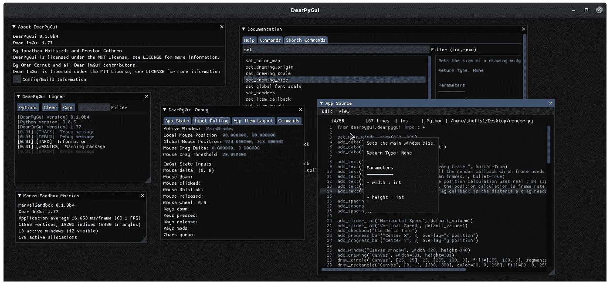

DearPyGui. Image Credit: [DearPyGui GitHub](https://github.com/hoffstadt/DearPyGui/raw/assets/tools.png?raw=true)

亲爱的 PyGui 是一个简单而强大的 Python Gui 框架，使用 Python 脚本来构建 GUI。Dear Py Gui 使用 Dear ImGui 的包装器，模拟传统的保留模式 Gui，而不是 Dear ImGui 的即时模式范例。

> 亲爱的 PyGui 从根本上不同于其他 Python GUI 框架

即时模式范例允许创建非常动态的界面。亲爱的 PyGui 不使用原生小部件，而是由计算机的显卡如 PyQt 绘制(使用 Directx11、Metal 和 Vulkan 渲染 API)。

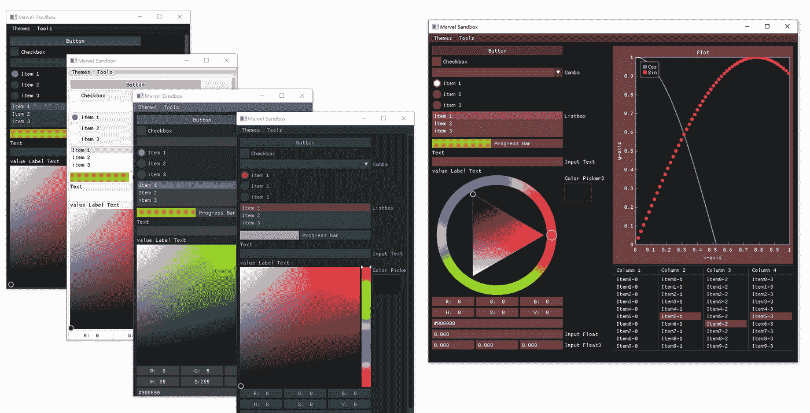

DearPyGui, Image Credit: [pypi Project](https://warehouse-camo.ingress.cmh1.psfhosted.org/c8c7817a436199e5f9ccabf134049fa3f92a5d24/68747470733a2f2f6769746875622e636f6d2f5261796c6f636b4c4c432f4465617250794775692f626c6f622f6173736574732f5468656d65732e504e473f7261773d74727565)

# 为什么用亲爱的 PyGui

与其他 Python GUI 库相比，Dear PyGui 的独特之处在于:

*   GPU 渲染
*   简单的内置异步函数支持
*   完整的主题和样式控制
*   简单的内置日志窗口
*   70 多个小部件，有数百种小部件组合
*   详细的文档、示例和无与伦比的支持

# 突出

*   主题— 10 个内置主题和一个自定义主题系统
*   绘图—绘图 API(内爆的包装)
*   画布—低级绘图 API
*   记录—记录 API
*   小部件——向下滚动查看亲爱的 PyGui 中的各种小部件

# 装置

确保至少安装了 Python 3.7 (64 位)。

```
pip install dearpygui
or
pip3 install dearpygui
```

## 属国

*   [亲爱的 ImGui](https://github.com/ocornut/imgui)
*   [CPython](https://github.com/python/cpython)
*   [内爆](https://github.com/epezent/implot)
*   [CLI11](https://github.com/CLIUtils/CLI11)

# 使用

亲爱的 PyGui 为 python 开发者提供了一种简单的方法来为脚本创建快速而强大的 Gui。亲爱的 PyGui 由一个程序窗口、窗口和小部件组成。程序窗口是程序的主窗口，通过调用函数`start_dearpygui().`在主 python 脚本的末尾创建

代码:

```
from dearpygui.core import *

*def* save_callback(sender, data):
    print("Save Clicked")

add_text("Hello, world")
add_button("Save", callback=save_callback)
add_input_text("string", default_value="Quick brown fox")
add_slider_float("float", default_value=0.273, max_value=1)

start_dearpygui()
```

结果:

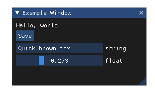

Output

下面的程序示例显示了程序窗口和另一个使用内置文档功能显示文档的窗口

```
from dearpygui.core import *

set_main_window_size(800, 800)
show_about()
show_documentation()

# when running this code please look at the about window and it will report which version of Dear PyGUI is running
# Even if you just did a pip install please ensure you your environment is using the latest package
start_dearpygui()
```

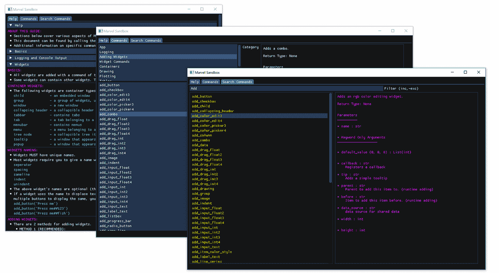

Built-in Documentation

亲爱的 PyGui 由两个模块组成`*dearpygui.core*`和`*dearpygui.simple.*`

`*dearpygui.core*`包含亲爱的 PyGUI 的基本功能。一切都可以用核心来完成。这是*简单*模块正在包装的实际 C 扩展模块。

`*dearpygui.simple*`包含从*内核*创建的简单包装器和其他实用程序，为亲爱的 PyGui 提供更友好的界面。

## 开发者工具

亲爱的 PyGui 包含几个非常有用的开发工具。`show_source()`需要输入 python 文件名才能读取。

```
from dearpygui.core import *

show_documentation()
show_debug()
show_about()
show_metrics()
show_source("main.py")  # replace "main.py" with your python file name
show_logger()

start_dearpygui()
```

## 内置日志记录

许多强大的内置开发工具之一是**记录器**。这可以通过命令`show_logger()`进入。记录器有 6 个日志级别:

1.  找到；查出
2.  调试
3.  信息
4.  警告
5.  错误
6.  离开

可以通过设置日志级别来过滤日志命令。记录器将过滤掉设定水平和低于该水平的任何水平。

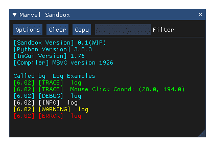

Logging

*mvTRACE* 日志级别将显示所有命令。

```
from dearpygui.core import *

show_logger()
set_log_level(mvTRACE)
log("trace message")
log_debug("debug message")
log_info("info message")
log_warning("warning message")
log_error("error message")

start_dearpygui()
```

## 创建小部件和容器

亲爱的 PyGui 物品可分为:

*   常规项目(即输入、按钮)
*   集装箱项目(例如窗口、弹出窗口、工具提示、子窗口)
*   布局项目(即分组、下一列)

使用各自的 *add_**** 命令添加项目。

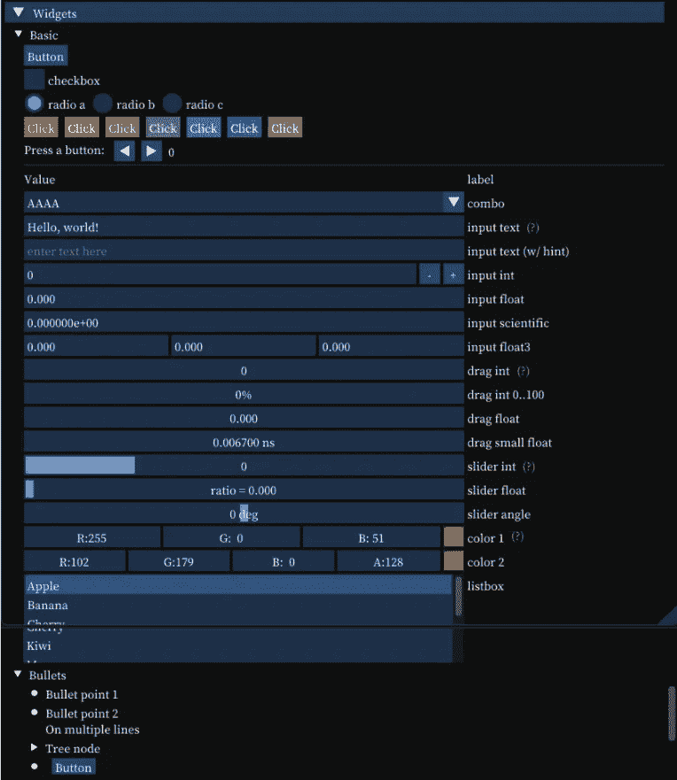

Widgets. Image Credit: [DearPyGui Getting Started](https://hoffstadt.github.io/DearPyGui/getting_started.html)

每个项目都必须有唯一的名称。默认情况下，该名称将成为标签(如果适用)。如果您想更改小部件的标签，您可以

*   在名称后面加上“## ”(例如" displayed _ name # # unique _ part ")" # # "之后的任何内容都将从显示的名称中隐藏。
*   使用 label 关键字，它将显示项目的标签而不是名称。

有些项目名称是为函数中没有名称参数的项目自动生成的。(即 same_line)。但是，它们有一个可选的名称关键字，如果您以后需要引用该项，可以填写该关键字。

```
from dearpygui.core import *

add_button("Apply")
add_same_line(spacing=10)
add_button("Apply##1")
add_same_line(spacing=10, name="sameline1")
add_button("Apply2", label="Apply")
add_spacing(count=5, name="spacing1")
add_button("Apply##3")

start_dearpygui()
```

`*dearpygui.simple*`上下文管理器自动调用 *end* 函数，允许代码折叠，并显示代码本身的层次结构。

> 默认情况下，项目是按照提交的顺序创建的。

但是，可以通过指定一个`*parent*`容器来无序添加项目。使用`*parent*`关键字将在父列表的子列表末尾插入小部件。如果你想把它插入到其他地方，结合使用`*before*`和`*parent*`关键字，把这个项目放在子列表中另一个项目的前面。

```
from dearpygui.core import *
from dearpygui.simple import *

add_text("First coded widget") 
add_text("This is some text on window 2", parent="window 2")  
# we can even specify the parent before it was coded
add_text("This is some text on child 1", parent="child 1")    
# we can even specify the parent before it was coded
with window("window 1"):                                      
# simple
    with child("child 1"):                                    
# simple
        add_checkbox("Checkbox")                              
# this is a input item added inside of the child
add_checkbox("Last coded widget", parent="MainWindow", before="First coded widget")
add_checkbox("Last coded widget 2", parent="child 1", before="Checkbox")

# empty window
with window("window 3"): # simple
    pass

start_dearpygui()
```

## 使用小部件

每个输入小部件都有一个值，可以在创建时或运行时通过命令 *set_value* 使用 *default_value* 关键字进行设置。要访问小部件的值，我们可以使用命令 *get_value* 。我们还可以将小部件的值直接传递给 python 变量，或者从 python 变量传递。

```
from dearpygui.core import *

my_var = True
add_checkbox("Radio Button", default_value=my_var)
print("Radio Button Value: ", get_value("Radio Button"))
print("my_var Value: ", my_var)

set_value("Radio Button", False)
print("Radio Button Value: ", get_value("Radio Button"))
print("my_var Value: ", my_var)

my_var = get_value("Radio Button")
print("Radio Button Value: ", get_value("Radio Button"))
print("my_var Value: ", my_var)

start_dearpygui()
```

## 小部件和窗口回调

每个输入小部件都有一个回调函数，在与小部件交互时运行。

回调用于为小部件提供功能。回调既可以在创建时分配给小部件，也可以在创建后使用`set_item_callback()`分配给小部件，如下面的代码所示。

> **应用于 Dear PyGui 中项目的每个回调必须接受一个*发送方*和*数据*参数。**

Dear PyGui 使用 *sender* 参数通过发送名称来通知回调是哪个小部件触发了回调。

各种标准回调使用*数据*参数，通过指定回调`callback_data`来发送附加数据。

窗口类型的小部件有特殊的回调函数，这些回调函数在窗口调整大小和关闭时被触发。窗口特定的回调可以应用于任何窗口类型的小部件。 *on_close* 将在窗口关闭时运行分配给关键字的回调，`set_resize_callback()`将在每次调整容器大小时运行，并且可以通过使用 handler 关键字设置为任何特定的窗口，默认为“主窗口”

如果你想让回调在每一帧都运行，你可以使用`set_render_callback()`

```
from dearpygui.core import *
from dearpygui.simple import *

*def* close_me(sender, data):
    log_debug(f"{sender} window has been closed")

*def* render_me(sender, data):
    log_debug(f"window {sender} has ran a render callback")

*def* resize_me(sender, data):
    log_debug(f"window {sender} has ran a rezise callback")

show_logger()                                      # were going to use the logger to display callback replies
with window("Tester", on_close=close_me):          # simple
    add_text('resize this window resize callback will occur')
    add_text('close this window using the "x" button and a close callback will occur')

set_render_callback(render_me)
set_resize_callback(resize_me, handler="Tester")

start_dearpygui()
```

## 运行时添加和删除小部件

使用亲爱的 PyGui，您可以在运行时动态添加和删除任何项目。这可以通过使用回调来运行所需项目的 *add_**** 命令并指定该项目将属于的父项来完成。默认情况下，如果没有指定父窗口，小部件将被添加到主窗口。添加项目时，通过在前使用关键字*，您可以控制新项目将出现在父项目的哪个项目之前。默认情况下会将新的小部件放在末尾。*

## 价值和数据存储

当添加新的小部件时，值被添加到值存储系统。默认情况下，该值的标识符是小部件的名称。您可以使用 source 关键字覆盖该标识符。这样做的好处之一是让多个小部件控制同一个值。

使用`get_value("source name")`从值系统中检索值。

可以使用`set_value("source name")`手动更改数值。

要使不同值类型的小部件在存储系统中使用相同的值，必须首先创建较大的值。

[](https://www.datadriveninvestor.com/2020/07/07/introduction-to-time-series-forecasting-of-stock-prices-with-python/) [## 用 Python |数据驱动投资者进行股票价格时间序列预测简介

### 在这个简单的教程中，我们将看看如何将时间序列模型应用于股票价格。更具体地说，一个…

www.datadriveninvestor.com](https://www.datadriveninvestor.com/2020/07/07/introduction-to-time-series-forecasting-of-stock-prices-with-python/) 

> ***记住你可以在数据存储中存储任何 python 对象甚至自定义数据类型。*** 虽然我们只会显示一张被存储的地图。

```
from dearpygui.core import *

*def* store_data(sender, data):
    custom_data = {
        "Radio Button": get_value("Radio Button"),
        "Checkbox": get_value("Checkbox"),
        "Text Input": dget_value("Text Input"),
    }
    add_data("stored_data", custom_data)

*def* print_data(sender, data):
    log_debug(get_data("stored_data"))

show_logger()
show_debug()
add_radio_button("Radio Button", items=["item1", "item2"])
add_checkbox("Checkbox")
add_input_text("Text Input")
add_button("Store Data", callback=store_data)
add_button("Print Data", callback=print_data)

start_dearpygui()
```

## 菜单栏

GUI 功能的一个非常重要的小部件是菜单栏。菜单栏总是显示在窗口的顶部，有 3 个主要部分:

1.  菜单栏—主菜单功能区
2.  菜单—下拉菜单“子菜单”
3.  菜单项—可以运行回调的项目(基本上是可选的)

项目从右向左添加到菜单栏。项目从上到下添加到菜单中。

> 菜单可以根据需要嵌套。任何小部件都可以添加到菜单中。

```
from dearpygui.core import *
from dearpygui.simple import *

*def* print_me(sender, data):
    log_debug(f"Menu Item: {sender}")

show_logger()
with menu_bar("Main Menu Bar"):                    # simple

    with menu("File"):                             # simple

        add_menu_item("Save", callback=print_me)
        add_menu_item("Save As", callback=print_me)

        with menu("Settings"):                     # simple

            add_menu_item("Setting 1", callback=print_me)
            add_menu_item("Setting 2", callback=print_me)

    add_menu_item("Help", callback=print_me)

    with menu("Widget Items"):

        add_checkbox("Pick Me", callback=print_me)
        add_button("Press Me", callback=print_me)
        add_color_picker4("Color Me", callback=print_me)

start_dearpygui()
```

## 文件和目录选择器对话框

目录对话框通过调用`select_directory_dialog()`来使用，必须给它一个返回回调。返回回调的数据参数将用目录路径&文件夹路径作为字符串列表填充。

文件对话框通过调用`open_file_dialog()`来使用，必须给它一个返回回调。返回回调的数据参数将用目录路径&文件路径作为字符串列表填充。扩展名是文件对话框的一个可选关键字，它将根据扩展名选择过滤对话框中显示的文件。

```
from dearpygui.core import *

*def* file_picker(sender, data):
    open_file_dialog(callback=apply_selected_file, extensions=".*,.py")

*def* apply_selected_file(sender, data):
    log_debug(data)  # so we can see what is inside of data
    directory = data[0]
    file = data[1]
    set_value("directory", directory)
    set_value("file", file)
    set_value("file_path", f"{directory}\\{file}")

show_logger()
add_button("Directory Selector", callback=file_picker)
add_text("Directory Path: ")
add_same_line()
add_label_text("##filedir", source="directory", color=[255, 0, 0])
add_text("File: ")
add_same_line()
add_label_text("##file", source="file", color=[255, 0, 0])
add_text("File Path: ")
add_same_line()
add_label_text("##filepath", source="file_path", color=[255, 0, 0])

start_dearpygui()
```

## 测绘

《亲爱的 PyGui》有简单的情节和动态的情节。

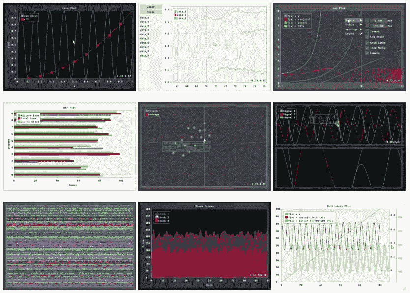

Different Plots. Image Credit: [DearPyGui Repo](https://github.com/hoffstadt/DearPyGui)

简单绘图接受一个列表，并根据列表中的项目数绘制 y 轴数据。这些可以是线形图或直方图。

绘图比简单绘图有更多的功能。绘图使用 x 和 y 坐标。必须使用`add_plot()`命令创建图表，然后数据可以添加为线形系列或散点系列。地块的特征是:

*   单击并拖动:平移绘图
*   在轴上单击并拖动:向一个方向平移图
*   双击:根据数据缩放绘图
*   右键单击并拖动:缩放到一个区域
*   双击右键:打开设置
*   Shift +右键单击并拖动:缩放到填充当前轴的区域
*   滚动鼠标滚轮:缩放
*   在轴上滚动鼠标滚轮:仅缩放该轴
*   切换图例上的数据集以隐藏它们

通过用`set_value()`改变绘图调用的值，简单的绘图可以变成动态的。

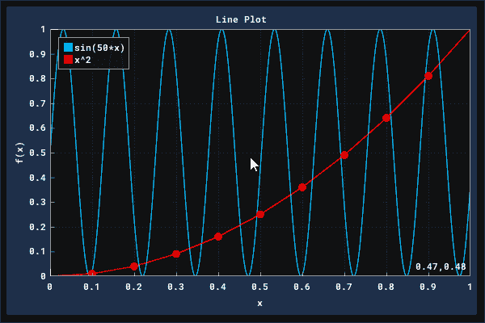

Plots Controls. Image Credit: [DearPyGui Repo](https://github.com/hoffstadt/DearPyGui)

情节也可以是动态的。动态函数的应用非常简单，只需使用回调(如渲染或项目的回调)清除绘图并添加新数据。`set_value()`。

```
from dearpygui.core import *
from math import cos

*def* plot_callback(sender, data):
    # keeping track of frames
    frame_count = get_data("frame_count")
    frame_count += 1
    add_data("frame_count", frame_count)

    # updating plot data
    plot_data = get_data("plot_data")
    if len(plot_data) > 2000:
        frame_count = 0
        plot_data.clear()
    plot_data.append([3.14 * frame_count / 180, cos(3 * 3.14 * frame_count / 180)])
    add_data("plot_data", plot_data)

    # plotting new data
    clear_plot("Plot")
    add_line_series("Plot", "Cos", plot_data, weight=2)

add_plot("Plot", height=-1)
add_data("plot_data", [])
add_data("frame_count", 0)
set_render_callback(plot_callback)

start_dearpygui()
```

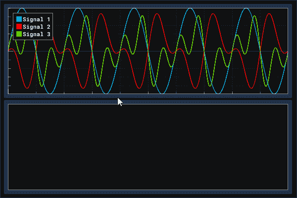

Plots Views. Image Credit: [DearPyGui Repo](https://github.com/hoffstadt/DearPyGui)

## 绘画/画布

亲爱的 PyGui 有一个低级的绘图 API，非常适合原始绘图、自定义小部件，甚至动态绘图。

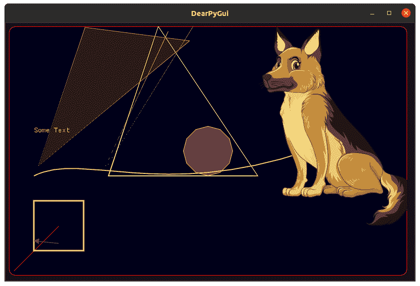

Drawing/Canvas. Image Credit: [DearPyGui Repo](https://github.com/hoffstadt/DearPyGui)

通过调用`add_drawing()`开始绘图，然后通过调用各自的绘图命令添加项目。画布的原点在左下角。

图形具有比例、原点和大小，都可以访问和设置。比例是项目 x 和 y 值的倍数。大小以像素为单位。

图纸可以显示图像的类型”。png“，”。jpg "，或者"。bmp”。使用`draw_image()`绘制图像

虽然可以通过清除和重画整个东西来动态绘制图形，但是提供了一种更有效的方法。

为了使绘图动态化，我们应该使用 tag 关键字来标记我们想要重画的项目。然后使用相同的标签简单地调用一个 draw 命令。这将只删除一个项目，并用新命令重新绘制它。

```
from dearpygui.core import *

*def* on_render(sender, data):
    counter = get_data("counter")
    counter += 1
    modifier = get_data("modifier")
    if counter < 300:
        modifier += 1
    elif counter < 600:
        modifier -= 1
    else:
        counter = 0
        modifier = 2

    xpos = 15 + modifier*1.25
    ypos = 15 + modifier*1.25
    color1 = 255 - modifier*.8
    color3 = 255 - modifier*.3
    color2 = 255 - modifier*.8
    radius = 15 + modifier/2
    segments = round(35-modifier/10)
    draw_circle("Drawing_1", [xpos, ypos], radius, [color1, color3, color2, 255], segments, tag="circle##dynamic")
    add_data("counter", counter)
    add_data("modifier", modifier)

add_data("counter", 0)
add_data("modifier", 2)
add_drawing("Drawing_1", width=700, height=700)
set_render_callback(on_render)

start_dearpygui()
```

## 增量时间和内部时钟

亲爱的 PyGui 有一个用于检查总运行时间的内置时钟`get_total_time()`,它以秒为单位返回总运行时间

同样使用命令`get_delta_time()`我们可以检查渲染帧之间的时间间隔，以秒为单位。

```
from dearpygui.core import *

*def* on_render(sender, data):
    delta_time = str(round(get_delta_time(), 4))
    total_time = str(round(get_total_time(), 4))
    set_value("delta_time", delta_time)
    set_value("total_time", total_time)

add_text("Total Time: ")
add_same_line()
add_label_text("##total_time_text", source="total_time")
add_text("Delta Time: ")
add_same_line()
add_label_text("##delta_time_text", source="delta_time")
set_render_callback(callback=on_render)

start_dearpygui()
```

## 桌子

亲爱的 PyGui 有一个简单的表格 API，非常适合静态和动态表格。

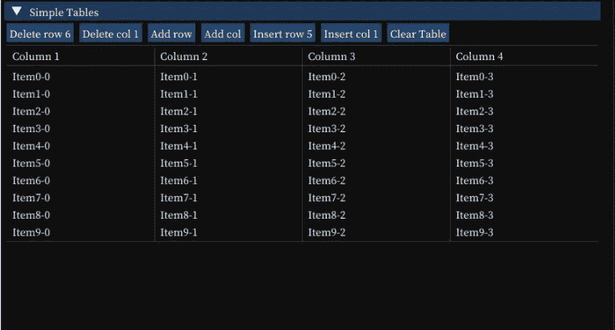

Tables. Image Credit: [DearPyGui Getting Started](https://hoffstadt.github.io/DearPyGui/getting_started.html)

表格小部件通过调用`add_table()`来启动。

要编辑表格小部件，我们可以使用`add_row()` `add_column()`方法，将行/列添加到表格的最后一个槽。

或者，我们可以使用`insert_row()` `insert_column()`插入行/列。根据索引参数插入列和行。如果指定的索引已经存在，现有的列/行将被删除，新的行/列将被插入到指定的索引处。

此外，默认情况下，添加或插入的行/列将用空单元格填充未指定的单元格。

此外，可以重命名标题和单元格，并更改它们的值。

> 表格单元格是可选的。这意味着我们可以对表应用回调，并通过发送者检索哪个单元格被选中，甚至获取单元格内的文本。

```
from dearpygui.core import *

*def* table_printer(sender, data):
    log_debug(f"Table Called: {sender}")
    coord_list = get_table_selections("Table Example")
    log_debug(f"Selected Cells (coordinates): {coord_list}")
    names = []
    for coordinates in coord_list:
        names.append(get_table_item("Table Example", coordinates[0], coordinates[1]))
    log_debug(names)

show_logger()
add_table("Table Example", ["Header 0", "Header 1"], callback=table_printer)
add_row("Table Example", ["awesome row", "text"])
add_row("Table Example", ["super unique", "unique text"])
add_column("Table Example", "Header 3", ["text from column", "text from column"])
add_row("Table Example", ["boring row"])

start_dearpygui()
```

## 输入轮询

Dear PyGui 中的输入轮询是通过在函数中调用所需的轮询命令来完成的。该函数必须设置为 windows 呈现回调，以便在窗口活动时进行轮询。因为渲染回调每帧运行一次，所以如果执行了指定的输入，亲爱的 PyGui 可以在帧之间轮询。

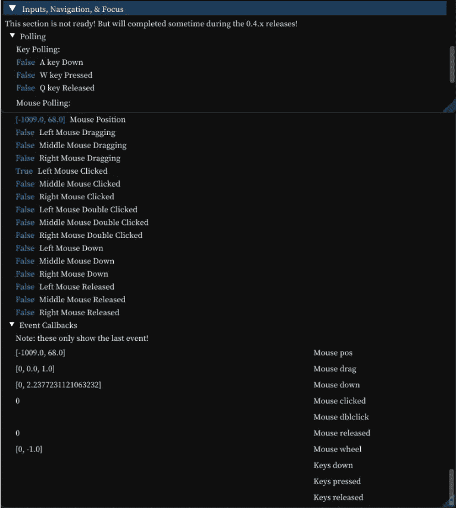

Input Polling. Image Credit: [DearPyGui Getting Started](https://hoffstadt.github.io/DearPyGui/getting_started.html)

所有轮询的列表如下:

*   get_mouse_drag_delta()
*   get_mouse_pos()
*   is_key_down()
*   is _ key _ pressed()
*   is_key_released()
*   is_mouse_button_clicked()
*   is _ mouse _ button _ 双击()
*   is_mouse_button_down()
*   是 _ 鼠标 _ 按钮 _ 拖动()
*   is_mouse_button_released()
*   set _ key _ down _ 回调()
*   set _ key _ press _ 回调()
*   set _ key _ release _ 回调()
*   set _ mouse _ click _ 回调()
*   set _ mouse _ 双击 _ 回调()
*   set_mouse_down_callback()
*   set _ mouse _ drag _ 回调()
*   set _ 鼠标 _ 滚轮 _ 回调()
*   set _ render _ 回调()
*   set_resize_callback()

有关特定命令的信息，请参见 [**API 参考**](https://hoffstadt.github.io/DearPyGui/api_docs.html) 。

可以根据需要组合任意多的轮询来实现所需的功能。

```
from dearpygui.core import *

*def* main_callback(sender, data):
    set_value("Mouse Position", str(get_mouse_pos()))

    if is_key_down(mvKey_A):
        set_value("A key Down", "True")
    else:
        set_value("A key Down", "False")

    if is_key_pressed(mvKey_A):
        set_value("A key Pressed", "True")
    else:
        set_value("A key Pressed", "False")

    if is_key_released(mvKey_A):
        set_value("A key Released", "True")
    else:
        set_value("A key Released", "False")

    if is_mouse_button_dragging(mvMouseButton_Left, 10):
        set_value("Left Mouse Dragging", "True")
    else:
        set_value("Left Mouse Dragging", "False")

    if is_mouse_button_clicked(mvMouseButton_Left):
        set_value("Left Mouse Clicked", "True")
    else:
        set_value("Left Mouse Clicked", "False")

    if is_mouse_button_double_clicked(mvMouseButton_Left):
        set_value("Left Mouse Double Clicked", "True")
    else:
        set_value("Left Mouse Double Clicked", "False")

    if is_key_down(mvKey_Shift) and is_mouse_button_clicked(mvMouseButton_Left):
        set_value("Shift + Left Mouse Clicked", "True")
    else:
        set_value("Shift + Left Mouse Clicked", "False")

add_label_text("A key Down", value="False", color=[0, 200, 255])
add_label_text("A key Pressed", value="False", color=[0, 200, 255])
add_label_text("A key Released", value="False", color=[0, 200, 255])
add_spacing()
add_label_text("Mouse Position", value="(0,0)", color=[0, 200, 255])
add_label_text("Left Mouse Clicked", value="False", color=[0, 200, 255])
add_label_text("Left Mouse Dragging", value="False", color=[0, 200, 255])
add_label_text("Left Mouse Double Clicked", value="False", color=[0, 200, 255])
add_label_text("Shift + Left Mouse Clicked", value="False", color=[0, 200, 255])

set_render_callback(main_callback)

start_dearpygui()
```

## 多线程和异步功能

对于需要延长时间的计算和回调，实现异步函数或在单独的线程上运行的函数会很有用。为此只需调用`run_async_function()`。

> **需要注意的是，使用 async 命令运行的函数不能调用任何其他亲爱的 PyGui API 调用。**

异步函数不能访问`add_data()`或`get_data()`。因此，当需要向异步函数传递数据时，必须使用数据和返回处理程序关键字参数。任何 Python 对象都可以通过“data”关键字发送到函数中，从而被异步函数访问。此外，从异步函数返回的任何数据都可以通过指定的返回回调的“数据”输入来访问。

```
from dearpygui.core import *
from time import sleep

*def* long_async_preparer(data, sender):
    floaty = get_value("Async Input Data")
    run_async_function(long_callback, floaty, return_handler=long_async_return)

*def* long_callback(sender, data):
    sleep(3)
    return data * 2

*def* long_async_return(sender, data):
    log_debug(data)

*def* long_callback2(sender, data):
    sleep(3)
    log_debug(data * 2)

show_logger()
add_text(
    "input a number and see the logger window for the output of the long callback that would normally freeze the GUI")
add_input_float("Async Input Data", default_value=1.0)
add_button("long Function", callback=long_callback2, callback_data=get_value("Async Input Data"), tip="This is the long callback that will freeze the gui")
add_button("long Asynchronous Function", callback=long_async_preparer, tip="this will not a freeze the GUI")

start_dearpygui()
```

调用异步函数方法时，会创建一个线程池。线程池可以配置的方面是线程的数量和超时时间。

使用`set_thread_count()`我们可以设置线程池中的线程数量。此外，我们可以使用`set_threadpool_high_performance()`来告诉线程池最大化每个用户计算机的线程数量。请注意，这将在调用异步函数时 100%运行 CPU。

使用`set_threadpool_timeout()`可以设置线程池的超时时间。这将在设定的时间后销毁线程池并释放资源。

## 主题和样式

主题和微件样式可以应用于单个微件或整个应用程序。可以设置的样式属性的一些示例如下:

*   字体大小
*   应用配色方案
*   拐角圆度

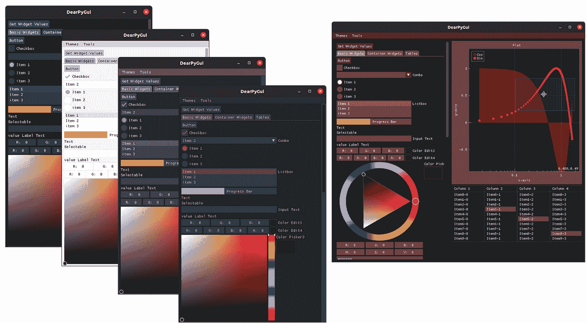

Themes and Styles. Image Credit: [DearPyGui Repo](https://github.com/hoffstadt/DearPyGui)

# 亲爱的 py GUI-示例

这是一个示例报告，展示了 python UI 库的能力

[https://github.com/Pcothren/DearPyGui-Examples.git](https://github.com/Pcothren/DearPyGui-Examples.git)

要安装所需的依赖项，请在您的计算机上从克隆的 repo 运行`pip install -r requirements.txt`或`pip3 install -r requirements.txt`。

Dear PyGui Python GUI framework. Video Credit: [Asim Code](https://youtu.be/7xfslC9ZZYU)

# 结论

亲爱的 PyGui 是一个简单而强大的易于使用的 Python Gui 框架，使用 Python 脚本来构建 GUI。亲爱的 PyGui 使用计算机的 GPU 绘制小部件，可以在 Windows 10、macOS 和 Linux 上工作。它包括绘图/绘图功能、主题、用于自定义绘图的绘图 API 以及用于应用程序开发的工具。

DearPyGui 包装了亲爱的 ImGui，提供了一个模拟的传统保留模式 API，包括额外的部件和附件(绘图、文件对话框、图像、文本编辑部件等)。)，添加异步支持，向画布添加项目，附加调试工具等。

一些即将推出的功能:

*   面向对象的界面
*   额外的点种类(条形图，饼图和堆其他。)
*   改进窗口停靠和 2 个视口。
*   3D 小部件。
*   个性化小部件 API。

# 进一步阅读

1.  [亲爱的 PyGui](https://pypi.org/project/dearpygui/0.1.0a18/)
2.  [亲爱的 PyGui Github 回购](https://hoffstadt.github.io/DearPyGui/)
3.  [DearPyGui-示例](https://github.com/Pcothren/DearPyGui-Examples)
4.  [亲爱的 PyGui 文档](https://hoffstadt.github.io/DearPyGui/)
5.  [亲爱的 PyGui 教程](https://hoffstadt.github.io/DearPyGui/tutorial.html)

> 最终，它试图提供一个完整的包。

## 访问专家视图— [订阅 DDI 英特尔](https://datadriveninvestor.com/ddi-intel)