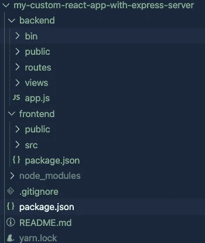

# 使用 Express Server 创建 React 应用程序

> 原文：<https://medium.datadriveninvestor.com/create-react-app-with-express-server-d36cb31ad25e?source=collection_archive---------5----------------------->

> 你是否经常觉得浪费时间，使用不同的命令为前端和后端创建不同的应用程序，比如为后端使用**NPM express-generator app**和为前端使用**npx create-react-app my-app**(假设你使用 react)？
> 
> 不再是了，create-react-app**CRA-template-with-express**模板拯救了我们。

# 关于

这是建立在基础模板之上的自定义模板，用于通过添加 express 服务器来创建简单的 React 应用程序，该服务器扩展了 [Create React App](https://github.com/facebook/create-react-app) webpack 配置。

如果不指定模板(例如`--template with-express`)，默认会创建简单的 React app。

有关更多信息，请参考:

*   [入门](https://create-react-app.dev/docs/getting-started) —如何创建新 app。
*   [用户指南](https://create-react-app.dev/) —如何使用 Create React App 开发应用程序。

# 安装

> `npx create-react-app <your-app-name> --template with-express`

只需使用这个简单的命令，它就会为你创建一个结构良好的应用程序，就像这样

# 如何使用。

> **不做纱开始**。

相反，请参考以下命令。通过`cd your-project`导航到`your-project`并运行以下命令:

*   到`Run Server` - npm 运行服务器或纱线运行服务器
*   至`Run Client` - npm 运行客户端或纱线运行客户端
*   至`Run Server with Client` - npm 运行服务器与客户端或 yarn 运行服务器与客户端

# 发展

*   要继续开发你的前端应用程序，使用`cd frontend`命令进入前端文件夹，继续开发你的传统前端应用程序。
*   要继续开发你的后端应用，使用`cd backend`命令进入后端文件夹，继续你的开发，就像你开发传统的后端应用一样。
*   要查看您的前端应用程序，请前往 [http://localhost:3000](http://localhost:3000/)
*   后端托管在 [http://localhost:9000](http://localhost:9000/)
*   如果您需要更改后端应用程序的端口，请导航到，`backend/bin/`打开 www，在第 15 行将端口更改为您想要的端口。

确保在 frontend package.json 中更改您的代理对象。

你可以在这里找到模板[。](https://github.com/nishant-sethi/cra-template-with-express-server)

你可以在这里找到我发布的[包。](https://www.npmjs.com/package/cra-template-with-express)

如果您需要同样的演示，请随时发表评论。我相信这将有助于你们提高生产力。

此外，请求所有的读者使用这个包，并通过提供他们的反馈来做出贡献，使它更加健壮，并帮助开发社区。

你也可以雇佣我做自由职业者【https://www.upwork.com/freelancers/~014f750462368afb57
Upwork

编码快乐！