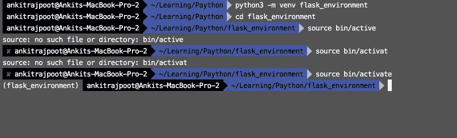
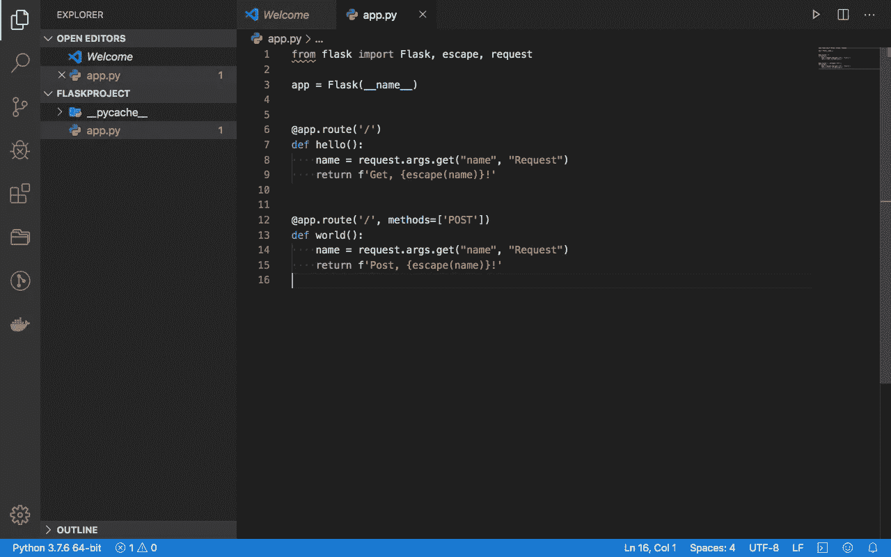
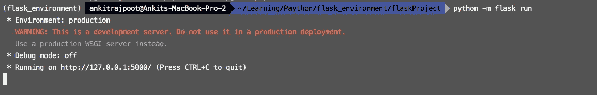
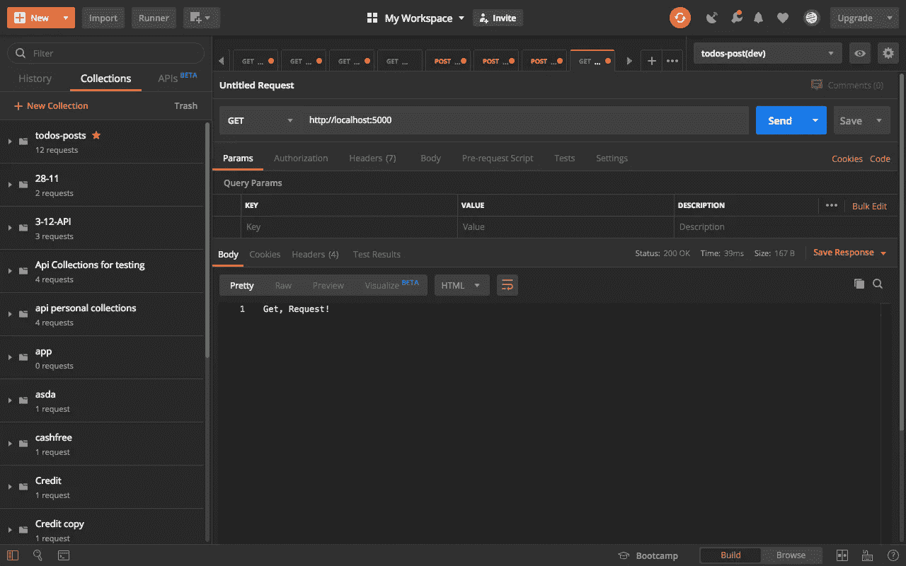
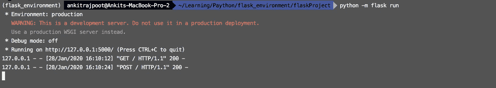

# 通过 Flask 创建您的第一个 web 应用程序

> 原文：<https://medium.datadriveninvestor.com/create-your-first-web-application-via-flask-87b95a235390?source=collection_archive---------3----------------------->


**Flask** 是 **Python 的轻量框架。用于 web 开发的 Flask，因为它是用 Python 编写的最简单的微框架之一，也不需要任何库或特定工具。它通过为各种进程(如数据库交互或文件活动)提供代码来加快开发速度。**

**步骤 1:-创建虚拟环境**

Python **虚拟环境**的主要目的是为 **Python** 项目创建一个隔离的环境。这意味着每个项目都可以有自己的依赖项，而不管其他项目有什么依赖项。

[](https://www.datadriveninvestor.com/2019/02/21/best-coding-languages-to-learn-in-2019/) [## 2019 年最值得学习的编码语言|数据驱动的投资者

### 在我读大学的那几年，我跳过了很多次夜游去学习 Java，希望有一天它能帮助我在…

www.datadriveninvestor.com](https://www.datadriveninvestor.com/2019/02/21/best-coding-languages-to-learn-in-2019/) 

我假设 **python3** 、 **venv** 和 **pip3** 安装在你的机器上。

创建**虚拟环境**并激活它的命令。

```
# create environment
$ python3 -m venv flask_environment# enter in environment folder
$ cd flask_environment# activate environment
$ source bin/active# deactivate environment
$ deactivate
```



**步骤 2:-安装烧瓶**

为新项目 **flaskProject** 创建一个目录，并转到该目录中。通过`pip3 install Flask`命令**安装砂箱。**


**步骤 3:-创建路线**

现在我们将在 app.py 文件中为`GET`和`POST`请求编写代码。在我们的代码中，第一条路径是 **GET** ，另一条是 **POST。**

```
from flask import Flask, escape, request app = Flask(__name__) @app.route('/')def hello():name = request.args.get("name", "Request")return f'Get, {escape(name)}!' @app.route('/', methods=['POST'])def world():name = request.args.get("name", "Request")return f'Post, {escape(name)}!'
```



**第 4 步:-启动项目**

现在我们通过这个命令启动 python 项目。`$ python -m flask run`



**步骤 5:-来自邮递员的请求**

这是**得到**的请求。在 postman 中，如果我们的项目在运行我们的机器，那么我们通过`[http://localhost:5000](http://localhost:5000)`调用，因为 flask 项目默认运行在 5000 端口上。



这是**帖子**的要求。在 postman 中，如果我们的项目在运行我们的机器，那么我们通过`[http://localhost:5000](http://localhost:5000)`调用，因为 flask 项目默认运行在 5000 端口上。


请求后，您将在终端上看到它。



享受你的第一个烧瓶项目。🤓

欢迎在评论区提出任何问题或疑问，或者你可以在脸书上 ping 我。