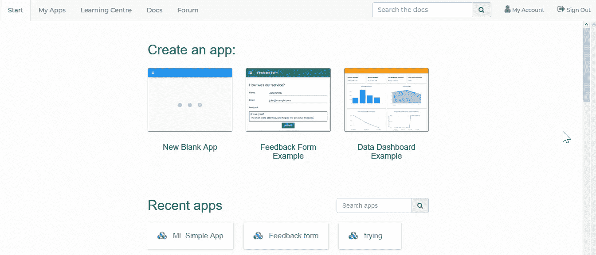
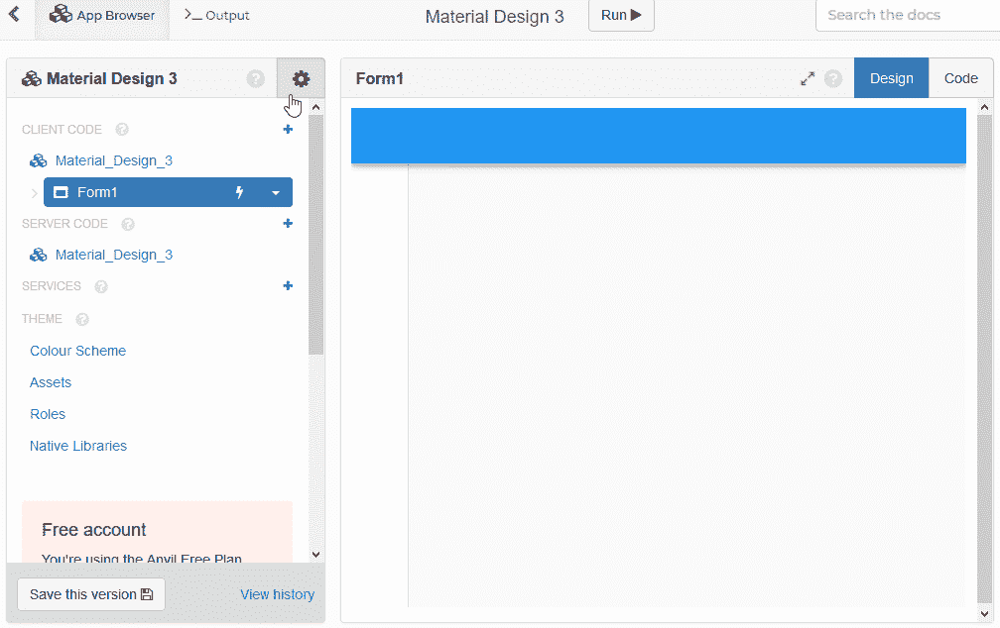
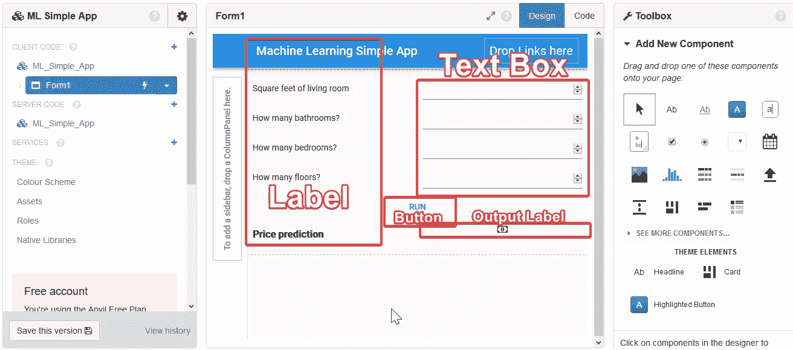
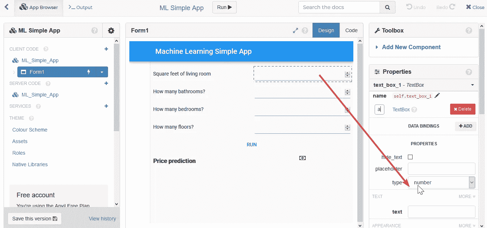
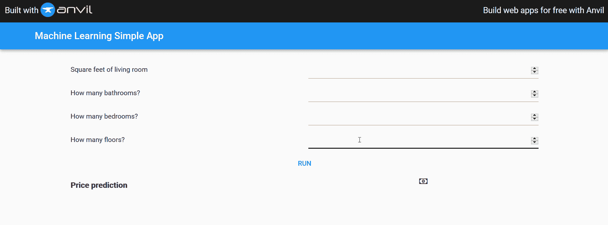

# 用 Anvil (Basic)创建自己的机器学习应用程序

> 原文：<https://medium.datadriveninvestor.com/create-your-own-machine-learning-app-with-anvil-basic-6bf3503e80f1?source=collection_archive---------0----------------------->


Photo by [Austin Distel](https://unsplash.com/@austindistel?utm_source=medium&utm_medium=referral) on [Unsplash](https://unsplash.com?utm_source=medium&utm_medium=referral)

嗨，大家好，再次回到我身边，和这些疫情一起，让我们为每一个战斗过的人祈祷，希望他们能尽快好起来。现在，我再次想创建一个应用程序，但只使用 Python，和以前一样，当我使用 Streamlit 创建房价预测应用程序时，如果你不知道或为了复习，看看这个 [**链接**](https://medium.com/datadriveninvestor/create-your-own-machine-learning-app-with-streamlit-basic-71ae1493d2d) 。

为什么是铁砧？事实上，当我的客户寻找另一个可以使用 Python 运行应用程序的平台时，他给了我 Anvil。它很像 Streamlit，所以基本上它是一个使用 Python 的 web 应用程序，但更易于使用。他们的网是这样写的。查看自己网页上[的*这个链接*的](https://anvil.works/)。

> 只有 Python 的全栈 web 应用

嗯，对我来说似乎很有趣，因为当他们这么说的时候，当然这对 Python 用户来说是个好消息，当你查看它时，会有教程帮助你熟悉 Anvil。它们是如何工作的，然后我们应该做些什么来创建一个应用程序。

# 循序渐进

# 创建帐户

首先，你应该在 Anvil web 注册创建一个应用程序，然后你可以看到这样的界面，你可以创建你的 scratch 应用程序，或者因为我们是新来的，让我们检查一下教程。我强烈建议你检查一下这个，因为它会帮助你熟悉 Anvil 是如何工作的。



Anvil web apps

# 创建应用程序

在稍微熟悉了界面之后，让我们创建一个应用程序。在这个阶段，我会为界面新的空白应用程序。您将看到使用 Anvil 的一个优点是 GUI。你甚至可以通过拖放来创建一个应用程序。但是当然使用 Anvil 意味着你应该了解 Python，因为要用 Python 来连接它们中的每一项，那么怎么做呢？


User interface of Anvil

# 用 Jupyter 笔记本连接

是的，你可以把 Jupyter 和 Anvil 连接起来，所以 Jupyter 可能有局限性，完全不懂代码的人总是搞不清楚我们的项目在谈论什么。有了 Anvil，人们只需看一眼你的应用程序，你就可以关心你的代码，这是双赢的解决方案，对吗？

[](https://www.datadriveninvestor.com/2020/02/19/cognitive-computing-a-skill-set-widely-considered-to-be-the-most-vital-manifestation-of-artificial-intelligence/) [## 认知计算——一套被广泛认为是……

### 作为它的用户，我们已经习惯了科技。这些天几乎没有什么是司空见惯的…

www.datadriveninvestor.com](https://www.datadriveninvestor.com/2020/02/19/cognitive-computing-a-skill-set-widely-considered-to-be-the-most-vital-manifestation-of-artificial-intelligence/) 

那么如何连接呢？首先点击左侧区域的设置图标，然后点击上传，这样你就可以选择添加一些密钥，点击启用密钥，然后密钥就会为你的项目生成。用这个做你的 Jupyter 笔记本。但是在安装 anivl-uplink 之前，要先用 pip 安装 anvil-uplink 来添加 anvil 的包。



How to get Key for Jupyter Notebook

拿到密钥后，将这段代码添加到您的 Jupyter 笔记本中，因为我们之前有文章的模型，所以我们只是添加到项目的最后一个单元格，在我的项目中使用 Shopee.ipynb， [***项目链接***](https://github.com/rizkysifaul/Workshop_Shopee) 。

```
import anvil.serveranvil.server.connect("INSERT_YOUR_KEY")
```

基本上这段代码是关于通过与 Anvil 应用程序连接来调用你的 Jupyter 笔记本，所以你不需要在 Anvil 上划痕。只是用你的笔记本。

# 在 Jupyter 笔记本上创建功能

因为我们想让我们的项目可以被调用到 Anvil App 中，当然我们应该创建一些适当的函数来调用。在这个应用程序中，我想添加一个名为 *predict_model()* 的函数，带有几个参数。

```
import pickle
import anvil.server
#saving model
pickle.dump(model, open('model_new.pickle', 'wb'))[@anvil](http://twitter.com/anvil).server.callable
def predict_model(sqft_liv,bath,bed,floor):
    model_linear = pickle.load(open('model_new.pickle', 'rb'))
    predictions=model_linear.predict([[sqft_liv,bath,bed,floor]])[0]
    return(predictions)
```

基本上你应该需要添加 *anvil.server.callable* 来确保你已经创建的函数将与 Anvil App 连接。为什么应该是四个论点呢？因为我们对模型的输入和上一篇文章一样是四个。除了加载模型，其余的都是一样的，我使用 pickle 来保存和加载模型。

# 设计你的应用

最后，是时候设计你的应用了。不要担心，因为它真的很简单，只需拖放你需要的，如标签或按钮点击。这是由你来检查哪些组件是好的。对于我的例子，设计应该是这样的。



My Design

特别对于文本框，别忘了把它改成数字类型，因为我们要创建机器学习应用。



Special case for TextBox

正如你所想象的，因为我们想要创建一个应用程序，我们可以随心所欲地设计，比如添加一个图标，或者调整标签大小等等，你可以做任何你想做的事情。完成这个设计后，现在是时候把你的 Jupyter 笔记本和 Anvil 应用程序连接起来了。

# 用铁砧连接

对于连接，因为我们只有一个按钮，只需点击按钮设计两次，然后界面将变成代码编辑器。然后你会看到另一个函数，这个函数对于把我们的 Python 连接到 Anvil 是很重要的。像这样添加一些代码行。

```
def button_1_click(self, **event_args):
    """This method is called when the button is clicked"""
    results=anvil.server.call("predict_model",self.text_box_1.text, 
                                self.text_box_2.text, 
                                self.text_box_3.text, 
                                self.text_box_4.text)   
    self.result.text = results
    pass
```

正如你所看到的，这个方法只有在你点击按钮时才会运行，为了调用这个函数，我们应该使用 *anvil.server.call* ，因为现在我们的 Jupyter 笔记本将是服务器，而应用本身将是客户端。所以不需要在 Anvil 上添加你的模型代码，直接调用就可以了。那么 *predict_model* 就是我们目前在 Jupyter 的函数。 *Self.text_box_1.text* 等是我们的**输入**，所以当我们有四个输入时，我们应该使用 Anvil 调用所有四个输入。而 *self.result.text* 是我们想要显示的结果，所以我们使用**标签**，名称*结果*。我希望它是清楚的，因为我知道这可能有点难做到。之后，您可以使用 Anvil 应用程序上方的**运行**图标运行。



Your app

瞧，你已经使用 Jupyter 笔记本和 Anvil 创建了一个应用程序。如果你有兴趣，你可以发布你的应用程序并定制域，就像这个[链接](https://ml-simple-app.anvil.app)如果我正在运行这个项目，这是非常感兴趣的一面，但有一点你应该注意到，因为你的 Jupyter 笔记本是你的服务器，所以当你不激活 Jupyter 笔记本时，链接不起作用。因此，请确保您已经运行了您的项目。

就是这样。非常感谢你阅读这篇文章，我希望它对你有所帮助，也许你没有网络技能，但想创建一个应用程序。这个项目可以在我的**Github**[T5【这里](https://github.com/rizkysifaul/Workshop_Shopee) 下载。之后，添加一个像我的文章一样的代码，你就可以开始了。关注我的**中**和 **Linkedin** [*这里*](https://www.linkedin.com/in/muhammad-sifa-ul-rizky-63525795/) 看到很有帮助就分享一下。欢迎在 **Linkedin** 或我的邮箱 [***这里***](http://msifaulkiki@gmail.com) 问我，另一篇文章再见。继续学习！