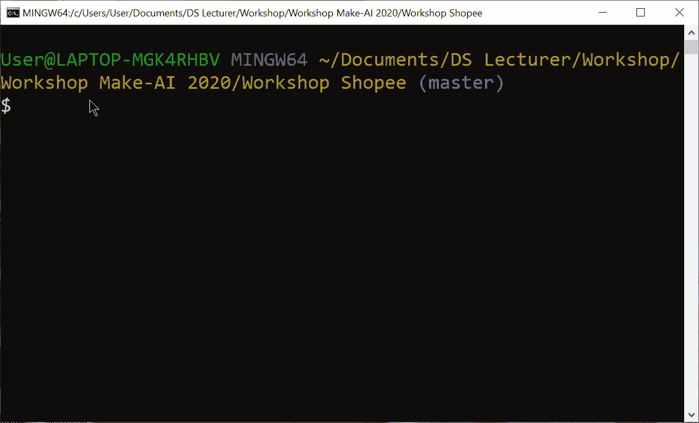
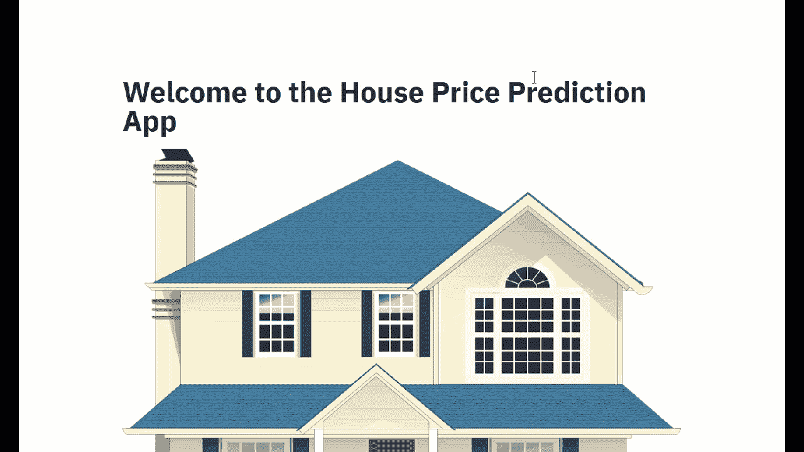

# 使用 Streamlit (Basic)创建您自己的机器学习应用程序

> 原文：<https://medium.datadriveninvestor.com/create-your-own-machine-learning-app-with-streamlit-basic-71ae1493d2d?source=collection_archive---------1----------------------->

Photo by [João Silas](https://unsplash.com/@joaosilas?utm_source=medium&utm_medium=referral) on [Unsplash](https://unsplash.com?utm_source=medium&utm_medium=referral)

欢迎回到我的故事，虽然我已经很长时间没有写了，但现在，我有一个想法与你们分享，关于创建一些机器学习应用程序。基本上，当你有或创建一个数据科学项目时，你需要向你的同事展示一些东西，任何东西，尤其是当你的朋友不理解这一点的时候。你总是不知道你应该展示什么，所以我希望这个博客能帮助你更好地了解你想做什么。

I spoke at Shopee Indonesia

这个项目是因为我在 2020 年国家数据科学竞赛 Shopee 上发言而创建的，我非常感谢成为谈论数据科学学习途径的发言者之一。我看到很多学数据科学的人的问题；他们似乎不知道该做什么和如何服务。我希望我的演讲对所有参加的人有所启发。

在做一些数据科学项目的时候，其实我们用的是 Python，R，或者更好的，Jupyter Notebook，也算是他们的一种吧。但是当你创建一个应用程序时，他们中的许多人似乎很难找到该怎么做。因此，有了 Streamlight，有了 Python 的基础，你就可以开始了。 **Streamlit** 是用 Python 构建的一个包，使用起来很简单；你可以在这里 查看这个套餐 [*。*](https://www.streamlit.io/)

 [## DDI 编辑推荐:5 本让你从新手变成专家的机器学习书籍|数据驱动…

### 机器学习行业的蓬勃发展重新引起了人们对人工智能的兴趣

www.datadriveninvestor.com](https://www.datadriveninvestor.com/2019/03/03/editors-pick-5-machine-learning-books/) 

对于安装，只需在 Anaconda 提示符或命令提示符下使用 pip install streamlit，就像其他包一样。就这么简单。我建议您定期查看有关 Streamlit 的文档，因为这个包非常新，并且定期更新，所以最好在这里查看*。因为我们要创建一个 app，所以我拆分成很多面，这样你就明白流程了。*

# *导入包*

*首先，因为和 Python 一样，你应该在你的代码中导入一些包，比如用于机器学习的 **Sklearn** ，用于数值计算和数据清理的 **Numpy** 和 **Pandas** 等等，你可以在下面查看更多。不要忘记导入 **Streamlit** 作为这个项目的主包。*

# *导入您的数据和图像*

*之后，你应该想添加你的数据和图像，对不对？好的，我们添加了这些数据和图像。我们现在要使用的数据很简单，就是来自 Kaggle 的房价数据，因为我们的目标是预测你的房价，所以正确的图片是房子本身。此时，可以随意更改数据或更改图片，因为更改它真的很简单。*

*如您所见，当您使用 Streamlit 时，将它视为一个包，因为调用它非常简单——使用 st.title 给它一个标题，使用 st.image 显示您的图像。请注意，use_column_width 已完成，您希望您的图片是基于实际大小还是基于应用程序大小显示；如果更改为 True，图像将随您的应用程序进行调整。*

# *检查您的数据*

*当你看到它没有错的时候，现在是时候让人们知道你的数据了。因为其他人不会看到你的代码，最好让他们明白你的数据是关于什么的。在这个项目中，为了简单起见，我为这个项目选择了四根柱子，因为我们想预测价格，所以我选择的柱子与它相关，有客厅( *sqft_liv* )、浴室、卧室和地板的平方英尺。*

*你在用 st.write 写任何东西，可能是你对项目的描述。然后勾选复选框，如果你勾选了发生了什么，如果没有，你会看到你所看到的。*

# *输入值*

*现在令人兴奋的一面是如何添加我们的价值观？因为你如何运行你的应用程序，如果你不知道如何添加你的值，以了解每列之间的差异。所以你可以用很多函数来增加你的值，但是现在，我用的是 st.slider，这样你就可以根据值本身来滑动它。*

*如果您看到每一行的参数，您将看到它包含三个带整数转换的参数(最小值、最大值和平均值)。这意味着它将显示您可以选择的值，最小值意味着您可以选择的最小值，最大值意味着它的最大值，平均值是指针所在的值，默认情况下。好吧，我希望你喜欢这意味着什么，因为知道它是很重要的。*

# *拆分您的数据*

*在此之后，现在如何创建一个模型，使它能够预测基于某个值的价格。在这个阶段，我们只是根据模型和预测值进行拆分。x 是除了我们的预测价格之外的所有数据，而 y 或我们的预测数据只是价格。然后分成 80:20，这意味着 80%用于训练我们的数据，然后只有 20%的数据用于测试，我们的模型是好是坏。*

# *为我们的数据建模*

*现在是时候用模型来拟合我们的数据了。为了简单起见，我选择了一个最简单的模型，线性回归。当然，你可以用另一个像 Random Forest，XGBoost 等的善和福祉来改变你的模型。为了使用这个模型，你只需要一个模型。Fit()仅用于拟合您的模型，并使用 predict 查看您的输出。简单。*

*但是对于另一个模型可能看起来有点难，当然，因为运行时间或简单性，你优先考虑哪一个。现在出现了一些问题，我们如何检查我们的模型是好还是不好？使用**均方根误差**就是这些答案之一。有关这方面的更多信息，请查看[这个](https://www.analyticsvidhya.com/blog/2019/08/11-important-model-evaluation-error-metrics/)，因为有如此多的指标可以用于评估。基本上，使用这些方法你可以得到误差的范围。*

*举个例子，当你的*是 15 万，然后 AI 预测房价是 50 万，这样你的房子的区间在 50 万-15 万之间，直到 50 万+15 万，就可以是你的房价区间从 *35 万到 65 万*。但请记住，有时实际价格不在这个范围内，这没关系，因为这是使用平均值，从 *RMSE，*所以平均，看起来实际价格是在误差范围内。如果我有时间，也许我可以描述更多。**

# **展示结果**

**最后但同样重要的是，展示结果；有一个按钮，在这个按钮上有两个输出，基于定制值的预测价格和基于 *RMSE* 的预测范围。在这个应用程序中，我没有显示 *RMSE* ，因为它是根据价格范围显示的。**

**如你所见，我正在改变价格本身的类型，从 float 到 int，因为我希望价格是一个好的数字，而不仅仅是 176892，937353，等等。所以我改变它，但是如果你不介意这个数字，就删除整数类型，这样你会在你的价格里面找到一个很棒的数字。就是这样。**

# **怎么跑**

**很简单，打开您的命令提示符，将其定位到您的项目中，然后运行这个*streamlit run your _ project*。例如在我的项目名 **ds_project_shopee.py** 中，这样我应该运行**

****streamlit run ds _ project _ shopee . py****

****

**How-to run**

**瞧，你可以在你的浏览器上查看它，你的应用程序已经准备好了！您可以根据您选择的参数更改任何内容。**

****

**Your app**

**非常感谢您的关注，我希望我所分享的内容能够真正帮助大家创建一个简单的应用程序，但要使用机器学习。如果你能做到这一点，你可以用你的创造力去看看其他数据和另一个模型。**

**这个项目可以在我的 **Github** [*这里*](https://github.com/rizkysifaul/Workshop_Shopee) 下载。关注我的**中**和 **Linkedin** [*这里*](https://www.linkedin.com/in/muhammad-sifa-ul-rizky-63525795/) 看到很有帮助就分享一下。欢迎在 Linkedin 上提问，我们将在另一篇文章中再见。继续学习！**