# 使用 Angular 创建您自己的“启动名称生成器”web 应用程序

> 原文：<https://medium.datadriveninvestor.com/create-your-own-startup-name-generator-web-app-using-angular-6203870d3dd3?source=collection_archive---------1----------------------->

# 建立小的辅助项目将帮助你更快地学习技术技能！


Photo by [Danial RiCaRoS](https://unsplash.com/@ricaros?utm_source=medium&utm_medium=referral) on [Unsplash](https://unsplash.com?utm_source=medium&utm_medium=referral)

> 如果你问我或任何技术人员学习任何新编程语言或框架的最佳方法，我会说构建一些你一直想构建的实际应用程序。我和你打赌；你可以很快学会这种语言或框架。事情是这样的，大多数人没有采取行动来解释为什么他们学不到这么多东西。如果你想学点什么，找到一个想法，用你想学的技能建造一些东西。如果你没有用你所拥有的技能建造任何东西，你就不会学到它。
> 就像你看视频，看博客，你不去做，自己去尝试，你是学不会的。而且没有实现看视频或者看书都没用，相信我。

正如你已经猜到的那样，在这篇博客中，我们将使用 Angular 制作我们自己的简单的**“启动名称生成器”**应用。

# **关键技巧:**

1.  学习 Angular 项目开发和部署
2.  如何解决常见问题及思考过程
3.  如何在项目中包含自定义 JavaScript

# 动机:

最近，我的朋友 [Madhav Bahl](https://medium.com/u/8449f3924a32?source=post_page-----6203870d3dd3--------------------------------) 写了一个关于给年轻一代的 10 条建议的博客，我不打算谈论这些，但其中一条信息是“**你应该与那些激励你在生活中变得更好的人交往**”，谢天谢地，他在我的联系人列表中，他写道，每天编码，这激励我开发了这个应用程序。几个月前，他( [Madhav Bahl](https://medium.com/u/8449f3924a32?source=post_page-----6203870d3dd3--------------------------------) )用 React Native 写了同样的标题，我想为什么不试试 angular。所以我开发了这个应用。很简单，而且你可以像我一样学到很多新东西。

[](https://www.datadriveninvestor.com/2020/03/29/microsoft-having-an-edge-over-chrome/) [## 数据驱动的投资者|微软比 Chrome 有“优势”

### 简史我从来不是浏览器的粉丝，确切地说，我只是一个浏览器的粉丝，Chrome。这是我的…

www.datadriveninvestor.com](https://www.datadriveninvestor.com/2020/03/29/microsoft-having-an-edge-over-chrome/) 

看，我不是棱角方面的专家，但我正在学习的旅途中，每天我都会学到一些东西。通过这篇博客，我只是想让你在学习 angular 的旅程中一直陪着我。

# GitHub 库和演示:

如果你希望直接看到代码而不是阅读博客，你可以去这个 GitHub repo(给它一个⭐星)

[](https://github.com/thedevankit/startup-name-generator) [## 工具包/启动名称生成器

### 此项目是使用 Angular CLI 版本 8.3.12 生成的。为开发服务器运行 ng serve。导航到…

github.com](https://github.com/thedevankit/startup-name-generator) 

# 应用预览:

让我们从应用程序的演示开始，下面是链接。在你访问这个链接之前，让我们弄清楚它是做什么的。

你必须输入一个关键字，应用程序将生成启动名称。

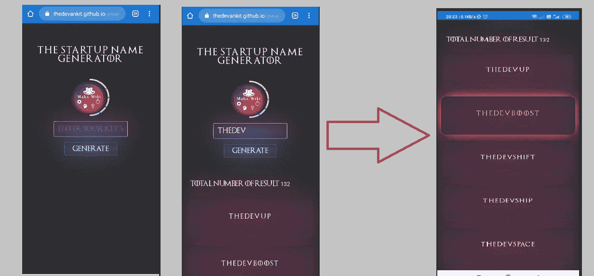

**Web App Demo**

# **PWA App**

1.  离线工作 2)作为应用程序的午餐 3)独立于平台

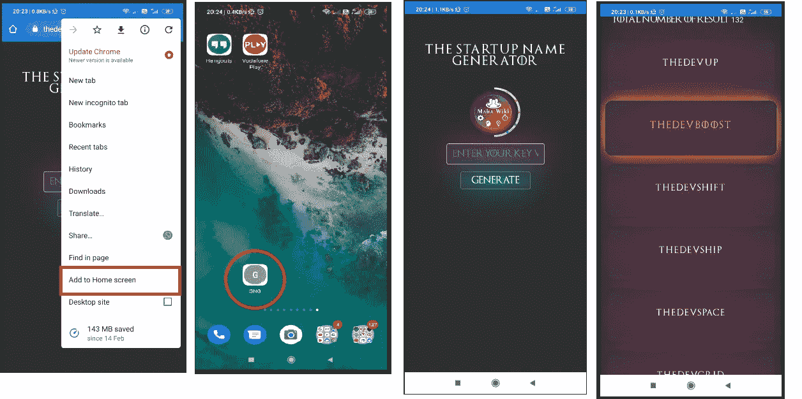

# 入门指南

如果你是新来的，请阅读我的关于角度的博客，这样你就会明白这里发生了什么。

[](https://medium.com/@TheDevAnkit/angular-for-all-ankitkumar-singh-11f8c6c25edb) [## 所有人的角度|Ankitkumar Singh

### 一个超级简单的角度介绍。

medium.com](https://medium.com/@TheDevAnkit/angular-for-all-ankitkumar-singh-11f8c6c25edb) 

你已经为开发建立了你的系统，是吗？如果没有，那么请执行以下步骤:
1)安装节点
2)安装 VS 代码(代码编辑器)
3)安装 Angular CLI

**现在，如果你准备好了，那么就让我们进入下一步，一步一步来打造。**
1)创建一个新项目，命名为**启动名称生成器。在您的终端中运行这个命令来创建您的项目**

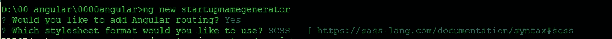

**ng new Startup_Name_Generator**

> **你已经开始 ng 新，保持冷静，等待节点模块，同时享受这个 gif**

2)使用**ng new startup name generator**创建一个应用程序后，您将获得一个默认的项目结构，您必须根据需要对其进行修改。

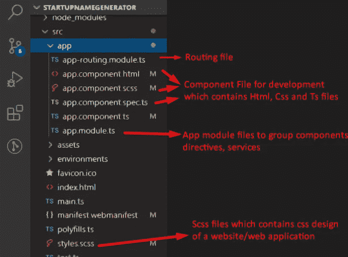

3)现在，我希望你已经创建了你的项目，现在了解它的结构，让我们深入到它，并创建我们的应用程序。如果你看到了这个画面，恭喜你。

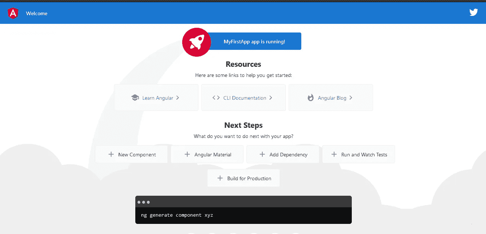

4)包括 Bootstrap 和 Jquery

```
npm install --save bootstrap jquery
```

5)我假设你已经阅读了我以前关于 angular 的博客，并对它有了基本的了解，所以我不打算介绍基础知识，而将解释更多面向项目的任务。

# 应用程序逻辑

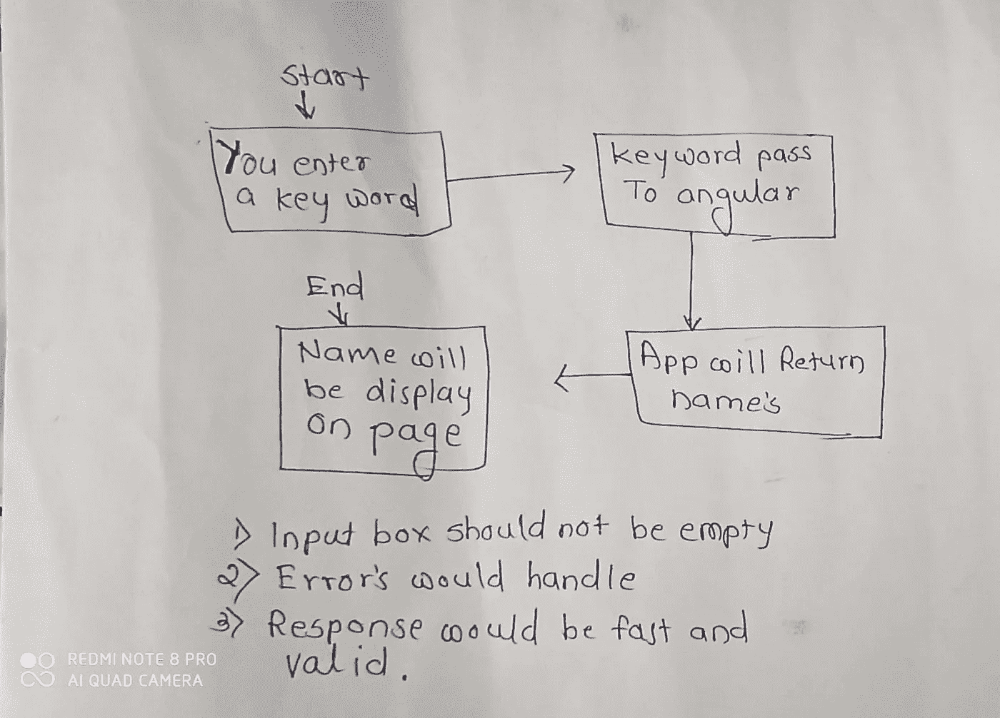

在我们继续下一步之前，我们必须弄清楚一件重要的事情，我们如何从给定的关键字生成启动名称？

我们可以编写代码来生成名字，或者使用 Rico Sta 的这个神奇的库。Cruz 生成启动名称。

所以为了简单起见，我将使用 Rico Sta 的库。Cruz，所以从这里下载 Js 文件并保存在应用程序的 assets 文件夹中。

[https://UNP kg . com/@ rstacruz/startup-name-generator @ 0 . 3 . 0/dist/startup-name-generator . js](https://unpkg.com/@rstacruz/startup-name-generator@0.3.0/dist/startup-name-generator.js)

# 让代码启动名称生成器应用程序

现在你已经有了所有需要的文件和逻辑，你已经准备好了……..让我们将[**startup-name-generator . js**](https://unpkg.com/@rstacruz/startup-name-generator@0.3.0/dist/startup-name-generator.js)**文件包含在我们的应用程序中。**

****包含 Js 的步骤****

1.  **将文件保存在资产文件夹中，您可以创建一个特定的文件夹名称，如 Js**
2.  **现在 angular.json 文件中的样式和脚本部分包含了 Js 文件路径和引导样式 css 路径。**

**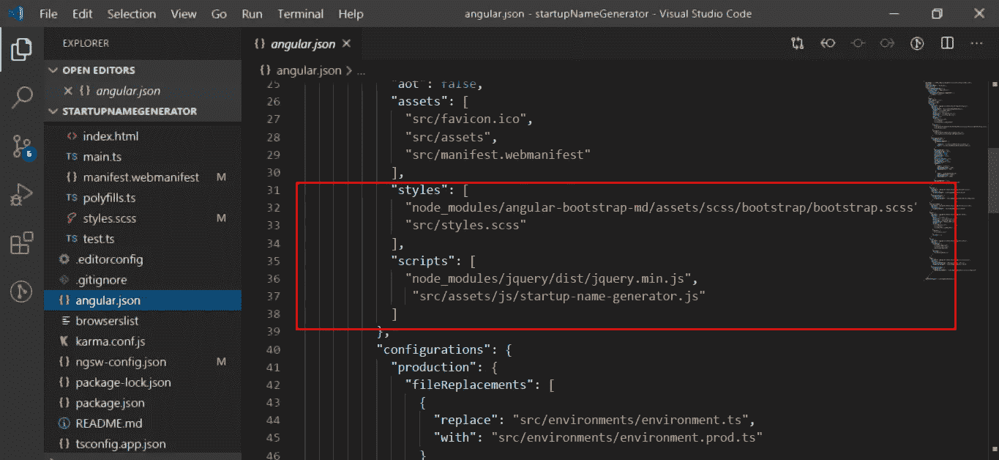**

**3.在这一步之后，让我们添加 html 和 Css**

**让我们来谈谈代码，这里的 div 包括头、容器、表单和 div，以显示基于条件的结果。你可以看看代码。**

**Css 添加按钮，背景和文本以及颜色效果的自定义设计。为了保持简单，你也可以保持默认的引导设计，它也将与所有设备友好的设计看起来很棒。**

**这个应用程序最重要的部分是 App.component.ts 文件，它包含一些完成工作的函数。**

**我们已经包含了 StartupNameGenerator.js 文件，现在我们需要在 app.component.ts 文件中包含它的功能**

**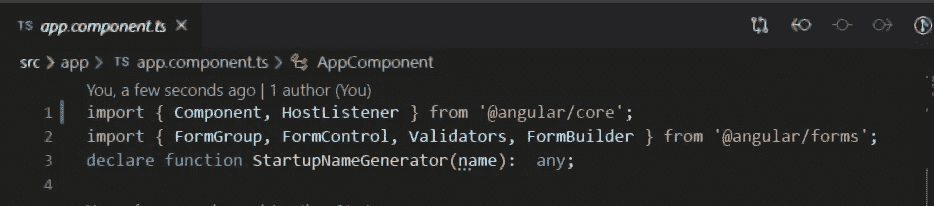**

**在这一步之后，现在我们必须获取用户输入的关键字，并将其传递给函数，然后响应将以字符串数组的形式出现，因此我们需要获取它并将其绑定在一个数组中，然后将其传递给 html。**

**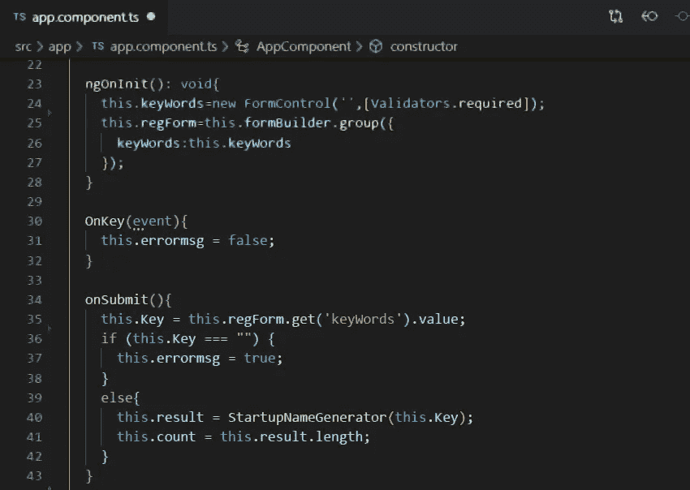**

**所以在这里，我们接受键值，如果它不为空，那么我们必须将关键字传递给名称生成器函数，所以在第 39 行我们已经这样做了。名称生成器的结果传递给结果数组，长度传递给计数变量。下面是完整的 app.component.ts 文件。**

**现在这个 ts 文件中有另一个函数，我知道你们大多数人会问为什么我们需要这个@HostListener()，这是 PWA 应用程序函数，在 chrome 中创建一个弹出窗口，允许你在手机、计算机或任何设备上安装应用程序。**

**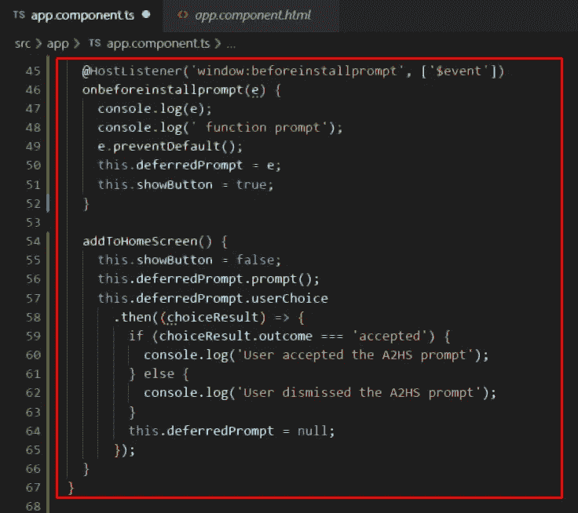**

**最后我们在这里做检验应用的链接并且测试它。**

 **[## StartupNameGenerator

### 编辑描述

thedevankit.github.io](https://thedevankit.github.io/pwa/)** **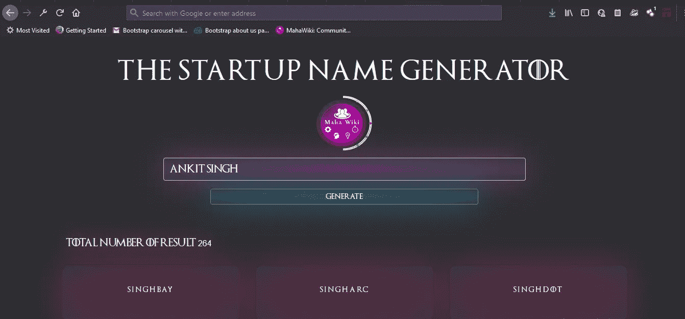**

**Application**

**这是我们的简单应用程序，希望你喜欢这个过程，并在 Angular 中创建了自己的 **StartName Generator 应用程序。****

****

**Ankitkumar Singh (TheDevAnkit)**

****感谢你阅读这篇博客。让我们通过与你的朋友和所有需要阅读这篇博客的人分享一些爱吧。****

**如果你有任何问题、建议、反馈或疑问，你可以随时问我。我很乐意帮助你们。**

**我喜欢结交新朋友。请通过以下链接与我联系。**

*   **【https://twitter.com/thedevankit **
*   **[https://www.instagram.com/](https://www.instagram.com/anki7singh/)**
*   **[https://www.linkedin.com/in/](https://www.linkedin.com/in/anki7singh/)工具箱**