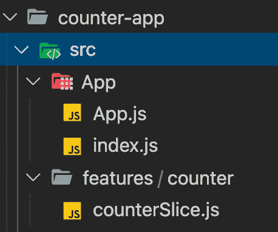

# 在 Redux 工具包中创建切片

> 原文：<https://medium.datadriveninvestor.com/createslice-in-redux-toolkit-c5e5441b75d9?source=collection_archive---------0----------------------->


这是[我之前的故事](https://medium.com/datadriveninvestor/redux-toolkit-eb07f753649)的延续。

让我们拿一块巧克力片蛋糕，这块蛋糕包括蛋糕、糖霜和巧克力片。如果我们把整个蛋糕想象成 redux 商店。传统的设计是把减速器、常量、动作放在不同的文件里，或者放在蛋糕片里，蛋糕、糖霜和巧克力片分开供应。

在 Redux-Toolkit 中， ***createSlice*** 方法帮助我们创建 redux-store 的一个切片，它在一个文件中包含了 reducer 和 actions。把巧克力蛋糕切成它想要的样子。

> 我们开始吧

一个基本的 ***createSlice*** 方法如下:

*   名称:引用的切片的名称
*   初始状态:减速器的初始状态
*   reducers:包含变更 reducer 状态的所有操作

让我们将 [*回购*](https://github.com/devAbhimanyu/Redux-toolkit/tree/createReducer) 更新为一个片。我将保留计数器的特性命名，并将文件从 counter.js 重命名为 counterSlice.js。

[](https://www.datadriveninvestor.com/2020/10/23/how-i-became-an-independent-researcher-of-the-tangled-net-of-economic-development-funding/) [## 我是如何成为经济发展资金纠结网的独立研究员|数据…

### 我很少发现自己处于一种看似独立的自由形式的身体抑郁状态，这种状态使人…

www.datadriveninvestor.com](https://www.datadriveninvestor.com/2020/10/23/how-i-became-an-independent-researcher-of-the-tangled-net-of-economic-development-funding/) 

**注意:我也已将 App comp 更新为功能组件。*



首先，我们需要从 redux-toolkit 库中导入 *createSlice* 方法。

```
import { createSlice } from "@reduxjs/toolkit";
```

现在是创建切片的时候了:

```
const *counter* = createSlice({
 name: "counter",
 initialState: {
  value: 0
 },
 reducers: {
  increment: state => {
   state.value = state.value + 1;
  },
  decrement: state => {
   state.value = state.value - 1;
  }
 }
});
```

*计数器*保存创建减速器所需的所有值。现在我们需要导出动作和缩减器。

```
export const { increment, decrement } = counter.actions;export default counter.reducer;
```

最终输出:

现在是时候分派动作并查看计数器的工作了。因此，对于功能组件，您需要导入 useDispatch 和 useSelector 挂钩。我们要导入的第二件事是上面导出的动作。

```
import { useDispatch,useSelector } from "react-redux";
import { increment, decrement } from "counterSlice";
```

useSelector 方法向我们返回 redux-store 对象，并且可以被析构以获得所需的值。

```
const {value} = useSelector(state=>state)
```

另一方面，必须调用 useDispatch 挂钩来设置调度程序:

```
const dispatch = useDispatch();
//dispatching an action
dispatch(action())
```

让我们集成这两个钩子来创建我们的计数器应用程序。

这样，我们的切片就被创建和消费了。你可以在这里找到上面例子[的回购。我还在 repo 中添加了一个 todo list 应用程序，所以也请检查一下。](https://github.com/devAbhimanyu/Redux-toolkit/tree/createSlice)

你也可以查看一下[createasncthunk](https://abhimanyuchauhan-61309.medium.com/createasyncthunk-in-redux-toolkit-4d8d2f0412d3)，它建立在上面提到的同一个待办事项列表应用上。

**进入专家视角—** [**订阅 DDI 英特尔**](https://datadriveninvestor.com/ddi-intel)