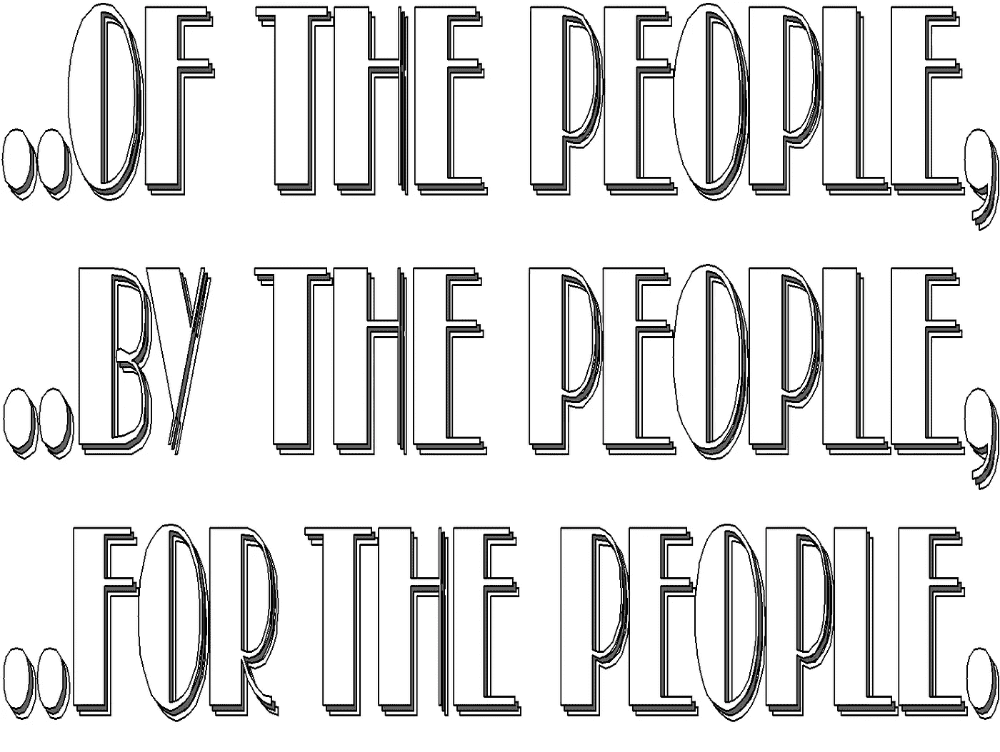
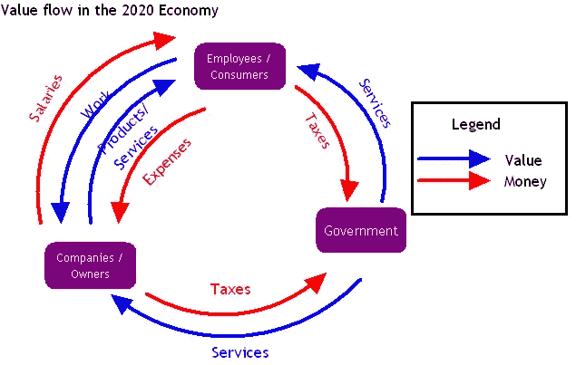
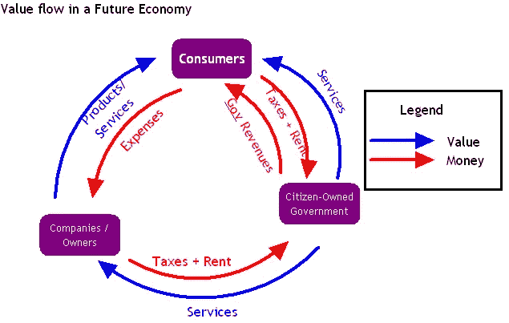

# 为未来创造以公民为中心的经济

> 原文：<https://medium.datadriveninvestor.com/creating-a-citizen-centered-economy-for-the-future-f4312710a412?source=collection_archive---------8----------------------->

我们的经济基于非常简单的概念:生产、生产管理和消费。我们生产是因为我们需要消费食物、房地产、服务等等。我们已经成为这个等式的一部分很长时间了，但现在是时候考虑改变我们的立场了。

我在之前的一篇文章中描述了在这个经济体中，我们是如何从生产和大部分管理任务中自动化出来的。在生产和提供我们想要消费的服务方面，人工智能和机器人正变得比我们更好。在 10 到 15 年内，人类将成为生产力的绊脚石，这意味着相互竞争的公司将希望摆脱所有人类工人，以争夺我们的消费者美元。现在，我们看到的主要是工作岗位的转移，这种情况会持续一段时间，但很快，就业模式就会变得很成问题。

 [## 经济就是包容人|数据驱动的投资者

### 建模，数据，最重要的是，人 Tayo Oyedeji 博士在他的食谱中混合了所有这些成分，为一个…

www.datadriveninvestor.com](https://www.datadriveninvestor.com/2019/03/06/economy-is-all-about-including-people/) 

如果我们看看我们的经济，公民是公司的附庸。我们为他们工作，虽然我们表面上控制着政府，但政府的存在只是为了确保工人留在劳动力市场，公司保持生产力。大多数公民没有什么重要的东西，除非他们是少数公司所有者之一。所有的员工都用他们的时间来换取金钱，而所有的公司所有者(顾问和个体户都属于这一类，适合讨论这个问题)都在互相竞争，争夺消费者的金钱。因此，所有者通过自己和员工的血汗创造价值。消费者购买创造的价值。政府为消费者和公司创造价值，作为交换，税收允许政府提供所需的服务。这里有一个简单的图表，说明价值交换的当前方式和系统中的每个参与者。公民只不过是所有者设计的巨大机器中的一个小齿轮。

公司将逐渐用更便宜、更高效的自动化系统取代员工。当这种情况发生时，工资不再支付，因此消费者不再能够支付私营部门的产品和服务，也不能向政府纳税。

这个系统完全崩溃了。我在这篇文章中详细解释了为什么这是必然的[。](https://medium.com/datadriveninvestor/the-job-market-in-year-2040-d17f7743c0fd)

除非我们改变美国公民在这个计划中的位置，否则经济是不可持续的。有很多方法可以保持经济周期的运转，而不需要从头开始重新发明整个东西。最简单的解决方案是从我记事起就一直在讨论的——我们必须把政府交到公民手中。但这一次，我们必须获得对我们自己政府的直接财政所有权控制。

当我们谈论民主时，我们指的是“民有、民享……”但它指的是有能力选举我们的代表和领导人。政府作为一个实体仍然像一个公司一样运作，其所有者没有收到一分钱的股息，也没有办法分享其收入。我们脚下的土地是国家的财产，所以它应该属于人民。然而，私人利益甚至其他国家已经从我们手中购买了那块土地，所以人民的土地实际上甚至不是我们的。如果我们是一个国家的公民，我们应该集体拥有土地，从而拥有土地的价值。无论是谁为了自己的目的使用土地，都应该向美国公民支付使用费。这是我们的，不是吗？难道我们不平等地与其他生物分享这片土地吗？那些更多地使用它的人，像大公司，应该请求许可，并根据我们自己的规则向公民支付租金。我们应该拥有自己的政府，并且有牙去咬那些未经允许就试图夺走我们的手。

当然，我意识到我们不能通过打个响指就改变土地所有权及其运作方式。不幸的是，自动化将迫使我们改变我们公民适应新经济的方式，那么为什么不将它重组为一个以国家公民及其福祉为中心的经济呢？就像我上面写的，没有足够的工作，我们就不能赚钱，没有钱，我们就不能纳税或购买我们需要的东西，没有钱，那些让我们失去工作的公司，也让他们自己失去了消费者。

这并不容易，但我们可以解决。我提出了一种在未来经济中流动价值和资金的新方式，在这种经济中，公民是真正的政府所有者和消费者。这两个职位都是我们应该拥有的，因为在这个世界上，应该由人类来担任的工作已经所剩无几了。

这一切都是为了在不破坏价值创造的情况下重组现金流。一切都应该是为了确保这个国家的公民幸福、健康，能够消费他们需要的东西。在这种模式下，公司的存在是为了给我们提供产品和服务。政府的存在是为了提供服务，帮助公司做他们需要做的事情，帮助消费者/公民做他们需要的事情。价值和金融现金流始于一个国家控制的土地。公民和公司可以从政府那里租用土地(而不是直接拥有土地),这些钱作为红利归公民所有。公民可以决定我们所站的这片土地的价值，这是由民主政府决定的。公民不为公司或政府工作。不，我们是业主。我们是食物链的顶端。我们可以把红利花在公司竞争的产品和服务上，我们的税收支付政府提供的任何服务。这与我们现有的方案没有太大的不同。

公司所有者仍然创造价值，并因此获得相应的报酬。消费者很高兴，因为他们可以花钱买到他们需要的东西。每个人都将成为由人工智能管理的房地产合作社的一部分。

这种模式最令人兴奋的是，即使是最贫穷的公民也能平等分享国家的价值。每个公民都会关心我们如何使用我们的土地，出于什么目的，以什么代价，因为这些决定会影响每个人的购买力。这改变了政治选择。

**重新分配土地:艰难的转变**

我们不能忽视一项重要的过渡任务，即从目前的经济过渡到本文提出的经济:土地属于大量私人和公共实体，所有土地必须转让给人民，即政府。有两种方法可以解决这个问题。一种是走法国大革命路线，革命政府决定将法国教会和皇室拥有的土地据为己有。没有交易，没有给所有者特殊的好处。事实上，大多数业主在过渡期间失去了理智。这是一种选择，但我同意这可能不是最公平的选择。第二种选择是，随着时间的推移，以公平的出价迫使所有权发生变化。最终，比如说 10 年后，所有私有土地将属于人民，并按计划出租。

我们希望确保每个人都能得到与他们平均所得相等的资金。根据 2019 年的统计数据，每个单身人士(单身独居)的税后平均收入为 27，300 美元，因此我们将使用这个数据来计算地租想法每年需要产生多少才能与之匹配。2019 年，不到 3000 万加拿大人年满 18 岁或以上，因此是租金收入的明显接受者。这意味着，该计划每年需要产生 8190 亿美元的收入。

现在，事实证明加拿大土地总面积中只有 11%是私有的。其余的都是皇家拥有的土地，因此已经是政府的财产，可以出租给开发商。几乎所有工业和个人使用的土地都是私有的，因此需要购买，然后出租，以产生数千亿美元的收入。根据一些名义价格，农田的平均价格约为每英亩 2500 美元，而高密度城市地区的土地价格为每英亩 40000 美元。根据加拿大统计局的数据，共有 5，669，462 英亩(从平方公里转换而来)的土地是城市土地。为简单起见，我们将按农田价格考虑剩余的私有土地。这意味着在总共 217，400，000 英亩私有土地中，共有 265，730，538 英亩私有农村土地(农田和其他)。几乎所有的加拿大公民都在私有土地上生活和工作。算一算，从所有者手中购买这块土地，将花费大约 8910 亿美元，如果没有一个深思熟虑的战略，加拿大的经济无法完成这项艰巨的任务。

人们需要通过政府做的是，在比如说 10 年的时间里制定一个战略回购计划，通过强制交易从土地所有者手中逐步购买土地，以换取 99 年的土地租赁协议。每笔交易的数字可能是这样的:作为购买价值 2500 美元的农田(1 英亩)的交换，政府可以要求每年 2500 美元的租赁费。对于 1 英亩总价值约为 40，000 美元的城市土地，政府将要求每年 4 万美元。租金将在 10 年内分期支付。这确保了对国家预算的影响与租金收入成比例。至于业主，他们显然觉得自己受到了不公平的待遇，如果他们愿意，他们将需要支付租金来维持土地的使用。这不会很好，大量闲置土地的所有者可能不会出租他们一直持有但没有任何使用意图的土地。加拿大景观的大部分将归皇家所有，准备出租给计划使用它的新开发商。

城市开发商甚至可能从这种安排中获益。当然，他们可能每年为一个城市街区(通常大小为 2- 5 英亩)多花 100，000 美元到 250，000 美元的土地租赁费，但是居住在该城市街区的高层开发项目(比如说 200 个单元)中的人每月要支付 200，000 美元以上的租金，很容易支付每年的租金成本。

整个计划将迫使投资者和土地所有者确保他们在思想上和经济上都很好地利用土地，以维持健康的预算。这将迫使人们与他人居住在一起，也增加了城市地区的密度。

请记住，这个方案无论如何都不是完美的。在这一点上它不是故意的。请记住，最初的问题是，我们需要钱来度过自动化革命，这将阻止我们大多数人从常规就业中赚钱。货币必须来自某个地方，并以不同的方式在经济中流通。

**全民基本收入和支撑未来经济的基础**

重新分配给国家真正所有者的土地收入可以称为普遍基本收入。这是一个公民通过简单地存在于这个国家的社会中而获得的收入，因此这种收入本身就具有值得补偿和参与经济的价值。UBI 最近在许多国家出现在新闻中，包括加拿大、印度、美国和许多欧洲国家。世界各地的专家和政治家们已经把它作为一种选择，因为我们看到了就业市场将如何变化。我听到很多关于这个概念的错误信息，所以[我已经写了好几次了](https://medium.com/datadriveninvestor/unconditional-basic-income-is-all-good-despite-what-the-nay-sayers-tell-you-data-driven-investor-6653babcdc81)。一句话:不管经济变坏是因为自动化还是因为我们只是想让我们的社会变得更好，这都是一个好主意。

阿拉斯加永久基金可能是最受欢迎和最成功的类似基本收入的倡议。APF 的钱也来自土地，除了在这种情况下，它是石油开采的价值，而不是土地租金。该计划自 1976 年以来一直存在，截至 2016 年底，该基金拥有近 550 亿美元。每年，阿拉斯加政府都会从基金中给所有阿拉斯加人分红。来自石油销售的国家收入积累在该基金中。土地还是石油，这是一个产品的选择。一样的交易。许多类型的收入都可以发挥作用，但石油等商品的价格会波动，而土地的价值不会发生太大变化。即使在 100 年后，我们仍然需要土地来站立和建设，因此为人口创造可持续的价值是更好的选择。

我们需要的是一个计划，以避免我们的经济崩溃，因为我们对人工智能造成的迫在眉睫的大规模就业转移采取行动太迟了。有些人可能称这种收入再分配为基本收入。有些人可能称之为公民红利。名字不重要。只要我们公民有能力支付我们口袋里需要消费的商品，不管我们对国家的生产力有多大贡献，总比什么都不做要好。