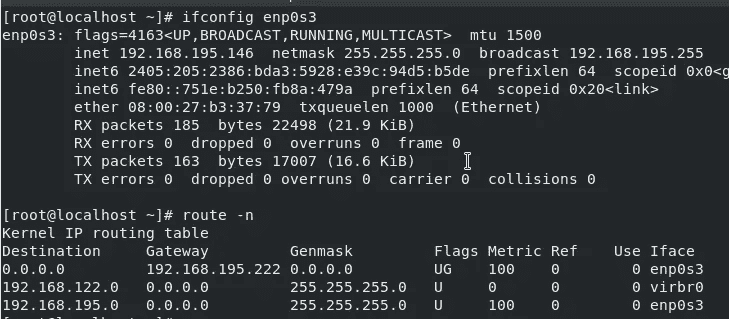
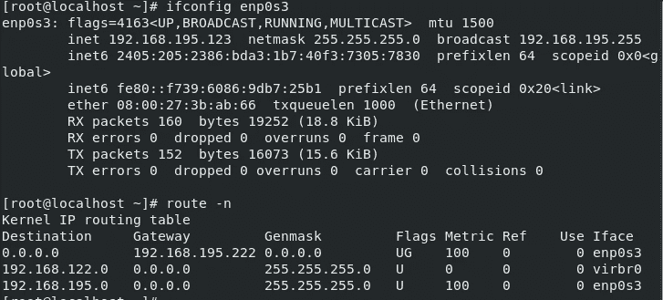
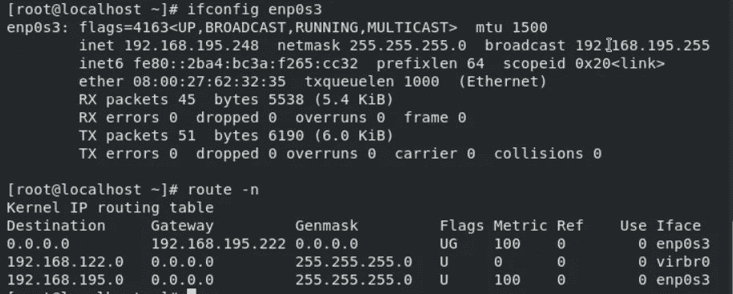
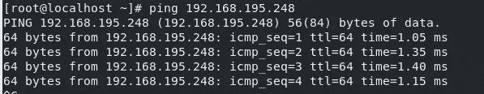
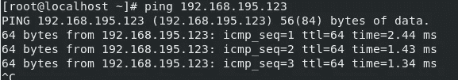
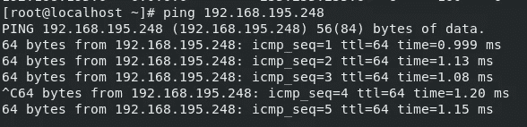
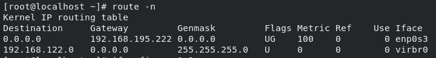
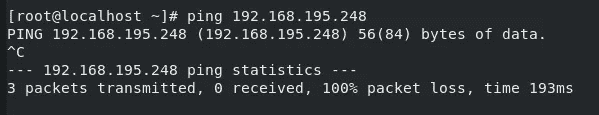
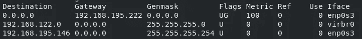
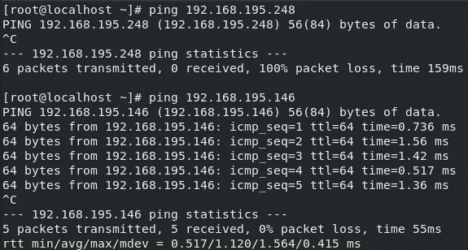

# 创建自定义网络拓扑

> 原文：<https://medium.datadriveninvestor.com/creating-a-custom-network-topology-f18d07103f70?source=collection_archive---------12----------------------->

网络是一个非常有趣的概念，我在以前的一篇文章中已经谈到了路由表的可用性和重要性。如果你不熟悉这里的是什么路由表，你可以看一下。

所以今天我有一个很有意思的实用与大家分享。

网络概念在某种程度上类似于传递性的数学规则。根据这一规则，如果

a 与 B 相关

a 与 C 相关

那么 B 与 c 相关。

类似地，默认情况下，这条规则也适用于网络。如果 OS1 可以 ping 通 OS2，OS1 也可以 ping 通 OS3，那么 OS2 也可以 ping 通 OS3。

然而，今天我将调整这个网络，虽然 OS1 可以连接到 OS2 和 OS3，但 OS2 和 O3 之间没有连接。

同样，在一些情况下，这种精确的实验可能是有用的。例如**在一个大学实验室里，一个教授可能想要连接到学生的系统，然而他可能不希望他的学生互相连接。**

但是，本实验也将展示路由表解决可能出现的各种问题的能力。

# 设置

我为这个实验创建了三个运行 RHEL8 操作系统的虚拟机。我将它们称为 OS1、OS2 和 OS3。我将创建一个网络，其中 OS1 可以连接到 OS2 和 OS3，同时它们不能 ping 通彼此。

如你所知，我已经列出了所有三个操作系统的 IP 和路由表。

OS1

OS2

OS3

让我来展示一下 ping 操作是否正常。所有这三个系统都能够很好地互相 ping 通。这是输出之一。

OS1 pings to OS3

OS1 pings to OS3

OS2 pings to OS3

因此，目前每个操作系统都可以 ping 通网络中的两个操作系统。

通常人们会考虑更改防火墙规则来创建这种拓扑。但是，如果我们使用路由表，这项任务会变得容易得多。

 [## 各种类型的分布式分类帐技术|数据驱动的投资者

### 随着比特币和加密货币在全球的采用、使用和魅力增长，它们已经成为常见的流行语。这个新的…

www.datadriveninvestor.com](https://www.datadriveninvestor.com/2020/12/04/various-types-of-distributed-ledger-technology/) 

为了完成这项任务，我们需要编辑 OS2 和 OS3 中的规则。

delete the route rule in OS2

所以现在 OS2 中的路由表看起来像这样

因此，我们删除了允许它连接到本地网络中任何其他名为 192.168.195.0/24 的系统的规则

OS2 trying to ping OS3

现在我们可以看到，虽然 OS2 之前很容易 ping 到 OS3，但现在它不能了。这是因为路由表不允许它连接到同一专用网络中的任何其它操作系统。

但这是个问题。我们希望 OS2 和 OS3 与 OS1 建立连接。为此，我们需要再次编辑路由表，以允许 OS1 连接到 OS2。

Allowing the connection of OS1 to OS2

所以最终的路由表看起来像这样

所以新添加的规则的 IP 是 OS1。这意味着尽管 OS2 没有与专用网络的任何操作系统连接，但是它可以连接到所提到的一个特定 IP。

让我们在实践中看到这一点。

OS2

这里我们可以清楚地看到，OS2 可以连接到 OS1，但不能连接到 OS3。

我也会在 OS3 中做同样的设置。

为了显示设置工作正常，我将在三个操作系统上分别显示 out。

# 结论

因此，在本文中，我们创建了一个网络拓扑，其中 OS1 能够连接到 OS2 和 OS3 系统，但是它们不能相互连接。我们没有使用防火墙或任何其他第三方软件来实现这一点。通过使用维护路由表的概念，可以解决许多用例。

如果你想在这里讨论任何关于技术的事情，请联系我。

谢谢:)

## 获得专家视图— [订阅 DDI 英特尔](https://datadriveninvestor.com/ddi-intel)