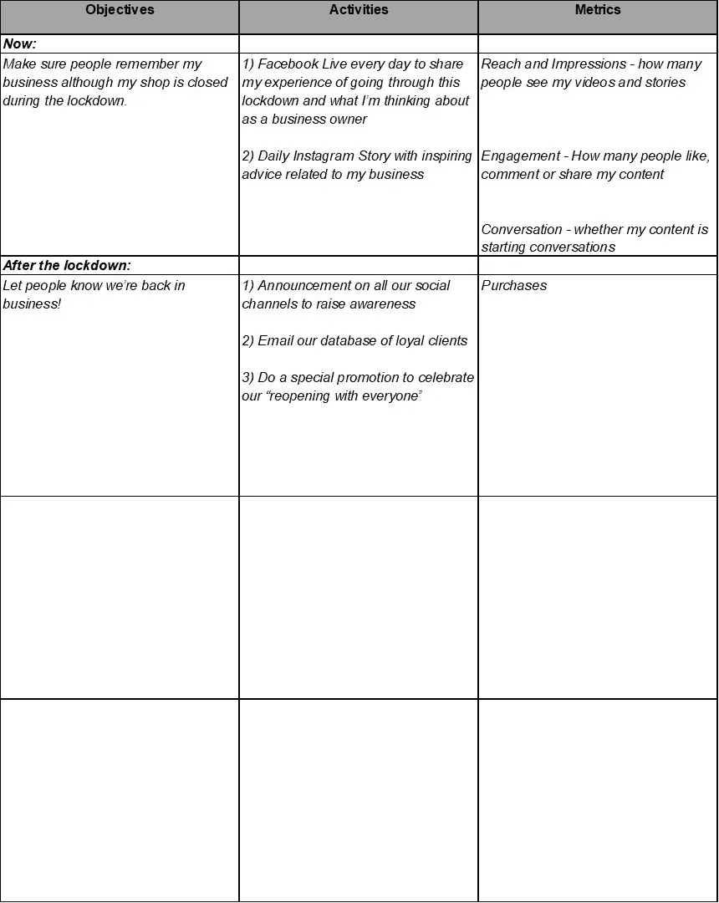

# 在危机时刻创造灵活的营销计划！

> 原文：<https://medium.datadriveninvestor.com/creating-a-nimble-marketing-plan-in-times-of-crisis-fbc4c6d280c0?source=collection_archive---------11----------------------->

# 帮助您入门的有用工作表

我最近写了一篇关于如何制定一个你可以在国外生活中坚持的营销计划的文章。

然而，尽管听起来有些矛盾，但事实是，营销计划并不是一成不变的。它们旨在成为一个向导，让你在经营企业的曲折过程中与核心目标保持一致。它们应该是一个*有用的*工具，与你的业务一起生存、一起发展，同时还能帮助你保持方法的一致性。

为了应对冠状病毒危机，一些企业不得不关门，另一些企业要求员工在家工作，一些企业转向新的业务模式，还有一些企业被新业务的涌入淹没。

无论你的企业处于什么位置，都要把这当成一个重新评估你的目标和当前营销活动的机会。即使你正面临严重的低迷，[你如何执行你的营销](https://www.the-emms.com/blog/should-you-still-be-thinking-about-your-marketing-now)现在可以决定你的客户是否会坚持你，以及一旦事情恢复正常，你能多快恢复。

 [## 影响者在聚光灯下表演|数据驱动的投资者

### 影响者营销是一个脱颖而出的游戏。结果是一个令人难忘的-和可信的-连接到一个产品或…

www.datadriveninvestor.com](https://www.datadriveninvestor.com/2020/01/15/influencers-perform-in-the-spotlight/) 

建立营销计划的框架
无论你是调整现有的营销计划还是从头开始，你都可以使用这个快速而简单的框架来帮助你将目标转化为行动。我鼓励你把这当成一个灵活的练习。最好的营销计划是你实际使用的计划，所以把它作为你的首要任务。

记住这一点，你的营销计划应该回答三个问题:

*   你想干嘛?
*   你会怎么做？
*   你怎么知道你已经完成了？

更具体地说，你的计划应该确定你的营销目标，确定哪些渠道和活动符合每个目标，并描述你将如何衡量你的进展。

下面的工作表旨在为您提供一个更深入的[营销计划](https://www.the-emms.com/blog/how-to-create-a-marketing-plan-for-your-start-up)的起点。写下你的营销目标，头脑风暴你可以用来实现每个目标的活动，并记下你将跟踪的任何硬性指标或软性进展标志。你说得越具体越好，但是不要因为缺乏细节而止步不前。

我已经为你做了第一个例子来说明你如何开始:

一旦你完成了这份工作表，请马上使用它。你也许不能一次做完所有的事情，但是要做一些事情，哪怕只是简单的给你的客户发送深思熟虑的信息，或者在社交媒体上记录情绪。

如果你有任何关于如何计划营销的问题，我很乐意回答。请在评论中留下您的问题或[与我联系](https://www.the-emms.com/contact-us)安排时间聊天。

— — —

【https://www.the-emms.com】原载于 2020 年 4 月 10 日**。**