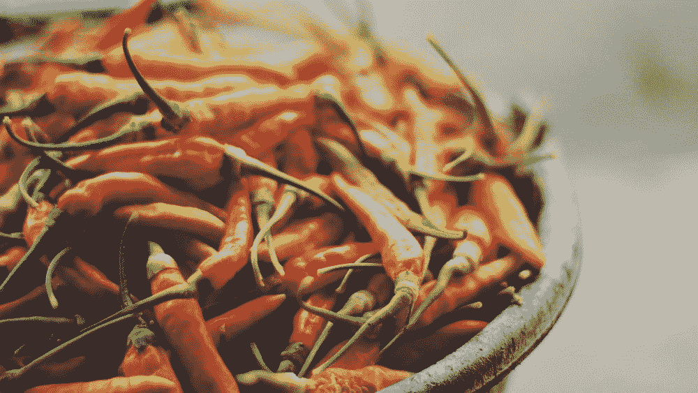
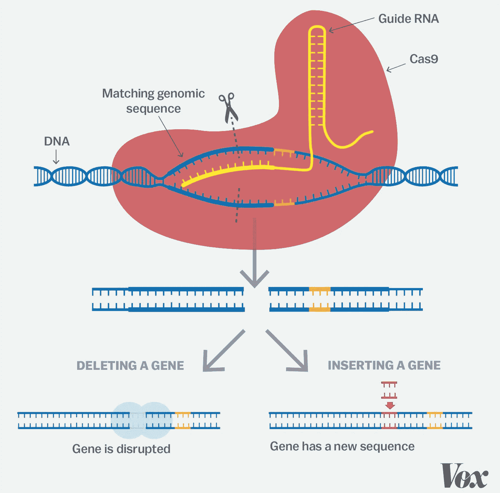

# 用基因编辑创造超级食物

> 原文：<https://medium.datadriveninvestor.com/creating-superfoods-with-gene-editing-3a13d6b4eb48?source=collection_archive---------1----------------------->

截至 2019 年，地球上约有 **37%** 的可居住土地被用于农业目的。然而这还不够。由于农业的需求以及地球人口的快速增长，我们可居住的土地不断减少。

目前的食品生产方法根本无法满足我们的需求，而且容易受到疾病和其他环境因素的影响。现在，**转基因生物**正被用来解决这个问题，但激起了巨大的生物和伦理争议。

 [## 忘记石油吧，水是未来。数据驱动的投资者

### 我们不会耗尽燃料的替代品。能源行业曾经是投资者的荣耀，无论…

www.datadriveninvestor.com](https://www.datadriveninvestor.com/2018/11/14/forget-about-oil-water-is-the-future/) 

这为**基因编辑**带来了革新农业的机会，而在帮助解决这一问题上发挥了重要作用。

# 吉恩·🧬

让我们先试着了解一下什么是**基因**。简单来说，基因就是细胞的**脱氧核糖核酸**的片段，存在于每一个生物体内。把你的 DNA 想象成你身体的指令手册。它包含了一整套必要的生命功能的遗传指令。因此，通过编辑 DNA 的特定部分，我们可以改变你身体的某些功能/特征。例如，我们 DNA 中的基因可以影响我们的身高或眼睛的颜色。

当我们出生时，我们从父母那里以染色体的形式获得了两套 DNA。染色体是一个紧密缠绕的 DNA 包，我们从父母那里获得的每组 DNA 包含 23 条染色体。这两套结合在一起，在我们的身体里产生一套指令。

# 基因编辑是如何工作的？✂️

有时，我们的组合指令中有错误，这可能导致严重的疾病以及基因缺陷。因此，我们可以使用基因编辑来尝试修复这些错误。

本质上，基因编辑允许我们添加、删除或改变我们 DNA 中的遗传序列，这些序列由四个不同的字母组成，称为“生命字母”: **G** **—** 鸟嘌呤、 **C —** 胞嘧啶、 **A** —腺嘌呤和 **T —** 胸腺嘧啶。编辑这些字母的序列，允许我们对我们的 DNA 进行这些改变。

我们有很多方法可以改变我们的基因序列，叫做基因编辑技术。最常见的技术之一是 **CRISPR-Cas9** 。它通过识别我们 DNA 中需要改变的特定序列来实现我们想要的目标。一旦它识别出这个序列，一种被称为 Cas9 的酶就会切除这个序列，并用另一个 DNA 序列取代它。有了 CRISPR，我们可以用新的基因替换有缺陷的基因，或者改变基因的行为。

# 创造超级食物🍎

就像我们如何改变人类的 DNA 一样，我们也可以对农作物做同样的事情，因为 DNA 存在于所有生物中。然而，科学家在编辑基因时需要超级小心，因为即使是单个序列的意外变化也会产生很大的影响。以下是一些有可能被基因编辑彻底改变的食物:

**香蕉🍌**

一种通过基因编辑创造的更可持续的香蕉品种目前正在测试中。它可以对抗一种称为镰孢菌 TR4 的病毒，这种病毒影响了全球香蕉的供应。

**巧克力🍫**

世界上 70%的可可豆来自非洲国家。目前，有一种被称为 CSSV 的病毒正在影响西非的可可作物。科学家们正试图增强这些植物的免疫系统来抵抗病毒。

**咖啡☕**

从咖啡豆中去除咖啡因是一个昂贵且耗时的过程。这个过程也会影响咖啡的味道。然而，我们可以创造出自然脱咖啡因的咖啡豆，它需要的时间更少，生产成本也低得多。

**蘑菇**🍄

宾夕法尼亚州立大学发现了蘑菇上出现的褐色斑点与黑色素基因之间的相关性，黑色素基因是赋予食物颜色的基因。通过编辑这种基因，他们可以改善蘑菇的外观和保质期。

**大米🍚**

世界上大部分大米来自亚洲国家，这些国家更容易面临更恶劣的气候条件。研究人员正在研究从生产水稻的植物中多生产 25-30%的谷物，同时保持它们对更恶劣气候条件的耐受性。

**小麦🌾**

科学家们正致力于改良小麦，以生产含有显著降低引起乳糜泻的谷蛋白含量的品种。

将基因编辑技术应用于这些食物以及许多其他食物，可以大大减少食物生产所需的资源量。此外，我们可以限制我们用于农业的土地数量，允许更多的土地用于其他目的。

# 关键要点🔑

*   世界上可居住的土地越来越少，当前的粮食生产方式使这个问题变得更糟
*   我们可以使用基因编辑来帮助解决这个问题
*   基因是细胞 DNA 的一部分，包含从父母遗传给你的两套染色体
*   c、G、A、T 是我们 DNA 遗传序列中的“生命字母”,可以通过改变来修复我们 DNA 中的问题
*   CRISPR 是一种常见的基因编辑技术，它可以删除有缺陷的基因或改变基因的功能
*   我们可以利用基因编辑技术创造“超级食物”,减少农业用地，优化粮食生产

这是一个总结…如果你喜欢读这篇文章，给它一个掌声或 50😉敬请关注更多精彩内容！另外，别忘了在 LinkedIn 上关注我:

[https://www.linkedin.com/in/aahil-s-a78556192/](https://www.linkedin.com/in/aahil-s-a78556192/)

和平✌.