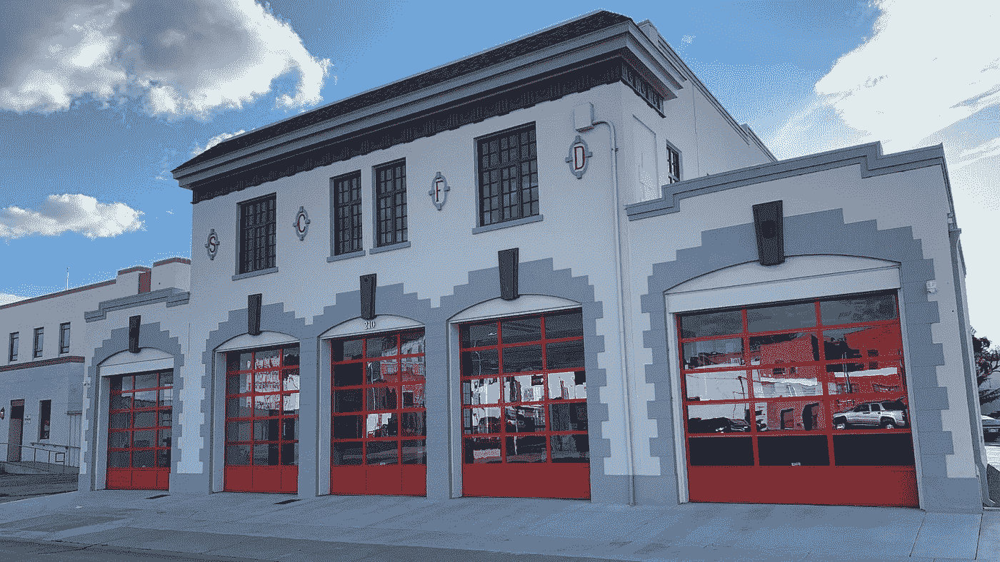

# 在农村社区创造技术职业道路

> 原文：<https://medium.datadriveninvestor.com/creating-tech-career-pathways-in-rural-communities-be37b3aa6c78?source=collection_archive---------15----------------------->

## 与 Digital Nest 创始人兼执行董事雅各布·马丁内斯的对话

Jacob Martinez, Founder and Director of Digital NEST. Digital NEST is a workforce development hub that helps young people in rural communities find well-paying jobs.

几个月前，我发起了一项行动呼吁，以解决如何利用数据素养为服务不足的社区提供更好的职业机会。我认为熟悉和轻松使用数据是一项关键技能，有助于我们驾驭不断变化的员工队伍。自从我参与寻找为年轻人创造科技职业道路的方法以来，我一直在关注其他人是如何解决这一挑战的。

雅各布·马丁内兹是[数码巢](https://digitalnest.org/)的执行董事，他是接受这一挑战的人之一。数字巢是一个青年劳动力发展和授权中心，位于加利福尼亚州沃森维尔和萨利纳斯。 ***巢*** 代表 ***用技术培育创业技能*** 。他们的使命是将青年与技能建设社区联系起来，支持他们转变为能够创造成功职业、创新解决方案和建设繁荣社区的专业人士。2014 年，雅各布在沃森维尔看到一名年轻女子在寒冷的户外使用免费 wifi 做作业后，推出了数字巢。他被感动了，决心采取行动。带着为他所在社区的年轻人建造一个凉爽、时尚和舒适的空间的计划，Digital NEST 诞生了。

自从六年前成立以来，Jacob 和他的团队一直在经历巨大的增长，没有放缓的迹象。他们为 2000 多名年轻人提供了免费的技术和劳动力技能培训，涉及网站开发、项目管理和数字艺术等领域。2017 年，他们在加州萨利纳斯开设了第二家分店。今天，他们正在搬迁萨利纳斯市中心的一个历史悠久的消防站，并刚刚宣布了第三个位置在吉尔罗伊，加利福尼亚州！

数字巢萨利纳斯正搬到市中心一个历史悠久的前消防站。位置和更大的空间将使他们能够更好地支持社区，培训更多的年轻人，并向当地企业推广他们的才能。

Digital NEST Salinas is moving downtown to a historic former firehouse. The location and larger space will position them to better support the community by training more youth and promoting their talent to local businesses

# Digital NEST 的起源故事是什么？

那么，这种资金充足的技术环境是如何形成的呢？雅各布带着自豪、激情和怀旧的混合情绪讲述了这个故事。就像老鹰为雏鹰准备巢一样，他希望沃森维尔的年轻人得到最好的。当他开始整理他的商业计划时，他回忆了他和他过去的学生对脸书和谷歌等科技公司的实地考察。这是他想到为 14-24 岁的年轻人创造一个合作空间的时候。他分享道，“如果这种环境有利于成年人激发创新和创造力，为什么年轻人不行呢？”他开始为孩子们创造一个拥有最酷的家具和设备的环境，同时不惜成本。为学生提供这个安全的港湾，让他们不受挑战的阻碍地接受教育和培训，就像没有 wifi 来完成作业一样，成为了 Digital Nest 品牌。

> “当你创造一个环境，让年轻人感到受到尊重，有归属感，并有一个支持他们的社区时，他们可以为自己设想一个不同的未来。”——雅各布·马丁内斯，Digital Nest 执行董事

# 这个项目如何帮助年轻人找到工作？

Digital NEST 采用亲身实践的方式进行培训，激发学生的才能和激情。他们的工作培训和职业发展计划由三大支柱组成:数字艺术和技术(DAT)、网络和信息技术(WIT)以及人员、项目和领导力(PPL)。[学生可以选择的课程](https://digital-nest.coursestorm.com/)包括电影和视频、网页设计和开发以及项目管理。

对 Jacob 和他的团队来说，重要的是鼓励年轻人在完成项目后留在当地，帮助丰富他们的社区。这就是为什么他们用 [bizzNEST](https://digitalnest.org/bizznest/) 创造了完美的桥牌程序。BizzNEST 是一家技术和数字创意青年机构，为 Digital NEST 毕业生提供他们进入就业市场所需的实践和基于项目的学习，以及现成的投资组合。一旦学生完成培训，他们将花一年时间在 bizzNEST 工作。雅各布分享了[雷米·罗德里格兹](https://www.linkedin.com/in/remy-rodriguez-311442165/)的职业道路。雷米高中毕业后成为了一名视频会员顾问。在那里，他为客户项目工作，建立了自己的投资组合，甚至还从事自由职业。他接着在沃森维尔市实习，目前是第二丰收食品银行的数字设计营销经理。雅各布解释说，这对雷米和沃森维尔来说是一个双赢的局面。虽然 Remy 能够找到职业机会，但像 Second Harvest 这样的本地企业能够获得高技能人才。因为有像数字巢这样的组织，找到合格人才的概率更高。

Jacob 分享了投资于社区的当地青年如何更积极地提出创新解决方案，从而促进社区繁荣。BizzNEST 能够在新冠肺炎疫情早期启动针对西班牙语社区和当地企业的[关键项目](https://digitalnest.org/nest-response-to-covid-19/)。他们因为为当地社区健康组织“健康促进会”制作了一部西班牙语的新冠肺炎信息视频而受到认可。他们还创建了一个小企业目录，告知社区哪些企业仍在营业，以及它们的运营状况。当大多数非营利组织在世界疫情开始时制定裁员计划时，Digital NEST 采取了相反的策略。即使新冠肺炎威胁生命，他们知道，社区需要服务。

# 如何筑巢？

当评估一个城市建造鸟巢时，数字鸟巢将可持续性和可扩展性放在首位。雅各布的目标是让年轻人掌握帮助当地雇主所需的技能，从而阻止沃森维尔等社区的人才流失。在考虑未来劳动力的前景时，Jacob 和他的团队查看人口普查数据，以了解社区的规模和该地区年轻人的比例。

一旦达到这个标准，团队就开始分析位置。对新巢穴的一个要求是在该地区有固定的公司。这对创造就业很重要。另一个要考虑的因素是社区离市中心的距离。这对于平衡防止该地区人才流失的需要和理解将会有年轻人想在硅谷这样的商业中心工作是必不可少的。

雅各布最终计划在旧金山湾区周围建立 9 个数字巢，这些巢将被战略性地放置，以引起硅谷的注意。和我们其他人一样，他也听到了硅谷对更加多样化的技术人才的呼唤。雅各布对自己的同伴充满自信和自豪。正如他所看到的，“我们在这些社区中拥有所有这些有技能、有才华和多样化的优秀年轻人。”

在考虑筑巢地点时，数字巢将可持续性和可扩展性放在首位。在接下来的十年里，雅各布看到了在加州北部和洛杉矶南部蓬勃发展的鸟巢网络。他不打算停止，直到他们蔓延到整个国家。

Over the next decade, Jacob sees a network of NESTs fully built in Northern CA and burgeoning Southern locations around Los Angeles. He doesn’t plan to stop until they are sprawled across the state.

# 数字巢已经起飞。

Jacob 建立了一个令人敬畏的员工发展计划，该计划正在蓬勃发展。他和 Digital NEST 团队已经能够设计出一种经过验证的可扩展和可持续的教育到工作模式。投资一个凉爽时尚的空间，为年轻人争取经济平等提供安全保障，这对他们的成功至关重要。此外，他们还创建了符合商业社会需求的职业规划。我相信他们正在努力让硅谷抬头看看天空中盘旋的雄鹰。

> “我认为，随着我们的发展，我们将北上，这样我们就可以包围硅谷，开始向他们施压，让他们开始关注我们的人才，并认真对待我们。”—雅各布讲述他扩建巢穴的计划