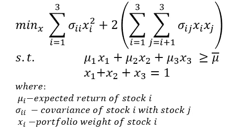
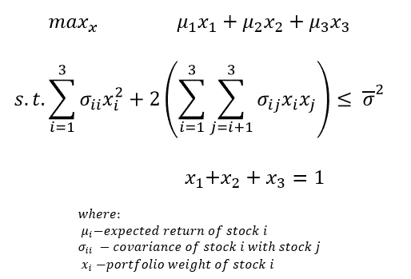
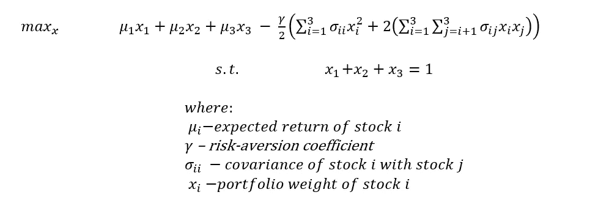
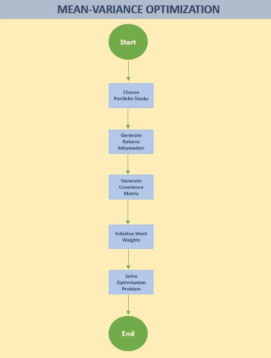
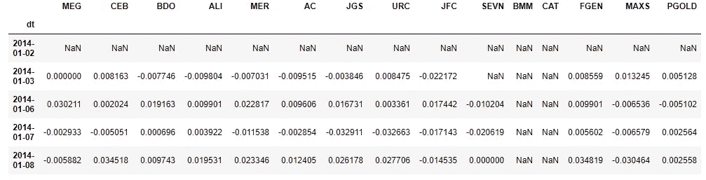
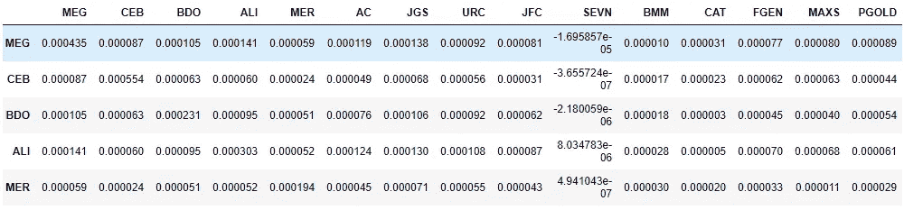
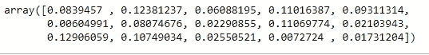
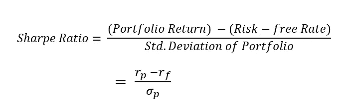
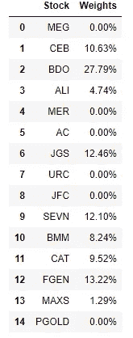
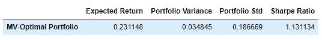

# 通过分析创建菲律宾股票的最优投资组合

> 原文：<https://medium.datadriveninvestor.com/creating-the-optimal-portfolio-of-philippine-stocks-through-analytics-c40f76f90545?source=collection_archive---------8----------------------->

## PYTHON。FASTQUANT。投资。菲律宾

## 使用 Fastquant、Scipy 和优化理论创建回报风险效率最高的股票投资组合


Photo by [Adam Nowakowski](https://unsplash.com/@adamaszczos?utm_source=medium&utm_medium=referral) on [Unsplash](https://unsplash.com?utm_source=medium&utm_medium=referral)

如果你尝试过投资股市，那么你最有可能面临“选择哪只股票”、“关注哪个行业”、“每只股票应该配置多少”等多重投资决策。

幸运的是，Harry Markowitz 为最后一个问题提供了答案，这个问题也被认为是投资中最困难的问题之一:*投资组合证券选择*。他的现代投资组合理论(MPT)为他赢得了诺贝尔奖，并介绍了组合投资的思想以及证券的风险和相关性如何影响整个投资组合。

所以你可能认为有很多方法可以回答“我应该投资多少”这个问题，但是最优化理论和 Markowitz 的工作会告诉你只有一个正确的答案。

我们将使用由菲律宾数据科学家开发的 *fastquant* 软件包，这是唯一一个可以轻松连接和访问菲律宾证券交易所数据的软件包。(*其他软件包很难检索与全球股票有相同代码的股票*)

本文将讨论理论背后的数学以及一些代码。对于那些仅仅想要代码的人，**你可以跳到标有“代码”的章节**。

# **金融数学:最优化理论和算法**

最优化理论要求理解线性代数和矩阵运算。你将在下面看到的优化模型都是矩阵符号，所以这将有助于回顾一些基础知识。

事实上，即使使用 Scipy 优化，定制代码也需要线性代数和矩阵的基础知识。

最优投资组合有三种基本模型或版本(如果你愿意这么称呼的话)。这将取决于你的目标和约束。

任何优化问题最多有以下几个组成部分:

1.  **目标函数** —我们希望优化的函数(最小化或最大化)
2.  **决策变量**——为达到最佳输出应改变的变量
3.  **约束** —如果没有约束，这被称为无约束优化。

利用这些基本知识，让我们开始使用三种股票的场景来查看我们的三个模型:

## **型号 1**



A Three-Stock model whose objective function aims to minimize portfolio variance. Note that the last constraint is ensuring that the sum of all the weights would equal 1.

模型 1 的目标是在给定回报的前提下，最小化投资组合的方差。这种模式最适合优先考虑风险管理的*金融机构。*

*例如，一家银行希望将风险(*投资组合方差*)降至最低，同时确定其投资组合的年回报率至少应为 10%，以满足其盈利目标。*

## ***模式二***

**

*A Three-Stock model whose objective function aims to maximize portfolio return. Note that the last constraint is ensuring that the sum of all the weights would equal 1.*

*模型 2 旨在根据特定的风险水平最大化投资组合的回报。这种模式更 ***适合已经确定了自己可接受风险水平的金融机构或公司，因此更关心收益最大化*** 。*

*例如，一家保险公司预测，为了成功管理流动性需求，投资组合方差不应超过 5%。在满足约束条件后，我们可以专注于最大化回报。*

## ***型号 3***

**

*A Three-Stock model whose objective function aims to maximize the tradeoff or return and risk subject to the level of risk-aversion. Note that the last constraint is ensuring that the sum of all the weights would equal 1.*

*模型 3 旨在最大化收益和风险的权衡，以规避风险的水平为准。这个模型更适合于那些已经计算出他们的风险规避水平的更先进的金融机构。一些先进的资产管理公司使用这种模式。*

## ***工作流程***

**

*General Workflow for the Mean-Variance Optimization Problem. We can see that we need three primary inputs: returns information, covariance matrix, and the portfolio weight of the stocks.*

*对于初学者来说，我们需要做的计算最优投资组合的工作量可能太大了。上面的工作流程应该有助于我们正确看待事情，并为流程提供一点秩序。*

# ***代码***

*确保安装了 *fastquant* 。*

```
*pip install fastquant*
```

*导入必要的包:*

```
*from fastquant import get_stock_data, get_stock_table
import pandas as pd
import numpy as np#Optimization
import scipy.optimize as optimization*
```

## *第一步:选择股票组合*

*假设我们想在我们的投资组合中包括以下股票:*

*   *超级世界*
*   *宿务太平洋(CEB)*
*   *奥罗银行(BDO)*
*   *阿亚拉土地公司*
*   *梅拉尔科公司*
*   *阿亚拉公司*
*   *JG 首脑会议(JGS)*
*   *环球罗比纳公司*
*   *乔利比食品公司*
*   *菲律宾七公司(SEVN)*
*   *博戈·麦德林制粉公司*
*   *第一代*
*   ***马克斯集团公司(MAXS)***
*   *纯金*

*用库存代码创建一个列表。*

```
*stocks = ['MEG','CEB', 'BDO','ALI', 'MER', 'AC', 'JGS', 'URC', 
          'JFC', 'SEVN', 'BMM', 'CAT', 'FGEN', 'MAXS', 'PGOLD']*
```

## ***第二步:计算这些股票的回报率***

*要计算回报，请指定有问题的时间段。这一点至关重要，因为时间段的选择可能与股票市场的高增长期或低增长期相吻合。*

*现在，让我们假设代表来年预期回报的正确时间周期由下式给出:*

```
*START_DATE = "2014-01-01" #yyyy-mm-dd
END_DATE = "2019-12-29"*
```

*使用 *fastquant* 软件包，为所选股票生成一天结束时的**股票价格**:*

```
*df = pd.DataFrame()
for stock in stocks:
    try:
        df_ = get_stock_data(stock, START_DATE, END_DATE)
    except:
        continue
    df_.columns = [stock]
    df = pd.concat([df, df_], axis=1)*
```

*得到股票价格后，pandas *pct_change()* 方法提供了一种计算收益的便捷方法。*

```
*returns = df.pct_change()
returns.head()*
```

**

## *步骤 3:生成收益的协方差矩阵*

```
*cov = returns.cov()
cov.head()*
```

**

## *步骤 4:初始化投资组合权重*

*选择的权重必须来自从 0 到 1 的均匀分布。幸运的是， *NumPy* 的 *random.random* 来自一个连续的、均匀的分布。*

```
*weights = np.random.random(len(stocks))
weights /= np.sum(weights)
weights*
```

**

*这些初始化的权重是我们的优化器可以使用的对象所必需的。*

## *第五步:解决优化问题*

*为了使用 Scipy 优化器，我们需要定义一个函数来优化它。*

*我们有几个模型可以使用，但我们可以修改基本模型，以针对特定的指标，投资组合经理用来评估投资组合的表现。*

**

*夏普比率衡量投资组合每单位风险的*超额收益。它告诉你一个投资组合是否为了更高的回报而在一些风险(标准差)的交易中做得很好( *rp* )。夏普比率越高，投资组合的表现越好。**

**因此，最大化夏普比率在某种程度上类似于我们的模型 3。**

**任何优化问题的标准形式都是最小化，通过在任何函数上加上负号，最小化就变成了最大化问题。**

**让我们定义 Scipy 将最小化的目标函数:**

```
**def portfolio_metrics(weights):

    '''
    This function generates the relative performance metrics that will be reported and will be used
    to find the optimal weights.

    Parameters:
    weights: initialized weights or optimal weights for performance reporting

    '''   
    rf = 0.02 risk-free rate
    rp = (returns.mean()*252)[@weights](http://twitter.com/weights) 
    port_var = weights@(cov*252)[@weights](http://twitter.com/weights)
    sharpe = (rp-rf)/np.sqrt(port_var)
    df = pd.DataFrame({"Expected Return": rp,
                       "Portfolio Variance":port_var,
                       'Portfolio Std': np.sqrt(port_var),
                       'Sharpe Ratio': sharpe}, index=["MV-Optimal Portfolio"])
    return df**
```

**使用上面的函数，因为我们只需要夏普比率，我们可以这样定义函数:**

```
**#Objective Function
def min_sharpe_ratio(weights):
    return -portfolio_metrics(weights).loc['MV-Optimal Portfolio','Sharpe Ratio']**
```

**Scipy 优化器的下一个输入是约束。回想一下，在上面的模型中，我们有两种类型的约束，等式约束和不等式约束。**

**投资组合优化问题的一个常见约束是“完全投资”约束，这意味着投资组合的权重总和应为 1。**

**Scipy 约束都是结构化的，因此等式的右边总是‘0’。因此，为了表示“完全投资”约束，我们写下:**

```
**#Constraints
constraints = [{'type':'eq','fun': lambda x: np.sum(x)-1}]#Bounds
bounds = [(0, 1) for i in range(len(stocks))] #because each weight, as a percentage, should just be between 0 to 1.**
```

**为优化器设置好输入后，我们现在可以编写优化代码了:**

```
**opt_weights = optimization.minimize(fun=min_sharpe_ratio,x0=weights,method='SLSQP',bounds=bounds,constraints=constraints)['x']**
```

**为了检查 dataframe 格式的输出，我们可以编写另一个函数，该函数获取优化器的输出，并将其与特定的股票代码进行匹配:**

```
**def optimal_portfolio_weights(weights):
    df = pd.DataFrame({"Stock": stocks,
                       "Weights": weights})
    df.Weights = df.Weights.map(lambda x: '{:.2%}'.format(x))
    return dfoptimal_portfolio_weights(opt_weights)**
```

****

**正如我们所看到的，最优投资组合中股票配置最多的是 BDO。最优投资组合同样不允许我们将任何东西分配给 URC、JFC、MEG 和 PGOLD。**

**注意，这并不意味着这些配置为 0%的股票是低效的或不可取的。只是在这种特殊的组合中，你可以优化回报和风险之间的权衡，而不用那些股票。在投资组合的其他组合中，它们的权重可能是正的。**

**为了计算这个投资组合的指标，我们可以简单地将优化器计算的最优权重插入到我们定义的函数中:**

```
**portfolio_metrics(opt_weights)**
```

****

**Note that for the Sharpe Ratio, we used 2% as our risk-free rate.**

**我们看到，使用我们的最佳权重，我们预计我们的投资组合在一年内的回报率为 23%，波动率约为 19%。**

**最佳的夏普比率似乎是 1.13，这被金融文献认为是好的(任何超过 1 的夏普比率也是如此)。**

# ****基本情况的修改****

**在这个练习中，我们只使用了历史回报，并将其作为预期回报。这个练习的其他更高级的版本将使用“预测”回报。对于这种情况，我发现 ARIMA 工作得最好，也许是我下一篇文章的主题。**

**所选择的时间段可能会在很大程度上影响回报，进而影响我们拥有的协方差数据。在选择历史时间段时，最重要的考虑因素是，它类似于所讨论的投资组合的一年持有期。**

**在我的 Github 页面上有完整的代码。**

## ****参考文献****

**[https://enzoampil . github . io/fast quant-blog/portfolio/optimization/2020/06/20/basic _ portfolio . html](https://enzoampil.github.io/fastquant-blog/portfolio/optimization/2020/06/20/basic_portfolio.html)

[https://towards data science . com/time-series-forecasting-predicting-stock-prices-using-an-ARIMA-model-2e3b 3080 BD 70](https://towardsdatascience.com/time-series-forecasting-predicting-stock-prices-using-an-arima-model-2e3b3080bd70)**