# 创造性人工智能——它走了多远？

> 原文：<https://medium.datadriveninvestor.com/creative-ai-how-far-has-it-gone-aad3dedd71f8?source=collection_archive---------18----------------------->

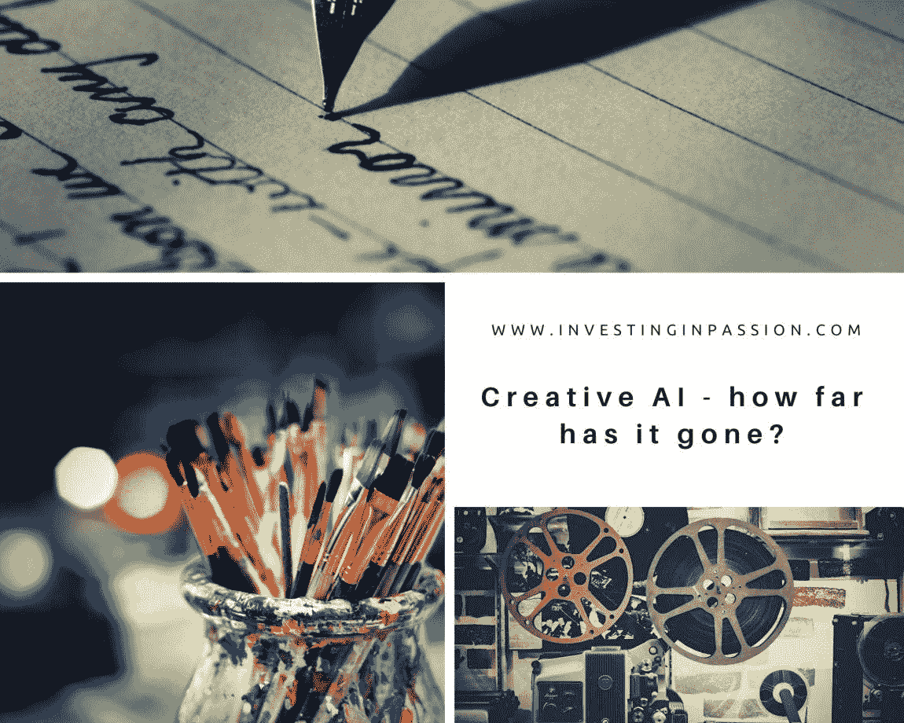

[灵感](https://investinginpassion.com/category/inspirations/)[资源](https://investinginpassion.com/category/resources/)[风险投资](https://investinginpassion.com/category/venture-capital/)

如今，我们称人工智能为很多东西，但很多时候它不是人工智能，而只是简单的自动化或与人工智能无关的软件。人工智能有不同的分类，这取决于我们衡量进步的角度和评估标准。我喜欢这样一种分类，它基于人工智能与人类思维的相似性，以及它们像人类一样“思考”甚至“感觉”的能力，并将人工智能分为 4 种主要类型。

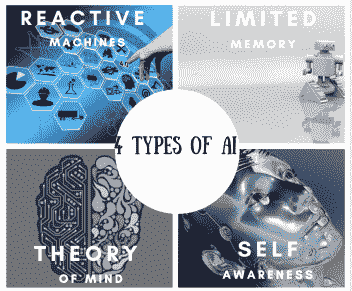

我想知道人工智能在创造力领域走了多远。不是它能模仿多少，重复动作的速度有多快，它对刺激的反应有多好，而是它的独立思考和独特的艺术作品、电影、诗歌等的创作的产出。自动驾驶汽车、数字个人助理甚至自动垃圾邮件过滤器都属于基本级别的‘狭义人工智能’。然而，人工 ***通用*** 智能(AGI)描述的是一台能够在更高层次上应用知识和技能，能够像人一样自我学习和解决问题的机器。

Source: Pfeiffer Consulting, Adobe

**电影**

让我们一起看《太阳之春》——一部由托马斯·米德蒂奇主演的科幻短片。该团队创造了“杰特森”，给他喂了很多科幻电视和电影剧本，然后播放他写的任何东西。

Ars 技术公司:[https://www.youtube.com/watch?v=LY7x2Ihqjmc](https://www.youtube.com/watch?v=LY7x2Ihqjmc)

如果你喜欢，你可以看《太阳之春》的续集——这可不是大卫·霍索夫的游戏。

**书/内容写作**

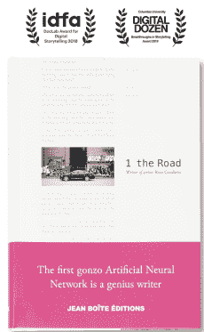

[https://bit.ly/2YfHvMP](https://bit.ly/2YfHvMP)

[1《路》](https://www.jbe-books.com/products/1-the-road-by-an-artificial-neural)是一部人工智能创作的实验小说。它获得了 IDFA 文献实验室评书奖。“1 The Road”是由罗斯·古德温(Ross Goodwin)创造而非创作的，他在谷歌的帮助下，在凯迪拉克上安装了全球定位系统、麦克风、时钟和屋顶摄像头，将信息传输给便携式人工智能。
它被命名为“*”一辆汽车写了一本值得一读的书。*’。

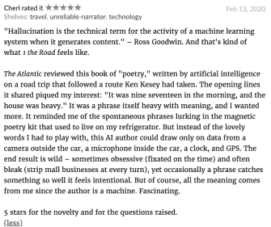

Recent review from [https://www.goodreads.com/](https://www.goodreads.com/)

一个大学生的假的，人工智能生成的博客愚弄了数万人，说明了这项技术的危险。"实际上，这非常简单，这也是最可怕的部分."(使用 GPT 3，最强大的语言生成人工智能工具)。

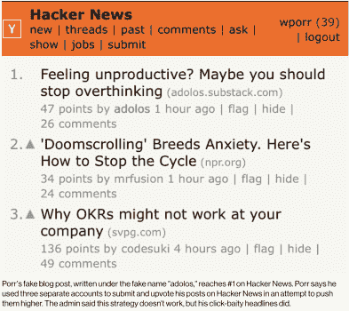

[https://bit.ly/3hePamn](https://bit.ly/3hePamn)

[https://adolos.substack.com/archive?sort=new](https://adolos.substack.com/archive?sort=new)

发起者说他想让人们相信 GPT-3 可能是一个真正的人类作家。该算法写了一些奇怪的文字和随机错误，但只有 3-4 人对他的帖子发表了评论，这引起了怀疑，并表示这看起来像是人工的，可能是由算法或机器完成的。所有的评论立即被其他成员否决了。

 [## COVID19 和风险投资|数据驱动的投资者

### 当分析一家初创公司，尤其是处于早期阶段的公司时，投资者关注三个主要因素:团队、市场和…

www.datadriveninvestor.com](https://www.datadriveninvestor.com/2020/07/23/covid19-and-venture-capital/) 

[*《福布斯》*、*《华盛顿邮报》*、路透社](https://www.forbes.com/sites/enriquedans/2019/02/06/meet-bertie-heliograf-and-cyborg-the-new-journalists-on-the-block/#3b13300d138d)等等，使用机器学习工具来帮助他们制作内容。彭博使用一个名为 ***Cyborg*** 的计算机系统将财务报告转换成迷你文章(约占 Boomberg 制作的所有内容的 1/3！).

**艺术**

人工智能[现在可以随机绘制出](https://www.somagnews.com/artificial-intelligence-can-create-tremendously-real-human-portraits-random-drawings/)真实的人类肖像，看起来棒极了。

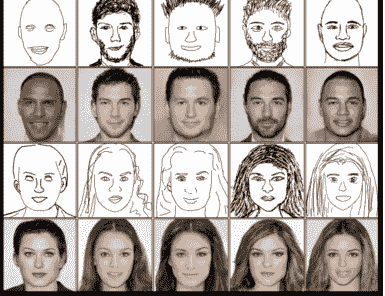

[https://bit.ly/31bIeAF](https://bit.ly/31bIeAF)

这个想法来自香港大学的付洪波。超过 17k 的人像照片被用来训练人工智能算法。

[Deep Dream Generator](https://deepdreamgenerator.com/) (谷歌出品)用于创作艺术作品，通过与人工智能工具的合作，你可以轻松地创作出鼓舞人心的视觉内容。

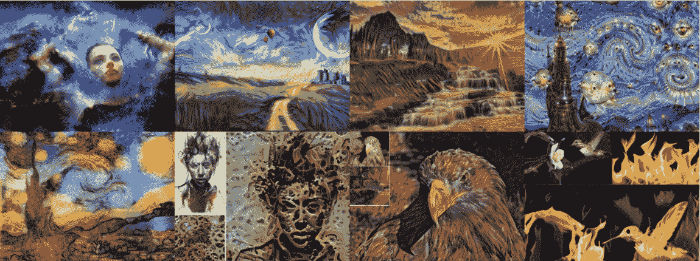

[https://deepdreamgenerator.com/](https://deepdreamgenerator.com/)

NVIDIA GAUGAN: Gaugan 由后印象派画家保罗·高更命名并受其启发，通过分割地图创建美丽的真实感图像，分割地图是描述场景布局的标签草图。

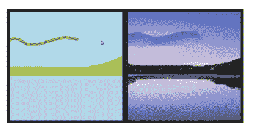

[https://bit.ly/31eecMT](https://bit.ly/31eecMT)

NVIDIA 图像修复是一种图像重建，它可以用从训练模型中生成的新像素完美地填充图片中缺失的部分，与照片中缺失的内容无关。

**游戏**

众所周知的 [AlphaGo](https://deepmind.com/research/case-studies/alphago-the-story-so-far) ，一个由 DeepMind 创建的人工神经网络，在 2016 年打败了围棋大师。机器做出了新的、创造性的、意想不到的动作，这些动作超出了它被训练的数据范围。

[GameGAN](https://nv-tlabs.github.io/gameGAN/) ，一个由 [NVIDIA Research](https://www.nvidia.com/en-us/research/) 创造的强大的新人工智能模型，可以生成一个全功能版本的 PAC-MAN。这是一个神经网络模型，通过利用[生成对抗网络](https://blogs.nvidia.com/blog/2017/05/17/generative-adversarial-networks/)，或 GANs，来模仿计算机游戏引擎。

**音乐**

[Flow Machines](https://www.flow-machines.com/) 是一个机器学习(ML)平台，AI 辅助音乐，用于创作歌曲。由索尼和华纳音乐集团等使用。我喜欢《想象的线》这首曲子。听着:

**辩论**

IBM 的[项目辩手](https://www.research.ibm.com/artificial-intelligence/project-debater/)不久前参加了一次世界辩论锦标赛。IBM 的人工智能系统提出了许多令人信服的论点，这些论点是由它自己创造的，并就幼儿园是否应该获得政府补贴提出了一个最终论点。这真的很有意义，也是支持这种说法的合理理由。

**时尚**

时尚是一个最需要创造力和想象力的领域。你可以释放你的思想，让它变得狂野，结合不同的风格、设计、颜色和裂缝。已经看过数百万套服装的 AI 能做到吗？亚马逊已经开发了一个可以设计衣服的人工智能服装设计师。人工智能服装设计师可以被训练使用，比方说，来自特定风格的图像，并在这种口味内创造不同的衣服，并且完全一致。

**读心术**(等等……什么？o_o)

我最感兴趣的是人工智能知道人类在想什么的能力。功能性核磁共振成像让计算机能够可视化人们在想什么，并画出物体的图片。ATR 计算神经科学实验室和京都大学提出了从大脑活动中“重建”或“生成”图像的模型。

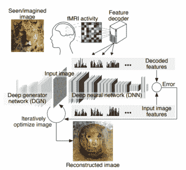

mage: ATR Computational Neuroscience Laboratories/Kyoto University: [https://bit.ly/2Q9HWUz](https://www.weforum.org/agenda/2018/02/mind-reading-ai-creates-images-from-your-thoughts/)

**自我创造**

让我们更进一步！为什么不让 AI 造另一个 AI？谷歌已经证明，人工智能可以构建一个比任何人做的都更好的人工智能。AI 创造了一个“婴儿”AI，它在给定的任务中胜过了人类制造的 AI。这显示了人工智能在没有监督的情况下完成复杂任务、练习、实验以及学习和进化的无限能力，就像人一样。

**其他资源**

这里有一些更有趣的文章，展示了如何让机器人更独立，更人性化，并给它们感官，感觉，使它们像人一样行事。
[赋予柔软的机器人感觉](http://news.mit.edu/2020/giving-soft-robots-senses-0601) [情感感知技术能帮助我们战胜变焦疲劳](https://www.fastcompany.com/90515714/emotionally-aware-technology-could-help-us-beat-zoom-fatigue)  [我们能拥有有意识的人工智能和其他令人兴奋的东西吗科学无法回答](https://www.forbes.com/sites/bernardmarr/2020/06/26/can-we-have-conscious-artificial-intelligence-and-other-mind-blowing-things-science-cant-answer/#7f61321e593a)
书:[机器中的艺术家:人工智能驱动的创造力世界
计算机学会如何画你告诉它们的任何东西](https://www.amazon.com/dp/B08BSZQ2SX/ref=dp-kindle-redirect?_encoding=UTF8&btkr=1)

**美国人工智能初创公司市场地图**

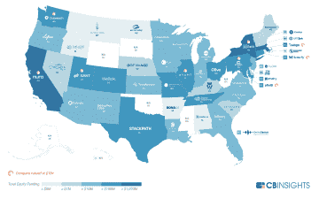

[https://bit.ly/2Q7vTax](https://bit.ly/2Q7vTax)

160 多家人工智能驱动的公司的伟大集合，将在未来彻底改变我们接收、消化和创建媒体的方式。

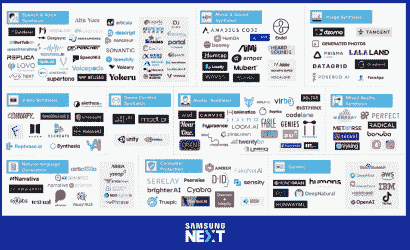

[https://www.linkedin.com/posts/doquang_my-team-and-i-spent-the-last-months-exploring-activity-6698877570852638720-57dA/](https://www.syntheticmedialandscape.com/)

以上都是 AI 技术的惊人成就。我坚信一台有创造力的机器能够与人类合作，赋予我们力量，增强我们的能力，而不是取代我们。我们可以一起创造惊人的东西，达到我们无法达到的水平，否则，单独工作，赌人类的思想。然而，我们应该记住，技术应该用来做好事，因此我们需要有适当的监管，以确保数据隐私和所有技术发展中以人为本的方法

**访问专家视图—** [**订阅 DDI 英特尔**](https://datadriveninvestor.com/ddi-intel)