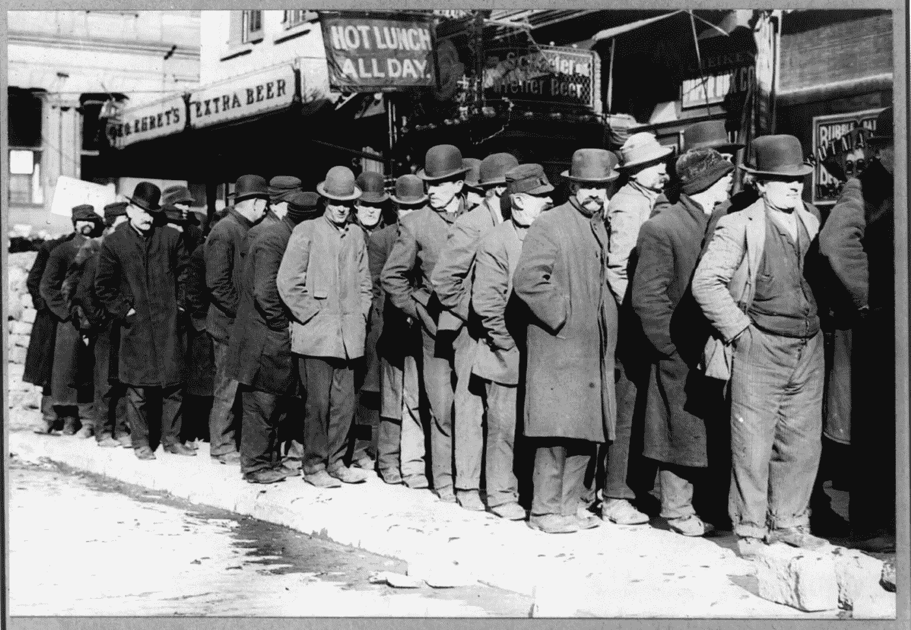
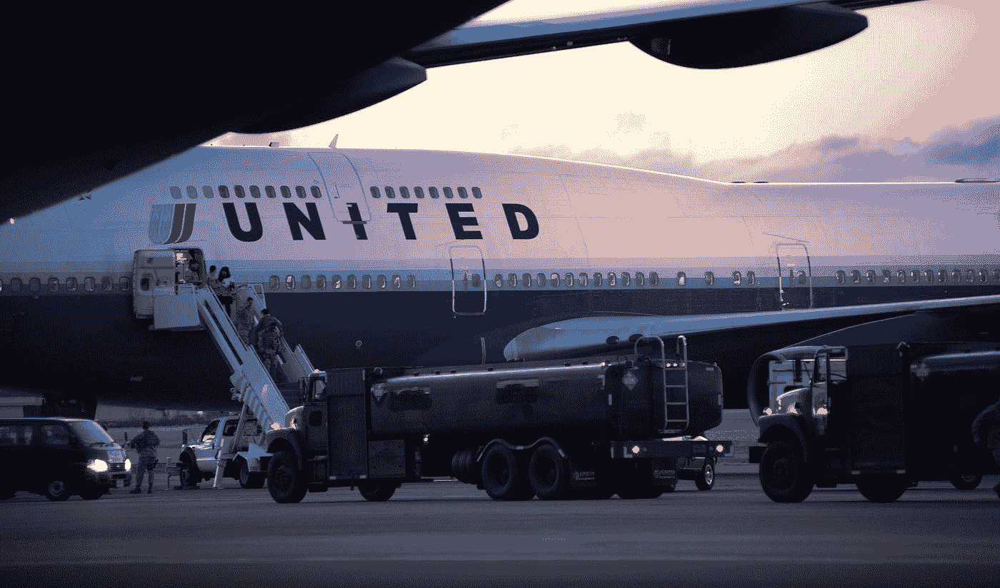

# 疫情时代的创造性破坏

> 原文：<https://medium.datadriveninvestor.com/creative-destruction-in-a-time-of-pandemic-2c42f6fa58fa?source=collection_archive---------12----------------------->

## 约瑟夫·熊彼特的资本主义理论比以往任何时候都更有意义。

正如伟大的奥地利政治经济学家在*资本主义、社会主义和民主*中首次讨论的那样，“创造性破坏”是我们今天所知的资本主义背后的基本驱动力。他 1942 年的书是在一个普遍恐惧和痛苦的时期出版的——第二次世界大战进入第三年，纳粹德国刚刚开始对犹太人的悲惨迫害。虽然二战期间的政治景观与当代政治截然不同，但我们通过一个共同点联系在一起:成千上万美国人迫在眉睫的死亡。

Bread line in New York City during the Great Depression

然而，将 2020 年的美国与 1940 年的美国进行直接比较是幼稚的。首先，特朗普总统于 2020 年 3 月 18 日启动的国防生产法案最初是为了应对朝鲜战争而制定的。二战期间没有这样的立法机构，也不需要。[美国的战争生产是全国范围内的协同努力](https://www.pbs.org/thewar/at_home_war_production.htm)，统一在美国梦的核心信念和富兰克林·德拉诺·罗斯福的强有力领导下。公民被要求定量供应某些商品，工厂被改造成制造相关机械。纠纷确实出现了，比如罢工，但是国会通过了[战争劳工纠纷法案](https://en.wikipedia.org/wiki/War_Labor_Disputes_Act)来对抗。此外，美国仍在从失业率创历史新高的大萧条中复苏。一旦国家被卷入战争，美国人就迫不及待地渴望为之而战。

 [## 如果资本主义失败了，那么还有什么选择呢？数据驱动的投资者

### 在当前政治领域的修辞之旅中，我们都可以面对面地接触到流行词汇，如…

www.datadriveninvestor.com](https://www.datadriveninvestor.com/2020/03/16/if-capitalism-is-a-failure-then-what-is-the-alternative/) 

时代确实已经改变，这一点从美国对新冠肺炎疫情的反应中可以看出。尽管从预测的死亡人数来看，我们似乎在为类似二战的场景做准备，但我们国家的定位实际上恰恰相反。首先，在经历了十多年的经济繁荣之后，我们进入了疫情。消费者信心达到顶峰，利率如此之低，消费者储蓄处于低谷。截至 2019 年 12 月， [69%的美国人储蓄不足 1000 美元](https://www.fool.com/retirement/2019/12/18/the-percentage-of-americans-with-less-than-1000-in.aspx)。45%的人拥有 0 美元。

**美利坚合众国毫无准备地进入了全球疫情。**

那么，如果你没有存款，并且是 4700 万美国人中可能被解雇的一员，你会怎么做呢？也许熊彼特的经济理论可以给美国工人阶级带来一些启示。

Economist Joseph Schumpeter

约瑟夫·熊彼特和卡尔·马克思非常相似，他们都预言资本主义会崩溃，为社会主义让路。虽然马克思预测这将通过一种大规模起义来实现，但熊彼特预计这将是一种更加渐进的衰落——在这种衰落中，资本主义本身将是自己最大的敌人。这可能正是我们目前正在经历的。

熊彼特的“创造性破坏”理论描述了资本主义的驱动力——新技术和创新迫使现有技术过时。因此，这些旧技术的资源——所使用的土地、劳动力和资本——自然会被市场重新分配。创造性破坏通过更有效地利用这些资源，让经济快速增长。正如艾伦·格林斯潘在他的书《美国的 T2 资本主义》中所讨论的，创造性破坏使得钢铁生产商在 1867 年至 1901 年间将批发价格降低了 83.5%，导致了一系列进一步的改进:横贯大陆的铁路、更高的建筑等等。随着钢铁厂变得更加有利可图，钢铁工人不可避免地会失业。政府本可以介入阻止这种失业，但它会以牺牲关键创新为代价。

当约瑟夫·熊彼特创立这一理论时，他的世界正处于大萧条和一场几乎波及全球的战争之中。他不可能想象出我们今天所知道的世界。[仅英国航空公司每天就在 JFK 和伦敦希思罗机场之间运营 15 个航班。](https://www.businesstraveller.com/business-travel/2018/07/09/british-airways-jfk-heathrow-route-is-worlds-most-lucrative/)源源不断的数据随时随地都可以获得，一个包裹不到两天就可以从 A 点运到 B 点。这个世界是超连接的，因此，比以往任何时候都更容易受到致命病毒的爆发。

尽管危机时期可能会极大地损害一个国家的士气，但正是在这些时期，最伟大的创新才会出现。《大西洋》 的理查德·弗罗里达说:“危机期间开发的创新产生了创造性破坏的狂风，带来了新技术，改造了现有的产业，催生了全新的产业——启动了新一轮的经济增长。”然而，要让这样的创新发生，我们必须允许完全不受约束的创造性破坏。如果过时的工业仍然碍事并囤积资源，工业就不可能被改造或建立。不幸的是，美国政府抱着一种危险的心态应对这场危机——不惜一切代价拯救美国现有企业。

让我们看看联合航空公司，例如。联合航空并不是最受崇拜的美国公司。该航空公司最近在[的一项客户满意度调查](https://www.chicagotribune.com/business/ct-biz-united-airlines-ranked-last-jd-power-20190529-story.html)中获得了最后一名，考虑到他们如何采用 DMV 方法来提供客户服务，这并不奇怪。三年前，一名医生被强行拖下飞机，不久后，航空公司因疏忽将一只小狗放在头顶的储物箱中而杀死了它。是的，联合航空公司雇佣了近十万名美国人，这些工作对经济当然很重要。然而，通过注入超过 250 亿美元的政府刺激，我们只是奖励经营不善的企业，并积极反对创造性破坏。如果这些公司被放任不管，被迫依靠自己的管理和现金储备来生存，我们会让疫情少两三家航空公司。但幸存下来的航空公司将因其远见和强大的商业实践而获奖。二手飞机将会以低廉的价格随处可得，数以千计的熟练员工将会被雇佣。也许一种新的交通方式会获得牵引力，比如高速铁路。相反，这一切都不会发生，我们将受困于一家由纳税人支撑的劣质航空公司。私有化收益，社会化损失。

United Airlines 747 at [Yokota Air Base, Japan](https://www.yokota.af.mil/News/Photos/igphoto/2000278092/)

在应对全球紧急情况时，从来没有一个‘正确’的答案，事后诸葛亮永远是二选一；然而，我们必须从我们国家的历史中认识到，目前的反应是错误的。创造性破坏使美国获得了自由世界领袖的地位，如果我们阻止它的发生，我们就威胁到了国家的经济优势。