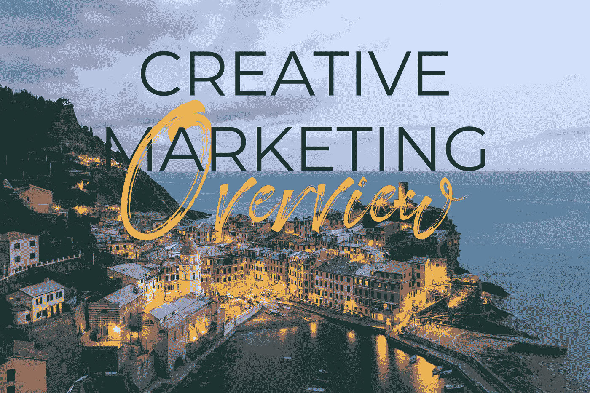
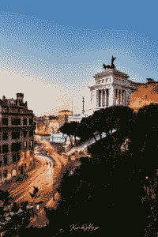
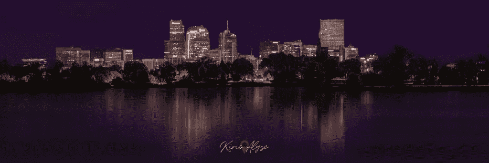

# 创意营销概述

> 原文：<https://medium.datadriveninvestor.com/creative-marketing-overview-4e6f109243b8?source=collection_archive---------19----------------------->

在这个创意营销的概述中，我想为创意行业聊天中的营销讨论打下基础。不要认为这是一个建议专栏，而是今年 9 月潜入社交媒体的前奏，也是收集未来替代营销措施的一种方式。如果你没有使用这些方法，开始思考它们。

# 社会化媒体

**为什么使用社交媒体** 首先，社交媒体是一个免费使用的平台，它通过标签、分享和口碑来利用可发现性。我们大多数人都熟悉大平台:Instagram，脸书，Twitter，作为主要的例子。这些网站因其视觉驱动的帖子结构而特别受欢迎，这种结构促进了参与和分享，从而为主要平台(如 Twitch 和 YouTube 等网站和内容创作网站)带来了流量。此外，也是至关重要的:群组和列表可以跨主要平台使用。团体已被证明是广告和网络的有效手段。我想强调的是，社交媒体是免费的，大多数为你提供即时点赞和转发的平台通常非常昂贵，并且使用数据库营销，所以从定义上来说，它不是有机的。我们将在 9 月份详细讨论这一点:有机受众是参与度最高的受众。

**社交媒体借力**

社交媒体通常是视觉驱动的广告平台，意味着图像和视频为王。

如上所述，hashtag 研究在你的可发现性方面也发挥了重要作用。大多数社交媒体创意新手(如果他们使用元数据的话)使用#photooftheday 这样的主要标签，并祈祷一个主要账户会看到它。然而，如果创意者使用的标签吸引的潜在关注者较少，他们会看到更好的回报。

还有，觉得社交媒体对你没用？坦白地说…你做错了，或者你只是没有找到让它工作的方法。社交媒体已经发展成为一个付费广告的世界，但这并不意味着它在使用时没有效果。

如果你被困在利用社交媒体上，请在[评论社区](http://discord.com/invite/jZu4FV9)中告诉我。我提供免费咨询，不卖任何东西(尽管你可以通过[创意产业倡议](https://www.patreon.com/kinoalyse)来支持这样的内容)。

接下来是市场、画廊和出版物。如果你出售你的创意作品，考虑一下市场。它对产生另一个平台的点击并没有特别的用处:我不建议把市场作为你生意的主要来源。

# 市场和画廊

## **什么是市场？**

市场通常是一个销售你作品的机会和地方。Etsy 是这方面的一个主要例子。一些市场的品牌是排他性的，几乎像俱乐部一样，你需要申请才能开始销售。或者，像 Etsy 这样的市场为所有创意人员提供了一个销售平台。

市场也是社交的机会。如果你花时间去做市场调查，你会发现和你相似类型的其他创意者，并且可能想和他们联系。

关于创收，市场有利于被动收入。有很多全职销售的创意人员确实赚了一大笔钱，但要小心不要把它作为你的主要平台:销售费用可能是毁灭性的，品牌认知度往往很低，所以把你的作品带出平台的可能性很低。

什么是画廊？

画廊是另一种产生被动收入的方式，也是在一个已建立的画廊里利用实物创作在世界各地推销你的作品的方式。通常，他们会举办主题竞赛，由来自 x field 的专家评判并授予每件作品一个在即将到来的画廊中的位置。

听起来好得难以置信？嗯……大多数画廊都有入场费。他们通常用高额现金奖励和潜在销售额(在作品展示时)来吸引创意人员。这并不是说所有的画廊都有奖项。有些只奖励景点和销售。类似的坏消息是:大多数画廊希望你自费把你的作品寄给他们，包括运费。这意味着，如果你决定将画廊作为一个主要的营销平台，你需要考虑进行实地盘点。

# 发布您的作品

出版、画廊和市场经常是携手并进的，但我想强调通过文学来源出版，如在线杂志。我已经创建了一个又一个的电子表格，很快就可以在[的出版商网站](http://www.patreon.com/kinoalyse)上看到，包括他们的联系方式，以及他们想要什么。我们还将讨论如何在流上自己做研究。

出版不仅是一个主要的网络*和*产生一个有机的观众，而且很多出版机会支付你的提交。通常，这些提交想要一篇文章。有时候他们想要的只是你的作品和说明。无论哪种方式，在你的创意领域为出版商做研究，并从今天开始写作:出版商可能是任何创意职业的最佳第三方资产。

# 建立一个网站

建立一个网站是有点疯狂，但我有你！网站对创意营销很重要，因为它们包含了上述平台的优势，同时也提供了其他好处。免费网站建设和托管网站的存在，往往是为了换取你的网站上的水印。

在建立一个网站之前，我建议花一个下午的时间对你的品牌和社会资本进行头脑风暴。在[创意产业 Twitch](https://www.twitch.tv/kinoalyse) 频道上有一些例子。当你需要的时候，创意社区也为个人咨询而存在，所以把你的关注抛到评论社区来和我联系。

## 搜索引擎优化

网站提供社交媒体平台、群组、评论、分享、市场、出版和画廊展示，所有这些都在 SEO 优化的保护伞下。SEO optimization 代表“搜索引擎优化”，它可以归结为 web 上的整体可发现性。此外，可以认为社交媒体通过个人资料和元数据提供 SEO。

## 博客

网站的另一个优势包括博客。博客让你的网站在搜索引擎上保持新鲜和流行，但它们也赋予网站可信度。当你考虑自己在创意行业的未来时，可信度应该是你品牌建设的首要考虑因素。我们倾向于认为名声是某个随机的名人转发我们的消息，而忘记了可信度通常是人们听我们说话的原因。建立信誉，保持你的网站新鲜，并通过利用博客保持在互联网食物链的顶端。

营销从社会资本和了解你的品牌开始。在发起付费营销活动之前，请考虑这两个关键因素。如果你还没有这些，今天就开始把你的创意作品放到社交媒体上吧。发个帖子。去看看我的帖子，复制我，idgaf:开始把你自己放在那里。:3 我们将在 9 月讨论如何聚集一批积极参与的观众。

讨论社会资本、媒体工具包，以及如何通过我的[创意产业 Twitch 频道](https://www.twitch.tv/kinoalyse)撰写潜在的合作关系和赞助商。在我的任何一个 [Kino Alyse Limited](https://kinoalyse.carrd.co/) 平台上给我发 DM，我会帮你制作你的图表！

日期如下:

**8 月 11 日星期二:**
创意营销概述

**8 月 18 日星期二:**
社会资本与媒体工具包

**8 月 25 日星期二:**
如何写潜在关联公司和赞助商

## 可靠性

最后一点:可信度是为你的受众提供价值的最自然的方式。成功和名气来自于信誉。是的，开始把你的工作放在外面，但是考虑一下你和你的品牌所提供的价值。如果你什么都想不出来，暂停一下，给我写:你和你的工作都有价值。有时候很难发现，我不想让你气馁。我们在一起。

把这些记在心里。我有一个原则:如果花在我身上的时间少于五分钟，就立刻做。现在就去发个社交媒体帖子吧。开始推销自己。考虑你能给别人什么价值。想想你的品牌和社会资本，如果你还停留在这些方面，好消息！社会资本是下周的主题。

下周:社会资本。

[创意产业抽动](https://www.twitch.tv/kinoalyse) | [推特](http://www.twitter.com/kinoalyse) | [Instagram](http://www.instagram.com/kinoalyse) | [脸书](http://www.facebook.com/kinoalyse) | [创意产业资源](http://www.patreon.com/kinoalyse) | [创意产业聊天](https://discord.com/invite/jZu4FV9)

