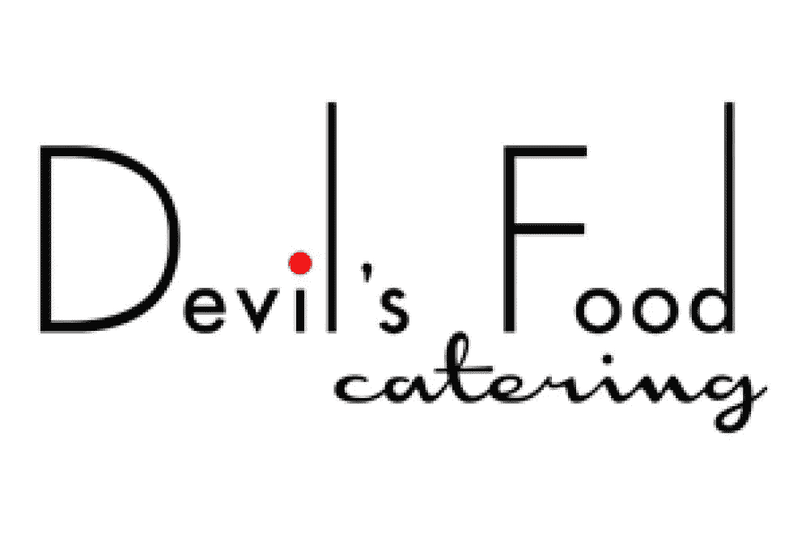
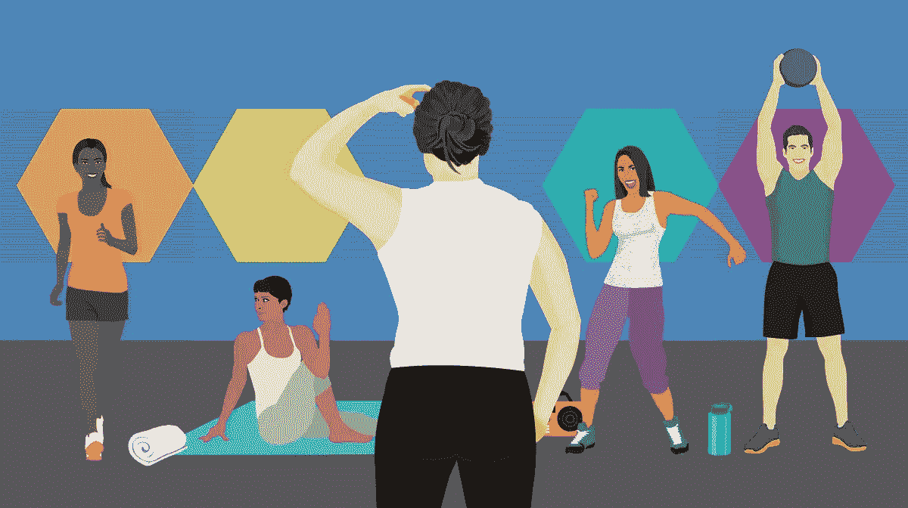
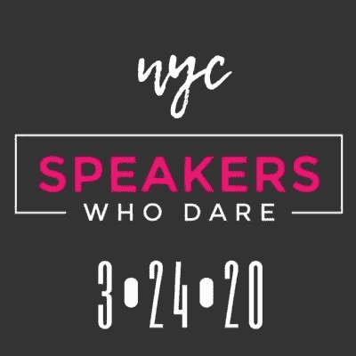

# 创造性或反应性:你现在是哪一种？

> 原文：<https://medium.datadriveninvestor.com/creative-or-reactive-which-one-are-you-right-now-2c7de2e29059?source=collection_archive---------15----------------------->

Photo by ["My Life Through A Lens"](https://unsplash.com/@bamagal?utm_source=medium&utm_medium=referral) on [Unsplash](https://unsplash.com?utm_source=medium&utm_medium=referral)

> 创造性和反应性
> 
> 相同的字母。
> 
> 顺序不同。
> 
> 截然不同的结果。

## 这是个奇怪的时代。

源源不断的新闻和更新向我们涌来，警告我们关注新冠肺炎，股市下跌，失业率上升，以及数百万个人和家庭面临的金融危机。

另一方面，我们也每天收到公司的通知，告诉我们面对所有这些新闻他们在做什么，在家工作和保持心理健康的提示，以及鼓励以新的方式支持我们的朋友、家人、邻居和陌生人。

我们应该害怕还是坚忍？孤立还是联系？囤积还是分享？

## 无论你选择什么(这是你的选择)，我鼓励你也要有创造力。

我并不是说以大写字母 C 的方式进行创作，从事绘画、雕塑、作曲或任何其他我们通常与美术相关的活动。

我说的是冷静地评估你的情况，清楚地认识到需要改变的限制，然后探索你可以创造的“新常态”。

## 这就是创新者所做的，而你，是的，你就是创新者。

创新者知道，创造力在约束中茁壮成长。如果一切皆有可能，一切都是允许的，你想做什么都可以！但世界并不是这样的。现在不行，新冠肺炎之前也不行。

我们，人和企业，总是面临着约束，因为我们从来没有无限的资源、金钱或时间。但是我们承认了这些限制，并在其中创造。这就是我们现在要做的。

 [## 人工智能与创造力:梦想成真|数据驱动的投资者

### 人工智能总是让我着迷。不仅作为一套有用的工具，不断发展，而且作为一个…

www.datadriveninvestor.com](https://www.datadriveninvestor.com/2019/01/28/ai-creativity-deep-dream-comes-true/) 

是的，有些人会比其他人容易。但我相信每个人和每个企业都有可能创造和创新。因为我们以前做过，不管我们是否意识到。

# 以下是一些灵感:

## **商家**

[**魔鬼餐**](https://devilsfoodcatering.com/) **:从活动承办商到提供外卖的财团**

宴会承办人必须在活动开始前预订食物，所以当活动取消时，宴会承办人会剩下很多他们已经支付的食物，而没有活动收入来支付他们的成本。

波特兰的魔鬼食品餐饮公司也面临这种情况。他们没有浪费食物或试图自己成为外卖店，而是通过与波特兰地区的其他餐馆、啤酒厂、酿酒厂、面包店和其他供应商合作，创建了[手提篮](https://devilsfoodcatering.com/handbasket/)，以“在这个社交距离期间创造优质的家庭用餐体验的手工菜单”

[**健身房、健身工作室、私人教练**](https://www.bostonmagazine.com/health/2020/03/16/virtual-fitness-classes-boston/) **:从面对面到在线社区**

有些人天生就有锻炼的动力，而我们中的一些人，嗯，却没有。

面授课程和个人培训通常是我们所依赖的解决方案，因为我们感觉与我们的导师、培训师和同学有一种联系。随着健身房关闭，社交距离成为一种生活方式，失去现场锻炼会加深我们的孤独感。

认识到这一点，全国各城市的当地健身房、工作室和私人教练都在提供直播课程，这样我们就可以在自己舒适的家中继续保持联系、健康和活跃。

附:上面的链接是针对波士顿地区的，但是我在费城、华盛顿、休斯顿甚至怀俄明州也找到了类似的文章

[**敢说话的人**](https://www.speakerswhodare.com/) **:从百老汇事件到直播再到电影**

“spears Who Dare bills as TED meeting 百老汇”，这是一个开创性的演讲系列，像百老汇秀一样制作，以来自世界各地的希望点燃变革和激发新的思维方式的演讲者为特色

计划于 3 月 24 日举行，组织者认识到，像许多其他现场活动一样，他们最初的百老汇现场活动计划需要改变。上周，他们从现场直播转向现场直播，计划用 6 个摄像头拍摄每个演讲者和表演者在空荡荡的剧院里分享他们的信息和艺术。

然后纽约关闭了电影院。几个小时后，组织者再次转移话题，要求每个演讲者录制一部“迷你电影”，可以一起编辑，以创建“一个成熟的敢于拍摄的演讲者”，与全球观众分享，在最初的活动日期一起观看。

## 人

当你不能(或不想)参加视频会议时，去看你的同事

当你已经玩过你买的所有游戏时，自制游戏

当你真的需要在自己家外面与人互动时，更多的自制游戏

# 今天你将如何创造和创造什么？

万一你需要一点鼓励… [找到完美的 gif](https://pudding.cool/2020/03/gifs/michael-scott.html) 由完美的名人主演，表达完美的情感，并把它发送给需要它的人

感谢[凯特·迪克森](https://katedixon.org/)和[梅根·谢伊](https://www.linkedin.com/in/meganfshea/)提出他们的建议

如果您喜欢这篇文章，请与朋友分享，单击👏很多次，跟着我在媒体上。

如果你想了解更多我在创新上阅读和喜欢的内容，请在 LinkedIn 上关注我。

要了解我如何与企业创新者合作，超越理论和戏剧，创造持久的变化和切实的商业成果，请访问我的网站 [MileZero](http://www.milezero.io/) 。