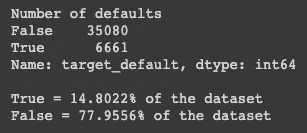
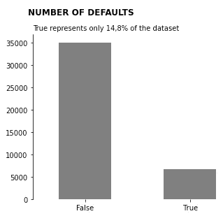
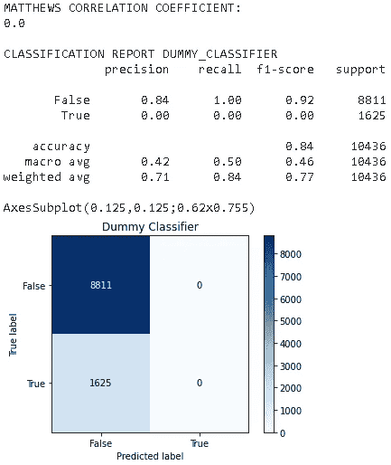
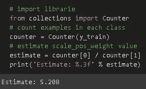
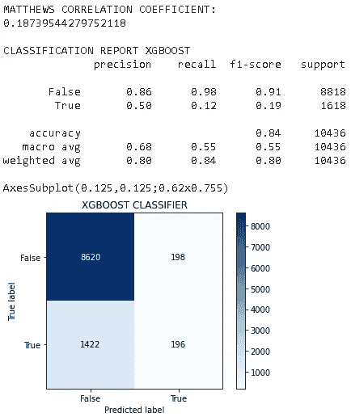

# 信用风险评估

> 原文：<https://medium.datadriveninvestor.com/credit-risk-assessment-4e34a92441bc?source=collection_archive---------3----------------------->

[image](https://bit.ly/3c6gIXL)

*   *这是来自* [*DSNP(数据科学 na Pratica)课程*](https://sigmoidal.ai/curso-online-data-science-na-pratica/) *导师* [*卡洛斯·梅洛*](https://www.linkedin.com/in/carlosfab/) 的项目
*   在 [my Github](https://bit.ly/36sBhwj) 中查看完整项目

如何不支付你的信用卡，贷款…在金融机构？

嗯，如果你不偿还金融机构的债务，这就是你所能期待的:

*   支付滞纳金，
*   获得更高的利率，以及
*   招致损害你的信用评分。

因此，如果有一个领域让银行和整体金融机构更加头疼，那就是它们客户投资组合的违约率。

评估客户或未来客户是否会无法履行其财务义务极其重要，并且会对机构的资产负债表产生重大影响。越来越多的解决方案正在被开发和改进，以最大限度地降低*违约*的风险。

 [## 数据科学和软件工程哪个更有前途？数据驱动的投资者

### 大约一个月前，当我坐在咖啡馆里为一个客户开发网站时，我发现了这个女人…

www.datadriveninvestor.com](https://www.datadriveninvestor.com/2019/01/23/which-is-more-promising-data-science-or-software-engineering/) 

在金融领域，违约是指未能履行贷款的法律义务(或条件)，例如，购房者未能支付抵押贷款。通常，不遵守付款条件的主要原因是客户的财务能力不足。

大银行、金融机构和金融科技越来越多地使用机器学习解决方案来避免或尽量减少*违约*。

在巴西， [Nubank](https://nubank.com.br/sobre-nos) 是最大的金融科技公司之一，在使用*人工智能*和*数据科学*团队方面表现突出。

这个*数据科学*项目中使用的数据集是初创公司 [Nubank](https://nubank.com.br/sobre-nos) 举办的一场竞赛的一部分，旨在揭示 Fintech 的人才和潜在招聘。

# 商业问题

在这个问题中，目标是预测一个新成立的 Nubank 客户不履行其财务义务和无法支付其信用卡账单的可能性有多大。

值得一提的是，这种评估必须在客户要求办卡的那一刻进行(通常是在第一次与机构接触时)。

G***OAL:****创建一个*机器学习*算法，提供客户违约的可能性。*

# **关于数据**

本项目使用的数据可通过[此链接](http://dl.dropboxusercontent.com/s/xn2a4kzf0zer0xu/acquisition_train.csv?dl=0)下载。它由一个包含 45，000 个条目和 43 列的 ***CSV*** 文件组成。

## 数据汇总

*   我们有两个变量叫做目标: ***目标 _ 默认*** 和 ***目标 _ 欺诈。*** 嗯，一开始，我们可以认为 target_fraud 是我们的目标变量，但是检查列条目，我们确认 target_default 是我们的变量 target。
*   一些列，如***last _ amount _ lowed，ok_since，external _ data _ provider _ credit _ checks _ last _ 2 _ year，last _ lowed _ in _ months***，具有超过 50%的缺失数据，并且具有更多缺失数据的列具有大约 97%的缺失数据: ***target_fraud。***
*   我们把两个变量 ***score_1*** 和 ***score_2*** 作为对象，其他的分数都是浮动的。

*因为我排除了 target_fraud 列作为我们的目标变量的可能性，所以我检查了 target_default 列，以查看该列的平衡程度，并检查我们有多少个空值。下面你可以看到结果。*

About 8% is missing

# 汇总统计数据

*   risk_rate 似乎在 0 到 1 之间，75%的数据在 0.36 以下，均值在 0.3 左右。
*   external _ data _ provider _ credit _ checks _ last _ 2 _ year 所有条目当不为 null 时为零，不带任何信息。
*   reported_income 有带 **inf** 的条目，可以干扰我们的 ML 模型，所以我们要把 np.inf 改成 np.NaN。
*   考虑到其他值，external _ data _ provider _ email _ seen _ before 有一个奇怪的最小值-999.0。这可能是由于输入错误或处理不当造成的。所以我们要把那个值改成 np.NaN。

# 数据准备

以下是为我们的机器学习算法准备数据的步骤:

*   把我们专栏的 inf 改成 reported _ income，
*   将 external _ data _ provider _ email _ seen _ before 中的-999 改为 NaN，
*   ***下降列 id，target_fraud，external _ data _ provider _ credit _ checks _ last _ 2 _ year and channel，***
*   删除不提供信息或需要更多研究的专栏，
*   删除列 target_default 中的行，即 NaN。

尽管没有关于**特性**的更多信息，但我们假设许多值由于两个因素而为空:

1.  有些项目在填写表单时不是必填的，例如关于客户脸书资料的信息；和
2.  与列[***‘最后 _ 借入金额’，‘最后 _ 借入 _ 月份’，‘n _ 发行’***]的情况一样，没有关于列的观察。

一般来说，对于属于第二种情况的变量， **NaN** 值被替换为 **zero** 。对于数值变量，采用中值，对于分类变量，采用最常见的值。

# 概述

到目前为止，为了建立一个机器学习模型，我做了大量的数据操作，以了解数据集，这是执行的步骤:

**探索性分析:**

*   *数据的第一印象，了解它*
*   *数据帧第一个条目*
*   *形状*
*   *列变量类型*

**仔细看:**

*   *检查缺失值*
*   *汇总统计*
*   *定义了目标变量*

**准备数据:**

*   *删除列和行*
*   *用零和均值填充缺失值*
*   *使用标准化将数据放在同一个标尺上*
*   *标签编码分类变量*
*   *分割训练中的数据并测试*

# 机器学习

在构建或选择模型之前，即 **XGBoost** 模型，让我们构建一个虚拟分类器模型。顾名思义，你可能会问…为什么？

因为 [**哑分类器**](https://scikit-learn.org/stable/modules/generated/sklearn.dummy.DummyClassifier.html) 是使用简单规则进行预测的分类器。这个分类器作为一个简单的基线与其他(真实的)分类器进行比较是很有用的。

*这是我们* ***哑分类器*** *:* 的结果

我使用的一个度量标准称为[马修斯相关系数(MCC)](https://en.wikipedia.org/wiki/Matthews_correlation_coefficient) 在机器学习中用作二进制(两类)分类质量的衡量标准。

在我们的两类分类中，MMC 的范围在-1 和 1 之间，其中最差值= 1，最佳值= +1。

在我们的虚拟分类器模型中，我们的 MMC 是 0(零),即使有 84%的准确率，这也不够好。

让我们记住，真实标签指的是未能履行法律义务的客户，而虚假标签则相反。

因此，我们可以从混淆矩阵中观察到，我们的虚拟分类器没有预测到任何真实标签，这就是为什么在分类报告中，**精度**、**召回**、**f1-得分**的真实标签为零。

我们的模型 84%的准确性并不意味着什么，因为它不能预测真正的标签，这正是我们想要在我们的商业案例中避免的。

## 梯度推进

我决定运行一个**梯度提升**来看看是否可以预测任何`True`标签，因为我们的`**Dummy Classifier**`没有预测任何标签，所以我们也可以使用这个强大的模型作为基线来与`**XGBoost**` **进行比较。**

*这是我们* ***梯度提升分类器*** *:* 的结果

我们的 MMC 是 0.15，比我们的虚拟分类器好很多

查看混淆矩阵，我们可以看到这个强大的模型预测了一些真实的标签。它的准确率高达 84%。

但是看看真实标签的召回。这里的问题是:在所有真正 ***违约*** 的客户中，我们标记了多少？

答案只有大约 0.09 = 9%

对于我们的商业案例，我们希望预测更多正确的标签，以避免违约。

# XGBoost

正如我之前提到的我们将使用 **XGBoost** 来构建或分类模型。 **XGboost** 如其[文档](https://xgboost.readthedocs.io/en/latest/index.html)中所述:

> 是一个优化的分布式梯度增强库，设计成高效的、灵活的和便携的。
> 
> 它在**梯度提升**框架下实现机器学习算法。 **XGBoost** 提供了一个并行树提升(也称为 GBDT，GBM)，以快速准确的方式解决了许多数据科学问题。"

在我开始构建我们的“XGBoost”模型之前，文档中说当我们有不平衡的类时，我们应该使用参数 **scale_pos_weight** ，默认情况下它是 1。要考虑的典型值是:

> **总和(负实例)/总和(正实例)**

经过大量实验后，我发现`scaled_pos_weight`的最佳值是 2.5，这是我们用来调整模型的值。

此外，我调整了模型的**估算器**和**最大深度**

*好了，既然我们有了比较的基线模型，我最终建立了许多参数的调整。*

*这是我们* ***XGBoost 分类器*** *:* 的结果

正如我们从结果中看到的，与其他模型相比，我们的模型具有相同的准确性，但我们改进了 **true** 标签的其他指标，这从我们的业务角度来看非常好。

# 结论

因为我们没有关于数据集的任何解释或文档，所以我们能够创建一个具有高性能的算法。

我们可以看到，仅仅使用准确性作为度量标准会使我们对将要投入生产的模型做出错误的决策。

我们的 ML 模型可以通过拥有更多数据或者使用`[Feature engineering](https://en.wikipedia.org/wiki/Feature_engineering)`来改进。

 [## glauciodrumond -概述

### 在 GitHub 上注册你自己的个人资料，这是托管代码、管理项目和构建软件的最佳地方…

github.com](https://github.com/glauciodrumond) 

[Glaucio Drumond](https://www.linkedin.com/in/glaucio-drumond-1734a018b/)

**资源:**

*   [DSNP(数据科学杂志)](https://sigmoidal.ai/curso-online-data-science-na-pratica/)
*   [机器学习掌握度](https://machinelearningmastery.com/)
*   [博客](http://blog.exsilio.com/)
*   谷歌