# 使用机器学习的信用评分

> 原文：<https://medium.datadriveninvestor.com/credit-score-using-machine-learning-cc1a383808ea?source=collection_archive---------2----------------------->

Score to customer credit system

目标是使用机器学习为客户创建信用评分。该分数给出了客户满足约定付款的信心程度。

分数越高，定义不付款的概率越大。

# 用 Scikit-Learn 实现 Python 中的多元线性回归

我们刚刚在上面的部分执行了涉及两个变量的线性回归。几乎所有你将要遇到的现实世界的问题都会有两个以上的变量。

涉及多个变量的线性回归称为“多元线性回归”或多元线性回归。执行多元线性回归的步骤几乎与简单线性回归的步骤相似。

 [## 金融中的机器学习|数据驱动的投资者

### 在我们讲述一些机器学习金融应用之前，我们先来了解一下什么是机器学习。机器…

www.datadriveninvestor.com](https://www.datadriveninvestor.com/2019/02/08/machine-learning-in-finance/) 

我们将使用客户信息对客户进行“信任”评分。评分公式可以根据每个公司的信用环境进行调整。在本例中，我们将使用客户迟到的平均天数和过去 2 年的平均账单金额来计算结合了这两种信息的分数。

计算分数后，我们将信息提交给具有 Scikit-Learn 的机器学习，以便系统可以根据学习信息预测新的分数。

我们的分数计算公式在[分数计算. xlsx](https://github.com/MRobalinho/ML-Credit_Score) 上有描述

客户信息在 excel 中:[客户 _ 代码。XLSX](https://github.com/MRobalinho/ML-Credit_Score)

# 客户公司信息:

> *客户起始日期*
> 
> *州、地区、邮政编码、销售员、主要 CNAE(巴西的公司分类类型)*
> 
> *最高记账日期*
> 
> *最大计费金额*
> 
> *发票开具的最后日期*
> 
> *最大信用敞口日*
> 
> *最高信用风险*
> 
> *平均历史延误*
> 
> *过去 48 个月的平均收入*
> 
> *逾期应付金额*
> 
> *到期应付金额*
> 
> *客户最后订单日期*
> 
> *该信息的日期*

# Serasa 信息(SERASA 是一家出售其他公司信息的公司)

> *塞拉萨得分*
> 
> *不付款的概率*
> 
> *最后未付款日期*
> 
> *未付单据金额*
> 
> *未付款单据的价值*
> 
> *最后日期空头支票*
> 
> *空头支票金额*
> 
> *最后日期抗议*
> 
> *价值抗议*
> 
> *司法诉讼的最后日期*
> 
> *重视司法行动*
> 
> *逾期债务最后日期*
> 
> *逾期债务价值*

# 获取数据和清理数据的一些 Python 代码:

读取 excel 文件:

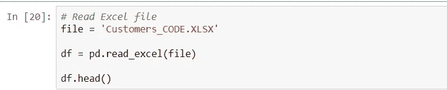

观看读取的信息:

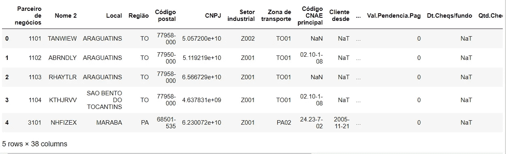

空信息列的分析:

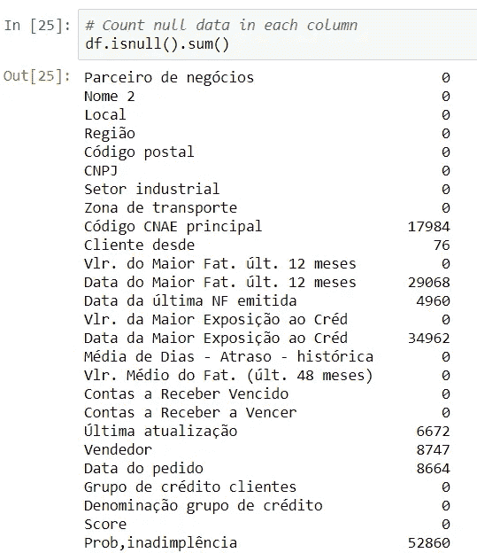

另一种形式可以是，只显示空列:

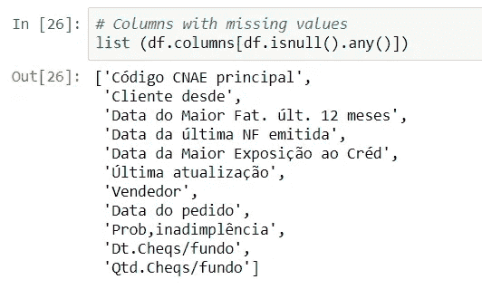

为了获得更好的数据，我们筛选了过去 2 年中至少有一张发票的客户的数据:

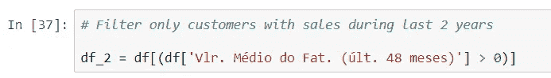

重命名一些列以便更好地识别:

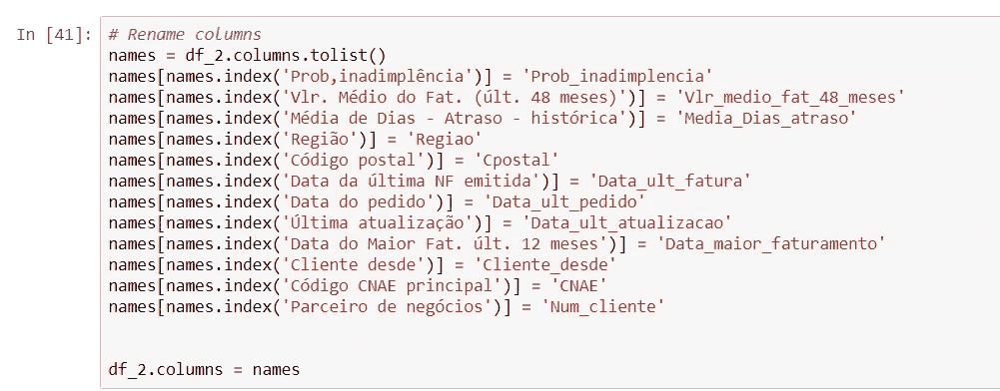

对于包含日期信息的列，我们将数据转换为天数，并将列类型转换为整数。列 Data_ult_atualizacao 具有今天的日期。

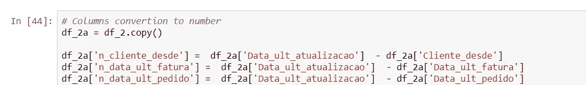

带有邮政编码和 CNAE 的列被转换为数字，并且这些列被更改为整数类型:

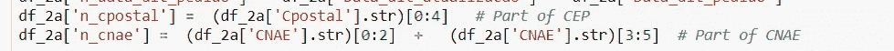

用 0(零)替换 NaN 列:

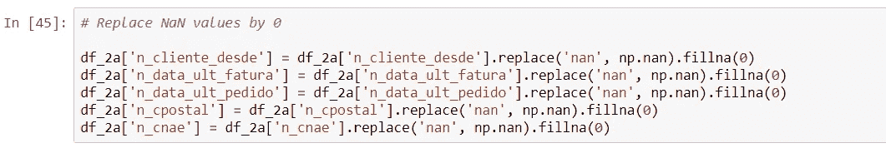

创建包含贵重物品列的部分数据集，以训练:

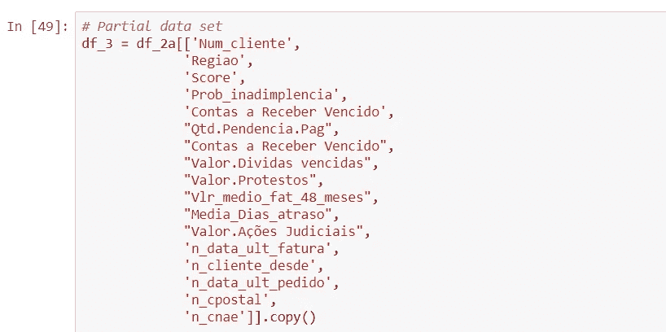

分析复制的数据集:

将天数列转换为浮点型:

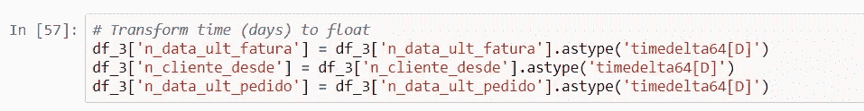

在我们创建一个例程来读取所有记录并使用我的定义计算我的分数(newscore)之后。我有一个 excel 文件，其中包含我的定义，用于计算我的分数(文件:Score calculation.xlsx)

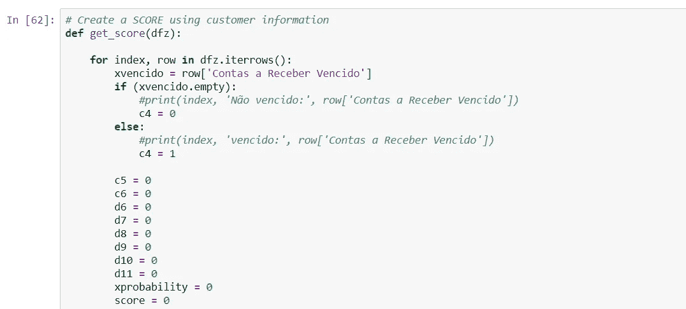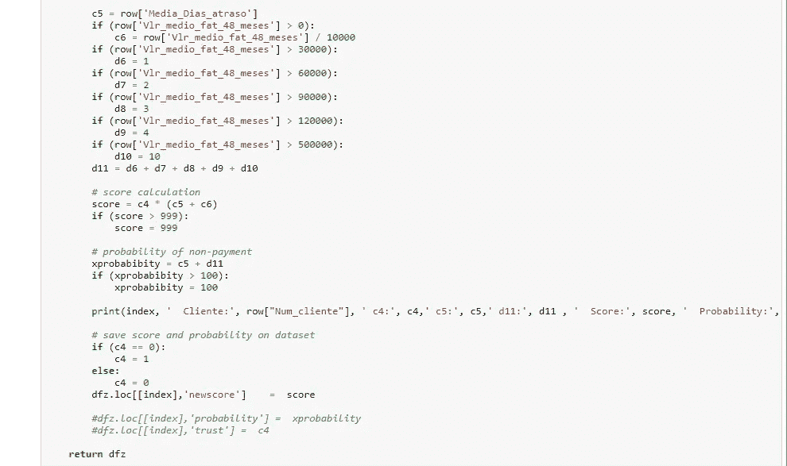

计算分数的一些打印件:

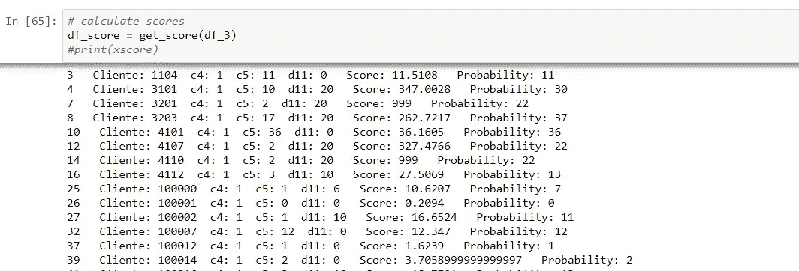

分析相关性时，我们可以观察与它们有更多相关性的列来获得新的分数:

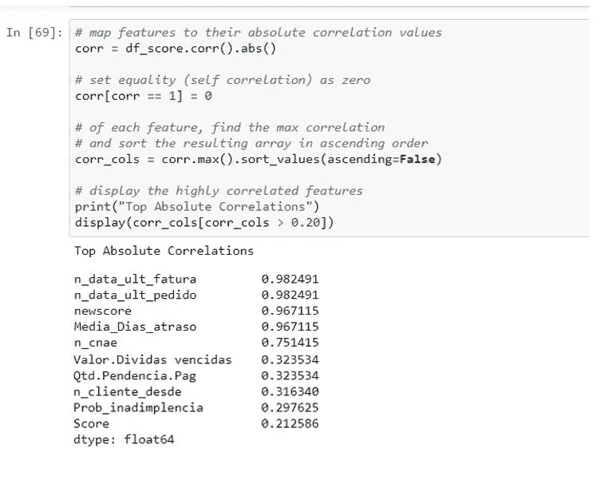

我们可以在一个图形库中观看它们:

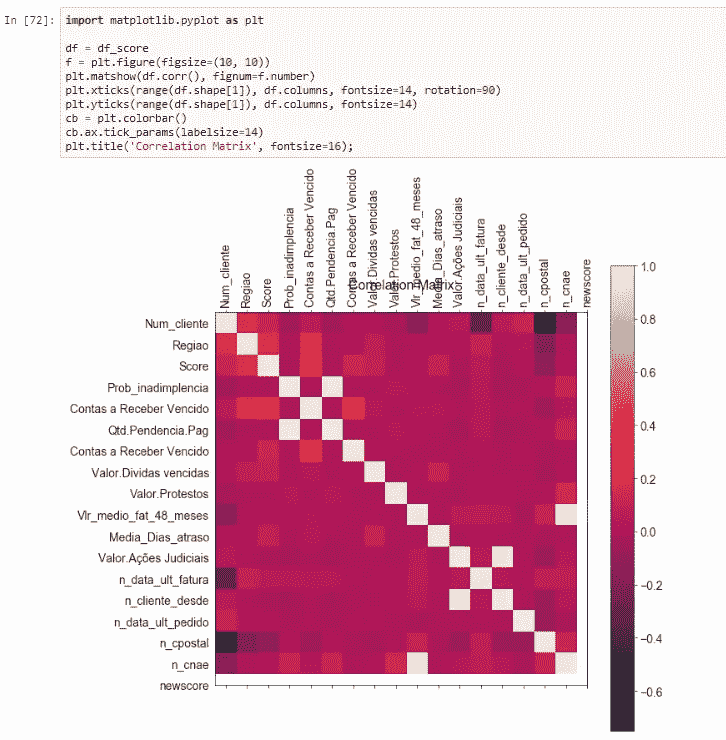

关于我们信息的一些事实，按地区划分的客户。大多数顾客来自同一个地区。

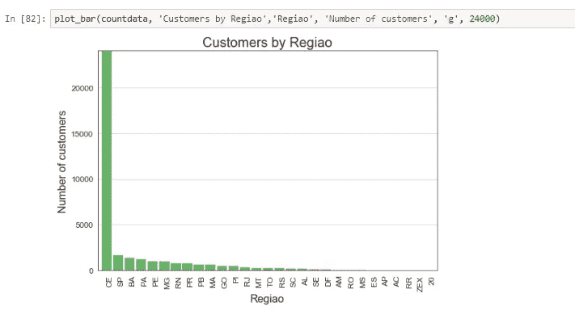

CNAE 提供的数据信息。大多数顾客来自同一个 CNAE。

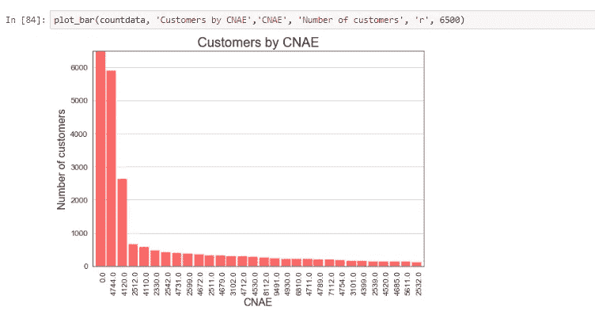

按供应商划分的客户:

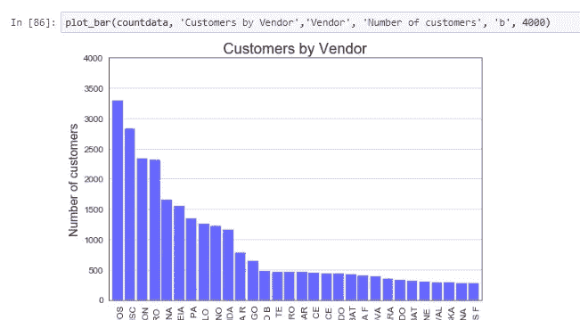

按用于客户交货的运输类型列出的客户信息。我们大部分的 then 都是以‘FO’开头的类型。

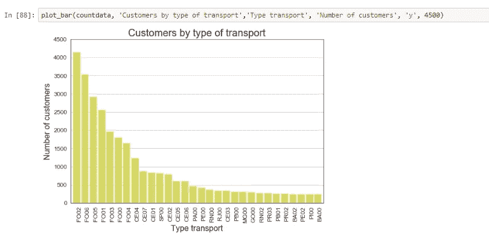

新分数和到期日之间的关系:

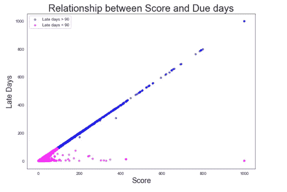

我们需要转换区域中的一个数字:

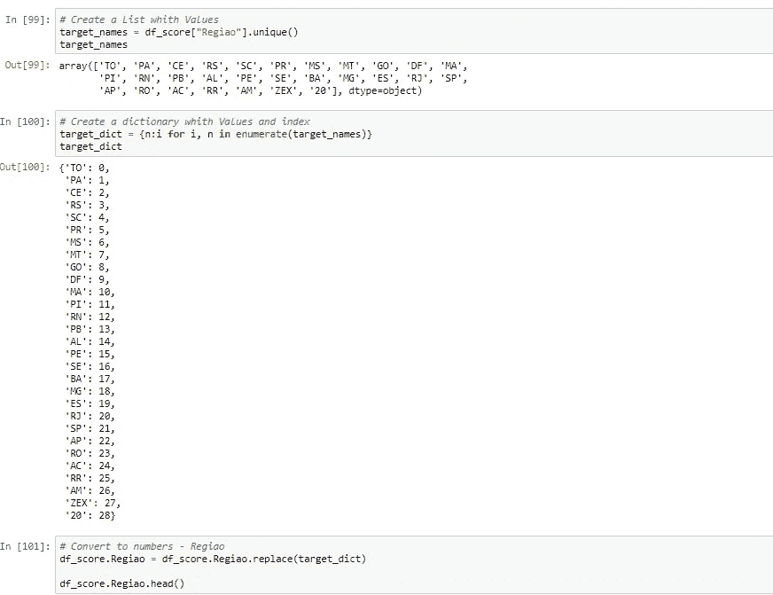

# 现在我们可以用 Keras 建模:

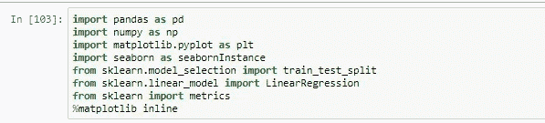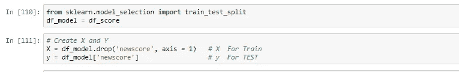

创建训练和测试数据集，80%用于训练，20%用于测试

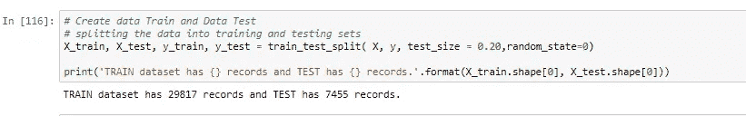

训练模型:

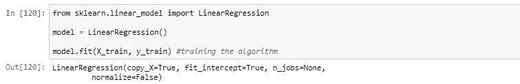

获取截距和斜率值:

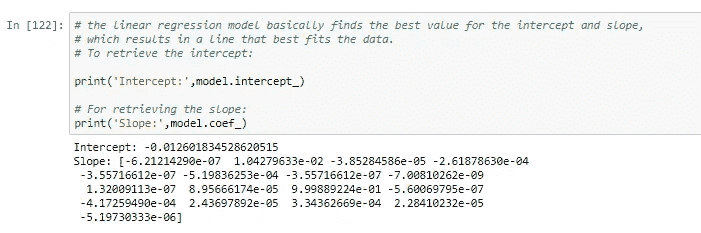

这些值可以以包含更好信息的格式打印出来:

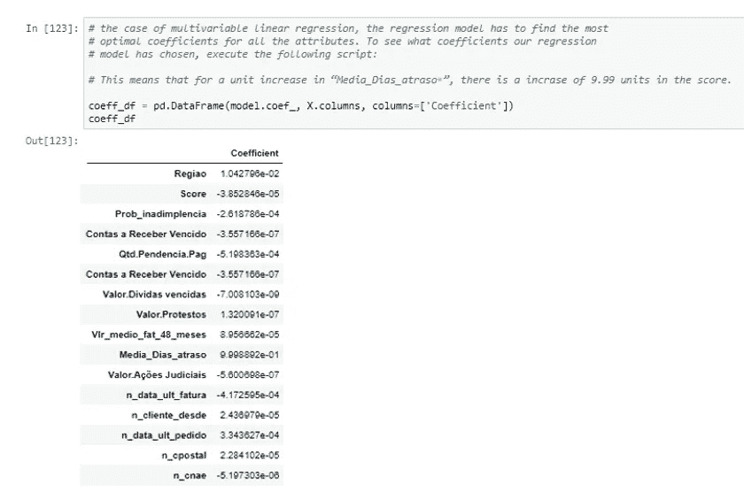

比较训练和测试:

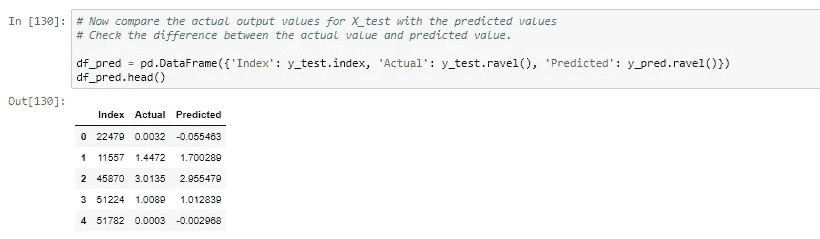

在图形模式下，我们可以比较训练和测试结果:

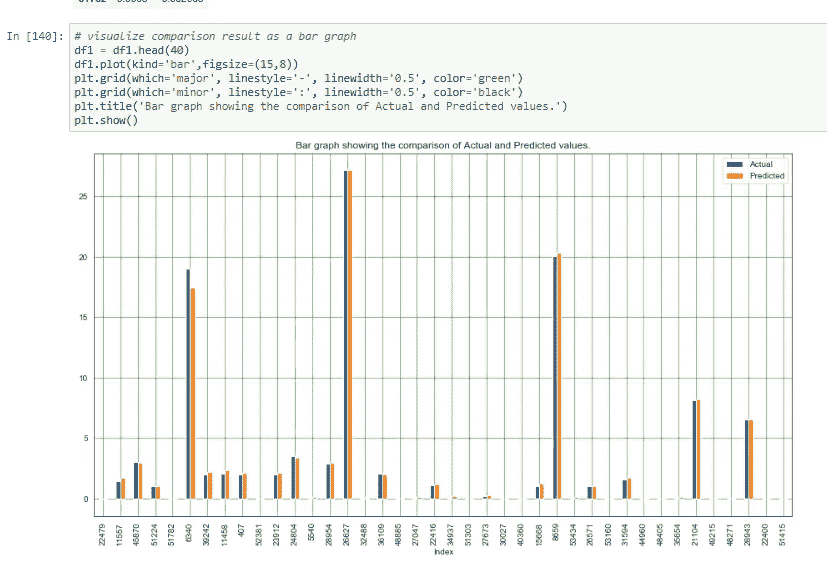

我需要预测一些个人记录，所以，我做了一个函数来预测分数:

跑步预测我的记录:

使用 tkinter python 库，我们可以创建一个具有更好视觉效果的屏幕:

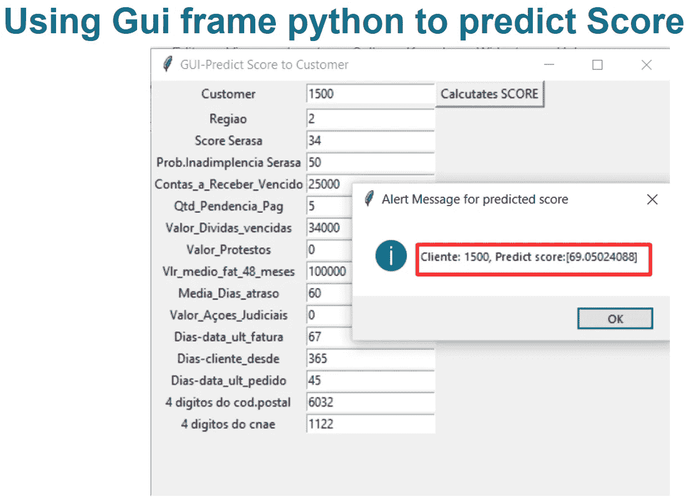

使用客户已知的信息创建分数，可以使信用系统自动化并更加可靠。这种方法有助于更冷静和更可靠的风险分析，仅来自市场数据和信息，从系统中去除了接近客户的标准和谈判可能产生的情绪。

参考资料:

 [## MRobalinho/ML-信用分数

### 使用机器学习来创建客户的信用评分，我们刚刚在上面的部分执行了线性回归…

github.com](https://github.com/MRobalinho/ML-Credit_Score)  [## (教程)使用 PYTHON 中的 TKINTER 介绍 GUI

### 在开始之前，您应该熟悉 Python 来学习 Tkinter。如果您是 Python 的新手，请查看 DataCamp 的…

www.datacamp.com](https://www.datacamp.com/community/tutorials/gui-tkinter-python)  [## Python GUI 示例(Tkinter 教程)-像极客一样

### 学习如何使用 Python Tkinter 包开发 GUI 应用程序，在本教程中，您将学习如何创建…

likegeeks.com](https://likegeeks.com/python-gui-examples-tkinter-tutorial/)  [## Python 机器学习多元回归

### 多元回归类似于线性回归，但有多个独立值，这意味着我们试图预测…

www.w3schools.com](https://www.w3schools.com/python/python_ml_multiple_regression.asp)  [## 使用 Python 进行简单和多元线性回归

### 线性回归是一种对因变量(目标变量)和一个变量之间的关系建模的线性方法

towardsdatascience.com](https://towardsdatascience.com/simple-and-multiple-linear-regression-with-python-c9ab422ec29c)