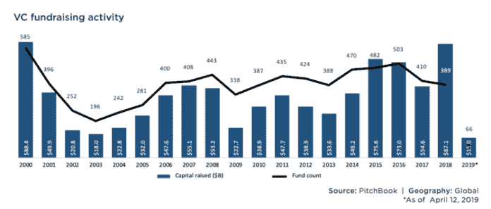
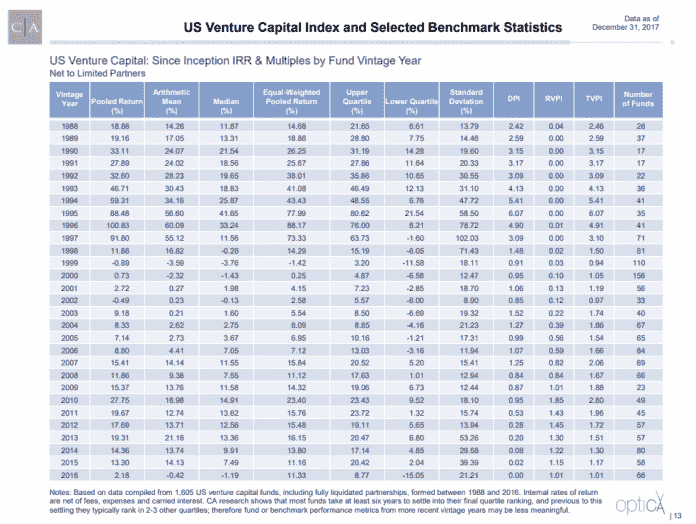
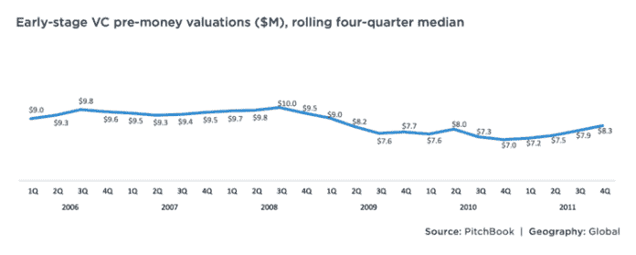

# 危机？风投适应的 3 种方式

> 原文：<https://medium.datadriveninvestor.com/crisis-3-ways-vcs-adapt-cc26e1821026?source=collection_archive---------21----------------------->

当我写这篇文章的时候，一场全球性的危机正在发生。这不是第一次，也不会是最后一次。关于创业公司应该如何在危机中管理自己的文章很多，但很少有人讨论风投如何适应不断变化的时代。这就是这篇文章要做的，关注风投活跃的三个主要领域。

筹资——鉴于一个典型的风险基金的期限为 10 年，它很可能会面临至少一次重大危机。此外，时间跨度也足够长，经济周期的影响在某种程度上是温和的。与对冲基金不同，对冲基金每天都有数十亿元的收益和损失，上市公司每季度都有收益和损失。也就是说，一场真正的危机会导致市场不稳定，进而导致市场瘫痪，有限合伙人的投资往往会更加保守。如下图所示，2002 年和 2009 年是筹集资金特别困难的年份:

因此，在即将到来或实际的低迷时期，优秀的风投会表现得像优秀的企业家一样，更加积极地融资。筹集一笔资金通常需要花费风投公司一半的时间，持续几年——所以这个数字会大幅上升。Samir Kaji 最近有一篇很棒的[文章，专门针对小型基金](https://medium.com/@Samirkaji/micro-vc-fundraising-and-covid-19-3c0bf53a3241)，供那些希望更深入探讨这个话题的人参考。

 [## 在创业之旅中，拥抱学习|数据驱动的投资者

### 好像建立一个数百万美元的公司还不够困难，企业家必须额外照顾他们的…

www.datadriveninvestor.com](https://www.datadriveninvestor.com/2018/10/16/on-the-entrepreneurial-trek-embrace-the-learning/) 

**2)投资组合也就是现有交易**——有些基金的策略只关注初始投资，而不是后续投资。它们通常是规模较小的基金，无法保证在未来几轮中按比例分配，因此，在股本最便宜的时候，尝试在初始投资中实现回报最大化。除了他们之外，大多数风投喜欢投资后续项目，以利用他们投资的成功，因此会通过保持更多的储备来适应危机。这个想法是，包括初创公司在内，每个人的可用资金都会减少，所以手头有现金就更重要了。

找到一家成功的初创公司是你成为一只优秀基金的方法，此后明智的投资组合管理是你成为一只优秀基金的方法。这在经济低迷时期尤其明显。例如，下面的数据显示，截至 2017 年 12 月 31 日，2010 年的基金回报率是过去 20 年来最高的。剑桥联合公司(风投行业标准，不是脸书丑闻中同名公司)的完整报告，对那些希望深入了解的人来说是[在这里](https://www.cambridgeassociates.com/wp-content/uploads/2018/05/WEB-2017-Q4-USVC-Benchmark-Book.pdf)。

**3)采购，也就是渠道，也就是新交易** —问大多数风投，他们会告诉你，经济低迷是一个低价买入的机会，也就是说，他们在继续采购。举例来说，下面的数据显示了 2008 年至 2009 年美国上一次重大危机中前期资金的减少。

也就是说，在严重的危机中，实际交易数量可能会比危机前有所下降。更常见的情况是衍生产品下降，例如，我们不是以每季度 10 笔新交易的速度增长，而是放缓至 5 笔新交易。可以说，很大一部分原因是因为基金最终聚焦于更有经验的团队，以此作为降低风险的指标和/或拥有更大跑道的公司(现金储备、完成更大一轮、更低成本等)。如果你在寻找一只反周期风险基金，就去找那些在该策略上有合法记录的罕见的大型基金。或者更一般地说，那些有较少伙伴的人，也就是说，群体思维倾向于低风险的可能性较低。

*原载于* [*数据驱动投资人*](https://www.datadriveninvestor.com/2020/03/22/crisis-3-ways-vcs-adapt/) *，“我很乐意在其他平台上辛迪加。我是*[*Tau Ventures*](https://www.linkedin.com/pulse/announcing-tau-ventures-amit-garg/)*的管理合伙人和联合创始人，在硅谷工作了 20 年，涉足企业、创业公司和风险投资基金。这些都是专注于实践见解的有目的的短文(我称之为 GL；dr —良好的长度；确实读过)。我的许多文章都在*[*https://www . LinkedIn . com/in/am garg/detail/recent-activity/posts*](https://www.linkedin.com/in/amgarg/detail/recent-activity/posts/)*上，如果它们能让人们对某个话题产生足够的兴趣，从而进行更深入的探讨，我会感到非常兴奋。如果这篇文章有对你有用的见解，请对这篇文章和 Tau Ventures 的 LinkedIn 页面***发表评论和/或给予赞，感谢你对我们工作的支持。这里表达的所有观点都是我自己的。**