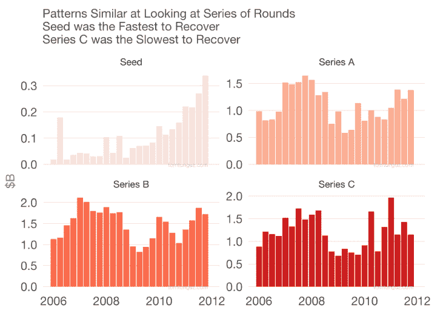

# 危机？创业公司仍然需要种子的 5 个原则

> 原文：<https://medium.datadriveninvestor.com/crisis-5-principles-for-startups-to-still-raise-seed-8b305b1525d?source=collection_archive---------26----------------------->

*这是系列的第二部，第一部是* [*危机？风投适应*](https://www.linkedin.com/pulse/crisis-3-ways-vcs-adapt-amit-garg/) *的 3 种方式。*

当我写这篇文章的时候，一场全球性的危机正在发生。这不是第一次，也不会是最后一次。全球企业家都感受到了影响，在美国，这种影响尤其在过去两周有所加剧。种子期尤其充满风险，因为它们通常是机构资本的首次注入，而初创公司没有任何收入。那么，在非常具有挑战性的时期，你应该如何着手筹集通常具有挑战性的资金呢？关于这个话题已经写了很多，这篇文章主要关注四个非常可行的要点。

 [## 金融科技初创公司正在颠覆全球银行业|数据驱动的投资者

### 传统的实体银行从未真正从金融危机后遭受的重大挫折中恢复过来…

www.datadriveninvestor.com](https://www.datadriveninvestor.com/2018/10/20/fintech-startups-are-disrupting-the-banking-industry-around-the-world/) 

**1)关怀法案** —如果你在美国的 covid 危机期间阅读这篇文章，那么你绝对应该看看最近通过的立法。CARES 提供高达工资 2.5 倍的贷款，这通常是可以原谅的，只要你留住员工，并且在关键的 8 周期间不减薪。对于 seed 来说，这基本上是几个月的免费工资。Venable 和 Fenwick West 是两家著名的律师事务所，他们在这个问题上的文章特别有用。

**2)减少浪费**——创业公司很少会考虑所有的选择，以下是一些可以考虑的主要方式:

*   降薪
*   延期支付工资
*   用工资换股权
*   暂时休假(给雇员发工资，给他们健康福利，但短期内不发工资)
*   裁员即你的雇员有资格领取失业救济金，你也有资格获得政府援助
*   让合作伙伴/投资者延期付款
*   让合作伙伴/投资者提供实物服务

获得更多的现金——也有无数种适应的方法，至少有一种方法适用于你的情况:

*   举债，如果你没有收入，这将特别困难，但如果你有其他抵押品(如资产)，这是可能的
*   筹集更多资金(稍后将详细介绍)
*   销售或许可知识产权
*   做有短期收入的项目(通常这些也是非经常性的，如 NRE)

**4)筹集更多** —在正常筹款深受影响的情况下，建议筹集更大的一轮，真是讽刺。但追求反周期策略实际上是明智之举，尤其是如果它能扩大潜在投资者群体的话。比方说，你最初的计划是筹集 1000 万美元 2M，而且主要来自小型基金或天使投资。现在，你可以改变计划，转而筹集 300 万美元，这将为寻求为更多所有权配置更多资本的更大规模基金打开大门。你如何将过早获得大型基金的负面影响最小化，比如说它们没有引领下一轮(被称为信号效应)？一种方法是实际创建董事会，并让基金占据一席之地，这意味着他们将有更强的理由与你保持密切联系。

**5)保持信念**——创办一家初创公司已经够难的了，在危机时期试图让它起飞就更难了。并非所有优秀的团队都能成功，但那些成功的团队会获得不成比例的成功。例如，2001 年的危机在 Paypal 中产生了一种生存心态，并允许谷歌招募如此大量的人才——这两家公司都成为了游戏规则的改变者。如果这是一个安慰的话，有证据表明种子阶段也是恢复最快的阶段，正如汤姆·东格斯的[伟大分析所显示的](https://tomtunguz.com/analogy-coronavirus-2008-crash/)。

*这篇文章的灵感来自与 Pete Moran 的一次对话。原载于“* [*”数据驱动投资人*](https://www.datadriveninvestor.com/2020/03/29/the-sharpe-ratio-paradox-why-still-invest-in-venture-capital/) *，“我很乐意在其他平台上辛迪加。我是*[*Tau Ventures*](https://www.linkedin.com/pulse/announcing-tau-ventures-amit-garg/)*的管理合伙人和联合创始人，在硅谷工作了 20 年，涉足企业、创业公司和风险投资基金。这些都是专注于实践见解的有目的的短文(我称之为 GL；dr —良好的长度；确实读过)。我的许多文章都在*[*https://www . LinkedIn . com/in/am garg/detail/recent-activity/posts*](https://www.linkedin.com/in/amgarg/detail/recent-activity/posts/)*上，如果它们能让人们对某个话题产生足够的兴趣，从而进行更深入的探讨，我会感到非常兴奋。如果这篇文章有对你有用的见解，请在 Tau Ventures 的 LinkedIn 页面* *上对这篇文章和* [*给予评论和/或赞，感谢你对我们工作的支持。这里表达的所有观点都是我自己的。*](https://www.linkedin.com/company/tauventures)