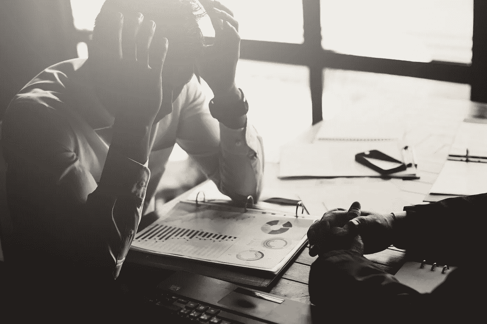

# 从两个失败的企业中吸取的重要教训——以及如何避免它们

> 原文：<https://medium.datadriveninvestor.com/critical-lessons-learned-from-two-failed-businesses-and-how-you-can-avoid-them-5ec54cd1b5d2?source=collection_archive---------13----------------------->

## 如果你愿意接受失败，失败会是你最好的老师

Licensed through [Adobe Stock](http://www.adobestock.com)

在生意失败后不久的某个时间点，我们中的许多人都会经历一次情绪的起伏。你开始觉得自己像个…

失败者。

失败。

没人。

可耻的人。

简而言之，糟透了。

你从这个伟大的商业想法开始，投入所有的时间、精力和资源。

另一方面，你得到的只是一次失败的尝试，一个受伤的自尊和一船的债务。

至少对我来说是这样。

在我 20 出头的时候，我有两个很好的商业机会，我都抓住了。一家是批发企业，向杂货店分销产品。另一个是经营一家无线商店，我在那里向消费者和企业出售手机。两家公司都有可能非常有利可图，所以我不能拒绝。

那时候，我很想赚钱。我想成为受人尊敬的人。不需要向老板汇报的人。就像有些人描述他们的美国梦一样；这是我的美国梦。

 [## 在创业之旅中，拥抱学习|数据驱动的投资者

### 好像建立一个数百万美元的公司还不够困难，企业家必须额外照顾他们的…

www.datadriveninvestor.com](https://www.datadriveninvestor.com/2018/10/16/on-the-entrepreneurial-trek-embrace-the-learning/) 

最重要的时刻是我第一次销售的时候。我仍然能闻到那天芝加哥温暖的空气，感受到我内心的感受。钱的交换是最好的部分。那是我的钱——我反复梦见的时刻。

开辟自己的道路感觉真好。然后是第二次出售，事情从那里开始滚动。

缓慢但坚定地，我正在把公司建设成我引以为豪的东西。我可以发展成一个帝国。

这种伟大的感觉持续了相当长的时间。但是渐渐地，舒适开始出现，事情开始变得糟糕。

简而言之，两家企业都失败了，而且失败得很快(各在两年内)。

这是我人生中最低谷的时刻之一。我记得我卖掉了货车，上交了我店面的钥匙。感觉就像是我在走耻辱之路。

在过去的 15 年里，我每天都在思考这些失败。它麻痹了我，让我认为我再也不会经营其他企业了。太糟糕了，我从来没有真正分享过。如果有人问，我会迅速改变话题。

但是我们在这里。

我读了下面这段话，它让我思考:

> **“成功就是从一次失败走向另一次失败，而不丧失热情。”**
> 
> **——温斯顿·丘吉尔**

如果有什么时候能让我一吐为快，那就是现在。目标是启发或教会你在经营企业时不要做什么。

所以我们开始吧，不分先后…

## 你必须理解承诺

经营企业需要全身心投入。即使我在努力(或者认为我在努力)，我也没有完全投入。我把这件事当作一份快餐工作——我来上班，打卡。

有时候我感到累了，或者我不得不去见一些朋友；我会早点结束。这让我损失了宝贵的销售额，随着时间的推移，导致了亏损。

如果你正在进入一个行业或者拥有一个企业——全力以赴！

我是真心的。不要让它成为一个副业、骗局，或者其他现在所谓的东西。这是你的事，所以认真对待它。

你是否承诺尽一切努力让这项业务运转起来？深夜、业务费用、忙碌和流动。

如果你不是，你需要重新评估前进。很大一部分小企业很快就倒闭了——不要成为统计数据。

> 天才是百分之一的灵感加上百分之九十九的汗水
> 
> ***-* 爱迪生**

## 营运资本是一个东西

我没有足够的资金来创业。当我开始的时候，我忽略了我会有商业支出，比如库存、汽油、车辆、仓储和一系列其他伴随商业而来的东西。除此之外，我还有个人开销。

在创业之前，我有一份体面的工作，习惯了一种特殊的生活方式。嗯，我一直保持着这种生活方式。不幸的是，这大大地消耗了我的利润。即使公司在成长，我也应该在个人方面更严格。

你需要掌握你的财务状况，不仅是在开始的时候，而且是在整个商业生涯中。就当没得商量。你不想在六个月内意识到你缺少资金来维持下去，或者更糟，把食物放在桌子上。

正如一句名言所说——没有计划就是计划失败。

当今网络世界的美妙之处在于，你可以用最少的投资做到这一点。在世界历史上，这是实现这一目标的最佳时机。

不管怎样，如果你打算辞职来启动这个项目，那就存点钱吧。即使你的启动成本很小，你也要确保你能把你的利润再投资到生意中。

## 一天比一天好

我有几天生意不错，但没意识到我不是镇上唯一的牛仔。还有其他人(相同业务类型)做得更好、更聪明。我意识到这一点时已经太晚了。我的愿景是模仿其他企业过去的做法，但我对未来视而不见，没有适应市场。

这不是朝九晚五，你只是在打卡。这是你的创造。你有竞争对手，你有客户要满足。如果你没有一天比一天好，你的生意就要完蛋了，或者更糟，被宰了。

你想要证据？看看网上所有废弃的博客。它们一毛钱一打。这让我很难过，因为他们中的一些人有一些容易记住的域名，这些域名将会被浪费掉。例如，我在看一个域名:

Nutrition.com 艺术——过期。

邪恶的 Nutrition.com——断气了。

这些博客主没能变得更好，没能适应时代。见鬼，我敢打赌他们中的大多数甚至没有开始。

如果你想成功，专注于每天进步 1%。这要求并不多，但当你这样做一年或五年，这可以导致指数增长。

## 学会接受起起落落

高点对我来说很高，但低点很低。对我来说这是一次太情绪化的旅程。如果我过了糟糕的一天，它就会变成糟糕的一夜。当这种情况发生时，我会和朋友一起喝一晚上的酒。那一刻，聚会把一切都清理了，没有意识到我成了自己最大的敌人。

我只是在情感上不够成熟。我也不知道不是每一天都是完美的。你看到所有这些成功的企业，你会认为它们一帆风顺。我认为任何企业都不会出现这种情况。这是一次可以带你走向不同方向的旅程。你需要适应并随着市场的变化而变化。

我可以在这里举一个很好的例子，就是在媒体上写作。有些日子你会得到大量的浏览量，但有些日子你什么也得不到。这些天你每隔几分钟就查看你的统计数据，怀疑人们是否在阅读你的东西。

在某些时候，你会问自己，“我适合做这个吗？”

直到两天后你的观点又跳回来，意识到你什么都没担心。

记住，这是一段旅程。我能给出的最好的建议是，在前进的道路上寻找稳定的进步，不要让向下的斜坡将你拉离正轨。

> 失败和成功之间的界限如此微妙，以至于我们经常处于危险之中而不自知
> 
> **—阿尔伯特·哈伯德**

## 你不知道你离成功有多近

事实是，我在无线行业的最后一天是我最好的一天。没有“离开”销售，也没有“停业”的标志。公司刚刚点击。但那时已经太晚了。我已经放弃了租约，第二天就有另一家公司搬进来了。

那天晚上开车回家很艰难。我在想我是否在金子附近。在他的书《思考致富》中，拿破仑·希尔谈到离黄金只有 3 英尺远，然后转身离开。我真的永远不知道我有多接近了。最后一天可能是转折点，但我太早低估了自己。

如果你想开始一件事，要明白你会有起有落。你需要为生活抛给你的一切做好准备。看看这种冠状病毒给市场带来了什么——它使市场低于预期收益。但是这些公司的不同之处在于他们有一个计划。他们为可能发生的事件做准备。你也需要这样做。

不要在第一个路障前放弃。要明白，会有无数次情况变得艰难。企业被定义为在被击倒后如何重新站起来。

## 关键要点:

致力于这一过程

把钱存起来以备不时之需

会有起有落——不要让它们影响你

如果你觉得你失败了，继续前进——你可能比你想象的更接近了，而且很可能就是这样！

## 结论

没有人说拥有一个企业是容易的，但是理解它需要什么会让你走在曲线的前面。研究他人的成功和失败是你能为自己做的最好的事情之一。如果你想更深入地研究，读一读高效企业家必备的 5 种品质以及如何将它们注入自己的 。

祝你成功。