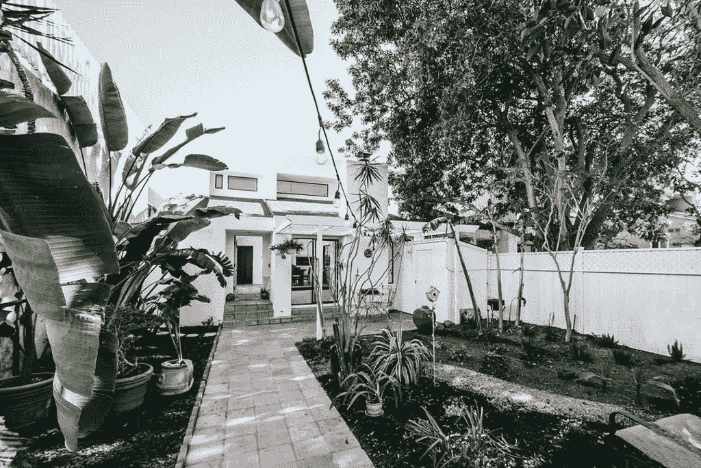
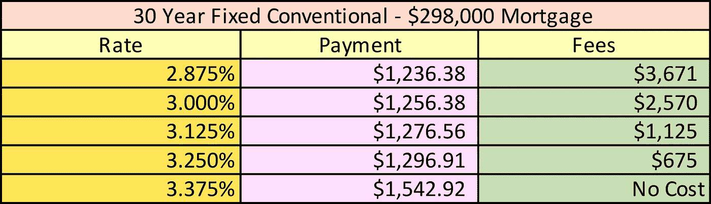
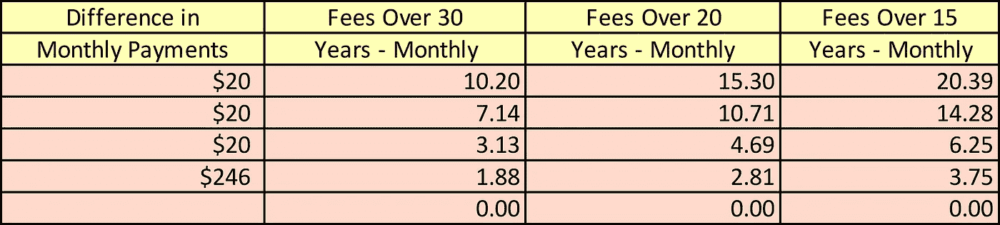
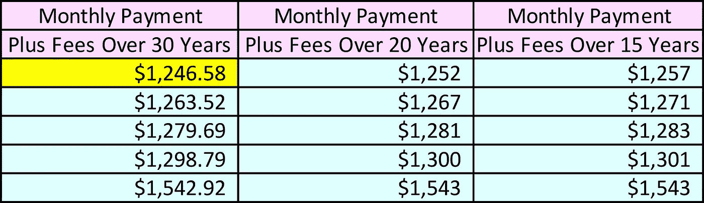

# 将为您节省大量时间的重要 Refi 信息

> 原文：<https://medium.datadriveninvestor.com/critical-refi-info-that-will-save-you-gobs-of-time-4f5ae7413fc3?source=collection_archive---------9----------------------->

我的住房贷款刚刚完成。花了将近五个月的时间。由于新型冠状病毒疫情，这次特别的再融资是我经历过的最具挑战性的一次。在这里，我想分享我所学到的，并可能节省你一些时间，因为，你知道，时间就是金钱。

这些年来，我已经为几十笔房地产贷款提供了融资和再融资，包括我的房子。作为一家房地产公司的首席财务官和合伙人，我负责为多单元和商业房地产获得融资和再融资。在此之前，我最困难的再融资是为我们的第一栋办公楼。

 [## 加速科技银行的数字化:云和人工智能成为疫情赢家|数据驱动的投资者

### 疫情新型冠状病毒的经济效应正在把斗争推向每个国家的主要产业…

www.datadriveninvestor.com](https://www.datadriveninvestor.com/2020/05/12/speeding-up-the-digitalization-of-the-tech-banking-cloud-and-ai-as-the-pandemic-winners/) 

当我和我的合伙人买下这栋楼时，我们几乎没有钱支付首付。我们需要现金作为营运资金，比如为应收账款和存货融资，我们不想把钱花在长期固定资产上。这是金融 101。当我和我们的房地产经纪人去看房子的时候，我的时机再好不过了。一楼的热水器坏了，房主跪在地上用成堆的毛巾擦水。他最近以一大笔钱卖掉了他的软件公司，我看得出他想继续前进。多好的运气啊！

这栋建筑在市场上出售或出租，他问我喜欢哪一栋。我说，“嗯，我们很想买下它，但是我没有足够的钱来付首付。”

他低头看着我们脚下慢慢打转的水，对我说:“我替你收回融资。”这意味着他实际上是银行，我们将每月支付给他。这样我们就不需要 25%的首付，这是商业建筑的典型金额。

我马上伸出手说:“成交！”我们握了握手，他起草了合同，一周之内就放在了我的桌子上。唯一的缺点是，他希望融资利率为 8%。那时候，很公平。他不是银行，我们的贷款风险更高，特别是因为我们没有首付，但我需要尽快想出如何再融资。为了做到这一点，我需要建筑物的价值上升到足以支付 20%的首付。

我们搬进去的那个月，我开始给当地银行的商业贷款部打电话。每个月我都继续给更多的银行打电话。与此同时，我们在底层经营另一家公司 X-Large(一家街头服饰公司),并租下了拥有六个独立办公室的整个顶层。但是我们每月支付 8%的利率是繁重的。

一天，邮箱里来了一封信。是美国银行的一名信贷员发来的。他在信中吹嘘说，他是我们大楼所在的洛杉矶郊区格伦代尔市的头号信贷员。这封信接着赞扬了他在安排商业抵押贷款方面的优点。我给他打了电话。我们谈过了。他计算了一些数字，在相对较短的时间内，再融资就完成了。从入住日到重新融资用了 18 个月。我们的月供几乎减少了一半。现在，楼上的六个房客支付了大部分的抵押贷款。我们只是等待市场，最终价值已经足够增加。

由于今天的利率处于历史最低水平，每个有住房或商业抵押贷款的人都应该考虑重新贷款，或者至少准备重新贷款。一个很好的经验法则是，如果你能获得 0.5%到 1.0%的低利率贷款，这可能是值得考虑的。

我的住房抵押贷款已经在摩根大通银行办理了大约 15 年，在此期间我只拖欠过一次还款。事情发生在几年前我在巴塔哥尼亚旅行的时候，当时还没有接入 Wi-Fi。我应该知道得更清楚。不要说太多关于我个人财务的细节，我的房子有超过 200%的资产净值。今天，我的 FICO 分数超过了 800 分，我的经纪账户也有了可观的存款。我负债很少，很幸运能够每月还清信用卡余额。

可以理解的是，在新冠肺炎时代，许多大银行现在不打算为房屋再融资。然而，大通拒绝了我，这似乎令人难以置信。我和我的公司都在富国银行有长期账户，他们也不能帮助我。值得注意的是，富国银行现在要求银行有一百万美元的资产，他们才会考虑你的抵押贷款再融资。最近，这个数字“只有”250，000.00 美元。

# **开始前**

根据我最近的经验，我发现银行现在至少在寻找什么:

1.  **信用评分至少 700** 。有些要求高一点——740。如果你的信用评分低于 700，在你申请之前修复它。如果你有能力，我建议偿还一些债务。这将迅速提高它。此外，加入信用监测服务，如 Experian，它可能会提高你的信用评分作为一种激励。
2.  **尝试通过一家较小的银行、一家社区银行或一家更积极的从事住房抵押贷款的国家银行**。你也可以使用贷款经纪人。正如我提到的，大通不会再融资我的房子。我想我最终成功地从美国银行获得了抵押贷款再融资，因为他们现在在这个领域似乎更积极了。我已经把他们介绍给几个朋友了。
3.  **银行希望债务收入比达到 35%—50%**,有些银行可能要求更低。这意味着，如果你一年挣 100，000.00 美元，你不能有超过 50，000.00 美元的债务支付。50000.00/100000.00 = 0.5 或 50%。这包括支付你的新屋贷款，信用卡，股票信贷额度和汽车贷款。如果你的债务收入比不低于 50%，试着还清一部分债务，或者试着赚更多的钱。
4.  **你的收入必须通过所得税申报表**来证明。假设你的所得税申报表显示你去年赚了 100，000.00 美元，但你今年已经获得了加薪，这将使你的债务收入比低于 50%。即使你能证明钱进入了你的支票账户，银行也不会考虑。它一定在你的纳税申报单上。所以你可能要等到你的纳税申报单完成并归档。
5.  说到纳税申报，**如果你还没有申报，或者你的下一份纳税申报单，2019 年的扣除额**会稍微轻一点。同样，你要尽可能展示最高的收入。尤其是如果你有债务的话。
6.  你至少需要 20%的资产净值。如果你的房屋贷款是 50 万美元，你认为你的房子值 60 万美元——那就是 20%的净值:50 万美元 X 1.2 = 60 万美元。但房价已经下跌，在这个疫情时期，评估师对房价非常保守。如果他们给你的房子估价 55 万美元，你就没有要求的 20%的权益。一些银行将接受更少的股本。你可能需要货比三家或提前询问银行。如果你没有足够的股本，你可能需要拿出首付。
7.  利率通常基于 10 年期债券加上银行的利润。你的抵押贷款利率将高于我们现在几乎为零的联邦基金利率。
8.  **巨额贷款、投资房产(你把房子租出去，但不住进去)或多单元住宅(复式或三层)的成本会更高**——利率会更高。由房利美和房地美设定的巨额贷款的定义目前是 510，400 美元。
9.  **确保你得到的贷款没有提前还款罚金**。如果你想在两年内卖掉你的房子，前三年有提前还款罚金，你必须向银行支付罚金。大多数单户家庭不再有这种东西了，但要确保。
10.  如果你用 20 年或 15 年的贷款进行再融资，利率会更低。当然，你的月供会更高，所以如果你选择走这条路，而不是典型的 30 年抵押贷款，请确保你有足够的现金流来支付。
11.  **当您获得初始报价时，讨论积分和/或费用**。通常，您的费率越低，积分越高。

# **分或不分**

这是一个假设的提议。正如我一直喜欢说的，“事实在数字中。”我做了一个电子表格分析来显示选择变得明显的成本。第一个图表列出了费率、月供和费用。同样，如果你的利率较低，你必须支付更多的手续费。你会选择哪个？乍一看，你认为哪一个是最好的交易？

让我们来处理这些数字。首先，我计算了每月付款的差额，并将成交费分成每月付款。我估算了将成交费分成不同类别的期限，30 年，然后如果你提前还清或再融资抵押贷款——20 年和 15 年。注意，如果你提前还款或再次贷款，每月的成交费会更高。

马上，你可以看到零成本的月供明显更高。

然后，当我把每月的费用加到每月的付款中时，最佳选择就变得很明显了。

你可以清楚地看到，在我的例子中，较低的利率/最高的关闭费用是最佳选择即使你提前还清贷款或 15 年再融资，它仍然是最佳选择。

如果你的现金流紧张，你没有多余的钱来支付费用，如果你必须在交易结束时支付费用，那么你可能会选择更低的费用或不收费。但随着时间的推移，你肯定会更好地采取最低利率和最高结算费用的选择。

然而，你可以与银行协商，尽量降低手续费，这就引出了我的下一点。

# **谈判。协商。协商。**

总是和你的银行协商。过去，我曾以几种方式进行谈判:

1.  **我寻求了不止一个报价**，并要求我的银行满足最低利率。我喜欢尽可能呆在同一家银行，以证明我的忠诚，所以我给了他们满足最低利率的第一拒绝权。
2.  在我最近的再融资中，我们以 1.5%的利率开始。**我** **对我的信贷员长篇大论了几个星期**。他最后说他会在结账时把 1%的钱还给我。我不认识这个人，也从未和他共事过。我没有理由相信他，但他很讨人喜欢，这当然很重要。交易结束时，他信守承诺，退还了我 1%的交易费。如果不是我努力争取，他永远不会这么做。我很感激。如前所述，我已经把我的朋友介绍给他了。
3.  我现在正在为我和我的合伙人拥有的一栋多单元公寓楼进行再融资。银行以特定的利率返还，作为首席财务官，我不得不**要求更低的利率**。第二天，我的信贷员回来了，利率下降了 0.125%，或者说下降了 12.5 个基点(1/8)。那是一个相当大的数目。与我们目前高出 100 个基点的利率相比，我们每个月将节省相当多的钱。我接受了。我很感激。

# **坚持不懈**

还记得我为我们的第一栋办公楼再融资的故事吗？我不停地试啊试，打啊打，终于找到了那个*对的人*答应了。

最后(双关语)，希望这个例子对你有帮助。请知道，我不是一个有执照的财务顾问，这篇文章是为了教育性质。如果你有更多的问题，你应该自己进行分析，或者和你的注册会计师或专业理财规划师一起进行分析。祝你好运，注意安全。

**免责声明**

*以上文章的内容仅用于信息和教育目的。它无意成为投资建议。此外，我与本文中提到的任何公司都没有业务关系。在作出财务或投资决定之前，请考虑所涉及的风险和您的个人财务状况，或寻求正式许可的财务专业人士的投资建议。*

Cynthia Wylie 是企鹅兰登书屋出版的儿童书籍作者，她拥有乔治敦大学的经济学硕士学位。她为数据驱动投资者撰写商业和经济方面的文章。当她不写作的时候，她为 TheProjectConsultant.com 的**做商业咨询和扭转战略。**

**由 D. P. Kamoen 编辑，创始人&无任所主编，项目顾问。**

***访问专家视图—** [**订阅 DDI 英特尔**](https://datadriveninvestor.com/ddi-intel)*