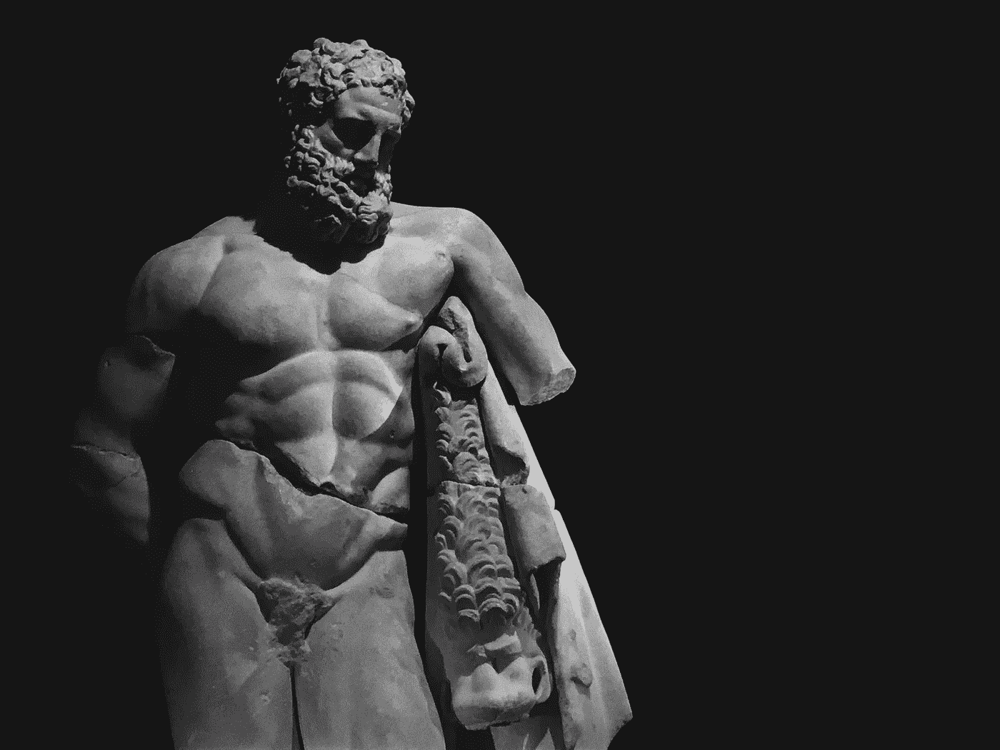

# 群众民主——如何创造第一个民主

> 原文：<https://medium.datadriveninvestor.com/crowdocracy-how-to-create-the-first-democracy-4c625d6e7bf2?source=collection_archive---------11----------------------->

Photo by [Antenna](https://unsplash.com/@antenna?utm_source=unsplash&utm_medium=referral&utm_content=creditCopyText) on [Unsplash](https://unsplash.com/s/photos/collaboration?utm_source=unsplash&utm_medium=referral&utm_content=creditCopyText)

> “我们的民主应该追求更加民主”——达珊·斯托克斯

回到过去，政治家们知道他们在争取什么，更高的工资，平等的机会，还是医疗保健系统。但是最近的电晕危机向世界表明，现在几乎不可能做出有益于整个国家的决定。经济或医疗保健系统得到优先考虑，一些政府完全否认。问题是——当一个政府依靠代表时，它能有多民主？

# 信任

孟德斯鸠的“三权政治”(Trias Politica)将政府权力分为三部分，即行政、立法和司法权力，这一制衡体系的建立是为了维护人民的信任和防止腐败。

 [## 保护主义、政治和经济动荡|数据驱动的投资者

### 美国股市昨日出现 400 多点的大幅反转，为未来的事情发出了警告信号。市场…

www.datadriveninvestor.com](https://www.datadriveninvestor.com/2018/06/28/protectionism-politics-economic-turmoil/) 

在西方民主国家，对司法权力的信任相对保持不变，但对政府行政和立法部门的信任一直在下降。

Photo by [Şafak Atalay](https://unsplash.com/@mrthug?utm_source=unsplash&utm_medium=referral&utm_content=creditCopyText) on [Unsplash](https://unsplash.com/s/photos/ancient-rome?utm_source=unsplash&utm_medium=referral&utm_content=creditCopyText)

# 古罗马

在朱利叶斯·张敬利加冕为皇帝之前，他必须与元老院的军队作战。

但当他夺取政权时，他比任何参议员都更受人民爱戴。

为什么？随着时间的推移，元老院的理想受到侵蚀，他们变成了一个腐败的团体，对推进他们的目标比对改善人民的生活环境更感兴趣。

# 现代

参议员很难对游说者说不，游说者可以向他们承诺连任所需的竞选资金或任期结束后的工作。

在 Joep Leerssen 写的《T2 国家尽管在欧洲》一书中，他谈到了一个似乎会重演的政治周期。

民主最终变得腐败；因此，一个强大的局外人被选中来清扫宫殿。然后随着时间的推移，集中的权力系统发展出极权主义的特征，我们得到了一场革命，它恢复了元老院。同样的故事一再重复。

# 群众民主

如今，在制定政策时，有太多的观点和想法需要考虑。

因此，与其相信几个人来撰写创新的立法。

我们可以问普通大众。

# 该系统

行政部门仍将存在，但我们将从他们手中接过为集体出主意的责任。

他们只会提供基础设施、警察和税收服务。

Photo by [Perry Grone](https://unsplash.com/@perrygrone?utm_source=unsplash&utm_medium=referral&utm_content=creditCopyText) on [Unsplash](https://unsplash.com/s/photos/collaboration?utm_source=unsplash&utm_medium=referral&utm_content=creditCopyText)

# 例子

你要求人们想出办法来实现联合国的可持续发展目标。

人们登录区块链开源平台；他们把自己的想法、观点或计划加入到讨论中。最好的方法是给行政部门，将其转化为政策。

# 反对

一个主要的反对意见是假新闻的危险性。

但是如果项目有足够的速度，一个团队的全部知识会过滤掉谎言。同样，如果一个开源项目达到了一定数量的开发人员，所有的错误都会被修复——临界质量定律。

我们如何防止锚定偏差？

如果参与，可以点击科学家、哲学家、律师的视角，直接参与。

然后你要么插入你的想法，要么在意见云中选择一个有利的泡泡。这个系统并不理想，但是众包系统还没有完善。

Like a word cloud but the bubbles containing different opinions, while seize represents popularity.

大多数人会遵从大众的意见。

问问你自己，你是否有能力直接影响政策。你会跟着其他人吗？我认为 crowdocracy 中的大多数人会被激励去创造和分享他们的观点，因为他们感到被包含在内。

# 履行

一些公司和政党如 [*伏特荷兰*](https://www.voltnederland.org/) 已经在使用它来做决策。

这本书的作者[*Crowdocracy-The End of Politics*](http://www.crowd.ngo/crowdocracy/crowdocracy_ebook.html)并没有声称对这个想法拥有所有权，而是希望你们这些人去改进和试验这个概念。

如果我们能够在社会中建立一个群众民主——我们已经开创了第一个真正的民主。

笔记

*   可以免费下载[*Crowdocracy——政治的终结*](http://www.crowd.ngo/crowdocracy/crowdocracy_ebook.html) 这本书。
*   [美国的两党制能进化成 crowdocracy 吗？](https://opensource.com/open-organization/16/11/crowdocracy)
*   [与 Iman Stratenus 关于 Crowdocracy 的对话。凯伦·塔姆拉兹扬的采访](https://www.youtube.com/watch?v=jhV5UZ5AbpA)。(跳过前 56 分钟)