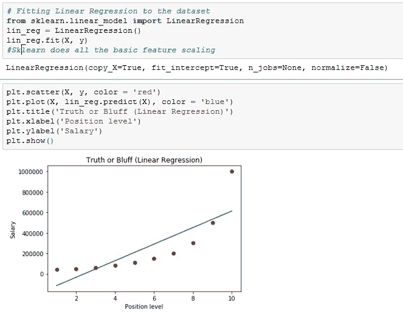

# 浏览多项式回归的基础知识

> 原文：<https://medium.datadriveninvestor.com/cruising-through-the-basics-of-polynomial-regression-a533fe177ca9?source=collection_archive---------7----------------------->

**多项式回归**是线性回归的一种形式，其中自变量 x 和因变量 y 之间的关系被建模为一个*n 次*多项式。多项式回归拟合 x 的值和 y 的相应条件均值之间的非线性关系，表示为 E(y |x)。我假设读者对线性回归有清楚的了解。我不会深入研究数学，而是试图给你一个用 Python 进行多项式回归的亲身体验。

让我们用基本的数据集来解释这个概念。

一旦数据和必需的库一起被导入，我们将在图表上看一下，以便更好地理解这种关系

哇哦。现在让我们试着拟合一个线性回归，然后用散点图将其可视化。在 plt.plot()中输入参数时要小心。第二个参数是包含我们预测点的 y 坐标的向量

在上图中，数据点用红点表示，预测用蓝线表示。从上图可以看出，预测是不正确的。很多红点远离蓝线。

 [## DDI 编辑推荐:5 本让你从新手变成专家的机器学习书籍|数据驱动…

### 机器学习行业的蓬勃发展重新引起了人们对人工智能的兴趣

www.datadriveninvestor.com](https://www.datadriveninvestor.com/2019/03/03/editors-pick-5-machine-learning-books/) 

让我们通过创建一个非线性模型来解决这个问题，这样红点就更接近预测值(蓝线)。因此，为了建立这个模型，我们创建了一个新类，它将为我们提供一些工具，在回归方程中集成一些多项式项。该类在预处理库中。创建这个类之后，我们的下一步是创建一个对象，在本例中是 poly_reg。这将使我们能够将我们的原始特征集转换成由多项式项组成的新特征集。多项式次数的大小作为参数传递给 PolynomialFeatures 类。

一旦创建了对象 poly_reg，我们就使用它来拟合原始数据点(X ),并将其转换为一组新的特征(X_poly ),该特征由额外的多项式项(在这种情况下只有一项)组成。可以看到，除了多项式项之外，还自动添加了一列 1。那是偏见！

在创建了新的特征矩阵之后，我们在转换后的特征上拟合线性回归模型。

附上图片的主要目的是让你练习代码，而不是复制粘贴它。

所以我们的回归模型差不多准备好了。让我们编写代码来可视化我们的预测。我们必须对上面为线性回归编写的绘图代码进行一些修改。我希望你没弄错！查看代码，只将 lin_reg 更改为 lin_reg2 没有帮助，因为 lin_reg2 仍然是线性回归类的对象，我们需要将转换后的功能集作为参数传递。让我们运行代码来看看结果！

这表明在线性回归中，蓝色曲线比蓝色线更接近。这可以通过增加多项式的次数来做得更好。试试增加到 3！你会看到，在这种情况下，预测会变得更好，并尝试用 4 度。更高的度数可能会导致过度拟合。

如果你想让曲线看起来更加平滑和连续，我们需要在代码中做一些细微的改变。我们使用 numpy 中的一个 range 函数，它包含所有级别(下限和上限)以及递增的步长。这给了我们向量，我们需要矩阵，所以我们使用 numpy 中的 reshape 函数来获得 X_grid 矩阵。好，让我们执行代码来得到平滑的曲线。

Smoothed Curve

我们可以清楚地看到，数据点更靠近蓝线，模型的表现比前一个更好。

我将用线性和多项式回归模型来结束我的预测

Predicted Values