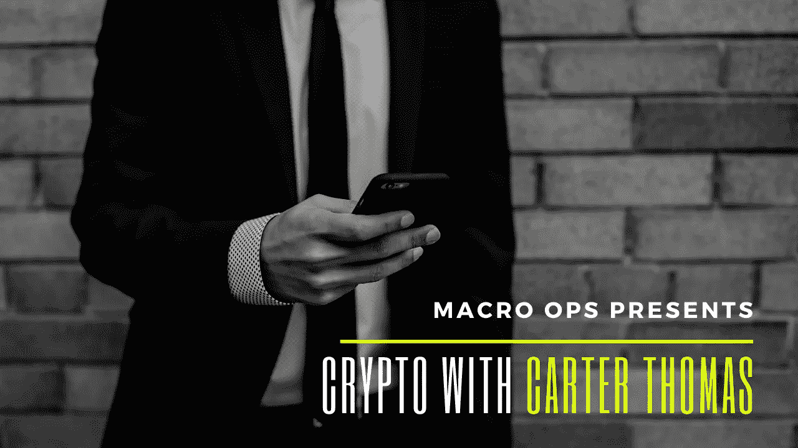

# 卡特·托马斯的加密和期货交易

> 原文：<https://medium.datadriveninvestor.com/crypto-and-futures-trading-with-carter-thomas-bb9c7fa34120?source=collection_archive---------16----------------------->

昨天我和期货和密码交易员卡特·托马斯聊天

对于播客，你可以点击这里，然后选择你喜欢的播客平台

[https://anchor . FM/macro-ops/episodes/Futures-and-Crypto-Trader-Carter-Thomas-ecr9lq](https://anchor.fm/macro-ops/episodes/Futures-and-Crypto-Trader-Carter-Thomas-ecr9lq)

或者在 YouTube 上看视频

【https://youtu.be/iZYdEzjHn9g 号

另一件令人惊奇的事情是，特立独行的交易现在赞助播客，如果你想知道更多关于道具交易的信息，我不能推荐他们。我也是那里的导师，所以当你加入并完成这个项目时，你会有机会和我交谈，哈！

为什么交易道具？如果你是个人交易者，我想不出你为什么不想和自营公司交易。

 [## 加密货币行业是死是活？数据驱动的投资者

### 九月初，我们在 X-Order 内部就代币市场的未来进行了一场辩论。有趣的是，我们的观点是…

www.datadriveninvestor.com](https://www.datadriveninvestor.com/2019/12/12/will-the-cryptocurrency-industry-be-dead-or-alive/) 

他们真的给你钱来交易，他们给你杠杆。

我已经在 Maverick 工作了 5-6 年，我不能说它有一点不好。

如果你有利可图，并且可以按照大男孩/女孩的规则来玩，那么就去追求它

http://bit.ly/2SXPFWL 外汇

选项[http://bit.ly/38KbLmn](http://bit.ly/38KbLmn)