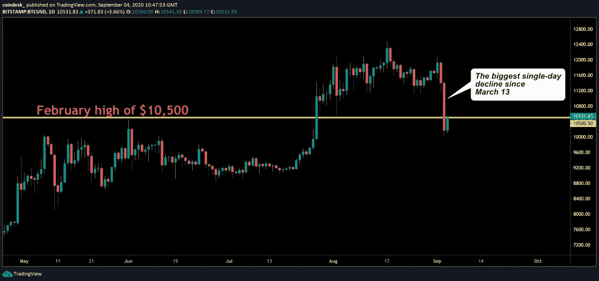
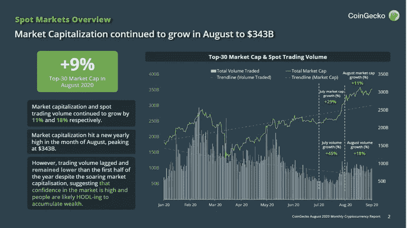
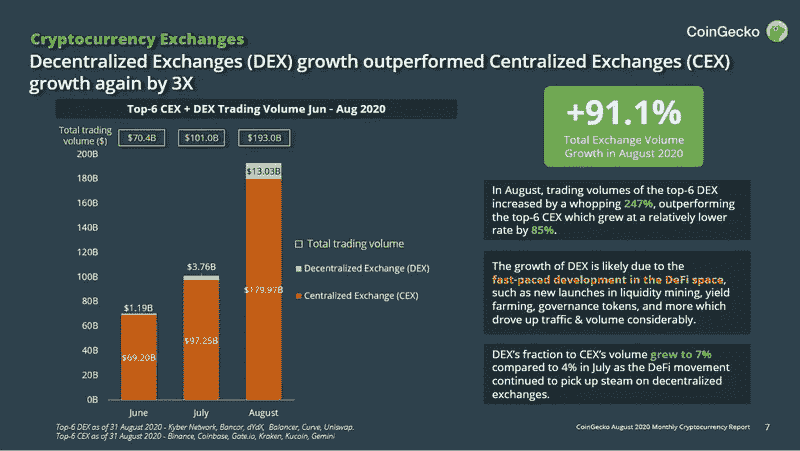
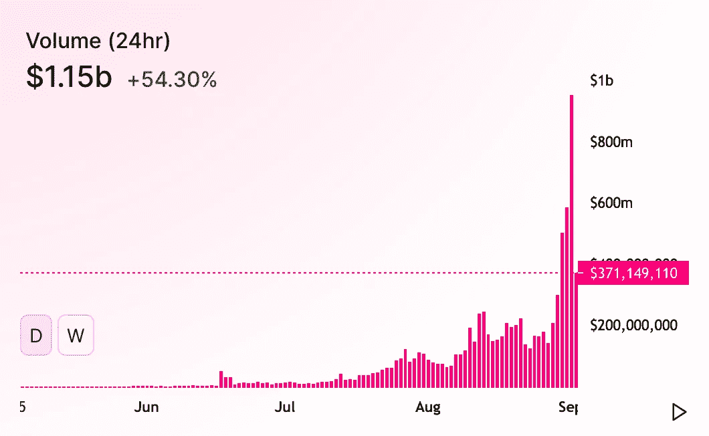

# 秘密血洗机会

> 原文：<https://medium.datadriveninvestor.com/crypto-blood-bath-opportunity-7ca0e5b79458?source=collection_archive---------7----------------------->

# 发生了什么事？

最近的加密市场调整可以追溯到两个主要因素，DeFi 空间和传统市场。投资者一直在等待一场重大的运动，他们只是不知道朝哪个方向。这篇文章将分析自黑色星期四以来我们遭遇最大跌幅的两个原因，以及在哪里可以找到机会。

Source: TradingView

# 市值创下 3430 亿美元的年度新高

尽管最近的事件看起来很严峻，但总体前景依然乐观。我们继续看到新资金涌入市场。这种变化也可以反映在传统市场上。随着我们继续消除新投资者的进入壁垒，我们看到新人蜂拥而至。我是说，你知道现在有多少人持有特斯拉的股票？当每个人都在谈论某项资产时，最好在音乐停止前离开派对。我们必须假设有经验不足的投资者在支撑市场，并谨慎行事。我们已经看到密码市场在传统市场面前是多么的脆弱。如果/当下一次股市调整到来时，你会准备好打击你的加密资产吗？

Source: CoinGecko

# 分散式交易所(DEX)的增长速度是集中式交易所(CEX)的 3 倍

前六大分散交易所(DEX)的月交易量增长了 247%，让集中交易所汗颜。这种活动是由纯粹的投机和利率黑客行为推动的。为了满足这种贪婪，无数的产量农业协议被创造出来，但是许多协议都失败了。这是因为这些协议的创建速度很快。他们变得容易受到 bug、黑客攻击和抽逃计划的攻击。不需要经济学家也能意识到+1000%的年利率是不可持续的。受益最大的人是第一批参与者，包括创造者和一些内部人士。关键是这些数字是不可持续的，在投资这些项目之前，最好在一旁等待热潮消退。

 [## 完美的加密交易策略|数据驱动的投资者

### 如果你在交易游戏中已经有一段时间了，你可能听说过“支点”和“VWAP”前者听起来像…

www.datadriveninvestor.com](https://www.datadriveninvestor.com/2020/08/31/the-perfect-crypto-trading-strategy/) 

Source: CoinGecko

# 机会在哪里

由于加密市场更关注 DeFi 项目，而不是集中项目，我们可以看到以 CeFi 为中心的有价值项目的贬值。随着许多投资者购买 DeFi 代币，并将他们的资本锁定在那个生态系统中，我们开始看到这两个空间之间的分离。随着 DeFi 降温，投资者将转向资金池的另一端，那里不太拥挤，开始时冷静，然后突然转向。最好把它看作一个钟摆，今天是 DeFi，明天是 CeFi。这也可以在 BTC vs 奥特金的统治力中看到。当我们在 Altcoin 浪潮中前进时，你最好开始关注主要的硬币，因为浪潮应该在早期被抓住，而不是在它的顶峰。

Uniswap Daily Volume

**进入专家视角—** [**订阅 DDI 英特尔**](https://datadriveninvestor.com/ddi-intel)