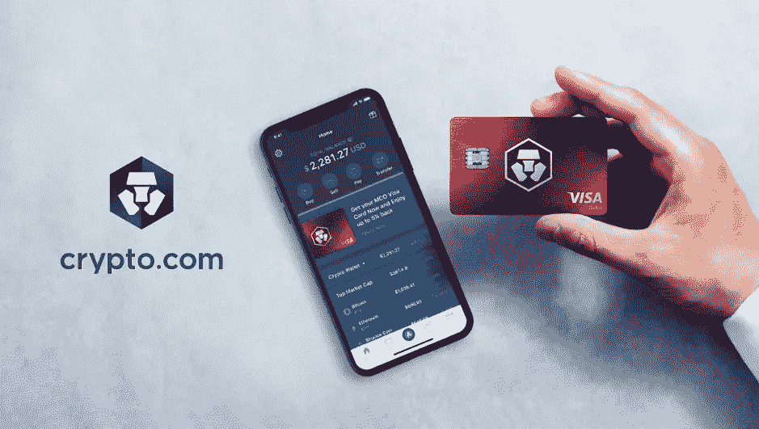
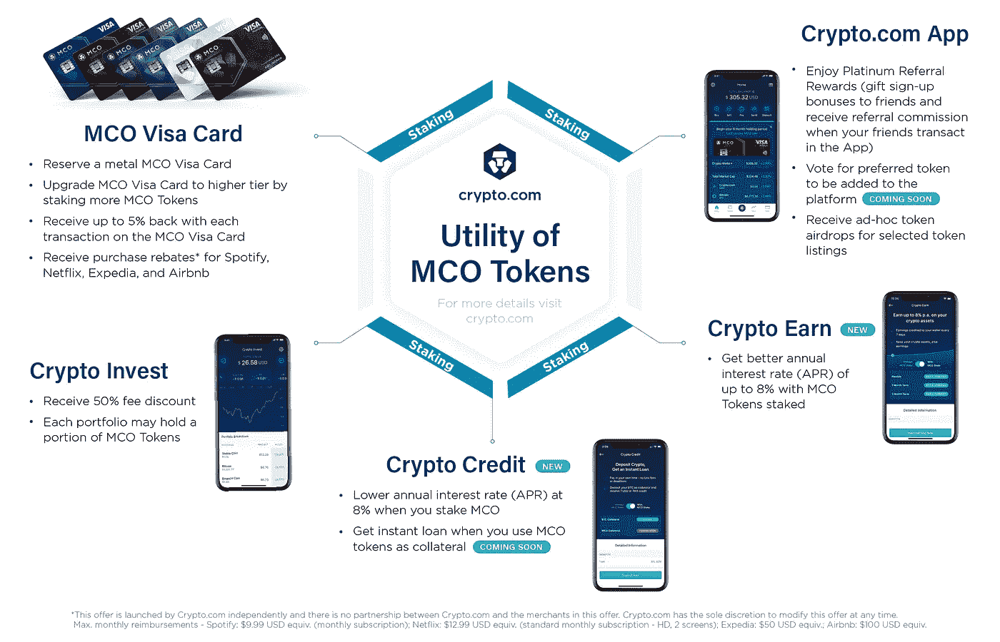
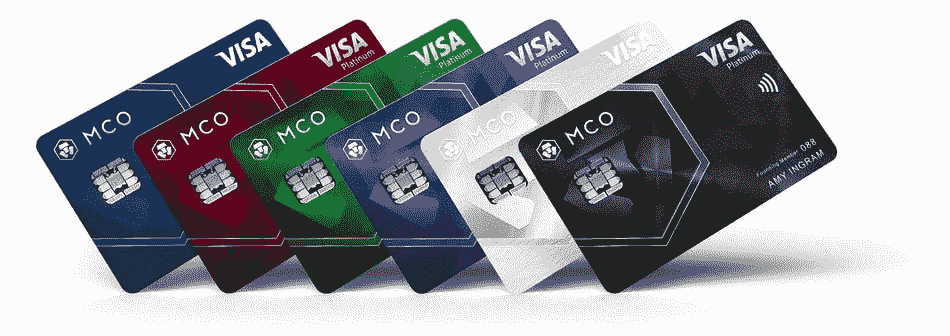
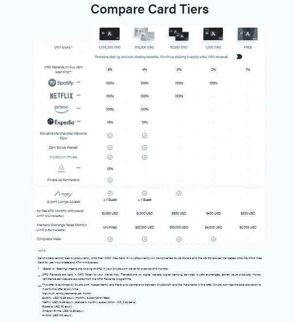
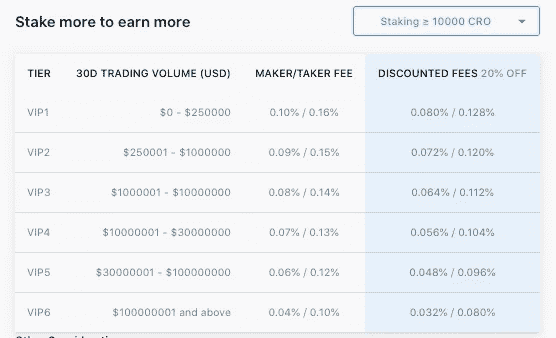

# Crypto.com！将密码带入日常生活！！

> 原文：<https://medium.datadriveninvestor.com/crypto-com-bringing-crypto-to-everyday-life-a743e37d2ef8?source=collection_archive---------11----------------------->

根据最近的一项调查，全球大约有 4000 多万加密货币用户。但对于上述大多数用户来说，他们的加密活动只是包括在交易所交易，希望借此发财。他们在日常生活中不使用密码。

这只是表明加密货币在日常生活中的采用仍处于萌芽阶段。有很多区块链项目应运而生，承诺在日常生活中帮助增加区块链的采用，但随着时间的推移，大多数项目都失败了。

少数项目留下来，推动了极限，并有助于对加密货币的日常采用产生影响。

其中一个是 Crypto.com

# Crypto.com

2016 年， [Kris Marszalek](https://www.linkedin.com/in/krismarszalek) 创立了 Crypto.com，坚信掌控自己的金钱、数据和身份是每个人的基本人权。该公司总部设在香港，根据最新报道，有 200 多人在为 crypto.com 工作。

Crypto.com 不是一个单一的实体，而是一个由 all in all 加密应用、Visa 支持的 MCO 卡和 Crypto.com 交易所组成的生态系统。Crypto.com 是市场上唯一一家提供完整加密生态系统的公司，包括支付、交易和金融产品。

# MCO 牌。

推动加密货币采用的最佳方式之一是当我们可以在日常生活中使用加密货币时，最好的方式是通过借记卡/信用卡，这将帮助我们按照我们的要求消费加密货币。

最初，一些项目成功地让几个商家注册，并让他们的顾客通过密码支付。这主要是通过钱包之间的转移来完成的。由于区块链的缓慢和价格时刻的波动，这个想法逐渐没有得到太多的宣传和支持。

正是在这个时候，Crypto.com 产生了开发一种可以日常使用的信用卡支付方式的想法。最初，该卡被称为摩纳哥卡，后来更名为 MCO Visa 卡。

 [## 加密过山车 ETH2.0 测试网的麻烦，动荡的市场，美联储谈论 CBDCs |数据…

### 是只有我这么想，还是外面的情况越来越乐观了？从酒吧凳体育创始人戴夫波特诺伊泵他最喜欢的…

www.datadriveninvestor.com](https://www.datadriveninvestor.com/2020/08/20/crypto-rollercoaster-trouble-on-the-eth2-0-testnet-volatile-markets-the-fed-talks-cbdcs/) 

MCO 维萨卡类似于金融机构发行的任何维萨卡，可以在任何支付终端使用。但主要的问题是你可以在 MCO visa 卡中加载你的加密货币，你可以随心所欲地消费。不需要那些痛苦的钱包钱包转移和延迟。你所要做的就是刷卡并使用这张卡。

目前，美国、新加坡和欧盟国家的用户可以使用该卡。预计在未来几年内，这种卡将逐渐在全世界的加密团体中使用。MCO Visa 卡目前支持以下加密货币:BTC、瑞士联邦理工学院、瑞士长期信贷、XRP、MCO、英美烟草、BNB、TUSD 和 ENJ，对于法定货币，该卡支持英镑、HKD、欧元、日元、新加坡元和澳元

为了获得一张卡，你需要投入 X 的 CRO。你持有的 MCO 股份越多，发行给你的卡的种类也就越多。

不同的卡等级带来不同的好处。这可以从 200 美元的 ATM 取款限额到 1000 美元的 ATM 取款限额，以及%的返现和您将获得的其他优惠

# 交易所

目前，在测试阶段，crypto.com 交易所于 2019 年 12 月 4 日推出。Crypto.com 交易所为用户提供了三种交易多种数字资产的方式。

1.  网络界面
2.  Crypto.com 应用程序
3.  交易 API。

使该交易所区别于其他交易所的是它的

*   **深度和全球流动性:** Crypto.com 的专有 Vortex Liquidity Engine 可确保客户获得深度流动性池和最佳执行价格。
*   **极具竞争力的交易费用:****0.008%的制造商和 0.02%的接受者的典型 API 交易账户费用，**高交易量账户免费交易(在交易量& CRO 赌注折扣之后)。
*   **机构级托管&安全:** Crypto.com 的 [ISO 认证 27001:2013](https://blog.crypto.com/crypto-com-achieve-iso-iec-27001-2013-certification/) ， [PCI DSS(一级)](https://blog.crypto.com/crypto-com-achieves-pci-dss-level-1-certification/)， [CCSS(三级)合规](https://blog.crypto.com/crypto-com-achieves-cryptocurrency-security-standard-level-3-compliance/)与[总账金库合作](https://blog.crypto.com/crypto-com-integrates-ledger-vault-technology-for-institutional-grade-custody-solution/)。

除此之外，用户还可以选择

*   **入股，省钱&赚:** CRO 赌注将提供丰厚的交易费折扣，高达 100%。*赌注越多，节省越多！* 除了交易折扣外，Crypto.com 交易所将 20%的年收益率押在 CRO 身上

更多详情[此处](https://blog.crypto.com/crypto-com-exchange-fee-schedule)。

*   **参与辛迪加——打折销售活动中的优先令牌分配:**与币安 launchpad 类似，新的数字资产将通过“辛迪加”——Crypto.com 筹款平台——在 Crypto.com 交易所上市。至少持有 10，000 枚 CRO 代币的 CRO 持有者可以在两周一次的辛迪加活动中获得高达 50%的硬币折扣

更多详情[此处](https://blog.crypto.com/the-syndicate/)。

注册过程相当简单。对于初级验证，用户需要提供基本信息，如姓名、出生日期和国籍。不需要任何 KYC，非 KYC 用户每天只能提取价值 5000 美元的密码。对于 KYC 通票用户，提款限额将提高到每天最多 100 BTC 或等值货币。

Crypto.com 交易所提供大多数主要加密货币的交易对，与 BTC、USDT 或 CRO 配对。菲亚特到加密到目前为止还没有提供，这可以在未来几天内预期。

# 象征性生态系统

一开始，crypto.com 有两个本地令牌。MCO 和 CRO。根据最新的[公告](https://blog.crypto.com/important-announcement-mco-swap/amp/)，MCO 将被交换到 CRO，并且从现在开始只有 CRO 令牌将在 Crypto.com 生态系统中使用。

Crypto.com 硬币(CRO)也为 Crypto.com 交易所提供了额外的效用和好处。crypto.com 推出了 CRO 交易对，旨在提高 CRO 在 Mainnet 推出前的流动性，并实现跨货币交易的低利差结算，CRO 也将与 Crypto.com 交易所上市的所有硬币配对。

# 摘要

在过去的几年里，Crypto.com 通过其各种产品成功地让数百万普通用户接触到了 crypto。到目前为止，他们已经推出了一套很好的产品和服务，确保用户不需要离开平台，并成为所有加密需求的一站式服务。

*免责声明:我不会从我对 Crypto.com 平台的评论中获得任何好处。这篇文章不打算作为投资建议。这只是我的看法。一如既往，DYOR 在投资之前。*

## 访问专家视图— [订阅 DDI 英特尔](https://datadriveninvestor.com/ddi-intel)