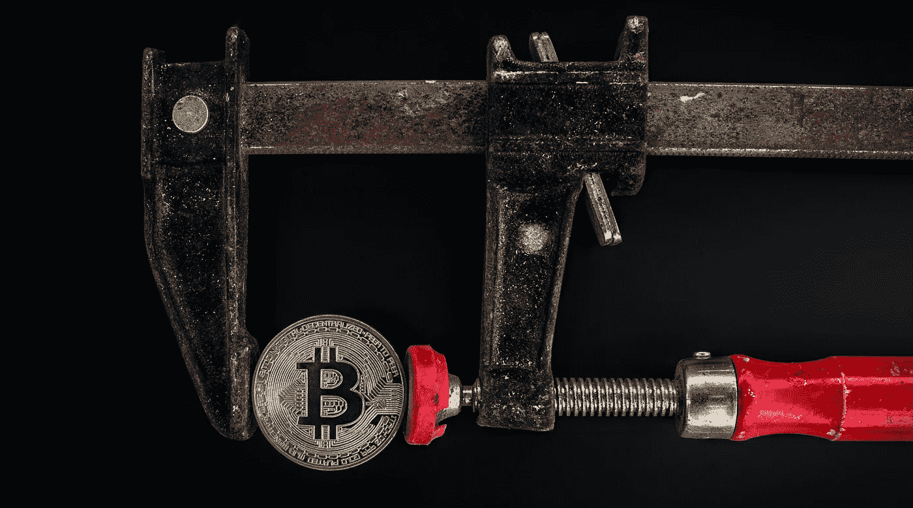

# 隐冠状病毒大屠杀

> 原文：<https://medium.datadriveninvestor.com/crypto-coronavirus-carnage-fbf58b73de53?source=collection_archive---------5----------------------->

## 比特币的黑色星期四过后，价格稳定下来，但 BTC 将何去何从？

Cryptocurrency, Bitcoin, Corvid-19, Market Crash Image by [Sulayman Sanyang](https://pixabay.com/users/sulayman360-4616363/?utm_source=link-attribution&utm_medium=referral&utm_campaign=image&utm_content=3194671) from [Pixabay](https://pixabay.com/?utm_source=link-attribution&utm_medium=referral&utm_campaign=image&utm_content=3194671)

多年来，比特币的拥趸们不仅吹捧这种加密货币的优势，还吹捧它在危机时期的价值。它是去中心化的、无边界的、透明的、不可改变的，并在 2017 年末飙升至近 2 万美元的历史高点。总有一天，股票市场会崩溃，法定货币会贬值，比特币会作为终极避风港占据至高无上的地位。供求法则将把这种极其稀缺的商品变成黄金的 21 世纪替代品。

快进到 2020 年 3 月 12 日。受新冠肺炎疫情和全球衰退威胁的困扰，股市暴跌，标志着有史以来最长的牛市的暴力结束。广泛的量化宽松向全球经济注入了数万亿美元的新货币，提醒我们在印钞机时代，法定货币或多或少是无限的。比特币已经准备好证明自己的勇气，并飙升至新高，表明自己是传统资产类别失败时的最佳防御手段。

 [## Azbit 旨在连接传统金融和加密货币|数据驱动的投资者

### Azbit 是下一个提供交易平台的加密项目，该平台提供保证金和算法交易。一样多…

www.datadriveninvestor.com](https://www.datadriveninvestor.com/2019/03/20/azbit-aims-to-connect-traditional-finance-and-cryptocurrency/) 

相反，比特币崩溃了。在全球股市遭受重创的一天，比特币受到的打击更大，暴跌 38%，是其历史上第三糟糕的一天。以太坊和其他加密货币紧随其后，标志着这些所谓的避风港的大屠杀。

发生了什么事？为什么比特币、以太坊和它们的加密同行在舞台似乎准备好让它们扶摇直上的时候崩溃了？比特币是如何从几周前的 1 万多美元跌至 3 月 12 日的 3700 美元和 3 月 18 日的 5300 美元左右的？鉴于所有这些屠杀，比特币和它的加密伙伴们还能赢回我们的信任吗？

让我们从 2020 年的资金管理快速课程开始。算法交易的出现意味着计算机可以检测股票市场的波动峰值。当这些峰值出现时，这些算法就会启动，引发大规模抛售，这反过来会使股市变得更加危险和动荡。当股市状况崩溃，大量抛售随之而来时，这种交易也会蔓延到其他资产。

原因？在金融危机时期，大资金金融机构寻求流动性高于一切。没有仔细考虑一种资产相对于另一种资产的优点。这一切都是在算法交易闪电战的推动下，向现金的巨大转移。

加密货币陷入了这场交火。所有金融资产的抛售开始加速，引发了更多的抛售，从而引发了保证金追缴，引发了对这些保证金追缴的抢购，引发了投资者的恐慌，导致比特币出现第三大单日跌幅。

所以，是的，当恐慌笼罩市场时，加密不能被指望为一个安全的避风港。好消息是，在比特币最近暴跌之前，使其成为一种有吸引力的资产的所有因素现在仍然存在。

与最近开始看起来无限的法定货币不同，比特币的供应量是有限的。这是因为比特币需要在名为区块链的分布式账本上挖掘新的交易区块才能存在。这种挖掘既验证了交易，又创造了更多的加密货币，从而奖励矿工执行交易验证任务。现在，大约有 1830 万比特币存在。比特币可以存在的最大数量是 2100 万。

*比特币将很快变得更加稀缺。那是因为 2020 年 5 月会给我们带来一个比特币减半的事件。*

比特币减半是大约每四年发生一次的事件(准确地说，是每创建 210，000 个区块发生一次)。减半将挖掘新区块的奖励减半，这意味着比特币矿工因验证交易而获得的硬币减少了 50%。减半将按照该时间表继续，直到达到 2100 万硬币的最大供应量。

供求规律非常简单:当供给枯竭而需求保持不变时，价格就会上涨。这意味着比特币的日益稀缺赋予了这种资产一些巨大的上行潜力。

更好的消息是，当供应减少时，需求可能不会停滞不前；它很可能开始激增。随着价格的上涨，加密技术逐渐被人们所接受。它正慢慢开始成为一种另类资产类别，机构资金经理可以将它与股票和债券一起纳入投资组合。像脸书这样的科技巨头正在投入资金和资源，要么利用现有的加密货币，要么[开发自己的](https://www.cnet.com/news/heres-what-you-need-to-know-about-facebooks-controversial-libra-cryptocurrency/)。其他举措，如[比特币基地首席法律官受聘监督美国国家银行系统](https://cointelegraph.com/news/coinbases-chief-legal-officer-resigns-to-oversee-us-national-banking-system)，最近增加了 crypto 在主流金融界日益扩大的接受度和可信度。

再加上法定货币随着政府印钞机吐出数万亿美元而贬值的可能性，你就可以看到比特币是如何吸引投资者的。

Bitcoin Photo: Worldspectrum Pexels

现在坏消息是。远在减半之前，比特币挖矿就已经是一项[昂贵、高能耗的计算机计算](https://www.vox.com/2019/6/18/18642645/bitcoin-energy-price-renewable-china)。从去年秋天开始，比特币采矿公司开始购买新的、更高效的设备，以从一个两个月后回报将减少 50%的过程中榨取尽可能多的利润。据报道，这样一来，花费将达到[5 亿美元](https://www.coindesk.com/price-drop-casts-pall-over-bitcoin-miners-equipment-upgrades)，而且比特币的价格最近受到猛烈冲击，这些矿业公司可能需要很长时间才能收回投资。

就目前情况而言，比特币作为一种支付手段尚未被广泛采用，这在新冠肺炎隔离期间成为一个更大的问题，因为人们更专注于购买食品等必需品。再加上机构和个人对现金的避险行为，比特币可能还没有做好关闭的准备。

[Buy the latest marketing book by Audrey Nesbitt](https://www.smashwords.com/books/view/1025113)

不过，最终，全球卫生官员将会抑制新冠肺炎的影响，隔离将会结束，商业将会像往常一样恢复。当这种情况发生时，所有有利于比特币的因素都将成为焦点。另一轮价格上涨很可能随之而来。

或许问题不在于比特币和其他加密货币何时回归，而是围绕主流加密的能源、人才和资本是否会迁移到代币经济。

> “从各个角度来看，压倒性的需求是必然的。交易员、投资银行家、街角商店、家庭住户都需要知道，他们的资产受到保护，需要时可以立即得到。现在想象一下，所有的交易对手都有一种自然的‘不信任’的愿望，希望确保这些资产是稳定和健康的，”[Liquid Ledgers 首席执行官兰迪·麦奎尔说。](https://www.linkedin.com/in/randy-mcguire-a61428/)“想象一下医疗保健及其供应链的代币经济(全球)，在这种经济中，在全球危机中根本不需要调用财政部印刷的废话。代币经济及其供应链将成为所有交易对手和所有利益相关者的对冲工具，而不是现金——在危机中，这比法定货币更有价值、更卫生。此外，代币经济供应链中的所有参与者都可以立即变得完整。切片切块而不是任意印刷。”

奥黛丽·奈斯比特

Linkedin 上的奥黛丽·奈斯比特

[@ audreynesbit 11 在推特上](https://twitter.com/AudreyNesbitt11)

[螺旋营销&公关](http://www.spinspirational.com/)