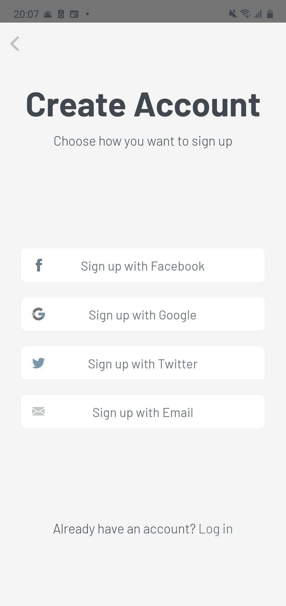

# 加密被动收入-摄氏网络

> 原文：<https://medium.datadriveninvestor.com/crypto-passive-income-celsius-network-c920939d407?source=collection_archive---------3----------------------->

罗伯特·清崎总是说:

> “停止为钱工作，让你的钱为你工作”

今天，我将为那些不想等待通货膨胀使储蓄贬值的人提供一个平台。这只是一个演示，所以记住在用你的钱做一些事情之前要做你的研究:)。

# 摄氏网络

根据他们的网站:

> 在区块链赚取、借贷和支付的新方式。

在这篇文章中，我们将只集中在赚取利息的部分，以及你如何去那里。

但首先，**为什么是摄氏度网？**

据我所知，写这个帖子的那一刻，摄氏网的利率是最好的:**高达 11.90%** APY **。利息每周都会进入你的钱包，所以这些也会对你有用。**

让我们举个例子:我们将有 10000 美元作为启动资金。如果利率为 11.90% APY，你每周将得到 22.92 美元，每年将得到 1，191.73 美元。最棒的是你可以随时取钱。

在这里，您可以查看他们提供利率的代币列表及其百分比。

 [## 赚取加密|如何赚取比特币|摄氏度

### 您应该知道的事情根据当地和国际法律法规，一些 Celsius 网络应用程序功能是…

摄氏.网络](https://celsius.network/earn-interest-on-your-crypto/) 

如你所见，最好的利率是稳定的硬币。简而言之，稳定的硬币将反映法定货币(美元、欧元等)的价格。我们可以以反映美元价格的 USDT 为例:1 USDT = 1 美元

# 我该如何开始？

首先，从你的智能手机，去应用商店，下载摄氏网络应用。

下载并安装应用程序后，你必须创建一个帐户。只需从 Celsius Network 为您提供的四个选项中选择一个。

现在，您几乎已经设置好了！链接您的 Celsius 帐户后，您只需添加您的真实姓名，如果您愿意，还可以添加一个推荐代码。如果你增加一个，两个，你和你得到推荐代码的人，得到价值 20 美元的比特币。想用的话下面是我的: **140943e862。**

做完这一切后，你应该在主屏幕上

开始身份验证过程。它应该简单明了。

**奖励:**完成身份验证后，从主按钮进入我的个人资料，您可以选择兑换优惠券代码。如果您存款超过 200 美元，使用 **SUMMER** 代码获得额外的 20 美元。

就这样，现在你是 Celsius 网络的一部分。你所要做的就是从主菜单按钮转到存款屏幕，从那里你可以获得所有 Celsius 网络支持的加密令牌的钱包地址。添加加密令牌后。你开始为他们赚取利息。下周一你应该会看到结果。

 [## 为什么参与正确的加密交换至关重要|数据驱动型投资者

### 到目前为止，与黄金和美元相比，加密货币，尤其是比特币，已经显示出巨大的增长

www.datadriveninvestor.com](https://www.datadriveninvestor.com/2020/07/16/why-engaging-with-right-crypto-exchange-matters/) 

# **我的策略**

正如我想你在我上面贴的链接上看到的，每个代币有两种不同的利率。最小的一个是为只持有特定令牌的成员设置的，较高的一个是为那些同时拥有 CEL(celus 网络令牌)的成员设置的

如果您持有摄氏币，这是红利利息的百分比

所以，如果你想得到最高利率，你需要有 15%的 CEL 代币。您可以直接从 Celsius app 或其他来源(exchanges、uniswap)购买 CEL 令牌。完成后，只需导航至一个代币屏幕并激活“赢取 CEL 利息”即可获得奖金。只是为了确保一切都很清楚，你会得到所有的 CEL token 的利益。否则，如果您想获得您所拥有的令牌的利息，您将需要停用此选项。

最后，这是我的策略:
-我的代币价值中至少有 15%是 CEL 代币，所以我可以从我拥有的所有代币中赚取最大的利率
- 45%在 USDT 受益于 11.9%的巨大利率
- 40%在不同的加密硬币(以太坊，比特币)中，因为我也想从加密世界的提升中受益。

就是这样！希望这对你有所帮助，并且永远不要忘记:**在你投资某样东西之前，先做好自己的研究！**

感谢您的阅读！

# 参考

 [## 加密贷款| BTC 利息|摄氏网络-自行解锁

### 赚取高达 10%的存款利息。*用 CEL 赚取*“购买加密”按钮由第三方提供，您的…

摄氏.网络](https://celsius.network/)  [## 摄氏网络-中等

### 从媒体上的摄氏网络阅读写作。在区块链赚取、借贷和支付的新方式。每天，摄氏…

medium.com](https://medium.com/@CelsiusNetwork)  [## r/celsius 网络

### r/CelsiusNetwork:在区块链上赚取、借贷和支付的新方式。赚取高达 10%的年利率加密利息收入…

www.reddit.com](https://www.reddit.com/r/CelsiusNetwork/) 

**访问专家视图—** [**订阅 DDI 英特尔**](https://datadriveninvestor.com/ddi-intel)