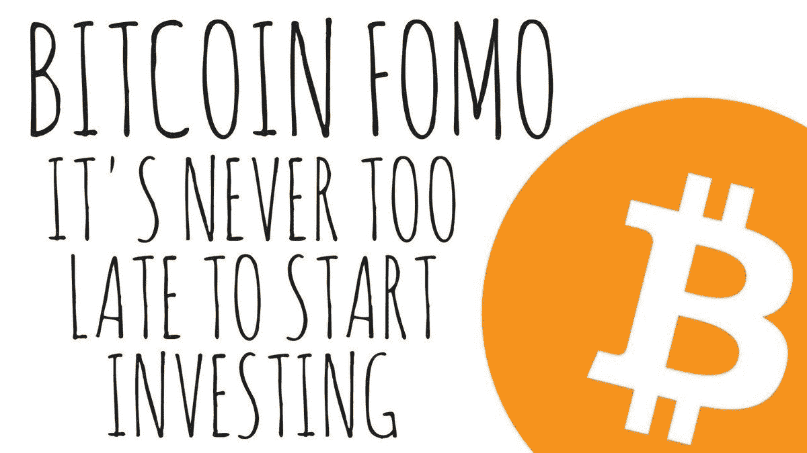

# 你应该知道的加密俚语

> 原文：<https://medium.datadriveninvestor.com/crypto-slangs-you-should-know-f7f23eca6069?source=collection_archive---------4----------------------->

## 精通技术的千禧一代遇到了金融

加密社区使用一些来自传统金融社区的术语，如“熊”/“牛”和“长”/“短”。然而，由于 crypto 充满了主要由千禧一代和 Z 世代组成的年轻人群，他们想出了一些俚语来更好地描述他们在这个被称为“加密市场”的过山车中经历的各种场景。

# 代币

它的实际定义来自于公司以加密货币的形式发行股票。然而，在社区中，这个词已经成为指代任何加密货币的同义词。

# FOMO

这是一个甚至在传统的“新闻”频道，如美国消费者新闻与商业频道货币，已经成为主流。

Taken from [Bitcoin FOMO Twitter account](https://twitter.com/bitcoin_fomo/status/963124890726535173?s=20)

FOMO =害怕错过。它通常有一个负面的含义，即人们(normies/noobs)具有从众心理，在价格因媒体报道而被人为抬高后购买比特币等代币。

# 诺尔米

加密投资者指的是那些仍然以传统思维方式思考，并因此决定作为“正常人”远离加密市场的人。

# 新手

借用游戏文化，noob 或有时被称为“noobie”或“菜鸟”是一个对加密货币感兴趣的人。

# 福乐

发音一汽李，福乐是 FOMO 的反义词。它代表害怕失去一切。就像 FOMO 希望人们买进一样，福乐害怕人们在股票价格下跌时卖出，因为他们觉得股票会跌到谷底。FOLE 的问题是，它可能会促使人们出售并遭受损失，而他们本来可以持有更长时间，直到他们的令牌/加密货币的价格再次上涨。

# 霍普姆

“希望”和“鸦片”的组合词是“在影响下”,就像国有贸易商在等待他们的代币涨价时有时会感觉到的那样。当交易者的感觉是基于纯粹的猜测而不是实际的基本面时，这个词特别有用。

# 基本原则

这些是一些关键指标，据称(根据许多专家的说法)会影响加密货币的价格。尽管股票等传统资产也存在基本面因素，但加密货币的基本面因素却非常不同，更多地与硬币的技术特征相关；即散列率、接近减半、24 小时交易量等。

# 哈希速率

当“矿工”在加密货币的网络上验证交易时，它被称为通过[哈希](https://www.webopedia.com/TERM/H/hashing.html)的过程获得了哈希 ID。每秒完成的哈希次数称为加密货币的哈希速率。高散列率意味着网络上更多的计算机或更强大的计算机有助于验证交易，并被认为是该货币价格将会上涨的指标。

 [## 总部位于瑞士的 ETP 进入加密交易市场|数据驱动的投资者

### 虽然金融市场几乎没有沉闷的时刻，特别是在引入…

www.datadriveninvestor.com](https://www.datadriveninvestor.com/2019/03/10/swiss-based-etp-enters-the-crypto-trading-market/) 

# 采矿

通过解决数学难题来验证加密货币网络上的交易的过程，以便将其添加到区块链中。作为奖励，有助于验证交易的计算机被给予少量的加密货币作为奖励。

Photo by [chuck lindsey](https://unsplash.com/@chuck_59?utm_source=medium&utm_medium=referral) on [Unsplash](https://unsplash.com?utm_source=medium&utm_medium=referral)

# 去月球

去月球/Mooning 是一个口语术语，表示货币价格的指数增长(意味着图表上的价格线几乎垂直上升，或者投机者预期它会这样)。

# 抽吸

当一枚硬币“跳动”时，与传统的法定货币如美元/欧元/印度卢比相比，它的价格在上涨。

# 倾销

当一枚硬币“跳动”时，与传统的法定货币如美元/欧元/印度卢比相比，它的价格正在下降。

# 霍德尔

“Hodl”是故意把“hold”这个词打错了。Hodler 是指相信加密货币的长期可行性并打算长期持有他/她拥有的加密资产(至少两年以上)的人。

# 替代硬币

替代硬币一词有两种含义:

1.  任何不是比特币的加密资产。
2.  一种加密货币，就市场资本总额而言不是顶级货币，与其他货币相比没有可行的技术差异(sh*tcoin)。

# Sh *币

sh*tcoin 是一种加密货币，是一种噱头。它可能是作为一个笑话开始的，为了好玩，或者是某人为了从轻信的新密码投资者那里赚钱而故意策划的。这里有一段非常搞笑的视频，是创的创始人在一次聚会上喝醉时把创描述成一个“笨蛋”:

# 比特币最大列表

比特币最大化主义者(bitcoin maximalist)是一种投资者，他认为比特币要么是唯一可行的，要么是迄今为止最好的加密货币形式，只投资比特币。

# 虚弱的手

“弱手”是一个隐含的“坏”投资者，当加密货币的价格线出现“下跌”或“下降”时，他/她倾向于出售他/她的加密资产。

Photo by [Tom Roberts](https://unsplash.com/@tomrdesigns?utm_source=medium&utm_medium=referral) on [Unsplash](https://unsplash.com?utm_source=medium&utm_medium=referral)

# 席尔斯

Shill 是一个在加密货币中隐藏(通常是自私的)主题的人。他们可能正在推广某种行为，因为他们意识到这种行为可以以对他们有利的方式改变加密货币的价格。这个词的动词形式是“先令”。

# 命令

法定货币是一种没有“支持”/支撑/不代表商品数量(如黄金)的货币。取而代之的是政府对其价值的担保。这种货币的一个常见例子是美元。这种对政府的依赖使得政府有权控制这种货币的真实价格/价值。这被视为加密社区中加密货币存在的主要原因。

# 比特币的统治地位

总市值是目前流通的所有加密货币的总价格。**比特币统治地位**是总市值中有多少百分比是由比特币引起的。数学上:

(可用比特币的数量*比特币的价格)/(所有可用加密货币的数量*这些加密货币的价格)* 100

# 鲸

鲸鱼指的是密码市场的大玩家。这些基本上是拥有大量特定加密货币的个人/组织的加密货币钱包地址。

Photo by [Ben White](https://unsplash.com/@benwhitephotography?utm_source=medium&utm_medium=referral) on [Unsplash](https://unsplash.com?utm_source=medium&utm_medium=referral)

我希望你今天在这里学到了一些奇怪的词，或者至少对一些秘密社区的俚语感到有趣😆。请在这里关注我以获取更多信息，或者在[推特](https://twitter.com/AngSin17)上关注一些随机性。

📝把这个故事保存在[杂志](https://usejournal.com/?utm_source=medium.com&utm_medium=noteworthy_blog&utm_campaign=tech&utm_content=guest_post_read_later_text)上。

👩‍💻每周日早上醒来，你的收件箱里会有本周最值得关注的科技新闻。[阅读科技简讯](https://usejournal.com/newsletter/noteworthy-in-tech/?utm_source=medium.com&utm_medium=noteworthy_blog&utm_campaign=tech&utm_content=guest_post_text)中值得关注的内容。