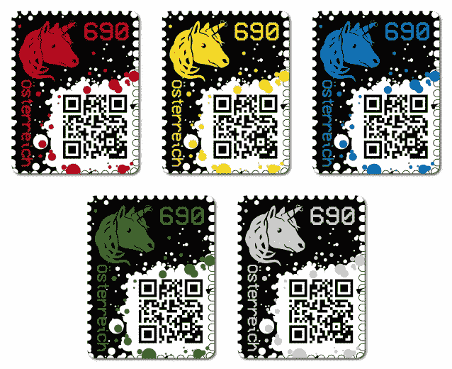
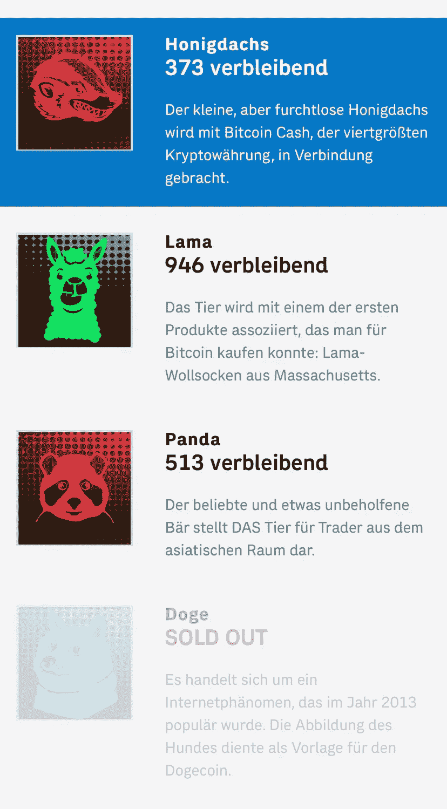

# 加密邮票 2.0 盈利吗？

> 原文：<https://medium.datadriveninvestor.com/crypto-stamps-2-0-636d759c4697?source=collection_archive---------0----------------------->

今天中午在网上 Anon 峰会期间，新的加密邮票一代发布。

去年，奥地利邮政发行了第一代 Crytpo 邮票。这是一张支票卡，带有一个纸质钱包形式的以太坊钱包。邮票上有一只独角兽。第一次收集非常成功。每枚邮票的价格翻了一倍多。第一批中的红色加密邮票甚至突破了每枚 6000 欧元的价格。总邮票的百分之一是红色的加密邮票。购买一张邮票的价格是 6.90 英镑。

现在是第二版。第二版于 2020 年 5 月 20 日出版。预售阶段已经开始，将于 6 月 25 日起在奥地利邮局发售。

这次有四种不同颜色的邮票。每张邮票将售出 6 万张。

在邮票上你可以看到一只蜜獾、一只狗(Dogecoin 的脸)、美洲驼和一只熊猫。

小而无畏的蜜獾与第四大加密货币比特币现金有关联。

美洲驼与第一批可以用比特币购买的产品之一联系在一起:来自马萨诸塞州的美洲驼毛袜子。

对亚洲地区的商人来说，这种受欢迎但有点笨拙的熊代表了动物。

总督是一个互联网现象。狗的脸被用来。

正如你所看到的，Onchain Doge 邮票已经在 1 小时后售罄…

这一次它们不是支票卡，但是邮票包装得很好，是用纸做的。它们适合作为邮票，可以湿粘。

总之，我可以说，数字投资或区块链领域的投资正变得越来越有趣，一旦达到临界质量，市场将爆炸或已经爆炸。

奥地利邮政 的 [**网上商店有加密邮票。你也可以在这个链接页面**](https://onlineshop.post.at/onlineshop/briefmarken---philatelie/crypto-stamps_391?changeLanguage=1) 通过以太坊 [**购买你的邮票。**](https://crypto.post.at/presale/)

我在每月一期的 [**简讯中分享了更多私密的想法，你可以在这里**](https://mailchi.mp/bf8f8e8ed697/keep-in-touch-with-lukas) 查看。请在评论中告诉我，并在各种社交媒体平台上加入我:

[**推特**](https://twitter.com/WiesfleckerL)●[**insta gram**](https://www.instagram.com/lukaswiesflecker/)●[**脸书**](https://www.facebook.com/lukaswiesfleckerr)●[**Snapchat**](https://www.snapchat.com/add/luggooo)**●[**LinkedIn**](https://www.linkedin.com/in/lukas-wiesflecker-1b11251a5/)**

**无论你做什么，都要带着爱和激情去做！**