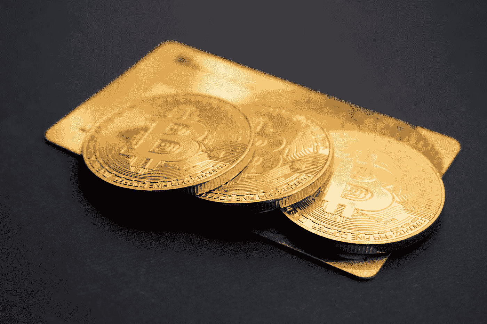

# 加密货币初级速成班

> 原文：<https://medium.datadriveninvestor.com/cryptocurrency-beginner-crash-course-175a4aeb732d?source=collection_archive---------3----------------------->

## 进去，出去的时候尽量不要撞到头。

Photo by [Austin Distel](https://unsplash.com/@austindistel?utm_source=medium&utm_medium=referral) on [Unsplash](https://unsplash.com?utm_source=medium&utm_medium=referral)

我们身处一个一切皆有可能的世界。就在 8 年前，比特币和区块链技术是地下犯罪团伙的秘密，在这个秘密空间里没有鲸鱼和鲨鱼。见鬼，当时甚至没有加密货币行业。

快进到 2017 年，我们已经进入了新百万富翁的时代，希望财务独立和财富。我的意思是，这可能是加密史上最激动人心的时刻之一。现在，在 2020 年，市场仍然不稳定，税收、华尔街和政府的持续威胁几乎使金融自由的希望完全停止。世界标准化的加密货币，银行已经进入市场，人们的兴趣可能达到了历史最高水平。我会说，先不要把 crypto 排除在外，我相信它的受欢迎程度还在上升。

**我的预测仍然是:**

1.  现实世界使用的加密货币和替代硬币将保持价值。
2.  只要罪犯、政治犯和政府继续使用诸如 Monero、比特币、莱特币、Dash 和任何他们在逃亡或资助行动时使用的硬币。财富增长是有价值和潜力的。
3.  隐私和人类数据作为一种有价值的商品将继续增长，保护和保密的需求也将增长。

尽管如此，我不是专家，这篇文章不应该被用作投资工具，但是，你可以在文章的最后加上你的想法。现在，如果你不知道所有这些大惊小怪的事情是什么，并且很好奇，那么这是对你的加密货币世界的介绍，以一种你实际上可以消化的方式。

 [## 总部位于瑞士的 ETP 进入加密交易市场|数据驱动的投资者

### 虽然金融市场几乎没有沉闷的时刻，特别是在引入…

www.datadriveninvestor.com](https://www.datadriveninvestor.com/2019/03/10/swiss-based-etp-enters-the-crypto-trading-market/) 

# 什么是加密货币？

加密货币是一种虚拟货币，不是由任何政府或冒充政府分支机构的秘密银行发行的。这是一种完全去中心化的点对点支付方式，为用户提供快捷、部分不可追踪和私密的交易。

# 加密货币的类型

加密货币的世界非常广阔，这里没有严格的分类。加密货币超过 1200 种，而且还在不断增加，这非常具有挑战性，即使是业内专家也很难跟踪全天候发生的所有变化。是的，市场不睡觉。然而，加密货币仍然可以根据其制作方式进行大致分类:

## **可开采的加密货币**

最初的加密货币是可开采的加密货币。这种加密货币的形成类似于金矿开采者的活动，他们使用特定的设备，以艰苦的耐心在矿井中寻找贵金属。

可开采的加密货币是通过使用巨大的计算能量解决巨大的数学难题来“开采”的，回报是加密货币本身。加密货币开采可能会很昂贵，因为它很可能会增加您的能源成本和支出。

## **不可开采的加密货币**

它们通常由制造商以代币的形式出售。这一趋势因以太坊区块链而变得流行，但这类加密货币通常在成为虚拟货币之外还有更大的用途。大多数人都是为了解决特定的现实世界问题，这些问题跨越了保险、房地产、银行、公用事业和医疗保健等行业。

# 加密货币市值

加密货币在总市值方面有不同的规模。它们的大小通常与它们存在的时间长短无关，因为即使是新硬币也可能在价值上超过旧的和经过审查的硬币。总价值在 3 亿美元到 20 亿美元之间的小型加密货币，这构成了该行业的大部分。小盘密码价值最小，风险较高。有价值略高于 10 亿美元但不到 100 亿美元的中型加密货币，还有价值超过 100 亿美元的大型加密货币，如以太坊和比特币。

# 投资加密货币

Photo by [Dmitry Demidko](https://unsplash.com/@wildbook?utm_source=medium&utm_medium=referral) on [Unsplash](https://unsplash.com?utm_source=medium&utm_medium=referral)

直到 2017 年，加密货币的大部分投资都是由使用分散加密交易所的个人进行的。这有点像 Sharebuilder，只不过，在某个时候，你的交易是真正隐藏的。然而，有一种日益增长的趋势已经完全吞噬了这个行业，并改变了对 cryptos 的投资。当金钱发挥作用时，鲸鱼就会出现。当水里有血的时候，鲨鱼会来饱餐一顿。

习惯这个比喻，这是什么永远改变了加密投资，对冲基金的家伙，和股票市场的“专家”进入市场。那么在一个没有规定的操场上会发生什么呢？没有经验的投资者会被机器人、鲸鱼和鲨鱼屠杀。

谁想和鲨鱼一起游泳？至少对鲸鱼来说，你有残羹剩饭。然后是云挖掘，也称为远程挖掘。一些投资者想完全避开交易所，所以他们跳进了云采矿。云挖掘是利用硬件力量远程挖掘加密货币的过程。这种采矿模式的出现是因为采矿难度的增加使得采矿爱好者在家中开采比特币和金币无利可图。

# 什么是云挖掘

云挖掘为人们提供了一个独特的机会来开始挖掘加密货币，而不需要在硬件或技术知识方面进行大量的初始投资。尽管云挖掘模型很简单，但还是有必要详细说明一些细节，特别是要强调远程挖掘有两种形式:托管或基于云的挖掘。

## 远程托管挖掘

远程挖掘的第一种形式是远程托管。这种型号适合具有丰富采矿经验和专业知识的用户，他们需要高度控制自己的采矿硬件。在这种模式下，采矿硬件托管在远程数据中心，用户对采矿硬件的设置和配置拥有完全控制权。

这家矿商向托管公司支付一笔费用，包括维护和电费。这有助于矿工处理与套件维护相关的风险以及与硬件运输相关的任何风险。

另一方面，它给采矿者带来了初始硬件投资的风险，并且需要更多的时间和技术知识来成功实施。可以说，远程托管采矿的好处在于，您可以保持对采矿流程、维护支持和后续硬件所有权的控制。

如果您正在考虑建立这样一个运营机构，那么从投资和技术经验两方面来看，最大的缺点是与采购昂贵的硬件和高昂的进入成本相关的风险。

## 云挖掘

第二种也是更容易实现的远程采矿模式是云采矿，通过这种模式，采矿者购买一小部分采矿能力，而不需要云采矿服务提供商托管和拥有的硬件。

Photo by [Dmitry Demidko](https://unsplash.com/@wildbook?utm_source=medium&utm_medium=referral) on [Unsplash](https://unsplash.com?utm_source=medium&utm_medium=referral)

服务提供商负责配置硬件、维持正常运行时间以及选择最高效、最可靠的池。该选项提供了一系列好处:即时连接(意味着没有硬件运输等待时间和交付风险)，固定维护和电费，并且没有与在家采矿相关的噪音、热量或空间等滋扰。另一个关键点是，云挖掘的这种模式不需要任何技术经验。

矿工必须了解挖掘过程，但是，这种模式不需要硬件专业知识或大量的配置/实施成本。由于客户可以购买他们想要的任何数量的矿业电力，这意味着投资水平将只取决于矿商的野心。这也意味着与远程托管模式相比，进入成本和后续风险要低得多。

云采矿非常适合想要尝试采矿并开始赚取加密货币的新手矿工。云采矿也是经验丰富的矿工，他们不想要托管或家庭采矿的麻烦或风险。

# 我如何开始用三个步骤建立我的加密组合

这正是我在做研究之外开始使用加密货币的方法，事实证明对我来说回报非常好。即使在 2020 年，我的投资组合也在继续获利。请注意，在投资你的钱或比特币之前，你应该总是对替代币和任何投资进行研究。这是对我有效的方法，我不能保证对你也有效，但是基础很重要。

# №01 -

研究…做你的研究…对我来说，我注册了一个在线加密市场来购买和存储加密。我想如果罪犯使用了某种密码，那么这些就是我想要的。我购买了 5 枚莱特币和 2 枚比特币，考虑到比特币不到 3000 美元，莱特币不到 40 美元，这在当时是一笔相当不错的交易。Monero 和 Dash 在当时并不一定可用。

如果你从 100 美元开始，我会建议你把它变成比特币，当你可以增加更多时，我会建议你购买莱特币、Monero 或 Dash。

# №02 -

永远用“钱包”保护你的加密货币，永远不要把你的加密货币留在网上或交易所。首先，我建议你下载一个桌面钱包。我推荐一个硬件钱包，这可能是保护你的加密货币的最佳方式。

**最佳硬件钱包**是**账本 Nano S** ，这是迄今为止最值得推荐的加密硬件钱包。它易于管理和使用，桌面应用程序非常用户友好。

关于用户友好性，可能是**最受欢迎的桌面软件钱包**，我推荐[**Exodus**](https://www.exodus.io/) 或 [**Jaxx**](https://jaxx.io/) 用于**比特币($ BTC)****莱特币($LTC)** 和**以太坊($ETH)** 它们都非常用户友好，易于安装和操作。

另一个不错的选择是[**MyETHERWallet.com**](https://www.myetherwallet.com/)，不过，《出埃及记》现在允许你储存 ERC20 代币。

# №03 -

这一步有点棘手，但是只要有耐心和理解，你就有可能在这个舞台上做得很好。你想上一个交易所(求推荐留下回复)，这样你就可以用你的比特币购买额外的“替代币”，比如**Digibyte(＄DGB)**、**NEO(＄NEO)**、**Komodo(＄KMD)**、**Monero(＄XML)**、**chain LINK(＄LINK)**等等。

# №04 -

将你的比特币、莱特币或以太币转移到交易所(根据你有多少硬币和代币，我会给每个硬币和代币转移一定的数量)。您将使用您的比特币、莱特币或以太币购买其他替代币和密码。

> 现在你 HODL，永远不要做 FOMO 交易！！！

# №05 -

研究密码、替代硬币、ico，并努力制定最适合您需求的策略。我从日内交易开始，专门发展我的比特币和莱特币。这是不推荐的，除非你知道你在做什么，并能成功地阅读图表。如果这是你的策略，那么学习如何设置“止损/限价/市价单”

这个加密货币初学者速成班不是投资建议，但我希望它有所帮助。让我知道你对加密市场的想法和它现在的位置，你的成功和挫折。

你认为 crypto 还有潜力吗？