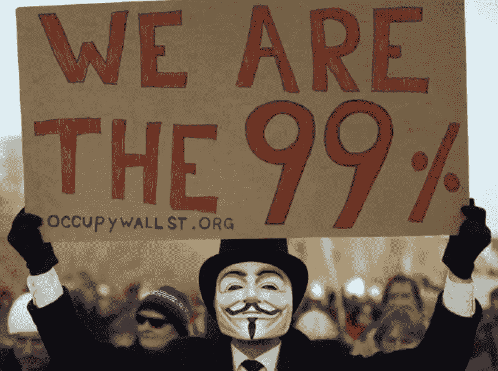

# 加密货币需要新的定位来成为下一种货币

> 原文：<https://medium.datadriveninvestor.com/cryptocurrency-needs-a-new-positioning-to-become-the-next-money-d7fef997cc2e?source=collection_archive---------8----------------------->

Parasite Movie Stills courtesy of CJ Entertainment

加密货币是革命性的，雄心勃勃的。它的目标是成为下一个货币。

十多年前，市场上第一个数字资产比特币问世。现有超过 2000 种加密货币。但是他们的收养率仍然不到全球人口的 1%。

作为一名营销人员，我认为加密货币需要新的营销来加速其采用。

Andreas Antonopoulos 的开放区块链的五大支柱:(1)开放(2)无国界(3)中立(4)抵制审查(5)公开。这是一篇见解深刻、无懈可击的论述。但是从营销的角度来说，它有一个问题。外行人很难理解。它的目标受众仅限于工程师和技术爱好者。

营销打造业务，技术打造产品。工程师制造技术“特征”营销人员通过关注用户利益来重新定义他们的价值观。

创造加密货币的价值主张来说服普通用户并不容易。加密货币是一个全新的概念。理解它需要了解货币和互联网的历史。此外，安德烈亚斯断言，金钱是沟通，是人权的一部分。随着政府最终同意政教分离的想法，人们会明白为什么我们要在 30 到 50 年后把钱和国家分开。但是，营销是为了现在。它应该会推动当今用户的采用。

在《T2》《T3》《T4》中，尼亚尔·费格森将银行创造信用、债券的诞生、公司和股票市场的诞生以及约翰劳的法定货币称为货币进化中的伟大革命。是什么促使用户采用这些新的创新？

在我看来，每一个都满足了人类比现在更富有的野心。丰富多了。用户可以发现经济和个人财富“爆炸式”增长的潜力。

加密货币怎么样？它是否也提供了一个新的机会，让我们在财富的尺度上更上一层楼？

乍一看，加密货币似乎试图缩小我们的经济规模，将交易规模缩小到点对点。它看起来对所有权比对赚钱更感兴趣。简单来说就是思想上的而不是实际上的。

此外，它对取消中介的赞扬是大规模采用的一个很高的障碍。**加密货币有什么特性可以激励用户采用它作为下一种货币吗？**

# 权力下放并不意味着取消中介机构

在纳撒尼尔·波普的[’*数字黄金*中，你可以找到关于比特币第一个定位信息的叙述。那是在 Satoshi 准备在 Slashdot 上发布比特币 0.3 版本的时候。](https://www.amazon.com/dp/B01D8KFX9Q/ref=dp-kindle-redirect?_encoding=UTF8&btkr=1)

*一个小团队来回讨论提交给 Slashdot 编辑的正确语言。当有人建议比特币作为* ***“不受任何政府管辖”出售时，Satoshi 勃然大怒***

“我绝对没有做出任何这样的嘲讽或断言，*”Satoshi 写道。*

这让我们对加密货币有了新的认识。比特币的诞生不是为了取代当前的货币，也不是为了将政府从金融体系中移除。

其白皮书建议的是一个电子交易系统'*不依赖于金融机构'*作为可信任的第三方。它所指出的当前系统的固有弱点是交易的可逆性。Satoshi 没有说应该取消中介。

# 以不同的方式翻译该功能以适应当今的需求

我们不一定非要把‘不依赖金融机构’翻译成移除它们。相反，我们可以说，我们将**‘增加’一个不依赖于金融机构的新交易系统。这将引导我们以不同的方式看待和使用加密货币。**

**尼亚尔·费格森从货币的历史中得到了以下启示:**

**“贫穷不是贪婪的金融家剥削穷人的结果。这与金融机构的缺乏(T21)有更大的关系，与银行的缺乏(而不是银行的存在)有更大的关系。”**

**事实上，次贷危机的发生是因为那些信用评分低且负债累累的人无法获得贷款。在货币的演变过程中，我们今天需要的是增加更有效的信用网络，而不是移除已有的信用网络。**

# **我们的时代反映在占领华尔街运动和寄生虫中**

****

**占领华尔街运动始于 2011 年，口号是“**99%的人不会沉默**”，指的是美国最富有的 1%和其他 99%的人之间的财富分配。这个主题似乎仍然能引起世界各地许多人的共鸣，以一部韩国电影的受欢迎程度来判断。**

**《寄生虫》是去年全球谈论最多的电影，也是第一部赢得奥斯卡最佳影片奖的外语片。导演奉俊浩说:“我们现在都生活在同一个国家:资本主义国家，在这里，‘经济停滞’已经成为新常态。”**

**在电影中，*基宇*有天赋和成功的潜力。但他并不是出生在一个富裕的家庭。令人心碎的是，他肯定买不起他父亲被困的房子。*金先生的台湾蛋糕店生意失败了。 *Geun-sae* 借了一些坏账，被迫躲避高利贷。他们是固定的，停留在他们当前的状态。***

# **打破金融包容性障碍的资金**

***寄生虫*讽刺精英统治的神话。例如， *Ki-jeong* 通过与富裕家庭的可靠来源建立联系，获得了她的家教职位。在招聘过程中，她的平面设计技能甚至她的假文件都被忽略了。**

**当“精英管理”一词在上世纪 50 年代被引入时，“优点”被定义为“智商加上努力”它经常因其精英主义而受到批评。但是今天的功绩不一定要这样对待，因为我们生活在互联网时代。**

**世界上所有的信息和知识在互联网上都唾手可得。 **Web 2.0(社交网络)**使人类能够与全球任何人联系，能够向全世界传播我们的声音，并建立我们的个人品牌。**

**而现在， **Web 3.0(区块链)**进来了。安德烈亚斯声称，有史以来第一次，金钱变成了信息。您可以在此基础上构建和扩展，创建支持智能合约、安全令牌产品甚至加密货币的应用程序。你可以做自己的市场，这个市场不一定要有很多用户。如果你至少有一个用户，你就创造了一个市场。**

**成熟的金融机构值得信赖，因为它们保持着很高的准入门槛。他们需要财务凭证来获得融资。在*寄生虫*，*金先生*拿不到银行的钱。但是他可以使用加密货币。**

**他可以在 Web 3.0 上用一个由他自己的规则制定的智能合约打开他的融资市场，瞄准世界各地有自己各种投资标准的同行。**

**如果他努力用可信的故事和网上内容为他的第一家店建立一个强大的品牌，他将有更大的机会实现他的目标。更重要的是，Web 3.0 上的金融市场不是一个不流血的冷血赚钱的零和游戏。相反，这将是一个丰富生活的网络。点对点交易听起来很小。但是，如果他们向地球上 100%的人“开放”无国界、中立、无审查和公开的机会，那将是巨大的。**

# **结论**

**奉俊昊评论说，“一旦美国人克服了字幕一英寸高的障碍，他们将会看到更多精彩的电影。”**

**我认为，一旦区块链人，包括开发者和用户，克服当前定位的一英寸高的障碍，跳出框框使用技术，加密货币可能会成为我们这个时代新的惊人货币。**