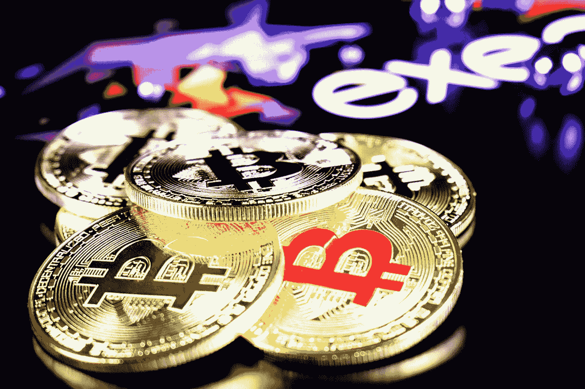

# 加密货币开始主宰货币世界

> 原文：<https://medium.datadriveninvestor.com/cryptocurrency-starting-to-dominate-the-world-of-money-6803ab1c4db4?source=collection_archive---------12----------------------->

## 数字货币

## 好奇的头脑需要知道

Photo by [Clifford Photography](https://unsplash.com/@cliffordgatewood?utm_source=medium&utm_medium=referral) on [Unsplash](https://unsplash.com?utm_source=medium&utm_medium=referral)

> “我确实认为比特币是第一种有潜力改变世界的(加密货币)。” **—贝宝联合创始人彼得·泰尔**

加密货币曾被认为是未来的技术。今天，它彻底改变了我们的金融世界。它改变了我们日常支付商品和服务的许多方面。

加密货币的快速增长表明，基于其诸多优势，它将在我们的未来扮演重要角色。

当货币不稳定时，它提供了替代方案，减少了外币转账欺诈，易于追踪，保护了消费者，并可以增加电子商务贸易的成功。

自从法定货币出现以来，我们一直用它进行日常交易。它让全球的交易和交易变得更加便捷。

2008 年全球金融市场崩溃后，中本聪，一个匿名的个人或团体，发布了比特币[纸](https://bitcoin.org/bitcoin.pdf)，成为第一种加密货币。很明显，加密货币是独一无二的、革命性的；它们挑战了传统金融市场的核心基础设施和流程。在接下来的 11 年里，加密货币获得了极大的关注。

## 加密货币是下一个潜在的范式转变吗？

身价超过 180 亿美元的著名对冲基金经理雷伊·达里奥去年写了一篇有趣的[文章](https://www.linkedin.com/pulse/paradigm-shifts-ray-dalio)。他推断，根据他的经验，金融市场每十年都会出现一次范式转换。发现并适应这些变化对一个人的成功至关重要。

达利奥认为，另一场金融危机即将到来。国际冲突，如贸易战、永久负利率、债务和非债务负债上升以及货币永无止境的贬值，将房地产、股票和其他投资置于风险之中。因此，各国政府都在积极寻找解决这些问题的方法，否则另一场金融危机可能会殃及整个世界。

Dalio 认为，政府可以通过将大量债务货币化和货币贬值来解决这一困境。欧元和美元等货币将会贬值，从而减轻政府的负担。

另一方面，对投资者来说，吸引力是一种“价值储存手段”，即使政府持有的货币贬值，这些资产也能保值。虽然 Dalio 使用黄金作为例子，但它与货币相同，如比特币。像黄金一样，比特币多年来一直保持着它的价值。

一旦投资者接受加密货币作为黄金的数字版本，后者的价值将立即飙升。

 [## 完美的加密交易策略|数据驱动的投资者

### 如果你在交易游戏中已经有一段时间了，你可能听说过“支点”和“VWAP”前者听起来像…

www.datadriveninvestor.com](https://www.datadriveninvestor.com/2020/08/31/the-perfect-crypto-trading-strategy/) 

## 不可信系统

加密货币和比特币的支持者声称这些平台从根本上说是不可信的，与任何政府、民族国家或机构都没有联系。因此，它们是独立的，不会像美国联邦政府的法规那样受外部因素的控制。

如果这是一件好事，困境是另一个争论，但一些批评者对加密货币的自主性提出了质疑。根据他们的说法，支持加密货币的基础设施是不平衡的，位于中国。如果中国政府对加密货币实施严格监管，可能会导致整体基础设施崩溃。

## 加密货币能否取代或补充传统金融体系？

关于加密货币的研究和文献表明，您可以将它们用于:

新的支付/兑换系统

一项投资

投机交易工具

由于加密货币作为支付系统的新颖性，其外汇交易成本非常低，并且独立于政府、货币当局和第三方金融中介。

与此同时，一些[专家](https://link.springer.com/chapter/10.1007%2F978-3-319-42448-4_6)认为不知情的用户不会将加密货币视为一种替代交易系统。相反，他们更多地将它们视为另类投资工具。由于这些资产与其他资产回报(如债券、股票、法定货币和商品)的相关性极小，加密货币在投资组合风险管理方面有着光明的未来。

几年前，对加密货币作为一种投机交易工具的研究还不够。然而，时过境迁。目前，很明显，投机正在鼓励越来越多的用户持有比特币。

以全球货币的形式，加密货币不代表任何特定国家，提供了针对特定国家风险的对冲机会。此外，购买加密货币为对冲过高的通胀打开了一个令人兴奋的机会。这类似于黄金等资产在过去如何[运作](https://linkinghub.elsevier.com/retrieve/pii/S1062940815000698)。

Photo by [Viktor Forgacs](https://unsplash.com/@sonance?utm_source=medium&utm_medium=referral) on [Unsplash](https://unsplash.com?utm_source=medium&utm_medium=referral)

值得注意的是[货币转换](https://doi.org/10.1111/coep.12151)经常发生在恶性通货膨胀中，越来越多的秘鲁人和玻利维亚人注意到这一点，他们更喜欢美元而不是他们不稳定的货币。当时，他们认为美元更安全。

同样，遭受通胀打击的人可以转而使用和持有加密货币，以备不时之需。我们已经在委内瑞拉看到了一个真实的例子。当通货膨胀上升时，委内瑞拉人对他们的政府和货币失去了信任，这引发了[加密货币采矿](https://linkinghub.elsevier.com/retrieve/pii/S0378437119305175)的流行。2012 年至 2013 年期间，在[塞浦路斯](https://scholarworks.lib.csusb.edu/jitim/vol24/iss3/2/)发生了类似的发展。

从现在开始，我们可以得出结论，政治不稳定和通胀危机将很快增加加密货币的采用。

越来越可以预见的是，加密货币注定将在全球经济结构中扮演重要角色。经济学家、投资者、研究人员和其他利益相关者已经开始做准备，深入了解区块链技术的工作原理，为他们进入蓬勃发展的加密货币领域铺平了道路。

尽管加密货币在过去十年中引起了大量的炒作，但它们尚未成熟。因此，有必要对其潜力和风险进行评估和评价。

据 Anne Haubo [Dhyrberg](https://www.researchgate.net/publication/284078502_Hedging_Capabilities_of_Bitcoin_Is_it_the_virtual_gold) 称，比特币可以对冲美元和金融股票市场。与黄金一样，比特币可以将市场上的任何风险降至最低。短期内，比特币在用户中的活跃交易频率揭示了其萌芽的对冲能力，表明比特币在这里停留在全球股市的投资组合分析利基，并具有良好的未来低风险管理。Dhyrberg 相信比特币会降低投资风险。

## 加密货币会再次崛起吗？

许多专家认为，加密的冬天已经结束。许多人认为，比特币被福布斯(Forbes)提名为密码爱好者，将在未来十年产生巨大收益。加密货币行业不可预测。即便如此，我们正进入一个相对稳定的时期。人们现在更加重视加密货币的基本面。他们正在努力理解加密货币生态系统。

根据一些分析师的说法，加密货币的出现与互联网的出现没有什么不同。因此，在易用性、可用性和可伸缩性方面，它可能会经历 1995 年互联网经历的同样的发展。

虽然只有 11%的美国人拥有比特币，但在智能手机等其他技术发展中，采用趋势类似。

一些专家强调新冠肺炎病毒的爆发是一个分水岭。这种破坏影响了传统的投资和银行机构，促使公众去试试运气，投资加密货币。它保护他们免受不确定的法定货币和通货膨胀的冲击。

密码分析师还认为，加密货币交易没有那么匿名和安全，人们可能需要依靠虚拟专用网络或 VPN。他们觉得网络罪犯可以利用加密货币。过去，他们黑了几家加密交易所，从用户那里窃取了大量硬币。

## 评估加密货币创新

目前，加密货币提供了变革性和多样化的尖端进步。此外，它可能成为对未来金融体系的投资，被称为分散金融(DeFi)。DeFi 是一个由公共区块链运行的新的替代金融系统，因此任何人都可以链接到它，从而实现更大的可访问性。交易的可见性也令人耳目一新，它将迫切需要的透明度融入到现有系统中。以特定方式使用的加密货币:

比特币、Stellar、Ripple 都是出了名的不需要金融中介就能买到商品。

稳定货币，如和戴，与商品或货币挂钩，如黄金。

Monero 和 Zcash 通过加密技术实现了用户匿名。

以太坊和 EOS 允许个人在没有中央权威的情况下构建应用，在没有中介的情况下链接创作者和用户。

## 最后的想法

多年来，加密货币以其波动性而闻名，尤其是比特币。这种波动性受到全球监管的影响，特别是美国金融监管机构对比特币使用的监管。简而言之，我们可以用以下内容来总结加密货币的未来:

Snapchat 的第一位投资者杰里米·刘(Jeremy Liew)[预计，到 2020 年，比特币价格将突破 50 万美元。](https://cointelegraph.com/news/bitcoin-price-will-reach-500000-realistically-snapchats-first-investor)

根据专家的分析，加密货币将继续以爆炸式的速度增长，主要基于备受推崇的区块链技术。

大量行业领导者已经开始支持加密货币和区块链技术。有了如此广泛的支持，加密货币可能会有一个更光明的未来。

最后，不要把加密货币崩溃看得太重。它们并不是加密货币未来的最佳指标。你知道比特币被宣布死亡 [382 次](https://99bitcoins.com/bitcoin-obituaries/)吗？自 2010 年以来，许多著名的消息来源预测比特币的死亡。今天，我们知道加密货币是过去十年来 T2 表现最好的资产。

**访问专家视图—** [**订阅 DDI 英特尔**](https://datadriveninvestor.com/ddi-intel)