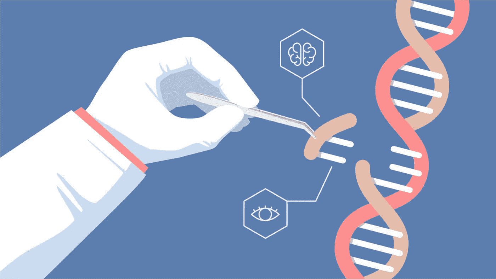
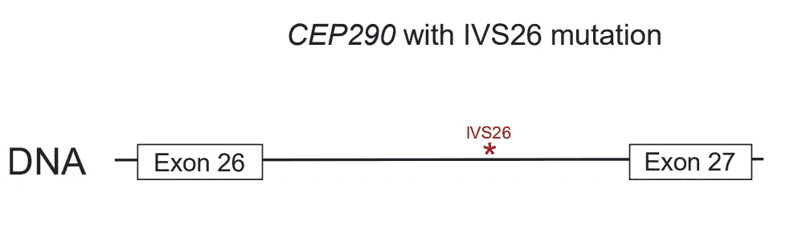
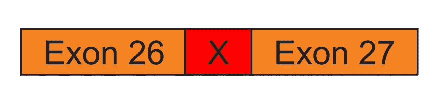
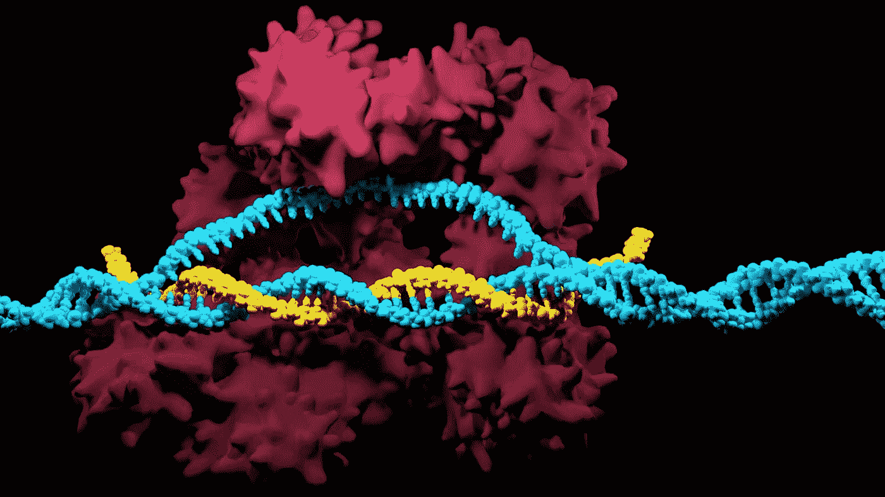
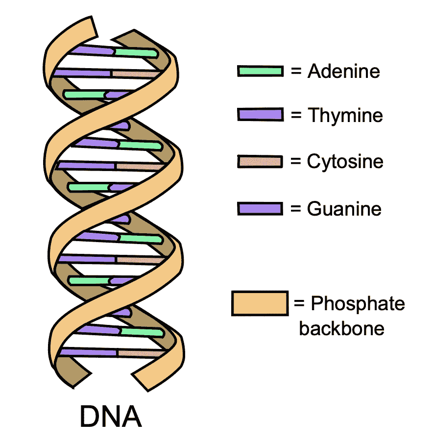
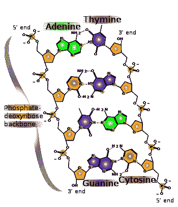
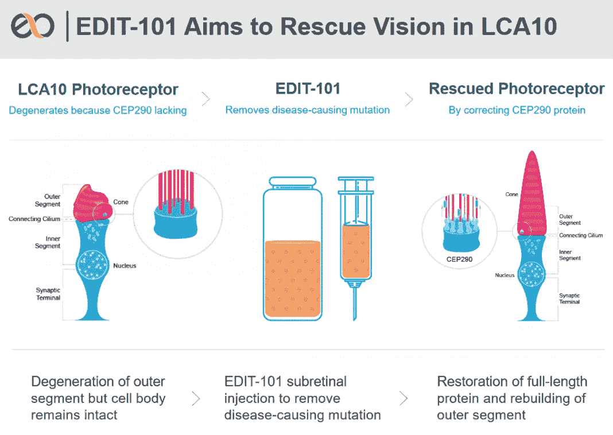

# 用 CRISPR——革命性的基因编辑工具治愈失明

> 原文：<https://medium.datadriveninvestor.com/curing-blindness-with-crispr-revolutionary-gene-editing-tool-851f10fc5c8c?source=collection_archive---------0----------------------->

## 利用 CRISPR 技术治疗 Leber 先天性黑蒙症 10，这是一种罕见的导致失明的遗传性视网膜疾病。

*我无法想象一个黑暗的世界，但我知道，生活在这样一个世界里的人，很容易成为* ***我*** *，也很容易成为* ***你*** *。我很幸运，也由衷地感激我没有生活在黑暗的世界里。这就是为什么我作为一个 16 岁的指数科技爱好者决定为这个问题做点什么。*

Can you imagine living like a blind person without vision for even a day? **Challenge for those who are hyper-grateful:** go blindfolded for a day.

记住这个*—****我和你*** *最终被赋予了健康的视力，这纯粹是运气，治愈那些患有视网膜疾病和所有其他疾病的人是我们的问题。***

# **介绍 CRISPR——治疗失明**

**一项革命性的基因编辑技术 CRISPR 于 2012 年首次推出，在科学界引发了关于这项技术治疗疾病的潜在用途的令人难以置信的研究和进步。**

** [## 医疗保健的未来正在被一场大型技术入侵所塑造|数据驱动型投资者

### 过去十年，全球经济的所有部门都经历了大规模的数字颠覆，而卫生部门现在…

www.datadriveninvestor.com](https://www.datadriveninvestor.com/2018/11/02/the-future-of-healthcare-is-being-shaped-by-a-big-tech-invasion/) 

我们可以利用 CRISPR 来治疗癌症等各种疾病，设计完美的“设计师婴儿”，创造比普通植物吸收更多二氧化碳排放的超级植物，等等！

在接下来的几年里， **CRISPR 在治疗点突变**(单突变)引起的疾病方面最有潜力，比如镰状细胞贫血和肌营养不良，具体来说，我将重点关注 Leber 先天性黑蒙症 10。

## Leber 先天性黑蒙是一个单一突变的结果

Leber 先天性黑蒙 10 (LCA 10)是遗传性失明的最常见原因。**这都是** **基因 *CEP290 中的一个单一突变引起的，称为 IVS26 突变。***

这种突变导致眼睛后部的感光细胞(称为视网膜)无法将光线转化为大脑信号，从而导致严重的视力损伤。

我们要逆转 Leber 先天性黑蒙患者的疾病所要做的就是修复一个单一的突变。

CEP290 gene with IVS26 mutation (shown in red)

使用 CRISPR，我们可以通过删除 IVS26 突变(以红色显示)来编辑基因。

The x shown in red represents the IVS26 mutation and this is the CEP290 gene.

通过删除 IVS26 突变，基因的功能被完全恢复，因此意味着光感受器的功能也被恢复。

After deleting the IVS26 mutation, the functionality of the CEP290 gene is restored.

## CRISPR 技术是如何工作的？

一种被称为 CRISPR cas 9(CRISPR 蛋白的一种)的特定类型的 CRISPR 被证明对编辑和剪切基因有用。

CRISPR Cas 9 有两个组成部分:Cas 9 蛋白和指导 RNA。

*   **cas 9 蛋白**负责切割 DNA。
*   **指导 RNA (gRNA)** 负责识别突变序列，然后用 Cas9 蛋白将其剪切/切割。

Dark pink: Cas9 protein, Blue: target DNA, Yellow: gRNA

在我们深入研究 gRNA 是如何工作的之前，让我先带你回到高中生物学(我希望我没有引发任何恐怖的回忆)。

我们的人类基因组由核苷酸组成，更准确地说是由 4 种核酸碱基组成:腺嘌呤(A)、胸腺嘧啶(T)、鸟嘌呤(G)和胞嘧啶(C)。

1 个核苷酸由 2 个相互结合的碱基对组成。

我们人类 DNA(脱氧核糖核酸)的结构由两条链组成，由相互结合的碱基对和 2 个糖-磷酸骨架形成，因此产生了双螺旋结构。

腺嘌呤与胸腺嘧啶结合，鸟嘌呤与胞嘧啶结合形成碱基对。

碱基 RNA(核糖核酸)由 4 种略有不同的核酸碱基组成:腺嘌呤(A)、尿嘧啶(U)、鸟嘌呤(G)和胞嘧啶(C)。*注意，RNA 由尿嘧啶组成，而不是胸腺嘧啶。*

为了形成碱基对，腺嘌呤与尿嘧啶结合，胞嘧啶与鸟嘌呤结合。

Chemical structure of DNA.

为了使用 CRISPR 编辑基因，研究人员首先找出导致疾病的突变序列，在这种情况下，这就是 IVS26 突变的序列。然后设计一个指导 RNA，使其具有与突变基因序列结合的核酸序列。

为简单起见，我们假设突变的基因有一段 TCCTGTCA 的序列。gRNA 将具有 AGGACAGU 序列(U 与 A 结合——因为在 RNA 中胸腺嘧啶被尿嘧啶取代)。

然后 gRNA 扫描你的基因组来寻找突变。gRNA 在搜索突变时会附着在你的 DNA 上。然而，如果 gRNA 的相应序列与 DNA 不匹配，它就会释放出来，不会附着在 DNA 上。

一旦 gRNA 发现突变并附着在突变的 DNA 序列上，附着在 gRNA 上的 Cas9 蛋白就会通过删除/剪掉突变的 DNA 来完成它的工作，这就是 IVS26 突变。

CRISPR Cas9 — Cas9 proteins are analogous to scissors that cut the DNA

突变被删除后，基因被纠正，功能恢复。

在其他情况下，删除突变可能不足以治疗疾病，可能需要插入新的健康 DNA 序列的额外步骤。

# 公司聚焦:Editas

[Editas Medicine](https://www.editasmedicine.com/) 是一家专注于外推 CRISPR-Cas9 技术治疗 LCA10 潜力的公司。

大约一年前，Editas Medicine 针对 LCA10 的 CRISPR 疗法 Edit-101 获得 FDA 批准进入临床试验。率先在美国开展使用 CRISPR 技术的体内临床试验。

目前，Editas Medicine 的方法涉及编辑患者的体细胞，这意味着编辑后的基因组不会被后代传递和遗传。

更多关于 Editas Medicine 的研究信息，可以访问[这里](https://www.nature.com/articles/s41591-018-0327-9)。

CRISPR 的未来真的是前所未有的，颠覆性的！然而，这项技术并不完美。CRISPR 面临的一些技术问题包括:

*   “剪切”出 DNA 并插入新 DNA 的精确度
*   CRISPR 的交付方式
*   我们已经探索了我们基因组的大部分以及编辑它的影响。偏离目标和对准目标的副作用总是有可能的。

你能想象一个没有 CRISPR 和基因编辑的世界吗？基因编辑是一个非常强大的工具，尽管它面临着一些挑战，但我对它的潜力持乐观态度。

# 关键要点:

*   CRISPR Cas9 是一种基因编辑技术
*   Cas9 是一种蛋白质，其功能就像剪刀一样切割 DNA
*   LCA10(遗传性眼病)是由 CEP290 基因的单一突变引起的。通过使用 CRISPR 删除这种突变，我们可以潜在地逆转 LCA10 患者的失明。

*如果你喜欢这篇文章，如果你也留下一些掌声，我将不胜感激！随时和我联系* [*LinkedIn*](https://www.linkedin.com/in/joey-mach-6293b1175/?originalSubdomain=ca) *！*

**😊乔伊****