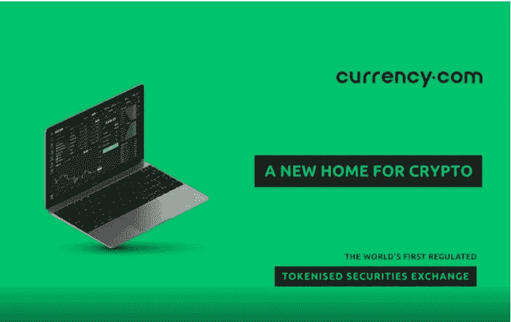
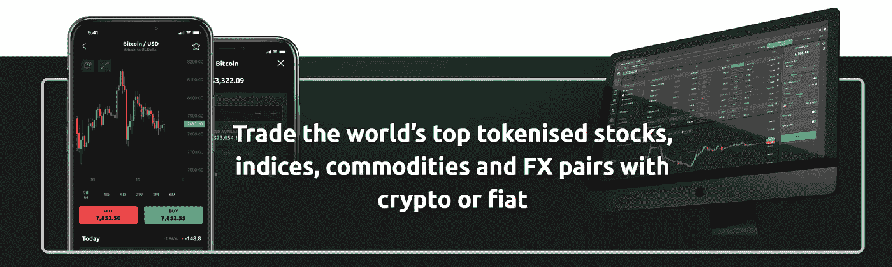
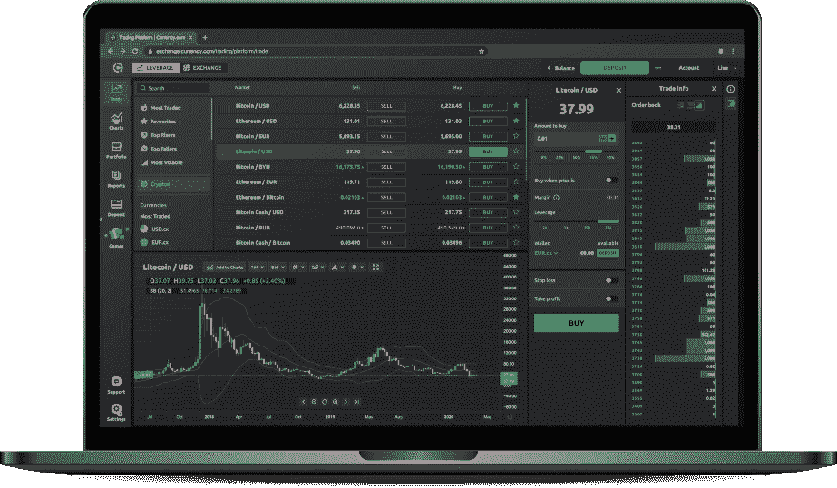

# Currency.com，买卖密码的新范式转变

> 原文：<https://medium.datadriveninvestor.com/currency-com-the-new-paradigm-shift-when-it-comes-to-buying-and-selling-crypto-c9557a55f785?source=collection_archive---------21----------------------->

自 2009 年比特币问世以来，加密货币已经走过了漫长的道路。目前，交易和使用加密货币的人比以往任何时候都多；随着世界逐渐接受加密货币，它们在金融界的重要性也在增加。因此，有必要弥合加密货币世界和现实世界金融资产之间目前存在的差距。输入[currency.com](https://currency.com/)。

Currency.com 正通过其创新平台加快弥合这一差距。该平台希望将市场过渡到交易的未来。很大一部分市场目前在纽约证券交易所进行交易；然而，通过正确的工具，这可以转移到像 currency.com 这样的平台上

# **终极交易平台**

通过 currency.com，交易者可以获得各种全球金融工具。它创造了一个没有歧视的生态系统。无论有没有法定货币，交易都是可能的。这使得加密货币投资者能够分散投资组合。例如，加密投资者可以通过 currency.com 无缝投资白银或黄金。

 [## 为什么参与正确的加密交换至关重要|数据驱动型投资者

### 到目前为止，与黄金和美元相比，加密货币，尤其是比特币，已经显示出巨大的增长

www.datadriveninvestor.com](https://www.datadriveninvestor.com/2020/07/16/why-engaging-with-right-crypto-exchange-matters/) 

为了实现无缝交易能力，currency.com 必须满足以下市场需求:

**1。** **调节**

Currency.com 符合白俄罗斯金融监管机构的要求。这是世界上第一个受监管的令牌化资产加密交易所。这使其有别于市场上的竞争对手，如 Bitmex。因为他们的竞争对手缺乏任何适当的监管，他们在交易时将用户置于风险之中。

该条例还允许 currency.com 与银行和其他中央金融机构直接交易。这使它们相对于竞争对手具有战略优势，因为竞争对手由于缺乏监管而限制了它们的准入。该规定进一步让平台获得更多投资机会，其用户可以轻松获得这些机会。

最近，currency.com 得到了进一步的承认。直布罗陀金融服务委员会授予 currency.com 分布式技术许可证。

**2。** **品种**

为了吸引更多的观众，currency.com 需要多样化。第一步是获得监管，这将允许它获得更多真实世界的资产。Currency.com 随后与受到监管和尊重的 Capital.com 合作。他们的合作伙伴关系允许 currency.com 的用户与加密和非加密资产进行无缝交易。

**3。** **安全**

Currency.com 遵循所有反洗钱规则和严格的安全措施，以确保其平台和用户的安全。它还通过实时价格警报和负余额保护提供风险管理。

**4。** **灵活性**

通过 currency.com，你可以用比特币交易各种数字资产，包括令牌化的股票和指数。

# **产品和服务**

Currency.com 配备的产品和服务使用户能够在各种市场上进行有竞争力的交易。这些包括:

## **1。** **购买比特币**

该平台通过苹果商店提供的[购买比特币应用](https://crypto.currency.com/)，让购买比特币成为一种流畅的体验。你可以通过信用卡直接从智能手机上购买比特币。Currency.com 支持通过万事达卡和维萨卡支付。你也可以通过该应用通过银行支付购买比特币。

## **2。** **专业交流平台**

Currency.com 拥有 pro exchange 平台下的所有交易选项。它提供最先进的服务，使交易无缝衔接。有了 currency.com 代币，用户可以在全球顶级市场进行投资。购买令牌化资产的用户可以将它们安全地存储在平台上。这些资产可以在方便的时候提取。

使用 currency.com，用户还可以获得 75 个技术上准确的指标，以改善他们的投资选择。图表易于阅读，帮助用户发现额外的交易机会。他们还帮助用户改善他们的市场跟踪。

对于个性化的体验，图表是可定制的。您可以根据自己的喜好定制图表，方法是更改它们的外观，最重要的是更改它们所跟踪的资产。

所有的 pro exchange 服务都可以通过一个适用于[安卓](https://app.appsflyer.com/com.currency.exchange.prod2?)和 [iOS](https://app.appsflyer.com/id1458917114) 的移动应用来访问。该应用程序使 currency.com 的交易变得智能、简单和安全。通过 2FA 增强了应用的安全性。用户在应用程序中获得与使用浏览器时相同的功能。

## **3。****Currency.com API**

API 允许用户在平台上建立自己的交易体验。Currency API 允许个人或各种实体通过该平台自动化其交易策略。使用 API 的可用交易选项包括令牌化货币对、指数、商品和加密货币。在使用 API 时，Currency.com 也提供其风险管理工具。因此，即使在自动交易中，用户也可以放心地减少过度损失。

## **4。** **公司代币**

Currency.com 允许其用户投资一家公司的代币。只要 100 美元，你就可以进行投资，并获得 5.5%的年利率，高于任何银行利率。此外，投资公司代币让用户有机会根据公司业绩赚取更高的利息。

当选择加入时，currency.com 对资金的存取或代币的买卖收取零佣金。为了给投资者信心，currency.com 记录了投资的代币由有价值的抵押品如财产和担保来担保。

与银行存款相比，代币让用户有机会获得更高的利率。

# **透明度**

在所有的交易中，currency.com 都保持透明。交易费用在加入时就向潜在用户说清楚了，以防止任何不必要的误解。货币在监管和操作上也是透明的。通过其透明度，该平台将从其不断增长的用户群中获得信心，成为一个值得信赖的加密交易平台。

# **结论**

在加密货币的这个过渡阶段，Currency.com 占据着至关重要的位置。它提供了进入分散和集中市场的最佳途径。通过遵守法规，currency.com 在所有竞争中脱颖而出。

随着用户群的稳步增长，currency.com 可能会成为分散市场中最大的交易平台之一。

了解更多详情

# 社交媒体渠道

**脸书:**[**https://www.facebook.com/currencycom/**](https://www.facebook.com/currencycom/)

**推特:**[**https://twitter.com/currencycom**](https://twitter.com/currencycom)

**电报组(英文):【https://t.me/Currencycomenglish】**

****Kakaotalk:**[https://open.kakao.com/o/gp0NNl7](https://open.kakao.com/o/gp0NNl7)**

**免责声明:*我不会从我对 currency.com 交易平台的评论中获得任何利益。这篇文章不打算作为投资建议。这只是我的看法。一如既往，DYOR 在投资之前。***

****访问专家视图—** [**订阅 DDI 英特尔**](https://datadriveninvestor.com/ddi-intel)**