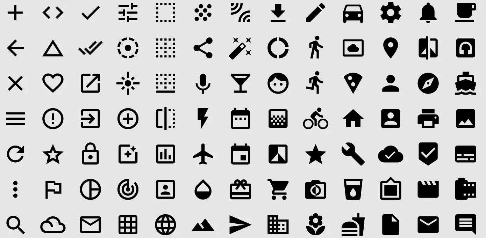
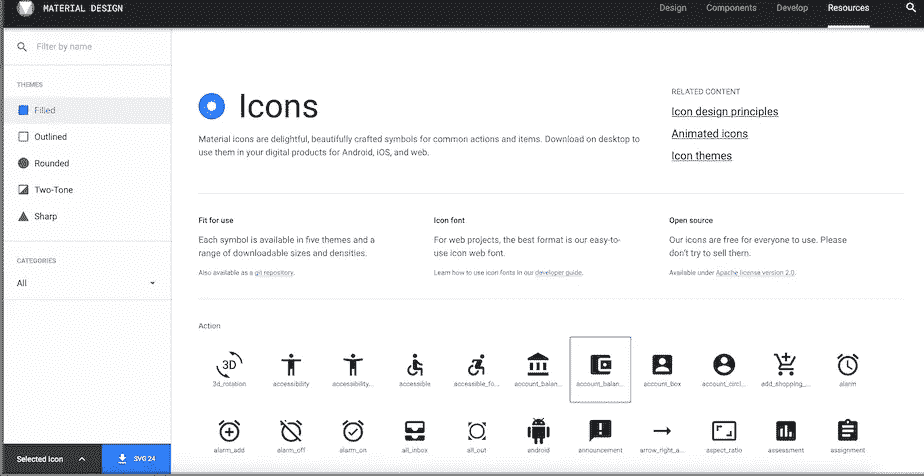
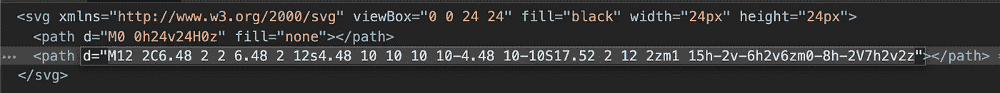
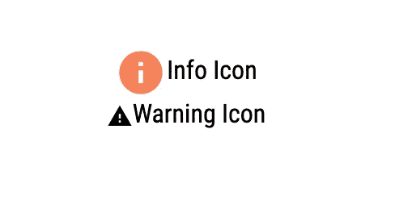

# React 中的图标组件

> 原文：<https://medium.datadriveninvestor.com/custom-icon-component-in-react-bc95a4eca52c?source=collection_archive---------0----------------------->



创建您自己的定制图标组件来呈现您的 SVG。

这是我一直想做的事情，创建我自己的图标组件，这将是一个非先导的可重用组件。这意味着任何人都可以使用该组件，就像我们使用 jsx 组件一样，无需多想。老实说，只有一步是固执己见。

> **为什么要创建你自己的图标组件**，有这么多棒的库已经为我们做了，像 [mui 图标](https://material-ui.com/components/material-icons/)和[字体棒极了](https://fontawesome.com/how-to-use/on-the-web/using-with/react)？

答案很简单，这些库为我们提供了数百个图标，但我们可能只需要几个，再加上那些定制的图标。

有了自定义组件，您就有了更多的控制权，基本上可以自由选择。另一个原因是设计的一致性。在显示屏的某些部分，图标可能会混合或具有不同的大小，这是很常见的，这意味着自定义加库图标的行为应该是相同的。为了使它们的行为相同，视口大小和 svg 大小必须匹配，所以一般来说，一种解决方法是拥有同一个 svg 的多个副本。**这是不可接受的**。

> 从我们的组件以及我这样做的原因和方式开始。

所以我做了一些调查，看看构建一个 svg 图标到底需要什么，老实说并不多:

*   svg，高度，宽度，视图框
*   svg 的子路径，填充颜色和 d，这是路径定义

我发现除了 **d** 属性之外的一切都是一样的，所以我所要做的就是更新图标设计的 **d** 道具并填充以定义图标的颜色。

```
<svg viewBox='0 0 24 24' width='24px' height='24px'  xmlnsXlink="http://www.w3.org/1999/xlink" >
 <path fill={color} d={iconPath[icon]} />
</svg>
```

现在我必须为路径创建自己的定义库，这比我想象的要容易。所以就我个人而言，我更喜欢[材质图标](https://material.io/resources/icons/?icon=warning&style=baseline)，这就是为什么我会在我的例子中使用它。你可以从链接下载图标，记得下载为 svg。



Material Icon

在文本编辑器或浏览器中打开 svg，并复制 d 属性中的**值。**



SVG code

有了这个实现，我们实际上不需要 svg 文件，因此作为一个额外的奖励，我们减少了最终的包大小。


iconlib only contains info icon definition

创建一个新文件，它将作为我们的路径定义库。创建一个对象，该对象将存储所有定义并将其导出为默认值

```
export default {
**info**:"M12 2C6.48 2 2 6.48 2 12s4.48 10 10 10 10-4.48 10-10S17.52 2 12 2zm1 15h-2v-6h2v6zm0-8h-2V7h2v2z",
**warning**: "M1 21h22L12 2 1 21zm12-3h-2v-2h2v2zm0-4h-2v-4h2v4z",
};
```

库完成后，是时候创建组件了。它将是一个功能组件，因为现在在 React 中一切都是功能。

[](https://www.datadriveninvestor.com/2019/01/23/which-is-more-promising-data-science-or-software-engineering/) [## 数据科学和软件工程哪个更有前途？数据驱动的投资者

### 大约一个月前，当我坐在咖啡馆里为一个客户开发网站时，我发现了这个女人…

www.datadriveninvestor.com](https://www.datadriveninvestor.com/2019/01/23/which-is-more-promising-data-science-or-software-engineering/) 

那么我们需要哪些主要的道具来渲染我们的图标呢？首先是我们要显示的 ***图标名称*** ，其次是 ***颜色*** ，第三是 ***大小*** 的图标。这些是基本道具，但我们也应该允许设计者/开发者更新样式，所以让我们添加 **className** 和 **style** ( *将遵循与普通 jsx 元素*相同的基于对象的模式)道具来添加 css 道具。

```
const Icon = ({ size, color, icon, className, style}) =>  {
return (
 <svg className={className} style={style} viewBox='0 0 24 24'     width={`${size}px`} height={`${size}px`}  xmlnsXlink="http://www.w3.org/1999/xlink">
  <path fill={color} d={iconPath[icon]} />
 </svg>
 );
};
```

如果图标有一个默认的大小和颜色，而且设计师不会更新每个图标的样式，那该怎么办？因此，我们需要添加回退值，这就是 **defaultProps** 发挥作用的地方:

```
Icon.defaultProps = {
 size: 16,
 color: "#000000", 
 viewBox: "0 0 24 24",
 style: {},
 className: "",
};
```

正如你所看到的，viewBox 也是 defaultProps 的一部分，这是因为这将为我们提供更多的图标大小的可伸缩性。我们需要添加到组件的最后一件事是一些默认样式，这可以通过创建一个具有默认样式的对象来完成。

```
const defaultStyles = { display: "inline-block", verticalAlign: "middle" };
```

至此，我们的组件完成了，让我们看看最终的代码:

Final Code

使用图标组件:

```
<div className="App">
 <div>
  <Icon icon="info" size={32} color="#f78259" /> 
  <span>Info Icon</span>
 </div>
 <div>
  <Icon icon="warning" />
  <span>Warning Icon</span>
 </div>
</div>
```

输出:



rendered icons

感谢您阅读本文，如果您需要任何澄清以更好地理解上述实现，请告诉我。