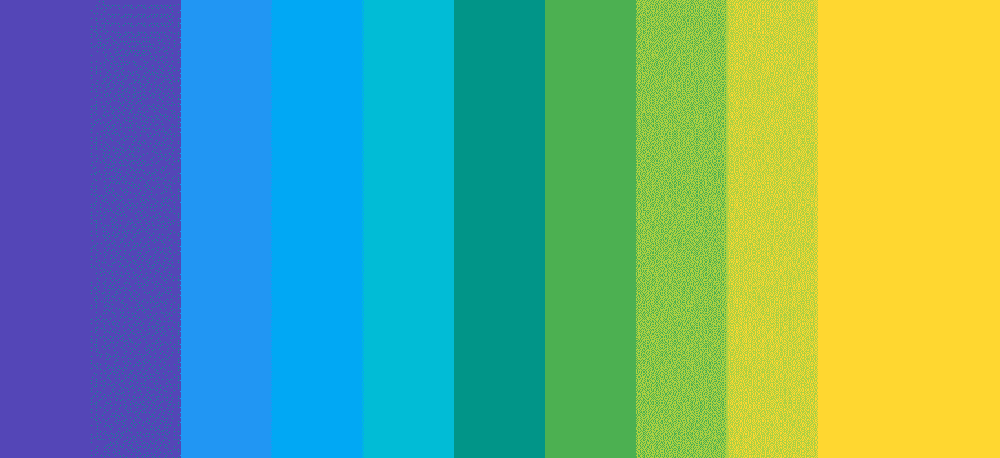
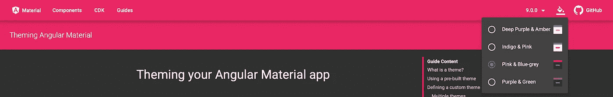
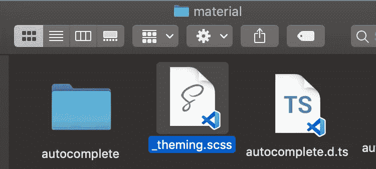
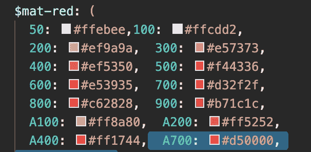
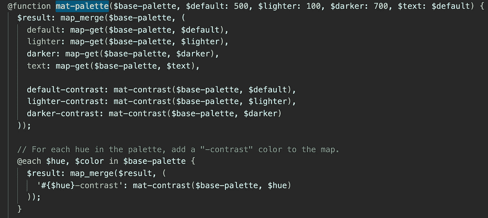
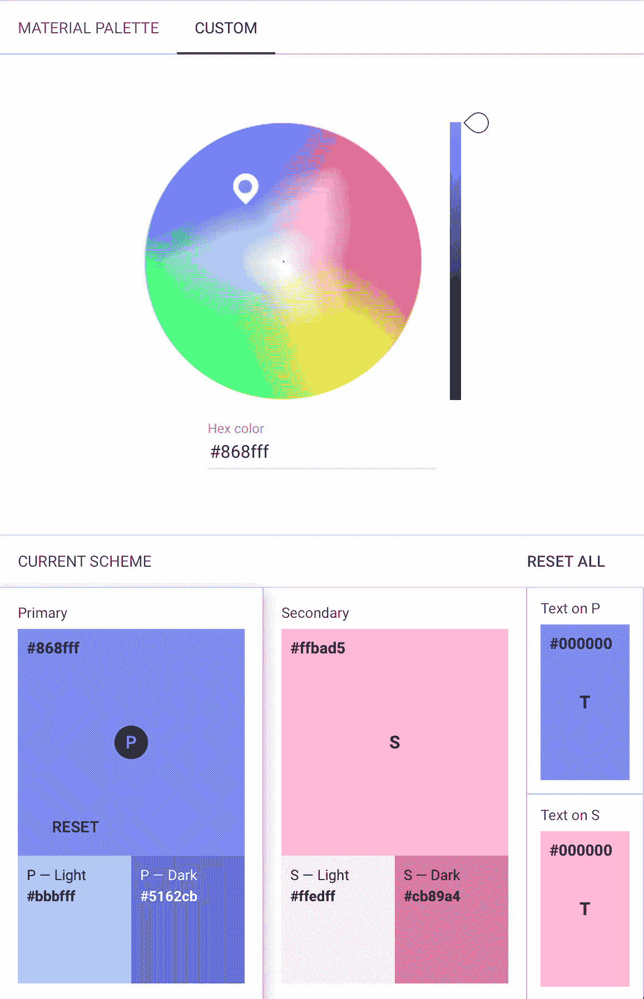

# 棱角分明的材质主题

> 原文：<https://medium.datadriveninvestor.com/custom-theming-in-angular-material-a9b0d7cd68a8?source=collection_archive---------0----------------------->



## 用棱角分明的材料创建您自己的定制主题

最后，在 **ReactJS** 工作了很长时间后，我想通过使用 Angular 做一个项目来克服我对 **Angular** 的偏见。

给我的第一个要求是使用*材料*实现主题化。做过 [*Material-UI*](https://material-ui.com) ，对材质的设计理念有所了解。对于棱角分明的材料来说是新的，这意味着按时交付将是一个障碍。

我的第一步是，浏览官方的主题化文档。在开始之前，了解一些基本知识会有所帮助。默认情况下，材质提供四种主题:深紫琥珀色、靛粉色、粉蓝灰色和紫绿色。

*注意:*您可以直接在材料网站上查看，只需点击油漆桶图标*。



default themes

> 如何定义一个主题？

这比你想象的要简单，你只需要三种颜色:

*   原色:主要颜色
*   强调色:作为次要颜色
*   警告:为了你的警告

*注意:*我将使用 SCSS 来实现主题化*

设置主题包括创建一个新的 theme.scss 文件(如果你想的话)，从 *material* 导入材质主题文件，并包含 mat-core mixin。

```
@import '../node_modules/@angular/material/**theming**';@include **mat-core();**
```

现在是有趣的部分，让我们选择一些颜色。材质主题化可以让你访问它自己的调色板，你可以从节点模块的材质文件夹中访问主题化文件。



theming.scss

一些颜色包括:浅红色、浅紫色、浅粉色等。

> 现在让我们创建主题:

```
$custom-theme-primary: mat-palette($mat-purple)
$custom-theme-accent: mat-palette($mat-pink);
$custom-theme-warn: mat-palette($mat-red, 500, A200, A700);//creating your theme
$custom-theme: mat-light-theme($custom-theme-primary, $custom-theme-accent, $custom-theme-warn);//updating main theme 
@include angular-material-theme($custom-theme);
```

你一定想知道什么是 **500，A200 & A700** 值，让我们检查主题文件:



mat color shades

500、A200 和 A700 是颜色的不同饱和度。 *mat-palette* 函数接受五个参数，第一个是调色板，其他三个是主色、浅色、深色(按顺序)，最后一个是文本颜色(我们将忽略它，因为它指向主色)。

*注:*材料中使用的每种颜色分为 3 种色调，一种是主色，一种是浅色，最后一种是深色。*

但是我们只为 ***警告*** 定义了这些属性，而没有为 ***主*** 和 ***重音*** *定义这些属性。*发生这种情况是因为，其他参数有默认的回退值。



mat-palette function

要将 ***自定义主题*** 应用于特定的材料组件，只需包含 mat-module 主题并传入您的主题即可。

```
@include angular-material-theme($custom-theme);@mixin angular-material-theme($theme) {@include mat-button-theme($theme);@include mat-button-toggle-theme($theme);@include mat-card-theme($theme);}
```

至此，自定义主题完成，可以与 *mat-components* 一起使用。

我也希望那是为了我的案子，但不是。这样做的原因是，我正在做的项目/产品是为多个客户设计的，主题将根据客户来设置。

[](https://www.datadriveninvestor.com/2019/02/21/best-coding-languages-to-learn-in-2019/) [## 2019 年最值得学习的编码语言|数据驱动的投资者

### 在我读大学的那几年，我跳过了很多次夜游去学习 Java，希望有一天它能帮助我在…

www.datadriveninvestor.com](https://www.datadriveninvestor.com/2019/02/21/best-coding-languages-to-learn-in-2019/) 

由于每个客户都有自己的预定义调色板，我们不能要求他们找到主题文件中提供的最接近的颜色。考虑到这一点，我不得不想出一个新的解决方案，其中色板是自定义的。

第一步是最容易的，我从客户那里得到了*三种颜色*，所以现在我已经定义了原色、强调色和警告色。但是现在我需要每种颜色的两种饱和度，感谢上帝，材质有自己的 [*颜色工具*](https://material.io/resources/color/#!/?view.left=0&view.right=0&primary.color=673AB7&primary.text.color=F57C00&secondary.color=FF9100) *。*



Maerial Color Tool

你所需要的是你的颜色的十六进制值，它会提供你需要的另外两个饱和度。

现在是时候定义您自己的定制调色板了:

```
$primary: (
 Main:#522058,
 Light:#804b85,
 Dark: #28002f,
 contrast: (
  Main: #f5f5f5,
  Light: #000,
  Dark: #fff
 ));$accent: (
 Main: #F7931E,
 Light: #ffc453,
 Dark: #be6500,
 contrast: (
   Main: #fff,
   Light: #fff,
   Dark: #fff
  ));
$warn:$mat-red;
```

*注意:*对比度用于定义文本/字体颜色*

定义了调色板之后，就该创建主题了，但是我们需要对上面定义的自定义主题逻辑做一些小的修改:

```
$custom-theme-primary: mat-palette($primary, Main, Light, Dark);$custom-theme-accent: mat-palette($accent, Main, Light, Dark);$custom-theme-warn: mat-palette($warn, A200, A400, A700);
```

可以看出，对于 custom-theme-primary 和 custom-theme-accent，我们将 **Main、Light、Dark** 定义为最后的参数，但是对于 custom-theme-warn，我们使用标准的 **A200、A200、A700、**这是因为这些参数充当*键*来获取调色板中的颜色值。

定义好一切后，我们可以使用以下内容创建主题:

```
$custom-theme: mat-light-theme($custom-theme-primary, $custom-theme-accent, $custom-theme-warn);
```

但是主题只与素材模块集成，那么定制模块呢？

```
//using custom theme colors@mixin cust-theme($theme) {
$primary: map-get($theme, primary);
$accent: map-get($theme, accent);
$warn: map-get($theme, warn);//header color
.header {
 font-weight: 400;
 background: linear-gradient(to right, mat-color($primary, Light),   mat-color($primary, Main));
 color:#fff;
 }
}
```

在 main/style.scss 文件中:

```
@import './theme.scss'; 
//the theme.scss contains $custom-theme defined above@include cust-theme($custom-theme);
```

至此，主题化的基础就完成了。

我希望这能帮助你理解如何在有棱角的材料中进行主题化。尝试一下，让我们做一些令人敬畏的主题。