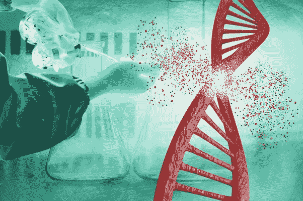
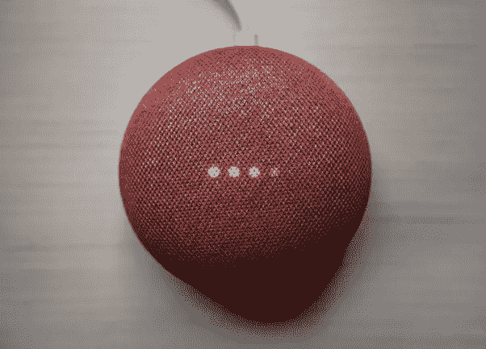
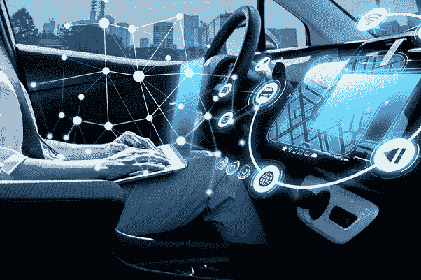
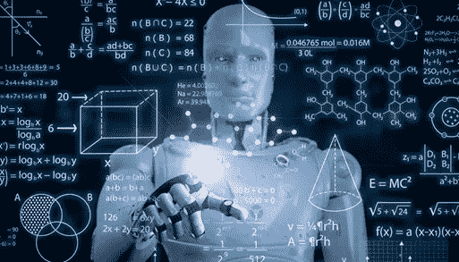
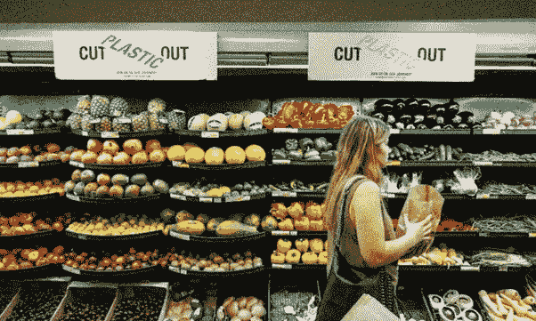

# 导致颠覆性趋势的客户行为|数据驱动的投资者

> 原文：<https://medium.datadriveninvestor.com/customer-behavior-leading-to-disruptive-trends-data-driven-investor-38d71e01e664?source=collection_archive---------18----------------------->

企业正在认识到客户行为的转变。

随着世界正在收获第四次工业革命的好处，颠覆性技术也正在演变成最美好的阶段。进步的步伐空前的快，消费者行为的转变，喜好是影响新技术发展的一些因素。

## **生物黑客，生物技术的突破**

Photo by: Getty Images/iStockphoto

生物黑客，也称为 DIY 生物学，是一种简单到复杂的生活方式调整和改善你的健康和福祉。它的范围从快速的 T2 减肥到增强大脑功能。简单来说，生物黑客是一种在科学和自我实验的帮助下改变你的化学和身体特性的实践，以获得更好的能量，增强身体及其功能。

我们中的许多人可能没有听说过“生物黑客”这个术语，但我相信我们中的许多人会看到 Twitter 首席执行官杰克·多西称赞[的 11 点生活方式计划的好处。你可能也听说过美国国家航空航天局的雇员乔赛亚·扎伊纳使用基因编辑技术 CRISPR。](https://www.nytimes.com/2019/05/02/fashion/jack-dorsey-influencer.html)

毫无疑问，人们的健康意识比以往任何时候都强，并且正在实施许多方法来预防疾病。事实上，这一“新产业”正在发展壮大，涉及生活和商业的各个领域，如体育、医学、生命科学等。

让我们想象一下生物黑客对社会的影响一旦人们开始目睹它的好处，认知功能的水平会提高，生产力会提高，社会生活会改善，因为人们会体验到更多的能量和良好的心情。公司也开始开发新的或增强的产品来服务这个市场。到 2025 年，人类生物学增强市场预计将增长至 23 亿美元。

 [## 公司从客户服务中获得回报|数据驱动的投资者

### 欣欣向荣的公司将他们的成功归功于客户服务。这包括企业对客户和企业对企业…

www.datadriveninvestor.com](https://www.datadriveninvestor.com/2019/12/09/companies-reap-rewards-from-customer-service/) 

围绕这种生物黑客技术有许多伦理上的讨论，使用这种技术时要小心谨慎，这是至关重要的。以一种无条件的方式进行这些生物黑客同样会受到法律的影响。

# 语音技术，人机交互的下一次进化

Photo by [Clay Banks](https://unsplash.com/@claybanks?utm_source=medium&utm_medium=referral) on [Unsplash](https://unsplash.com?utm_source=medium&utm_medium=referral)

随着越来越多的顾客采用新技术以最好的方式安慰他，新产品和服务被开发出来以迎合他的需求。一个令人欣慰的创新产品是使用语音技术的智能扬声器苹果的 Siri，亚马逊的 Alexa 和谷歌的 Assistant 都是语音技术的例子。这项技术实现了人、服务和设备之间的三向交互，并彻底改变了消费者与计算机设备的通信模式。

这是人机交互的下一个发展史，它归功于[人工智能](https://www.datadriveninvestor.com/glossary/artificial-intelligence/)、[物联网](https://www.datadriveninvestor.com/glossary/internet-of-things/)、[云计算](https://www.datadriveninvestor.com/glossary/cloud-computing/)和数据收集的进步。

进入商业领域， [Strategy Analytics 的最新报告显示，2020 年 Q1 已售出 2820 万台，比 Q1 2019 年高出 8.2%](https://timesofindia.indiatimes.com/gadgets-news/amazon-continues-to-beat-google-apple-in-the-smart-speaker-market/articleshow/75755234.cms)。仅在美国，就有近 5000 万人使用智能音箱。据专家称，50%的在线搜索将通过语音搜索进行。

以上数据让我们清楚地了解了语音技术市场以及人们和社会如何从中获益。

嗯，有一个关于我们的安全和隐私问题的争论，需要立即引起注意。建议在隐私和安全问题上进一步开发这种技术。

# 电气化，自主移动

Photo by: Thinkstock

一个以减少碳足迹、减少二氧化碳排放和更环保的环境为使命的世界已经使电动汽车(ev)市场激增。2019 年，电动汽车市场在全球范围内的销量达到了创纪录的水平。欧洲和美国主要在采用电动汽车环境和在其国家建立意识方面做了大量工作。

一笔巨额资金在[R](https://www.datadriveninvestor.com/glossary/r/)D 用于开发以特斯拉和谷歌母公司 Alphabet 的名义制造的自动驾驶汽车(AVs)。其他全球汽车公司在开发 AVs 和亚马逊方面也不落后，一家主要的电子商务公司正在试验自主包裹递送服务，这必将彻底改变递送服务行业。

据推测，两种截然不同的商业模式将会出现，并与传统汽车制造商和移动服务提供商共存。据推测，随着电池寿命和总拥有成本的提高，主要的技术进步将使客户的购买选择转向电动汽车。

# IoRT(机器人物联网)，一个具有具身认知的现代小发明

虽然机器人已经在工业和其他领域的许多自动化目的中使用，但机器人和物联网的集成正在成为一个入口，统称为 IoRT(机器人物联网)。 [IOT](https://www.datadriveninvestor.com/glossary/internet-of-things/) 是一个由遍布全球的许多物理设备组成的互联网络，通过互联网连接传感器，提供数据收集和共享。人工智能( [AI](https://www.datadriveninvestor.com/glossary/artificial-intelligence/) )被提升到机器人系统，能够解释、评估和执行决策功能，这些功能可以与人类处理任务的方式相媲美。通过传感器技术将机器人和人工智能结合起来被称为“具身认知”。

也请看看我的另一篇文章- [机器人技术-商业视角](https://www.datadriveninvestor.com/2020/08/19/robotics-a-business-perspective/)，它提供了关于机器人技术的发展和商业在全球市场中形成的方式的见解。

# 自觉消费主义和道德生活方式

很明显，最近消费者的喜好正从一些奢侈品转向更健康的产品。他们已经开始了解整个生态系统的一部分，以及它是如何影响环境的。基于植物的食物，免费的塑料产品，有机农业，天然纤维衣服是一些消费者感兴趣的例子。他们更倾向于有道德和可持续实践的产品，这增加了对可持续产品的需求。

另一个主要的趋势转变是少吃或不吃肉制品，少喝酒，不吃皮革制品。为了迎合这种新的消费者转变/喜好，公司配备了提供无数的产品。这种趋势可能还处于初级阶段，但在未来，人们对这种产品的需求肯定会增加。

*原载于 2020 年 9 月 4 日 https://www.datadriveninvestor.com**[*。*](https://www.datadriveninvestor.com/2020/09/04/customer-behavior-leading-to-disruptive-trends/)*

***进入专家视图—** [**订阅 DDI 英特尔**](https://datadriveninvestor.com/ddi-intel)*