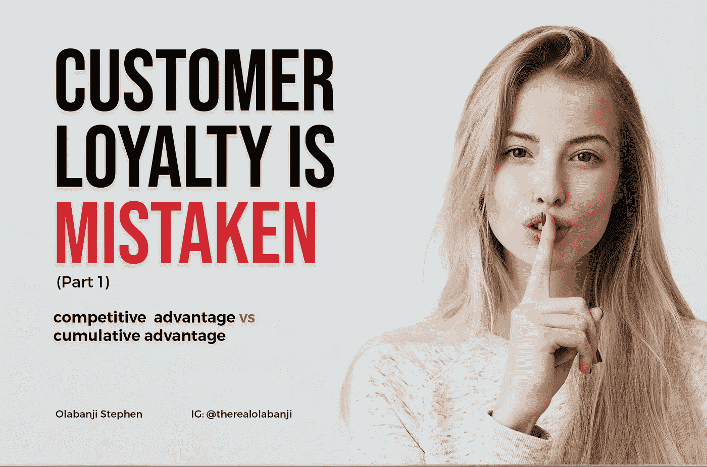

# 顾客忠诚度是错误的(第一部分)

> 原文：<https://medium.datadriveninvestor.com/customer-loyalty-is-mistaken-part-1-54b867661d6?source=collection_archive---------43----------------------->

## 竞争优势与累积优势

如果你知道大脑是如何工作的，你就会明白，人类的运转比他们看起来控制的更自动。事实上，大脑会直接抵制任何似乎会给它带来压力的东西。这就是为什么学习新事物的早期会有压力。

人类是一种习惯性的动物，打破习惯是非常困难的。

这让我想到了品牌重塑的想法，因为很多时候这是一个糟糕的想法，而且做得不对，尤其是对于那些已经建立了一定权威的品牌来说，不过我们以后再来讨论这个问题。

顾客忠诚度可能被高估了，某些人口统计的人会一直使用一种产品的想法有时很牵强，因为如果人类是习惯的动物，那么顾客不会对你的产品忠诚，他们会忠于他们的习惯

客户忠诚度主要基于竞争优势的理念，许多组织认为保持竞争优势是他们保持相关性和增加市场份额所必须做的。嗯，这似乎不完全正确，因为当面临选择时，人类总是选择熟悉、简单的选项，所以，只有当你的产品一直是简单的出路时，你才处于优势；这个习惯。

这篇文章的观点是**寻求让你的产品成为习惯(简单的方法)是一个更好的焦点。**

一篇由 A.G .雷富礼和罗杰 l .马丁撰写的关于战略的 HBR 文章说

> 研究表明，让竞争优势真正可持续的是帮助消费者避免做出选择。他们选择市场上的领先产品，主要是因为这是最容易做到的事情。每次他们选择它，它的优势就会超过他们没有选择的产品或服务，创造出作者所说的*累积优势。*

先说累积优势。头脑对联想的兴趣超过了它可感知的计算能力。

斯科特·伯林纳托说:“因为人们是习惯的动物，他们对新奇事物视而不见。我们的大脑使用启发法和经验来判断事物是什么，通常会跳过场景中意想不到或新奇的方面。”

神经科学家 Moshe Bar 说，“我们认为当我们看着某样东西时，大脑会问，这是什么？但实际上它会问，这是什么样的？”也就是说，我们正在将来自世界的输入与我们以前遇到的事情进行匹配。

这意味着，思考累积优势更聪明，换句话说，定位是简单的选择，深化你的产品是习惯。

改变你的品牌和不断使用含糊不清的“高超”沟通并不总是有助于保持习惯。因此，我们不妨从沟通的角度重新定义什么是优秀，什么不是。

Roger L. Martin 和 A . G Lafely(目前在 SnapChat 董事会任职)就如何保持累积优势提出了有用的见解，例如:

**早早走红**

**为习惯而设计**

**品牌内部创新**

**保持沟通简单**

他们认为，这种表现不是通过向客户提供完美的选择，而是通过向他们提供简单的选择来维持的。因此，即使一个价值主张是最初吸引他们的东西，它也不一定是吸引他们的东西。

我将在接下来的几篇文章中写这些。

与此同时，我今天将在 spark 社区发表关于个人成长和组织的演讲，我已经决定发布我的演讲笔记，所以我可能明天就发布。留下来。