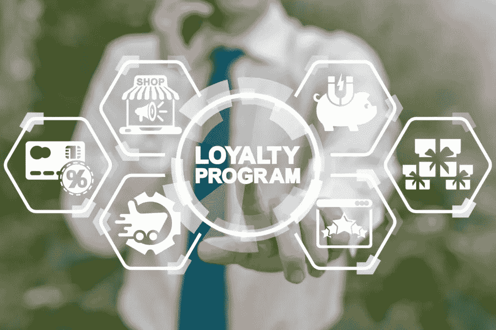

# 零售业中的客户忠诚度计划——定义、类型和优势

> 原文：<https://medium.datadriveninvestor.com/customer-loyalty-programs-in-retail-definition-types-and-benefits-90f83ec44764?source=collection_archive---------14----------------------->

网上购物和店内购物本身就是一种很好的体验，但更好的是从中获得回报。零售商为他们的顾客提供各种生意奖励，希望能吸引他们继续回来。这是零售商将一次性购物者变成回头客的主要方法之一。然而，并非所有的客户忠诚度计划都是一样的。在本文中，我们将告诉您最常见的奖励计划类型以及每种奖励计划的好处。首先，我们先来一个定义。

# 什么是忠诚度计划？

忠诚度计划为在您的商店购物的客户提供一些奖励。他们参观和消费越多，回报就越多。当顾客看到他们花的钱得到了回报，他们会更愿意回来再次购买。如果我们考虑一下零售商和所有商店的庞大数量，包括实体店和网店，忠诚度计划正在成为帮助企业在拥挤的市场中脱颖而出并吸引客户的工具。在这一点上，让我们仔细看看忠诚度计划提供的好处。

# 忠诚度计划有什么好处？

客户忠诚度计划的最大好处是提高客户保留率。实际上，你给了顾客额外的动力来光顾你的商店。那些让消费者花的钱更有价值的公司将最终赢得他们的生意。这反过来会给你的公司带来更多的好处，比如增加收入。事实上，最近的数据显示，一家公司 65%的业务[来自现有客户](https://www.smallbizgenius.net/by-the-numbers/customer-loyalty-statistics/#gref)，忠诚计划[将整体收入提高了 5-10%](https://www.annexcloud.com/blog/10-pros-and-cons-of-loyalty-programs/)。

此外，客户赞赏计划让你更好地了解你的客户。从奖励计划中获得的所有数据对于分析每个购物者的偏好并为他们提供详细的建议非常有用。通过提供这样的定制体验，人们将更有可能从你这里购买，因为他们会明白你得到了他们的需求。同样，商店忠诚度计划可以让你奖励你最珍视的顾客。你将能够查看所有的数据，并识别经常购买高级和奢侈品的人，以及只是寻找特价商品的人。

# 不同类型的零售商奖励计划

*   积分计划——这是零售客户忠诚度计划中最直接、最常见的计划之一。顾客花的钱越多，他们赢得的积分就越多。这些积分后来转化为一些折扣、商店信用、现金返还或其他任何东西。一个很好的例子是丝芙兰提供的程序。您花费的每一美元都可以赢得一个积分，以后可以兑换折扣、礼品等。
*   游戏计划——将忠诚度计划游戏化可以非常有效地让人们购买更多商品并获得奖励。他们可以和朋友竞争，这也带来了更多的人。一个令人兴奋的例子是 Wizzzi 增强现实游戏，它在一个巫师世界中有 26 个独特的角色。如果满足某些条件，客户将收到一张互动购物卡。这张卡可以用来玩桌面游戏和增强现实游戏。
*   返现计划——一些商店提供各种返现优惠。这个概念很简单——你花得越多，你得到的就越多。通常，这将是总额的一个百分比。这是世界上最大的零售商之一欧尚提供的东西。[欧尚还有一个手机 app](https://skywell.software/portfolio/auchan-mobile-application/) ，用它可以买到特价商品。

*   合作计划——这是指您与其他商店合作，为您的顾客提供相同的奖励。你在这里得到的最大好处是，你可以利用其他公司的成功和知名度，吸引他们的一些客户在你的位置或网站购物。有很多成功合作的例子，比如华伦天奴和阿里巴巴，塔吉特和迈克尔·格雷夫斯，等等。

# 今天就开始留住更多客户

零售销售的所有数据都表明了留住客户的重要性，因为这是增加销售并最终增加收入的关键。建立一个忠诚度计划将有助于向你的顾客展示你有多重视他们，并给他们更多在你的商店购物的理由。为零售商提供合适的[软件解决方案](https://skywell.software/retail-software-development/)将对你的项目成功与否产生重大影响。你需要确保它是有趣的，互动的，易于使用的。这将帮助你获得超越竞争对手的竞争优势，并让你与客户建立更有意义的长期关系。

*最初发布于*[*https://sky well . software*](https://skywell.software/blog/customer-loyalty-programs-in-retail-definition-types-benefits/)*。*