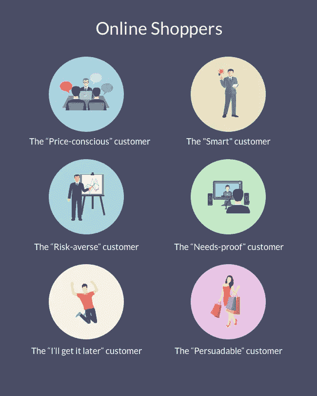
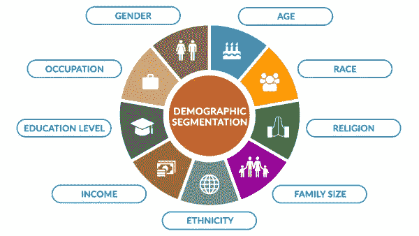

# 客户细分和目标定位

> 原文：<https://medium.datadriveninvestor.com/customer-segmentation-and-targeting-c855ee34c428?source=collection_archive---------6----------------------->

## 为什么以及如何划分你的客户群？

Customer segmentation

在这篇文章中，我将解释客户细分，为什么划分你的客户群是重要的，以及客户细分如何帮助你有效地锁定客户，从而为你的企业增加收入。

# 客户细分的效果如何？

营销依靠细分、目标和定位(STP)原则来识别和指导营销活动。尽管这种传统的三重威胁公式在各种营销活动中都有效，但有必要记住，产品细分和消费者细分在数字客户体验中的实施方式与在传统旅程中非常不同。

营销人员总是试图将正确的信息传达给正确的群体，但当涉及到数字营销时，评估购买者的行为和理解他们的旅程变得更加困难，从而更难细分你的受众并锁定你的信息。我将阐述细分和定位在数字领域的价值，并给出一些提示和资源来帮助您入门。

# 什么是买家角色？

买家角色是对你理想客户的描述。创建几个不同的买家角色可以帮助你更好地了解你的受众，以便有针对性地引导和销售策略，并细分你的受众。

创建买家角色模板时，您需要知道谁最有可能购买您的商品和服务。当你为你的理想客户建立一些人物角色时，以下是一些需要考虑的问题:

*   他们是做什么的？
*   他们多大了？
*   他们的爱好是什么？
*   他们的工资是多少？
*   他们住在哪里？
*   他们的短期和长期目标是什么？

这个练习的目的是理解你可以用不同的方式接近他们，让他们知道你可以帮助他们实现他们的愿望或需求

# 什么是客户细分？

客户细分包括根据相似的特征将客户分成不同的组。

通过细分用户，移动营销人员可以直接与最有可能转化的用户交谈，而不必浪费金钱为那些不准备购买的人留下印象。您还可以创建高度个性化的营销信息，有效地将潜在客户进一步推向转化漏斗。

根据你的移动营销平台收集的用户数据，有数百万种属性可以用来划分你的受众。但并不是所有的方法都能帮助你创造对你的业务真正有用的有意义的细分市场。

受众细分在数字领域至关重要，因为消费者比以往任何时候都更有权力。不仅如此，他们还以前所未有的速度做出购买决策。因此，数字营销人员面临的挑战是了解如何在购买决策过程中抓住他们。为了做到这一点，他们需要尽一切努力去理解他们的观众的思维和行为方式。

如果你想知道从哪里开始受众细分，这里有几个关键领域可以考虑。

# 历史购买行为

您希望将以前的买家与新买家区分开来，因为您将根据已经建立的关系与不同的人群进行不同的互动。为此，你的细分市场可以根据购买模式甚至他们购买的产品类型来区分。关键是预测他们未来的需求，这样你就可以在他们真正意识到之前告诉他们他们需要什么。

# 心理/生活方式细分

有时，人们会根据特定的特征、文化价值观或生活方式对受众进行细分。这些也可以和时事有关。这种细分可能很难精确定位，因为它并不总是以具体信息的形式出现，如地理细分或年龄，这些都是清晰而具体的数据集。可能更多的是价值观，喜好或者生活方式因素。心理测量学要求营销人员挖掘得更深一点。为此，像脸书民意测验和小测验这样的事情可以创造奇迹。

# 人口细分

它基于性别、年龄、职业、婚姻状况、收入等。市场上的每一种产品都可以从使用人口统计细分的营销策略中受益。为什么？因为并非所有的反馈都是平等的。客户会让你更好地了解你的营销和信息工作。它是监控趋势的理想选择

# **客户细分后的后续步骤**

# 把…作为目标

一旦你将你的受众分成了适当的群体，你就要寻找关注不同群体的最佳方式，并通过营销活动吸引他们的注意力。你要根据他们的人口统计特征来构建这个模型，而他们的人口统计数据和购买者角色会给你一些线索，让你知道他们看重什么类型的东西。

一旦你传达了有效的信息，你就需要了解如何吸引和留住已经参与的客户(例如，通过客户忠诚度计划或激励措施)，以及如何吸引那些没有坚持购买的客户。

# 重新定位

理解为什么人们决定不打开电子邮件或短信。为此，重定向技术可以有所帮助。重定目标最好作为基础广泛的策略的一部分，并不适合所有规模的企业。将它与入站和出站内容营销策略结合使用，以帮助跨多个平台的转换。请注意，在实施重新定位计划之前，你需要先了解是什么在驱动你的流量——这不是一种带来流量的方式。

# 最后的想法

客户群的共同特征可以指导公司如何向单个客户群营销，以及向他们推销什么产品或服务。例如，一家销售手工吉他的小企业可能会决定向年轻的吉他手推销低价产品，向年长的音乐家推销高价的优质吉他，因为他们知道年轻音乐家的可支配收入比年长的音乐家少。类似地，邮件送餐服务可能会强调给千禧一代顾客带来的便利，以及给婴儿潮一代带来的“尝起来像妈妈做的”好处。

所有企业都可以进行客户细分，无论规模或行业如何，也无论他们是在线销售还是面对面销售。它始于收集和分析数据，终于以适当和有效的方式对收集的信息采取行动。

在我的下一篇帖子中，我将向您展示如何使用机器学习将您的客户分成不同的细分市场。

**进入专家视角—** [**订阅 DDI 英特尔**](https://datadriveninvestor.com/ddi-intel)