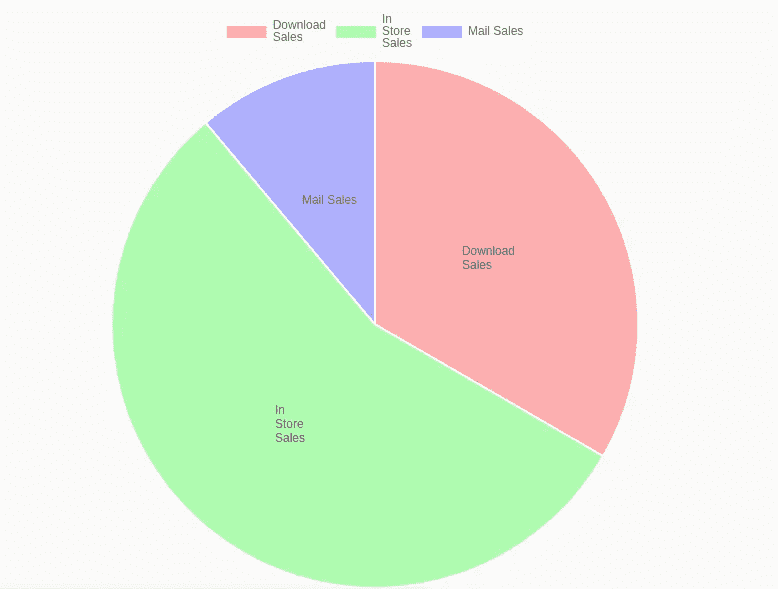
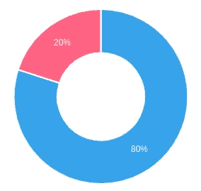
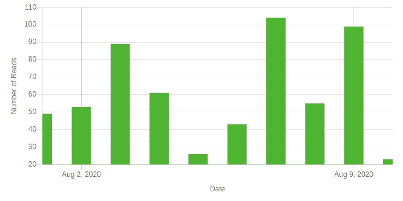
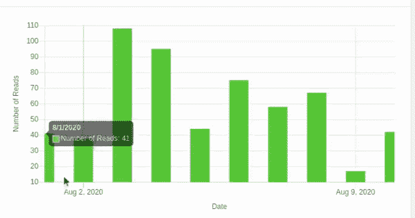

# 使用 NG2 图表定制—一种简单的数据可视化方法

> 原文：<https://medium.datadriveninvestor.com/customization-with-ng2-charts-an-easy-way-to-visualize-data-4c458148c47d?source=collection_archive---------3----------------------->


Chart.js 是开源生态系统中使用最多的可视化库之一。它不仅能很好地与普通 javascript 一起工作，而且还提供了对最流行的框架(如 React、Angular 和 Vue)的扩展。如果你想更深入地了解你能通过 chart.js [实现什么，点击这里](https://github.com/chartjs/awesome)。今天我们将讨论 chart.js 中的“options”参数提供的可定制性级别。

虽然我们可以在 angular 中直接使用 chart.js，但建议我们通过 chart.js 社区提供的插件即 NG2 图表来使用。这个库使我们能够在 angular 中利用来自本机 typescript 代码的 chart.js。

要设置 ng2 图表，您可以访问[这里](https://valor-software.com/ng2-charts/):

现在让我们进入有趣的部分:

在使用 ng2 图表的 angular 中，选项参数声明如下:

```
pieChartOptions: ChartOptions = {
 responsive: true,
 legend: { position: "top" },
 plugins: {
  datalabels: {
   formatter: (value, ctx) => {
    const label = ctx.chart.data.labels[ctx.dataIndex];
    return label;
   },
  },
 },
};
```

[](https://www.datadriveninvestor.com/2020/07/30/why-is-real-time-data-processing-so-challenging/) [## 为什么实时数据处理如此具有挑战性？数据驱动的投资者

### 实时数据分析就是要缩小数据收集、分析和行动之间的差距。与……

www.datadriveninvestor.com](https://www.datadriveninvestor.com/2020/07/30/why-is-real-time-data-processing-so-challenging/) 

当前代码允许在代表标签的部分显示标签。



假设您希望更改标签各部分的百分比，如下所示:



为此，我们将对数据标签中插件部分的格式化函数进行更改:

```
ChartOptions: ChartOptions = {
 responsive: true,
 tooltips: {
  enabled: true,
  callbacks: {
   label: function (tooltipItem, data) {
    let label = data.labels[tooltipItem.index];
    let count = data
                .datasets[tooltipItem.datasetIndex]
                .data[tooltipItem.index]; return label + "Reads Count : " + count;
   },
  },
 },
 plugins: {
  datalabels: {
   color: "white",
   formatter: (value, ctx) => {
    var perc = ((value * 100) / totalCount).toFixed(0) + "%";
    return perc;
   },
  },
 },
};
```

现在让我们考虑你想要创建一个条形图或折线图并且想要 x 轴和 y 轴标签显示它们是什么样子的:



为此，您需要在两个轴上添加 scaleLabel 关键点，如下所示:

```
ChartOptions: any = {
 responsive: true,
 scales: {
  yAxes: [
   {
    display: true,
    scaleLabel: {
     display: true,
     labelString: "Number of Reads",
    },
   },
  ],
  xAxes: [
   {
    scaleLabel: {
     display: true,
     labelString: "Date",
    },
   },
  ],
 },
};
```

现在，假设您想在中添加线性时间序列数据，该数据显示所有数据点，但不是下面的所有标签，但您可以在悬停数据点时查看该数据点。不仅如此，随着越来越多的数据点的增加，标签也会随之调整。下面的图表单位设置为周，因此它只显示周末的标签。



为此，您可以将数据添加为日期对象，图表选项将相应地对数据进行预处理

```
ChartOptions: any = {
 responsive: true,
 showLine: true,scales: {
  xAxes: [
   {
    barPercentage: 0.9,
    categoryPercentage: 0.55,
    type: "time",
    distribution: "linear",
    time: {
     unit: "week",
    },
    scaleLabel: {
     display: true,
     labelString: "Date",
    },
   },
  ],
  yAxes: [
   {
    scaleLabel: {
     display: true,
     labelString: "Number of Reads",
    },
   },
  ],
 },
};
```

需要注意的是，x 轴上的类型应该是时间，并且应该给出适当的时间单位，如日、周和月等。

这只是冰山一角，chart.js 为其用户提供了广泛的可定制性。它还提供设置最小和最大数据级别步长、网格线隐藏等等。你可以在这里 *查看详细的样品和文档 [*。*](https://www.chartjs.org/samples/latest/)*

**访问专家视图—** [**订阅 DDI 英特尔**](https://datadriveninvestor.com/ddi-intel)