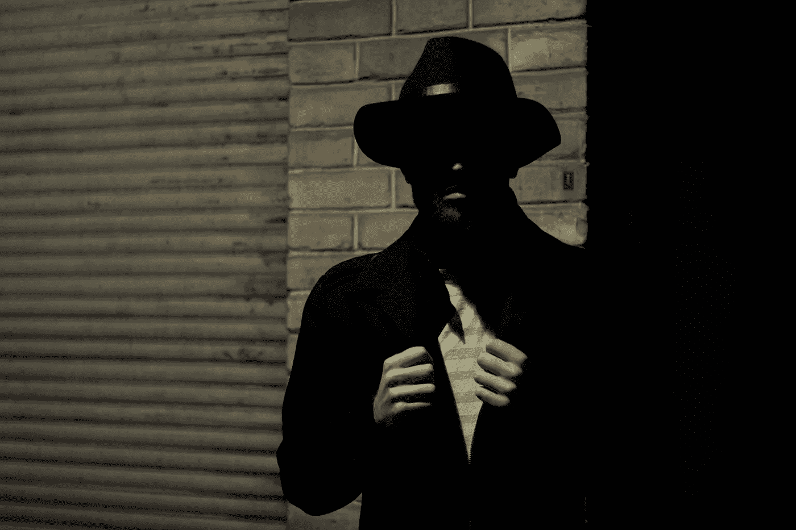

# 网络罪犯期待您的邀请

> 原文：<https://medium.datadriveninvestor.com/cyber-criminals-look-forward-to-your-invitation-9c01640367fd?source=collection_archive---------13----------------------->

## 您的隐私取决于坚持个人最佳实践

Photo by Sergiu Nista on Unsplash

黑客们窥探的目光潜伏在互联网的每个角落。社交媒体上的解决方案是保护你数据的隐私模式。当然，网络安全的有效性取决于实践它的人。

认为你分享的东西可以帮助别人，而不会因为人们可能不同意你的观点而担心你的安全，这需要自信——也许是愚蠢。

[乔斯法特·姆瓦尼亚](https://twitter.com/mwania_josphat/)表示坚决反对。数字营销商、内容创作者和软件开发者坚定地支持成为私人社交媒体用户，同时牢记关系。

“为了实现我们的目标和宗旨，我们需要人，”姆瓦尼亚说。"因此，学会如何与人友好相处并善待他人是很重要的."

在一次[非洲推特聊天中，他谈到了隐私和社交媒体。](https://twitter.com/AfricaTweetChat/)

 [## 如何保护个人数据不被坏人窃取

### 数字隐私实际上是一个误称。未被黑客攻击的公司名单似乎比被攻击的公司要短。

medium.com](https://medium.com/datadriveninvestor/how-to-shield-personal-data-from-evil-doers-e57b2330cfa) 

根据用户的不同，社交媒体和隐私在术语上可能是矛盾的。如果你心甘情愿地把自己的一切都放在那里，你就是在告诉坏人，“来抓我吧。”

姆瓦尼亚说:“社交媒体隐私是对各种问题的保护，包括授权个人隐私的权利，以及通过互联网存储、重新利用、向第三方提供和显示与自己有关的信息的权利。”

“基本上，它限制了与公众分享的内容，尤其是个人信息，”他说。

# 让它变得艰难

从某种意义上说，网络隐私是一种错觉。在社交媒体上，你应该对隐私有同样的期待，就像你走在有潜在扒手的街上和黑暗的小巷里一样。你的隐私是你挑战不向他人透露的东西。

“作为一名用户，你可以控制与你的观众分享什么，”姆瓦尼亚说。“你可以决定在哪里设限。”

想想“需要知道”这句话。别人真正需要了解你什么？

“太多的信息可能会被恶意的人利用，”姆瓦尼亚说。“注意你的分享习惯。不要分享太多包含你个人信息的信息——照片、地点、财产等等。

“建立双因素认证，”他说。"从不同设备登录时，将随机代码加载到您的手机。教育你的孩子关于社交网络。请务必为他们的帐户自定义隐私和安全设置。

 [## 良好的安全保护我们免受自身伤害

### 您收集的数据易受黑客攻击。他们可能会直接攻击或编译看似不相关的和…

medium.com](https://medium.com/datadriveninvestor/good-security-protects-us-from-ourselves-2cc92fabbfe1) 

虽然预防措施通常是好的，但要睁大眼睛采取措施。

“避免用你的社交网络账户注册第三方应用，”姆瓦尼亚说。“如果有人获取了你的账户信息，就会自动破坏第三方应用程序上的所有数据。

“设置你的隐私设置，”他说。"确保你的电子邮件或电话号码等数据不会被公开."

在社交媒体上分享太多信息会给黑客提供大量信息，这可能会让你的银行账户里少得可怜。

姆瓦尼亚说:“这根本没有隐私可言。“的确，我不会让所有家人在社交媒体上关注我。

他说:“你在社交媒体上分享太多的事实可能会被潜在的雇主、商业伙伴或任何即将与你建立关系的人用于社交档案。”

# 隐私的案例

松懈的隐私措施是身份盗窃的公开邀请。

姆瓦尼亚说:“在社交媒体上分享个人信息，如当前地址、电话号码、出生日期或你的社会安全号码，可以让你的信息在网站上随时可用。”“这让网络罪犯的工作变得更加容易。”

在他看来，这就是为什么在社交媒体上成为私人用户很重要。

“使用隐私模式的最大优势之一是能够控制谁看到你的内容或通信，”姆瓦尼亚说。“不过，这取决于你是什么样的人。

“作为一个私人用户，你不太容易受到网络追踪公司的攻击，”他说。“第三方公司和广告商收集的数据会更少。”

当别人开始怀疑你的帖子不是你写的，你知道你遇到了黑客和隐私问题。还可能存在社会偏见和骚扰。

姆瓦尼亚说:“我遇到过一些陌生人，他们可以接触到我朋友的个人信息。”。"他们用她的照片创建账户，并在社交媒体上发布攻击性内容."

 [## 网络安全威胁比恐怖更可怕

### “你是一个目标。”

medium.com](https://medium.com/datadriveninvestor/cybersecurity-threats-scarier-than-scary-60fcc2f704c2) 

人们对品牌或商家在社交媒体上侵犯顾客隐私的容忍度不同。

当你只是在网上看了一张割草机的图片，然后突然被割草机的广告轰炸，你可能会怀疑你的隐私。

“看看数据搜集，”姆瓦尼亚说。“公司已经收集了便于跟踪人们在线活动的信息。他们从社交媒体、求职网站和在线论坛上收集个人数据和对话。”

通过适当的预防措施，那些在线用户可以获得一定程度的隐私。然而，姆瓦尼亚鼓吹采取额外措施，因为没有网络连接是 100%安全的。

**关于作者**

吉姆·卡扎曼是拉戈金融服务公司的经理，曾在空军和联邦政府的公共事务部门工作。你可以在[推特](https://twitter.com/JKatzaman)、[脸书](https://www.facebook.com/jim.katzaman)和[领英](https://www.linkedin.com/in/jim-katzaman-33641b21/)上和他联系。

*原载于 2020 年 12 月 9 日 https://www.datadriveninvestor.com**的* [*。*](https://www.datadriveninvestor.com/2020/12/09/cyber-criminals-look-forward-to-your-invitation/)

## 访问专家视图— [订阅 DDI 英特尔](https://datadriveninvestor.com/ddi-intel)