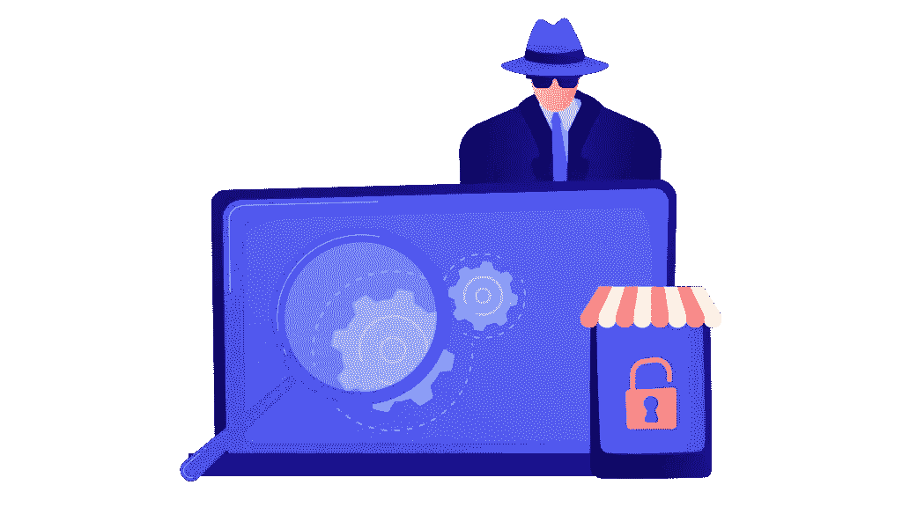
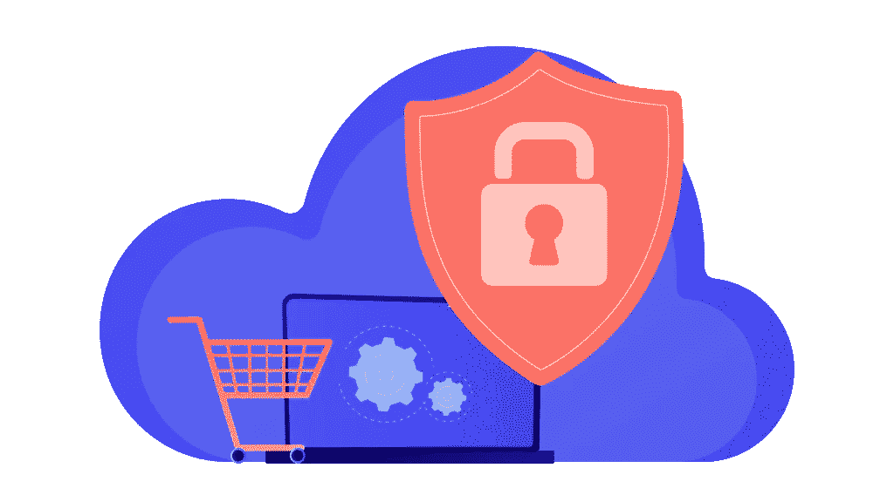

# 2021 年电子商务企业面临的网络安全威胁及应对措施

> 原文：<https://medium.datadriveninvestor.com/cyber-security-threats-and-measures-for-ecommerce-companies-in-2021-a017502c9dbf?source=collection_archive---------44----------------------->

在这个时代，谁不在网上购买产品和服务呢？谁不想能够从无数的选项中进行选择，比较形状、尺寸、颜色和价格，所有这些都可以在家里方便地完成，而不必亲自去商店？除此之外，产品还可以在全球范围内销售！我相信，今天几乎每个人都在网上购物，而且人数每天都在增加！

预计 2021 年全球电子商务销售额将达到 4.9 万亿美元！新冠肺炎疫情驱使人们开始在网上购买日常用品，甚至迫使非网上购物者转向网上购物。

那么，电子商务公司需要做些什么来保持当前的竞争力，吸引新客户，并为他们的客户提供无缝和令人满意的购物体验呢？

对于电子商务公司来说，专注于提供新产品、保持竞争优势、坚持交付承诺、提高产品质量和客户服务至关重要，同样重要和必要的是保护他们的网站和客户。由于整个电子商务业务是数字化和在线的，公司面临的主要威胁来源是网络攻击。

为了了解电子商务公司应该采取什么样的信息安全措施，让我们先来看看困扰这些企业的一些常见和有害的网络威胁。

# 电子商务面临的网络安全威胁

## 信用卡诈骗

这是网上购物网站最常见的苦恼，并且与日俱增。黑客经常使用黑暗网络购买被盗的信用卡信息。然后，他们试图在各种电子商务网站上定位其卡信息被盗的人的账户，试图侵入这些账户，并使用卡信息进行欺诈性购买。

如果公司不能识别和阻止此类交易，就会导致有价值产品的损失和愤怒的客户。由于他们需要偿还被骗客户的钱，他们还会损失大量的钱，并且要处理声誉受损的问题。

## 电子略读

E-skimming 是黑客用来从电子商务交易中窃取信用卡和其他个人信息的另一种攻击方法，但这发生在支付过程中。如果支付过程的各个阶段不是无缝的，或者如果屏幕上有指向外部网站或支付门户的误导性链接，黑客会在客户输入详细信息时等待实时捕获卡信息，则存在这种威胁。

[这种类型的攻击正在增加](https://www.cnbc.com/2020/01/31/e-skimming-cyberattack-is-growing-along-with-online-shopping.html)；攻击者使用各种方法，如误导链接、网络钓鱼、跨站脚本等。2020 年 9 月，[黑客利用零日漏洞](https://www.bankinfosecurity.com/payment-card-skimming-hits-2000-e-commerce-sites-a-15000)向近 2000 个运行旧版本 Adobe Magento 软件的电子商务网站插入抓取代码。黑客们也开始使用自动化技术来运行撇帐操作。

## 分布式拒绝服务(DDoS)攻击

在 DDoS 攻击中，黑客用来自潜在的不可追踪来源(即 IP 地址)的数千个请求来淹没电子商务网站的服务器。这种攻击的目的是通过中断网站和服务器之间的服务，使购物平台对客户不可用。这种攻击的发生率在流行销售期间[会增加](https://securityintelligence.com/articles/ddos-attacks-ramp-up-black-friday-how-to-prepare/)，例如年末提供特殊的假日折扣，推出一款期待已久的产品并给予大幅折扣等。

如果客户在这种时候不能利用产品和服务，他们会失去对公司的信任和信心，随后，公司将面临严重的声誉损害和财务损失。

## 恶意软件

电子商务网站也不断受到恶意软件的威胁。恶意软件是旨在针对目标实现恶意结果的软件。恶意软件在它们被设计来产生的结果上是极其多样的；下面列出了一些:

*   冒充电子商务公司，代表他们发送电子邮件
*   控制平台和架构
*   访问数据库和篡改或窃取数据
*   获得系统的完全访问权，并将所有者锁定在外，也就是说，实质上是以赎金的方式持有系统(勒索软件)

我们可以看到，如果电子商务企业不时刻保持警惕，不采取最新的预防性信息安全措施，恶意软件会对电子商务企业产生[深远、昂贵和破坏性的影响](https://www.bigcommerce.com.au/blog/data-breaches/#the-data-at-risk)。

## 自动化算法或机器人

我们在上面提到了当今黑客是如何使用自动化技术来进行信用卡盗取操作的。这些元素被称为“机器人”；它们是设计用来在系统中执行特定任务的自动化程序。它们还被设计得像真实用户一样，因为它们可以像人一样处理事务。很难区分机器人和真人。

坏机器人使黑客活动变得更加容易和激烈，因为它们可以在几秒钟内重复执行相同的操作数千次。它们用于对电子商务平台进行攻击，例如:

*   **信用卡欺诈:**机器人被编程使用偷来的信用卡号码，然后对照 CVV 号码组合进行测试，直到找到匹配的号码。一旦成功，黑客就可以利用这些信息冒充他人进行购买。
*   **账户访问:**黑客可以窃取账户信息，或者从黑暗网络中获取信息。有了这些信息，他们可以编写机器人程序，在各种[点对点电子商务](https://graffersid.com/how-to-create-a-scalable-peer-to-peer-marketplace-website/)网站上尝试用户名和密码组合。如果帐户登录成功，黑客就可以自由、完整地访问用户帐户中存储的所有信息，并进行未经授权的欺诈性购买。
*   **刮价:**机器人也被竞争对手使用并不奇怪。电子商务企业可以将机器人插入竞争对手的平台，以获取敏感数据，如产品定价、营销计划、产品线、供应商、定价策略、库存水平等。

# 电子商务业务的整体要求

任何电子商务企业必须满足四个基本原则，这是进行安全在线交易的基础。这些是:

**隐私:**网上购物平台上交换或保存的任何信息必须受到保护，以防未经授权的实体获取。这包括个人账户信息、密码、地址、卡的详细信息，甚至购物历史。公司应制定一项政策，规定他们如何利用这些信息并将其告知其客户，但是，任何外部和未经授权方不得访问这些数据。

*电子商务中侵犯隐私的一个例子是黑客未经授权访问客户账户并窃取个人和支付信息。*

**完整性:**未经授权的第三方不能更改保存和交换的信息。在交换或显示信息的过程中，发送方和接收方之间的数据应保持原始状态。

> *电子商务中违反诚信的一个例子是 e-skimming 攻击，购买者从电子商务网站被引导至欺诈性支付网关。*

**真实性:**交易双方应该能够互相证明自己的身份。电子商务企业应该知道每个客户的身份。从顾客的角度来看，他们应该确信他们正在与一个真正的企业打交道。这包括通过电子邮件或电话在网站上交换信息。

> 电子商务中违反真实性的一个例子是攻击者冒充公司发送时事通讯、报价等进行网络钓鱼。通过向客户发送带有嵌入式链接的电子邮件，客户可以单击这些链接并输入他们的在线购物帐户凭据。

**不可否认性:**对于任何电子商务交易，应该有证据表明交换的信息已经收到。参与交易的任何一方都没有否认自己行为的余地。

> *缺乏不可否认性的一个例子是客户账户中没有订单历史，这使得他们可以拒绝下任何订单。或者缺少付款确认，如税务发票或电子收据，这将允许公司拒绝客户为其订单付款。如果一个电子商务网站缺乏这一原则，攻击者就可以利用这一漏洞，在客户和公司之间制造混乱。*

# 电子商务企业应采取的网络安全措施

一些基本的网络安全措施对电子商务企业保护其数据、系统、客户和声誉大有帮助。这些包括但不限于:

1.  实施强而唯一的密码。强制用户在网站上也这样做，并鼓励他们不要使用与任何其他在线帐户相同的凭据。
2.  在登录屏幕上实现验证码。验证码本质上是一个完全自动化的图灵测试，用来区分计算机和人类。这是防止坏机器人创建假账户和访问客户详细信息的有效第一步。
3.  实施两步验证、双因素身份验证或多因素身份验证，以确保只有授权用户才能登录电子商务网站。
4.  安装防火墙系统以监控网站活动，并投资于强大的防病毒保护系统。定期安装所有软件和操作系统更新。
5.  尽可能限制网站上的敏感信息。公司应将商业机密和敏感数据存储在公司系统中，这些数据将受到更严格的安全措施的保护。
6.  存储操作帐户和购物绝对需要的客户数据。个人数据的隐私问题是当今的一大焦点，电子商务公司应该避免要求不必要的数据。
7.  制定协议和警报系统，以识别可能的欺诈性采购。例如，比正常收到的订单价值高得多的订单、发货地址不同于账单地址的订单、在一段时间内多次不成功的下单尝试以及许多其他参数。
8.  对员工进行培训和再培训，以警惕可能让黑客进入公司系统的网络钓鱼邮件。
9.  定期备份数据。万一发生违规，电子商务企业丢失数据或无法访问系统，他们可以尽快恢复备份数据并恢复运营。
10.  定期对公司的系统和电子商务网站和/或移动应用程序进行[渗透测试](https://securetriad.io/)，以确定是否存在任何可能被网络攻击者利用的漏洞。

[在 Secure Triad 联系我们](https://securetriad.io/contact/)，了解我们如何帮助您进行渗透测试，以增强您电子商务的网络安全防御。

*原载于 2021 年 2 月 8 日*[*https://securetriad . io*](https://securetriad.io/cyber-security-threats-and-measures-for-ecommerce-companies-in-2021/)*。*