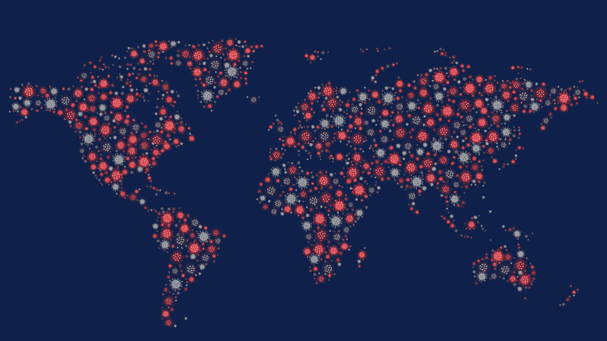

# 网络攻击会持续多久？罪犯已经从新冠肺炎赚了很多…

> 原文：<https://medium.datadriveninvestor.com/cyberattacks-for-how-long-criminals-already-making-much-from-covid-19-e0134a1529c5?source=collection_archive---------14----------------------->

## **五个月了，还在继续……**

全世界都受到冠状病毒的[影响。经济、行业、工作模式、运营基础设施都在经历衰退。有些挑战是初级的，可以清楚地看到周围的一切。一些同等重要的次要挑战不知何故被忽略了。只有当洪水大规模爆发时，他们才会有所了解。网络攻击、网络威胁和数字犯罪都伴随着 corona 而来。](https://shuftipro.com/blog/business-transformations-for-operational-resilience-amid-covid-19-crisis)

## **如何？**

全球用户数字活动的增加。全球一级防范的形势促使人们更多地使用数字服务，而不是出于任何目的访问物理分支机构。无论是购物还是银行业务，人们更喜欢使用数字手段，而不是离开他们的房子。用户数字活动的增加为网络罪犯提供了无限的机会。不良行为者积极瞄准在线用户，监视他们的活动，通过各种技术诱捕他们。这些伎俩可能包括恶意活动，如金融犯罪、信用卡欺诈、网络钓鱼攻击和一系列网络攻击。

天真的数字用户成为这些欺诈者的猎物。新冠肺炎提出了其他几个挑战，其中确保数字平台的安全是新冠肺炎疫情爆发期间的首要挑战。据报道，网络钓鱼诈骗和攻击使用财务激励和恐惧来提示用户在线，以便他们对欺诈者做出回应并陷入困境。

 [## 为什么加密对日常生活至关重要？数据驱动的投资者

### 你几乎每天都要输入密码，这是你生活中最基本的加密方式。然而问题是…

www.datadriveninvestor.com](https://www.datadriveninvestor.com/2020/02/10/why-encryption-is-critical-to-everyday-life/) 

不仅用户，而且声誉良好的大型组织也受到各种网络攻击的威胁。需要一个小时的时间是为了找出漏洞，这些漏洞实际上为欺诈者提供了舞台，让他们进行恶意活动。缺乏安全措施让企业损失了数百万甚至数十亿美元。严格的安全措施的监管要求不足以应对这种情况。应该有足够的安全措施，单独或共同帮助对抗网络攻击。

# **受控访问被组织低估**

组织低估了对用户帐户、数据和平台的授权访问。对于[企业来说，在采用安全解决方案时保持警惕是很重要的](https://shuftipro.com/blog/3-ways-to-protect-your-organizations-from-coronavirus-cyber-security-threat)。在这些困难时期，任何差异都可能付出巨大代价。在以无缝方式向客户提供服务时，保护客户数据应该是第一动机。在数字世界中运营的企业面临的最新挑战如下，包括但不限于上述挑战:

*   部署风险评估和配置措施，为客户提供安全的远程服务。
*   安装防火墙、防病毒软件和创新的身份验证方法(2-FA 或多因素)
*   更强的客户身份认证，如[人工智能面部识别](https://shuftipro.com/blogs/how-machine-learning-changed-facial-recognition-technology)，在线认证客户身份
*   通过验证客户来保护平台。这可能看起来是一个巨大的过程，但不是在这个数字时代。传统方法势不可挡、耗时且令人沮丧。如今，创新的自动化解决方案可以在几秒钟内验证每一位客户，并保护平台免受不良行为的影响。
*   根据更新的犯罪监视名单筛选您的客户。这也称为反洗钱筛查，即根据更新的制裁名单和 PEP 记录对客户进行筛查，以打击洗钱和类似犯罪。